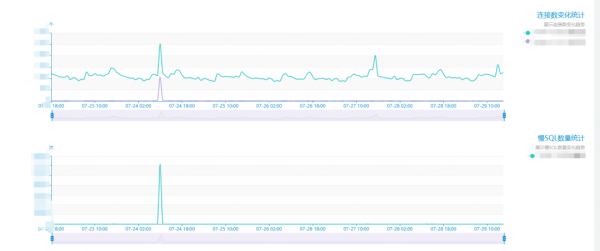
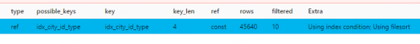

## 千万级数据表选错索引导致的线上慢查询事故

「在这次事故中也能充分看出深入了解MySQL运行原理的重要性，这是遇到问题时能否独立解决问题的关键。」 试想一个月黑风高的夜晚，公司线上突然挂了，而你的同事们都不在线，就你一个人有条件解决问题，这时候如果被工程师的基本功把你卡住了，就问你尴不尴尬...

- 作者：蛮三刀把刀来源：[后端技术漫谈](https://mp.weixin.qq.com/s/SamXNQLD64-UL0uECdyLgw)|*2020-08-20 14:49*

  [ 收藏](javascript:favorBox('open');)[ 分享](javascript:;)

 [](https://s2.51cto.com/oss/202008/20/40882310cd5c4dee9b9f912dc45324c2.jpg-wh_651x-s_1136628744.jpg)

**前言**

又和大家见面了!又两周过去了，我的云笔记里又多了几篇写了一半的文章草稿。有的是因为质量没有达到预期还准备再加点内容，有的则完全是一个灵感而已，内容完全木有。羡慕很多大佬们，一周能产出五六篇文章，给我两个肝我都不够。好了，不多说废话了...

最近在线上环境遇到了一次SQL慢查询引发的数据库故障，影响线上业务。经过排查后，确定原因是「SQL在执行时，MySQL优化器选择了错误的索引(不应该说是“错误”，而是选择了实际执行耗时更长的索引)」。在排查过程中，查阅了许多资料，也学习了下MySQL优化器选择索引的基本准则，在本文中进行解决问题思路的分享。本人MySQL了解深度有限，如果错误欢迎理性讨论和指正。

「在这次事故中也能充分看出深入了解MySQL运行原理的重要性，这是遇到问题时能否独立解决问题的关键。」 试想一个月黑风高的夜晚，公司线上突然挂了，而你的同事们都不在线，就你一个人有条件解决问题，这时候如果被工程师的基本功把你卡住了，就问你尴不尴尬...

「本文的主要内容：」

- 故障描述
- 问题原因排查
- MySQL索引选择原理
- 解决方案
- 思考与总结

**正文**

**故障描述**

在7月24日11点线上某数据库突然收到大量告警，慢查询数超标，并且引发了连接数暴增，导致数据库响应缓慢，影响业务。看图表慢查询在高峰达到了每分钟14w次，在平时正常情况下慢查询数仅在两位数以下，如下图：

[](https://s4.51cto.com/oss/202008/20/b1765764a4cad5cb4f0fd5adfd376c99.png-wh_600x-s_3260833024.png)

赶紧查看慢SQL记录，发现都是同一类语句导致的慢查询(隐私数据例如表名，我已经隐去)：

```
select   * from   sample_table where     1 = 1     and (city_id = 565)     and (type = 13) order by   id desc limit   0, 1 
```

看起来语句很简单，没什么特别的。但是每个执行的查询时间达到了惊人的44s。

[](https://s2.51cto.com/oss/202008/20/b78dc5c697a62fc81fe75e7dea7e7610.png-wh_600x-s_1587295759.png)

简直耸人听闻，这已经不是“慢”能形容的了...

接下来查看表数据信息，如下图：

[](https://s5.51cto.com/oss/202008/20/062c7cfed8dd3b84d6df6abf61bf83d6.png-wh_600x-s_3090007647.png)

可以看到表数据量较大，预估行数在83683240，也就是8000w左右，「千万数据量的表」。

大致情况就是这样，下面进入排查问题的环节。

**问题原因排查**

首先当然要怀疑会不会该语句没走索引，查看建表DML中的索引：

```
KEY `idx_1` (`city_id`,`type`,`rank`), KEY `idx_log_dt_city_id_rank` (`log_dt`,`city_id`,`rank`), KEY `idx_city_id_type` (`city_id`,`type`) 
```

请忽略idx_1和idx_city_id_type两个索引的重复，这都是历史遗留问题了。

「可以看到是有idx_city_id_type和idx_1索引的」，我们的查询条件是city_id和type，这两个索引都是能走到的。

但是，我们的查询条件真的只要考虑city_id和type吗?(机智的小伙伴应该注意到问题所在了，先往下讲，留给大家思考)

既然有索引，接下来就该看该语句实际有没有走到索引了，MySQL提供了Explain可以分析SQL语句。Explain 用来分析 SELECT 查询语句。

Explain比较重要的字段有：

- select_type : 查询类型，有简单查询、联合查询、子查询等
- key : 使用的索引
- rows : 预计需要扫描的行数

更多详细Explain介绍可以参考：MySQL 性能优化神器 Explain 使用分析

我们使用Explain分析该语句：

```
select * from sample_table where city_id = 565 and type = 13 order by id desc limit 0,1 
```

得到结果：

[](https://s5.51cto.com/oss/202008/20/5560fff7da3b8f3e33aa1a1ed35f6d88.png-wh_600x-s_582520614.png)

可以看出，虽然possiblekey有我们的索引，但是最后走了主键索引。而表是千万级别，「并且该查询条件最后实际是返回的空数据」，也就是MySQL在主键索引上实际检索时间很长，导致了慢查询。

我们可以使用force index(idx_city_id_type)让该语句选择我们设置的联合索引：

```
select * from sample_table force index(idx_city_id_type)  where ( ( (1 = 1) and (city_id = 565) ) and (type = 13) ) order by id desc limit 0, 1 
```

这次明显执行的飞快，分析语句：

[](https://s3.51cto.com/oss/202008/20/7a3e8536bd51cc475ea71913a0e360b9.png-wh_600x-s_3444224499.png)

实际执行时间0.00175714s，走了联合索引后，不再是慢查询了。

问题找到了，总结下来就是：「MySQL优化器认为在limit 1的情况下，走主键索引能够更快的找到那一条数据，并且如果走联合索引需要扫描索引后进行排序，而主键索引天生有序，所以优化器综合考虑，走了主键索引。实际上，MySQL遍历了8000w条数据也没找到那个天选之人(符合条件的数据)，所以浪费了很多时间。」

**MySQL索引选择原理**

**优化器索引选择的准则**

MySQL一条语句的执行流程大致如下图，而「查询优化器」则是选择索引的地方：

[](https://s1.51cto.com/oss/202008/20/973e3c9ed168f7b74020674aeb266f05.png)

引用参考文献一段解释：

首先要知道，选择索引是MySQL优化器的工作。

而优化器选择索引的目的，是找到一个最优的执行方案，并用最小的代价去执行语句。在数据库里面，扫描行数是影响执行代价的因素之一。扫描的行数越少，意味着访问磁盘数据的次数越少，消耗的CPU资源越少。

「当然，扫描行数并不是唯一的判断标准，优化器还会结合是否使用临时表、是否排序等因素进行综合判断。」

总结下来，优化器选择有许多考虑的因素：「扫描行数、是否使用临时表、是否排序等等」

我们回头看刚才的两个explain截图：

[](https://s1.51cto.com/oss/202008/20/d2a41835efac1a2ce9c391f80b87aa03.png)

[](https://s5.51cto.com/oss/202008/20/ddcc1856d71f2140939d44fe062a6208.png-wh_600x-s_909832421.png)

走了「主键索引」的查询语句，rows预估行数1833，而强制走「联合索引」行数是45640，并且Extra信息中，显示需要Using filesort进行额外的排序。所以在不加强制索引的情况下，「优化器选择了主键索引，因为它觉得主键索引扫描行数少，而且不需要额外的排序操作，主键索引天生有序。」

**rows是怎么预估出来的**

同学们就要问了，为什么rows只有1833，明明实际扫描了整个主键索引啊,行数远远不止几千行。实际上explain的rows是MySQL「预估」的行数，「是根据查询条件、索引和limit综合考虑出来的预估行数。」

MySQL是怎样得到索引的基数的呢?这里，我给你简单介绍一下MySQL采样统计的方法。

为什么要采样统计呢?因为把整张表取出来一行行统计，虽然可以得到精确的结果，但是代价太高了，所以只能选择“采样统计”。

采样统计的时候，InnoDB默认会选择N个数据页，统计这些页面上的不同值，得到一个平均值，然后乘以这个索引的页面数，就得到了这个索引的基数。

而数据表是会持续更新的，索引统计信息也不会固定不变。所以，当变更的数据行数超过1/M的时候，会自动触发重新做一次索引统计。

在MySQL中，有两种存储索引统计的方式，可以通过设置参数innodb_stats_persistent的值来选择：

设置为on的时候，表示统计信息会持久化存储。这时，默认的N是20，M是10。

设置为off的时候，表示统计信息只存储在内存中。这时，默认的N是8，M是16。

由于是采样统计，所以不管N是20还是8，这个基数都是很容易不准的。

我们可以使用analyze table t命令，可以用来重新统计索引信息。但是这条命令生产环境需要联系DBA，所以我就不做实验了,大家可以自行实验。

**索引要考虑 order by 的字段**

为什么这么说?因为如果我这个表中的索引是city_id,type和id的联合索引，那优化器就会走这个联合索引，因为索引已经做好了排序。

**更改limit大小能解决问题?**

把limit数量调大会影响预估行数rows，进而影响优化器索引的选择吗?

答案是会。

我们执行limit 10

```
select * from sample_table where city_id = 565 and type = 13 order by id desc limit 0,10 
```

[](https://s1.51cto.com/oss/202008/20/0fcf7434a92e9f91043296912ed86a1f.png)

图中rows变为了18211，增长了10倍。如果使用limit 100，会发生什么?

[](https://s5.51cto.com/oss/202008/20/4929a1ef6ff13a076e60767fe56d76d7.png-wh_600x-s_454351159.png)

优化器选择了联合索引。初步估计是rows还会翻倍，所以优化器放弃了主键索引。宁愿用联合索引后排序，也不愿意用主键索引了。

**为何突然出现异常慢查询**

问：这个查询语句已经在线上稳定运行了非常长的时间，为何这次突然出现了慢查询?

答：以前的语句查询条件返回结果都不为空，limit1很快就能找到那条数据，返回结果。而这次代码中查询条件实际结果为空，导致了扫描了全部的主键索引。

**解决方案**

知道了MySQL为何选择这个索引的原因后，我们就可以根据上面的思路来列举出解决办法了。

主要有两个大方向：

1. [鸿蒙官方战略合作共建——HarmonyOS技术社区](https://harmonyos.51cto.com/#sjkxqy)
2. 强制指定索引
3. 干涉优化器选择

**强制选择索引：force index**

就像上面我最开始的操作那样，我们直接使用force index，让语句走我们想要走的索引。

```
select * from sample_table force index(idx_city_id_type)  where ( ( (1 = 1) and (city_id = 565) ) and (type = 13) ) order by id desc limit 0, 1 
```

这样做的优点是见效快，问题马上就能解决。

缺点也很明显：

高耦合，这种语句写在代码里，会变得难以维护，如果索引名变化了，或者没有这个索引了，代码就要反复修改。属于硬编码。

很多代码用框架封装了SQL，force index()并不容易加进去。

「我们换一种办法，我们去引导优化器选择联合索引。」

**干涉优化器选择：增大limit**

通过增大limit，我们可以让预估扫描行数快速增加，比如改成下面的limit 0, 1000

```
SELECT * FROM sample_table where city_id = 565 and type = 13 order by id desc LIMIT 0,1000 
```

这样就会走上联合索引，然后排序，但是这样强行增长limit，其实总有种面向黑盒调参的感觉。我们还有更优美的解决方案吗?

**干涉优化器选择：增加包含order by id字段的联合索引**

我们这句慢查询使用的是order by id，但是我们却没有在联合索引中加入id字段，导致了优化器认为联合索引后还要排序，干脆就不太想走这个联合索引了。

我们可以新建city_id,type和id的联合索引，来解决这个问题。

这样也有一定的弊端，比如我这个表到了8000w数据，建立索引非常耗时，而且通常索引就有3.4个g，如果无限制的用索引解决问题，可能会带来新的问题。表中的索引不宜过多。

**干涉优化器选择：写成子查询**

还有什么办法?我们可以用子查询，在子查询里先走city_id和type的联合索引，得到结果集后在limit1选出第一条。

但是子查询使用有风险，一版DBA也不建议使用子查询，会建议大家在代码逻辑中完成复杂的查询。当然我们这句并不复杂啦~

```
Select * From sample_table Where id in (Select id From `newhome_db`.`af_hot_price_region` where (city_id = 565 and type = 13)) limit 0, 1 
```

**还有很多解决办法...**

SQL优化是个很大的工程，我们还有非常多的办法能够解决这句慢查询问题，这里就不一一展开了。留给大家做为思考题了。

**总结**

本文带大家回顾了一次MySQL优化器选错索引导致的线上慢查询事故，可以看出MySQL优化器对于索引的选择并不单单依靠某一个标准，而是一个综合选择的结果。我自己也对这方面了解不深入，还需要多多学习，争取能够好好的做一个索引选择的总结(挖坑)。不说了，拿起巨厚的《高性能MySQL》,开始...

压住我的泡面...

「最后做个文章总结：」

- 该慢查询语句中使用order by id导致优化器在主键索引和city_id和type的联合索引中有所取舍，最终导致选择了更慢的索引。
- 可以通过强制指定索引，建立包含id的联合索引，增大limit等方式解决问题。
- 平时开发时，尤其是对于特大数据量的表，要注意SQL语句的规范和索引的建立，避免事故的发生。