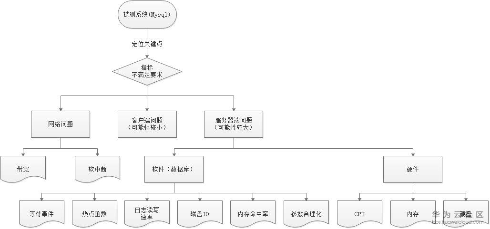
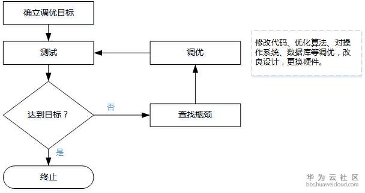

[[数据库](https://bbs.huaweicloud.com/forum/forum-931-825-1.html)] MySQL 8.0.16 调优指南（鲲鹏920）


# [调优概述](https://bbs.huaweicloud.com/forum/thread-25203-1-1.html#)

## 介绍

​    MySQL是一个[关系型数据库管理系统](https://baike.baidu.com/item/关系型数据库管理系统/696511)，由瑞典MySQL AB 公司开发，目前属于 [Oracle](https://baike.baidu.com/item/Oracle) 旗下产品。MySQL 是最流行的[关系型数据库管理系统](https://baike.baidu.com/item/关系型数据库管理系统/696511)之一，在 WEB 应用方面，MySQL是最好的 [RDBMS](https://baike.baidu.com/item/RDBMS/1048260) (Relational Database Management System，关系数据库管理系统) 应用软件之一。

​    MySQL是一种关系数据库管理系统，关系数据库将数据保存在不同的表中，而不是将所有数据放在一个大仓库内，这样就增加了速度并提高了灵活性。

​    MySQL所使用的 SQL 语言是用于访问[数据库](https://baike.baidu.com/item/数据库/103728)的最常用标准化语言。MySQL 软件采用了双授权政策，分为社区版和商业版，由于其体积小、速度快、总体拥有成本低，尤其是[开放源码](https://baike.baidu.com/item/开放源码/7176422)这一特点，一般中小型网站的开发都选择 MySQL 作为网站数据库。

 

## [调优原则](https://bbs.huaweicloud.com/forum/thread-25203-1-1.html#)

​    性能调优从大的方面来说，在系统设计之初，需要考虑硬件的选择，操作系统的选择，基础软件的选择；从小的方面来说，包括每个子系统的设计，算法选择，如何使用编译器的选项，如何发挥硬件最大的性能等等。

​    在性能优化时，我们必须遵循一定的原则，否则，有可能得不到正确的调优结果。主要有以下几个方面：

   ● 对性能进行分析时，要多方面分析系统的资源瓶颈所在，因为系统某一方面性能低，也许并不是它自己造成的，而是其他方面造成的。如CPU利用率是100%时，很可能是内存容量太小，因为CPU忙于处理内存调度。

   ● 一次只对影响性能的某方面的一个参数进行调整，多个参数同时调整的话，很难界定性能的影响是由哪个参数造成的。

   ● 由于在进行系统性能分析时，性能分析工具本身会占用一定的系统资源，如CPU资源、内存资源等等。我们必须注意到这点，即分析工具本身运行可能会导致系统某方面的资源瓶颈情况更加严重。

   ● 必须保证调优后的程序运行正确。

   ● 调优过程是迭代渐进的过程，每一次调优的结果都要反馈到后续的代码开发中去。

   ● 性能调优不能以牺牲代码的可读性和可维护性为代价。

## [调优思路](https://bbs.huaweicloud.com/forum/thread-25203-1-1.html#)

​    性能优化首先要较为精准的定位问题，分析系统性能瓶颈，然后根据其性能指标以及所处层级选择优化的方式方法。

​    下面介绍Mysqls数据库具体的调优思路和分析过程，如下图所示。



### 调优分析思路如下：

​    ⒈ 很多情况下压测流量并没有完全进入到服务端，在网络上可能就会出现由于各种规格（带宽、最大连接数、新建连接数等）限制，导致压测结果达不到预期。

​    ⒉ 接着看关键指标是否满足要求，如果不满足，需要确定是哪个地方有问题，一般情况下，服务器端问题可能性比较大，也有可能是客户端问题（这种情况比较小）。

​    ⒊ 对于服务器端问题，需要定位的是硬件相关指标，例如CPU，Memory，Disk I/O，Network I/O，如果是某个硬件指标有问题，需要深入的进行分析。

​    ⒋ 如果硬件指标都没有问题，需要查看数据库相关指标，例如：等待事件、内存命中率等。

​    ⒌ 如果以上指标都正常，应用程序的算法、缓冲、缓存、同步或异步可能有问题，需要具体深入的分析。


可能的瓶颈点如下表所示：

| 瓶颈点    | 说明                                                         |
| --------- | ------------------------------------------------------------ |
| 硬件/规格 | 一般指的是CPU、内存、磁盘I/O方面的问题，分为服务器硬件瓶颈、网络瓶颈（对局域网可以不考虑）。 |
| 操作系统  | 一般指的是windows、UNIX、Linux等操作系统。例如，在进行性能测试，出现物理内存不足时，虚拟内存设置也不合理，虚拟内存的交换效率就会大大降低，从而导致行为的响应时间大大增加，这时认为操作系统上出现性能瓶颈。 |
| 数据库    | 一般指的是数据库配置等方面的问题。例如，由于参数配置不合理，导致数据库处理速度慢的问题，可认为是数据库层面的的问题。 |

### 调优的通用步骤：



# [硬件调优](https://bbs.huaweicloud.com/forum/thread-25203-1-1.html#)

## [BIOS](https://bbs.huaweicloud.com/forum/thread-25203-1-1.html#)配置

### 目的

​    对于不同的硬件设备，通过在BIOS中设置一些高级选项，可以有效提升服务器性能。

### 方法

​    步骤1 关闭SMMU。

​      

​        此优化项只在非虚拟化场景使用，在虚拟化场景，则开启SMMU。

​          ⒈ 重启服务器，按Esc键进入BIOS，选择“Advanced > Misc Config”，按Enter进入。

​          ⒉ 将“Support Smmu”设置为“Disable”，保存退出（永久有效）。

​    步骤2 关闭预取。

​          ⒈ 重启服务器，按Esc键进入BIOS，选择“Advanced>MISC Config”，按Enter进入。

​          ⒉ 将“CPU Prefetching Configuration”设置为“Disabled”，保存退出。

​    **----结束**

# [操作系统调优](https://bbs.huaweicloud.com/forum/thread-25203-1-1.html#)

## [文件系统调优](https://bbs.huaweicloud.com/forum/thread-25203-1-1.html#)

### 目的

​    对于不同的IO设备，通过调整文件系统相关参数配置，可以有效提升服务器性能。

### 方法

​    步骤1 文件系统使用xfs。

​    步骤2 建议在文件系统的mount参数上加上noatime，nobarrier两个选项。

​    ⒈ 一般来说，Linux会给文件记录了三个时间，change time, modify time和access time。

​            ● access time指文件最后一次被读取的时间。

​            ● modify time指的是文件的文本内容最后发生变化的时间。

​            ● change time指的是文件的inode最后发生变化（比如位置、用户属性、组属性等）的时间。

​        一般来说，文件都是读多写少，而且我们也很少关心某一个文件最近什么时间被访问了。所以，我们建议采用noatime选项，文件系统在程序访问对应的文件或者文件夹时，不会更新对应的access time。这样文件系统不记录access time，避免浪费资源。

​    ⒉ 现在的很多文件系统会在数据提交时强制底层设备刷新cache，避免数据丢失，称之为write barriers。但是，其实我们数据库服务器底层存储设备要么采用RAID卡，RAID卡本身的电池可以掉电保护；要么采用Flash卡，它也有自我保护机制，保证数据不会丢失。所以我们可以安全的使用nobarrier挂载文件系统。

​            ● 对于ext3, ext4和 reiserfs文件系统可以在mount时指定barrier=0

​            ● 对于xfs可以指定nobarrier选项。

​    **----结束**

## [关闭irqbalance](https://bbs.huaweicloud.com/forum/thread-25203-1-1.html#)

### 目的

​    关闭irqbalance，通过手动绑定中断的方法优化性能。

### 方法

​    步骤1 停止irqbalance服务。

**systemctl stop irqbalance.service**

​    步骤2 关闭irqbalance服务。

**systemctl disable irqbalance.service**

​    步骤3 查看irqbalance服务状态是否已关闭。

**systemctl status irqbalance.service**

```
[root@localhost home]``# systemctl disable irqbalance.service``Removed ``symlink` `/etc/systemd/system/multi-user``.target.wants``/irqbalance``.service.``[root@localhost home]``# systemctl status irqbalance.service``● irqbalance.service - irqbalance daemon``  ``Loaded: loaded (``/usr/lib/systemd/system/irqbalance``.service; disabled; vendor preset: enabled)``  ``Active: inactive (dead)``[root@localhost home]``#
```

## [网卡中断绑核](https://bbs.huaweicloud.com/forum/thread-25203-1-1.html#)

### 目的

​    手动绑定网卡中断，根据网卡所属CPU将其进行分配，从而优化系统网络性能。

### 方法

​    查询网卡所在的CPU，将网络中断绑定到该CPU的所有核上。

​    步骤1 查询中断号。

**cat /proc/interrupts | grep $eth | awk -F ':' '{print $1}'**

​    步骤2 根据中断号，将每个中断各绑定在一个核上。

**echo $cpunum > /proc/irq/$irq/smp_affinity_list**

​    **----结束**

## [网络参数调优](https://bbs.huaweicloud.com/forum/thread-25203-1-1.html#)

### 目的

​    对于不同的操作系统，通过在OS层面调整一些参数配置，可以有效提升服务器性能。

### 方法

| 参数名称                | 参数含义                                                     | 操作                                                     |
| ----------------------- | ------------------------------------------------------------ | -------------------------------------------------------- |
| tcp_max_syn_backlog     | tcp_max_syn_backlog是指定所能接受SYN同步包的最大客户端数量。默认值是2048，建议修改成8192。 | echo 8192 > /proc/sys/net/ipv4/tcp_max_syn_backlog       |
| net.core.somaxconn      | 服务端所能accept即处理数据的最大客户端数量，即完成连接上限。默认值是128，建议修改成1024。 | echo 1024 > /proc/sys/net/core/somaxconn                 |
| net.core.rmem_max       | 接收套接字缓冲区大小的最大值。默认值是229376，建议修改成16777216。 | echo 16777216 > /proc/sys/net/core/rmem_max              |
| net.core.wmem_max       | 发送套接字缓冲区大小的最大值（以字节为单位）。默认值是229376，建议修改成16777216。 | echo 16777216 > /proc/sys/net/core/wmem_max              |
| net.ipv4.tcp_rmem       | 配置读缓冲的大小，三个值，第一个是这个读缓冲的最小值，第三个是最大值，中间的是默认值。默认值是"4096 87380 6291456"，建议修改成"4096 87380 16777216"。 | echo "4096 87380 16777216" > /proc/sys/net/ipv4/tcp_rmem |
| net.ipv4.tcp_wmem       | 配置写缓冲的大小，三个值，第一个是这个读缓冲的最小值，第三个是最大值，中间的是默认值。默认值是"4096 16384 4194304"，建议修改成"4096 65536 16777216"。 | echo "4096 65536 16777216" > /proc/sys/net/ipv4/tcp_wmem |
| net.ipv4.max_tw_buckets | 表示系统同时保持TIME_WAIT套接字的最大数量。默认值是2048，建议修改成360000。 | echo 360000 > /proc/sys/net/ipv4/tcp_max_syn_backlog     |

## [IO](https://bbs.huaweicloud.com/forum/thread-25203-1-1.html#)参数调优

### 目的

​    对于不同的IO设备，通过在OS层面调整一些IO相关参数配置，可以有效提升服务器性能。

### 方法

| 参数名称                               | 参数含义                                               | 操作                                           |
| -------------------------------------- | ------------------------------------------------------ | ---------------------------------------------- |
| /sys/block/${device}/queue/scheduler   | 配置IO调度，deadline或者noop更适用于mysql数据库场景。  | echo deadline > /sys/block/sdb/queue/scheduler |
| /sys/block/${device}/queue/nr_requests | 提升磁盘吞吐量，尤其对myisam存储引擎，可以调整到更大。 | echo 2048 >  /sys/block/sdX/queue/nr_requests  |

## 缓存参数调优

### 目的

​    对于不同系统的内存使用情况，通过在OS层面调整一些缓存相关参数配置，可以有效提升服务器性能。

### 方法

| 参数名称    | 参数含义                                             | 操作                              |
| ----------- | ---------------------------------------------------- | --------------------------------- |
| swappiness  | 值越大，越积极使用swap分区，值越小，越积极使用内存。 | vm.swappiness = 1                 |
| dirty_ratio | 内存里的脏数据百分比不能超过这个值。                 | echo 5 > /proc/sys/vm/dirty_ratio |

# [数据库调优](https://bbs.huaweicloud.com/forum/thread-25203-1-1.html#)

## 数据库参数调优

### 目的

​    对于不同业务场景，通过在调整数据库的参数配置，可以有效提升服务器性能。

### 方法

​    使用如下配置文件参数启动数据库，默认配置文件路径为/etc/my.cnf，其中MySQL软件安装以及数据存放路径根据实际情况修改。

```
[mysqld_safe] `` ``log-error=``/data/mysql-8``.0.16``/mysql/log/mariadb``.log `` ``pid-``file``=``/data/mysql-8``.0.16``/mysql/run/mysqld``.pid `` ` ` ``[client] `` ``socket=``/data/mysql-8``.0.16``/mysql/run/mysql``.sock `` ``default-character-``set``=utf8 `` ` ` ``[mysqld] `` ``basedir=``/home/mysql-8``.0.16``/mysql` ` ``tmpdir=``/data/mysql-8``.0.16``/mysql/tmp` ` ``datadir=``/data/mysql-8``.0.16``/mysql/data` ` ``socket=``/data/mysql-8``.0.16``/mysql/run/mysql``.sock `` ``port=3306 `` ``user=root `` ``default_authentication_plugin=mysql_native_password `` ``innodb_page_size=4096 ``#设置页大小 `` ``ssl=0 ``#关闭ssl `` ``[mysql] `` ``max_connections=2000 ``#设置最大连接数 `` ``back_log=2048 ``#设置会话请求缓存个数 `` ``performance_schema=OFF ``#关闭性能模式 `` ``max_prepared_stmt_count=128000 `` ` ` ``#file `` ``innodb_file_per_table ``#设置每个表一个文件 `` ``innodb_log_file_size=1500M ``#设置logfile大小 `` ``innodb_log_files_in_group=32 ``#设置logfile组个数 `` ``innodb_open_files=4000 ``#设置最大打开表个数 `` ` ` ``#buffers `` ``innodb_buffer_pool_size=230G ``#设置buffer pool size,一般为服务器内存60% `` ``innodb_buffer_pool_instances=16 ``#设置buffer pool instance个数，提高并发能力 `` ``innodb_log_buffer_size=64M ``#设置log buffer size大小 `` ` ` ``#tune `` ``sync_binlog=1 ``#设置每次sync_binlog事务提交刷盘 `` ``innodb_flush_log_at_trx_commit=1 ``#每次事务提交时MySQL都会把log buffer的数据写入log file，并且flush(刷到磁盘)中去 `` ``innodb_use_native_aio=1 ``#开启异步IO `` ``innodb_spin_wait_delay=180 ``#设置spin_wait_delay 参数，防止进入系统自旋 `` ``innodb_sync_spin_loops=25 ``#设置spin_loops 循环次数，防止进入系统自旋 `` ``innodb_flush_method=O_DIRECT ``#设置innodb数据文件及redo log的打开、刷写模式 `` ``innodb_io_capacity=20000 ``# 设置innodb 后台线程每秒最大iops上限 `` ``innodb_io_capacity_max=40000 ``#设置压力下innodb 后台线程每秒最大iops上限 `` ``innodb_lru_scan_depth=9000 ``#设置page cleaner线程每次刷脏页的数量 `` ``innodb_page_cleaners=16 ``#设置将脏数据写入到磁盘的线程数 `` ` ` ``#perf special `` ``innodb_flush_neighbors=0 ``#检测该页所在区(extent)的所有页，如果是脏页，那么一起进行刷新，SSD关闭该功能 `` ``innodb_write_io_threads=16 ``#设置写线程数 `` ``innodb_read_io_threads=16 ``#设置读线程数 `` ``innodb_purge_threads=32 ``#设置回收已经使用并分配的undo页线程数 `` ` ` ``sql_mode=STRICT_TRANS_TABLES,NO_ENGINE_SUBSTITUTION,NO_AUTO_VALUE_ON_ZERO,STRICT_ALL_TABLES
```

 

| 参数名称                       | 参数含义                                                     | 优化建议                                                     |
| ------------------------------ | ------------------------------------------------------------ | ------------------------------------------------------------ |
| innodb_thread_concurrency      | InnoDB使用操作系统线程来处理用户的事务请求。                 | 建议取默认值为0，它表示默认情况下不限制线程并发执行的数量。  |
| innodb_read_io_threads         | 执行请求队列中的读请求操作的线程数。                         | 根据CPU核数及读写比例进一步更改来提高性能。                  |
| innodb_write_io_threads        | 执行请求队列中的写请求操作的线程数。                         | 根据CPU核数及读写比例进一步更改来提高性能。                  |
| query_cache_size               | 设置query_cache_size大小。                                   | Query Cache（查询缓存）是一个众所周知的瓶颈位，即使在并发量不高的时候也会出现。最好的选择是从一开始就禁用它。通过设置 query_cache_size = 0，建议禁用查询缓存。 |
| innodb_buffer_pool_instances   | 开启多个内存缓冲池，把需要缓冲的数据hash到不同的缓冲池中，这样可以并行的内存读写。 | 建议设置8~16。                                               |
| innodb_open_files              | 在innodb_file_per_table模式下，限制Innodb能打开的文件数量。  | 建议此值调大一些，尤其是表特别多的情况。                     |
| innodb_buffer_pool_size        | 缓存数据和索引的地方。                                       | 通常建议内存的70%左右。                                      |
| innodb_log_buffer_size         | 缓存重做日志。                                               | 默认值是64M，建议通过查看innodb_log_wait，调整innodb_log_buffer_size大小。 |
| innodb_io_capacity             | innodb 后台线程每秒最大iops上限。                            | 建议为IO QPS总能力的75%。                                    |
| innodb_log_files_in_group      | 重做日志组的个数。                                           | -                                                            |
| innodb_log_file_size           | 重做日志文件大小。                                           | 如果存在大量写操作，建议增加日志文件大小，但日志文件过大，硬性数据恢复时间，非生产环境，测试极限性能尽量调大，商用场景需要考虑数据恢复时间。 |
| innodb_flush_method            | Log和数据刷新磁盘的方法：1.   datasync模式：写数据时，write这一步并不需要真正写到磁盘才算完成（可能写入到操作系统buffer中就会返回完成），真正完成是flush操作，buffer交给操作系统去flush,并且文件的元数据信息也都需要更新到磁盘。2.   O_DSYNC模式：写日志操作是在write这步完成，而数据文件的写入是在flush这步通过fsync完成。3.   O_DIRECT模式：数据文件的写入操作是直接从mysql innodb  buffer到磁盘的，并不用通过操作系统的缓冲，而真正的完成也是在flush这步,日志还是要经过OS缓冲。 | 建议O_DIRECT模式。                                           |
| innodb_spin_wait_delay         | 控制轮询的间隔。                                             | 根据真实场景调试，直到看不到splin_lock热点函数等待。         |
| innodb_sync_spin_loops         | 控制轮询的虚幻次数。                                         | 根据真实场景调试，直到看不到splin_lock热点函数等待。         |
| innodb_lru_scan_depth          | LRU列表的可用页数量。                                        | 默认值是1024，非生产环境，测试极限性能可以适当调大，减少checkpoint次数。 |
| innodb_page_cleaners           | 刷新脏数据的线程数。                                         | 建议与innodb_buffer_pool_instances相等。                     |
| innodb_purge_threads           | 回收undo的线程数。                                           | -                                                            |
| innodb_flush_log_at_trx_commit | l  0：不管有没有提交，每秒钟都写到binlog日志里.l  1：每次提交事务，都会把log buffer的内容写到磁盘里去，对日志文件做到磁盘刷新，安全性最好。l  2：每次提交事务，都写到操作系统缓存，由OS刷新到磁盘，性能最好。 | 非生产环境，测试极限性能，可以设置为0。                      |
| innodb_doublewrite             | 是否开启二次写。                                             | 非生产环境，测试极限性能，可以设置为0，关闭二次写。          |
| ssl                            | 是否开启安全连接。                                           | 安全连接对性能影响较大，非生产环境，测试极限性能，可以设置为0；商用场景，根据客户需求调整。 |
| skip_log_bin                   | 是否开启binlog。                                             | 非生产环境，测试极限性能在参数文件中增加此参数，关闭binlog选项。 |
| innodb_checksum_algorithm      | 数据完整性校验。                                             | 非生产环境，测试极限性能设置成none，不启用算法校验。         |
| binlog_checksum                | Binlog完整性校验。                                           | 非生产环境，测试极限性能设置成none，不启用算法校验。         |
| innodb_log_checksums           | Log完整性校验。                                              | 非生产环境，测试极限性能设置成0，关闭log  checksum。         |
| foreign_key_checks             | 外键校验。                                                   | 非生产环境，测试极限性能设置成0，关闭外键校验。              |
| performance_schema             | 是否开启性能模式。                                           | 非生产环境，测试极限性能设置为OFF，关闭性能模式。            |

