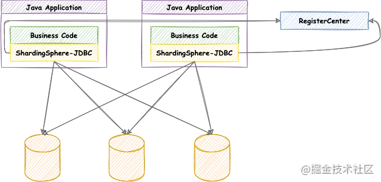
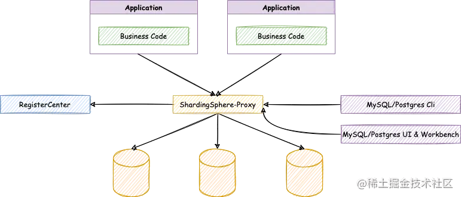
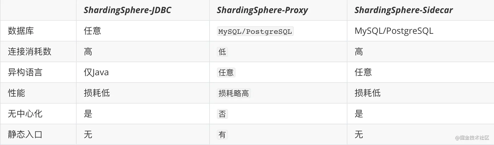

[](https://juejin.cn/user/1521379823857175)

[王小胖酱 ](https://juejin.cn/user/1521379823857175)

2021年09月23日 阅读 101

关注

# ShardingSphere之数据库拆分的艺术

### 一、简介

- Apache ShardingSphere 是一套开源的分布式数据库解决方案组成的生态圈，它由 JDBC、Proxy 和 Sidecar（规划中）这 3 款既能够独立部署，又支持混合部署配合使用的产品组成。 它们均提供标准化的数据水平扩展、分布式事务和分布式治理等功能，可适用于如 Java 同构、异构语言、云原生等各种多样化的应用场景。ShardingSphere 已于2020年4月16日成为 Apache 软件基金会的顶级项目。阿帕奇顶级项目哦！！！
- ShardingSphere 主要分为三块
  1. ShardingSphere-JDBC：定位为轻量级 Java 框架，在 Java 的 JDBC 层提供的额外服务。 它使用客户端直连数据库，以 jar 包形式提供服务，无需额外部署和依赖，可理解为增强版的 JDBC 驱动，完全兼容 JDBC 和各种 ORM 框架
  2. ShardingSphere-Proxy：定位为透明化的数据库代理端，目前提供 MySQL 和 PostgreSQL 版本。
  3. ShardingSphere-Sidecar（TODO）：定位为 Kubernetes 的云原生数据库代理，以 Sidecar 的形式代理所有对数据库的访问。 通过无中心、零侵入的方案提供与数据库交互的啮合层，即 `Database Mesh`，又可称数据库网格
- 技术环境：SpringBoot2.4.3，ShardingSphere5.0.0-alpha，mybatisplus3.4.1，mysql8.0，docker

### 二、功能用途

- #### 分库分表的理解

  1. 数据库数据量是不可控的，随着业务和时间的推进，数据库数据量会越来越大，这造成我们对数据库crud操作的时候会遇到很多性能优化问题

- #### 性能问题优化两方面

  1. 增加内存以及数据库服务的硬件配置（治标不治本）
  2. 分库分表

- #### 分库分表策略

  1. 垂直拆分：垂直分表、垂直分库
     - 垂直分表：数据表字段过多，有些数据字段我们并不常用，那么就会把常用字段和不常用字段拆分成两张表
     - 垂直分库：把单一的数据库按照业务进行划分，这也是微服务架构中常用的方式，一个数据库对应相应的业务模块
  2. 水平拆分：水平分表、水平分库
     - 水平分库：把一些表数据按照一定的策略分别储存到两个数据库中，即两个数据库具有相同的表结构，只是按照一定策略存储到了不同数据库中
     - 水平分表：统一数据库中有两张相同表结构的表，按照一定的策略存储数据

- #### 分表分库应用和问题

  1. 在数据库设计阶段我们可针对业务体量进行预估，并对有压力的数据库或者数据表选择合适的拆分策略
  2. 随着数据量的增加，我们一般不会第一时间进行拆分，首先会考虑索引、缓存、读写分离的策略，如果这些解决不了本质性的问题，在考虑数据的拆分
  3. 数据拆分带来的问题
     - 跨节点链接查询问题（分页、排序）
     - 多数据源的管理问题

- #### ShardingSphere作用

  1. ShardingSphere简化分库分表之后数据的相关操作
  2. 解决上述分库分表带来的问题

### 三、ShardingSphere-JDBC

1. #### 介绍

   - 定位为轻量级 Java 框架，以 jar 包形式提供服务，无需额外部署和依赖，可以理解为我们只需要一个jar包集成Spring的一些配置便可以轻轻松松做到数据库的拆分工作，零侵入，可插拔式的中间件

   - 适用于任何基于 JDBC 的 ORM 框架，如：JPA, Hibernate, Mybatis, Spring JDBC Template 或直接使用 JDBC

   - 支持任何第三方的数据库连接池，如：DBCP, C3P0, BoneCP, Druid, HikariCP 等。

     

2. #### 快速开始

   - ##### 说明

     1. 我们后续的数据库拆分都是在同一个项目中进行测试学习，唯一变化的只是配置文件和测试代码

     2. 一定要注意ShardingSphere版本问题，我们用的是5.0.0-alpha与4.x的版本配置起来会有特别大的区别，这也是比较坑的地方之一

        ```xml
              <dependency>
                <groupId>com.baomidou</groupId>
                <artifactId>mybatis-plus-boot-starter</artifactId>
                <version>3.4.3</version>
            </dependency>       
                <dependency>
                <groupId>com.alibaba</groupId>
                <artifactId>druid</artifactId>
                <version>1.2.6</version>
            </dependency>
        
            <dependency>
                <groupId>org.apache.shardingsphere</groupId>
                <artifactId>shardingsphere-jdbc-core-spring-boot-starter</artifactId>
                <version>5.0.0-alpha</version>
            </dependency>
        复制代码
        ```

   - ##### Sharding-JDBC水平分表

     1. 水平分表我们需要在数据库db-1中创建两个张相同的表，然后指定分表策略，然后根据策略存储和查询数据

        ```sql
        CREATE TABLE `user_1` (
          `id` bigint NOT NULL COMMENT '主键id',
          `name` varchar(20) DEFAULT NULL COMMENT '姓名',
          `age` int DEFAULT NULL COMMENT '年龄',
          `email` varchar(70) DEFAULT NULL COMMENT '邮箱',
          `cid` bigint DEFAULT NULL COMMENT '分库规则',
          PRIMARY KEY (`id`)
        ) ENGINE=InnoDB DEFAULT CHARSET=utf8;
        
        CREATE TABLE `user_2` (
          `id` bigint NOT NULL COMMENT '主键id',
          `name` varchar(20) DEFAULT NULL COMMENT '姓名',
          `age` int DEFAULT NULL COMMENT '年龄',
          `email` varchar(70) DEFAULT NULL COMMENT '邮箱',
          `cid` bigint DEFAULT NULL COMMENT '分库规则',
          PRIMARY KEY (`id`)
        ) ENGINE=InnoDB DEFAULT CHARSET=utf8;
        复制代码
        ```

     2. 配置信息

        - Inline标识符可以使用 `${...}` 或 `$->{...}`，但前者与 Spring 本身的属性文件占位符冲突，因此在 Spring 环境中使用行表达式标识符建议使用 `$->{...}`。

          ```yaml
          #======================单库分表start======================
          
          mybatis-plus:
            mapper-locations: classpath:mapper/**.xml
            configuration:
              log-impl: org.apache.ibatis.logging.stdout.StdOutImpl
              map-underscore-to-camel-case: off #关闭驼峰命名转换
          
          spring:
            shardingsphere:
              enabled: true
              datasource:
          #     数据源名称，多数据源逗号分隔
                names: db-1
                #多数据源的情况下统一配置信息
                common:
                  type: com.alibaba.druid.pool.DruidDataSource
                  driver-class-name: com.mysql.cj.jdbc.Driver
                  username: ENC(4W3cIDfVuMVjtlbDSHz0/w==)
                  password: ENC(qHrJoszuSrIqdbT6l+RN+Q==)
                #数据源名称  
                db-1:
                  url: jdbc:mysql://81.68.178.65:3306/db-1?useSSL=false&useUnicode=true&characterEncoding=utf-8&serverTimezone=Asia/Shanghai
          # 分库分表策略配置        
              rules:
                sharding:
                  key-generators:
          #         必须配置，雪花生成策略，否则会有no value bond错误，分片字段的算法以及参数设置
                    snowflake:
                      type: SNOWFLAKE
                      props:
                        worker-id: 123
                  tables:
          #         表命名规则，user为我们创建表的前缀user_1 & user_2
                    user:
          #           标准分片表配置：数据源名+表名，多个以逗号分隔
                      actual-data-nodes: db-1.user_$->{1..2}
          #           分表策略
                      table-strategy:
                        standard:
          #               分表字段&分表算法名称
                          sharding-column: id
                          sharding-algorithm-name: table-inline
          #       table-inline 分表算法,根据id取模2为0 放入user_1表否则放入user_2表
                  sharding-algorithms:
                    table-inline:
                      type: INLINE
                      props:
                        algorithm-expression: user_$->{id%2 + 1}
          #    打印sql
              props:
                sql-show: true
          
          
          #   由于分表操作，一个实体对应两张表，需要设置覆盖为true
            main:
              allow-bean-definition-overriding: true
          
          
          #======================单库分表end======================
          复制代码
          ```

     3. 测试分表功能

        ```java
         /**===============分表测试statrt==========================**/
        //批量插入数据会根据分表策略分别插入两张表中    
        @GetMapping("/batchSave")
            public boolean batchSave(){
        
                List<User> users = new ArrayList<>();
                for (int i = 1; i < 10; i++) {
                    User user = User.builder()
                            .name("zhangsan" + i)
                            .age(10 + i)
                            .email(String.format("zhangsan%s@bike.com", i))
                            .build();
                    users.add(user);
                }
        
                return userService.saveBatch(users);
            }
        //根据id值查询相应数据库数据
            @GetMapping("/findById")
            public User findById(@RequestParam Long id){
        
                return userService.getById(id);
            }
        
        
        /**===============分表测试end==========================**/
        复制代码
        ```

     4. 验证分表

        通过sql打印可以看到操作的数据库db-1和数据表user_2，下面所有功能的验证皆可通过查看sql验证

        ```xml
        Actual SQL: db-1 ::: INSERT INTO user_2  ( id,
        name,
        age,
        email )  VALUES  (?, ?, ?, ?) ::: [1440941064414769153, zhangsan8, 18, zhangsan8@bike.com]
        复制代码
        ```

   - ##### Sharding-JDBC水平分库

     1. 水平分库需要创建两个不同的数据库db-1和db-2，同样db-2中创建user_1&user_2两张表

     2. 配置文件

        ```yaml
        #======================水平分库分表start======================
        
        mybatis-plus:
          mapper-locations: classpath:mapper/**.xml
          configuration:
            log-impl: org.apache.ibatis.logging.stdout.StdOutImpl
            map-underscore-to-camel-case: off #关闭驼峰命名转换
        
        spring:
          shardingsphere:
            enabled: true
            datasource:
        #     数据源名称，多数据源逗号分隔，5.0命名的时候做好不要用'_',用了之后会报错，采用'-'替代
              names: db-1,db-2
              common:
                type: com.alibaba.druid.pool.DruidDataSource
                driver-class-name: com.mysql.cj.jdbc.Driver
                username: ENC(4W3cIDfVuMVjtlbDSHz0/w==)
                password: ENC(qHrJoszuSrIqdbT6l+RN+Q==)
              db-1:
                url: jdbc:mysql://81.68.178.65:3306/db-1?useSSL=false&useUnicode=true&characterEncoding=utf-8&serverTimezone=Asia/Shanghai
              db-2:
                url: jdbc:mysql://81.68.178.65:3306/db-2?useSSL=false&useUnicode=true&characterEncoding=utf-8&serverTimezone=Asia/Shanghai
            rules:
              sharding:
                key-generators:
         #         必须配置，否则会有no value bond错误，分片字段的算法以及参数设置
                  snowflake:
                    type: SNOWFLAKE
                    props:
                      worker-id: 123
                tables:
        #         表命名规则，user为我们创建表的前缀user_1 & user_2
                  user:
        #           配置分库，分表规则
                    actual-data-nodes: db-$->{1..2}.user_$->{1..2}
        #            分库策略
                    database-strategy:
                      standard:
        #               分库字段cid
                        sharding-column: cid
        #               官方配置是下划线，切记不要用下划线
                        sharding-algorithm-name: database-line
        
        #           分表策略
                    table-strategy:
                      standard:
        #               分表字段
                        sharding-column: id
                        sharding-algorithm-name: table-inline
        #       配置分片算法,根据id取模2为0 放入user_1表否则放入user_2表
                sharding-algorithms:
        #         分库策略：cid偶数放入db_1，奇数放入db_2
                  database-line:
                    type: INLINE
                    props:
                      algorithm-expression: db-$->{cid%2 + 1}
                  table-inline:
                    type: INLINE
                    props:
                      algorithm-expression: user_$->{id%2 + 1}
            props:
              sql-show: true
        
        
          #   由于分表操作，一个实体对应两张表，需要设置覆盖为true
          main:
            allow-bean-definition-overriding: true
        
        
        
        #======================水平分库分表end======================
        复制代码
        ```

     3. 测试功能

        ```java
        /**===============水平分库分表测试statrt==========================**/
            @GetMapping("/batchDataSave")
            public boolean batchDataSave(){
        
                List<User> users = new ArrayList<>();
                for (int i = 1; i < 20; i++) {
                    User user = User.builder()
                            .name("zhangsan" + i)
                            .age(10 + i)
                            .email(String.format("zhangsan%s@bike.com", i))
                            .cid(100l+i)
                            .build();
                    users.add(user);
                }
        
                return userService.saveBatch(users);
            }
        
            @GetMapping("/findDataById")
            public User findDataById(@RequestParam Long id,@RequestParam Long cid){
        
                return userService.lambdaQuery()
                        .eq(User::getId,id)
                        .eq(User::getCid,cid)
                        .one();
            }
        
        /**===============分库分表测试end==========================**/
        复制代码
        ```

   - ##### Sharding-JDBC公共表

     1. 公共表：在业务系统中，我们会有一些不常变动的数据表比如字典表，而各个业务系统又都需要，这时候我们每个数据库都存储了这样一种相同的表，我们也需要对这种表进行统一的管理。

     2. 在db-1&db-2中分别创建公共表t_dict

        ```sql
        CREATE TABLE `t_dict` (
          `dictId` bigint NOT NULL COMMENT '主键',
          `dictCode` varchar(10) DEFAULT NULL COMMENT '字典code',
          `dictDesc` varchar(60) DEFAULT NULL COMMENT '字典描述',
          `dictType` varchar(20) DEFAULT NULL COMMENT '字典类型',
          `sort` int DEFAULT NULL COMMENT '排序',
          PRIMARY KEY (`dictId`)
        ) ENGINE=InnoDB DEFAULT CHARSET=utf8;
        复制代码
        ```

     3. 配置文件（添加broadcast-tables配置）

        ```yaml
            rules:
              sharding:
        #        公共表配置，对公共表进行修改，只要一次修改，其他数据库也会更新（比如一些公共字典表，一些操作日志表）
                broadcast-tables: [t_dict]
                key-generators:
         #         必须配置，否则会有no value bond错误，分片字段的算法以及参数设置
                  snowflake:
                    type: SNOWFLAKE
                    props:
                      worker-id: 123
        复制代码
        ```

     4. 测试公共表

        ```java
        /**===============公共表测试statrt==========================**/
            @GetMapping("/commonSave")
            public boolean commonSave(){
        
                List<Dict> dicts = new ArrayList<>();
                for (int i = 1; i < 5; i++) {
                    Dict dict = Dict.builder()
                            .dictCode(i + "")
                            .dictDesc("状态：" +  i)
                            .dictType("DICT_TYPE")
                            .sort(i)
                            .build();
        
                    dicts.add(dict);
                }
        
                return dictService.saveBatch(dicts);
            }
        
            @GetMapping("/commonUpdate")
            public boolean commonUpdate(){
        
                dictService.lambdaQuery()
                        .eq(Dict::getSort,4)
                        .oneOpt()
                        .ifPresent(d->{
        //                    先修改，再测试删除
        //                    d.setDictDesc("修改状态：5+1");
        //                    dictService.saveOrUpdate(d);
                            dictService.removeById(d.getDictId());
                        });
        
                return true;
            }
        
        
        /**===============公共表测试end==========================**/
        复制代码
        ```

   - ##### Sharding-JDBC读写分离

     1. Sharding-JDBC只是根据sql语义来进行主从区分，源码中会有很多路由引擎来选择数据源，上面的分表分库也是一样的道理，但是主从复制还是mysql自己实现的，通过docker搭建数据库的主从，可移步[docker部署mysql主从环境](https://juejin.cn/post/7009098706076631076)查看具体实现

     2. 配置文件

        ```yaml
        #======================主从复制start======================
        
        mybatis-plus:
          mapper-locations: classpath:mapper/**.xml
          configuration:
            log-impl: org.apache.ibatis.logging.stdout.StdOutImpl
            map-underscore-to-camel-case: off #关闭驼峰命名转换
        
        spring:
          shardingsphere:
            enabled: true
            datasource:
        #     数据源名称，多数据源逗号分隔，5.0命名的时候做好不要用'_',用了之后会报错，采用'-'替代
              names: master,slave
              common:
                type: com.alibaba.druid.pool.DruidDataSource
                driver-class-name: com.mysql.cj.jdbc.Driver
                username: ENC(4W3cIDfVuMVjtlbDSHz0/w==)
                password: ENC(qHrJoszuSrIqdbT6l+RN+Q==)
              master:
                url: jdbc:mysql://81.68.178.65:3306/db-master?useSSL=false&useUnicode=true&characterEncoding=utf-8&serverTimezone=Asia/Shanghai
              slave:
        #        从服务器端口变化
                url: jdbc:mysql://81.68.178.65:3307/db-master?useSSL=false&allowPublicKeyRetrieval=true&useUnicode=true&characterEncoding=utf-8&serverTimezone=Asia/Shanghai
        
            rules:
        #      主从复制配置类ReplicaQueryDataSourceRule；
              replica-query:
                data-sources:
        #         主从数据源别名，可自定义
                  sm:
                    name: sm
        #           写数据源
                    primary-data-source-name: master
        #           读数据源
                    replica-data-source-names: slave
        #           负载均衡策略ROUND_ROBIN：轮询，RANDOM：随机
                load-balancers:
                  balancers:
                    type: ROUND_ROBIN
                    props:
                      value: value
        
            props:
              sql-show: true
        
        #   由于分表操作，一个实体对应两张表，需要设置覆盖为true
          main:
            allow-bean-definition-overriding: true
        
        #======================主从复制end======================
        复制代码
        ```

     3. 测试读写分离

        ```java
        /**===============主从复制测试statrt==========================**/
            @GetMapping("/smSave")
            public boolean smSave(){
        
                List<Sm> sms = new ArrayList<>();
                for (int i = 1; i < 5; i++) {
                    Sm sm = Sm.builder()
                            .sm("主从复制：" + i)
                            .build();
        
                    sms.add(sm);
                }
        
                return smService.saveBatch(sms);
            }
        
            @GetMapping("/smFind")
            public List<Sm> smFind(){
        
                List<Sm> list = smService.list();
        
                return list;
            }
        
        
        /**===============主从复制测试end==========================**/
        复制代码
        ```

   - ##### 总结

     1. 数据库拆分配置很是繁杂，有些参数配置我们也无法全部记住，更可气的是不同版本之间配置信息还完全不一样，更更可气的是官网给的示例竟然还有错误，所以我们如何区分配置信息是否正确是个令人头疼的问题，我们可以从springboot的装配规则入手，找到其中的配置类就可以知道配置哪些参数了。
     2. 可以从配置文件中直接点进去，进入配置类，也可以根据Sharding-JDBC配置类命名规则查找，比如分片sharding配置，对应的配置类就是YamlShardingRuleSpringBootConfiguration，读写分离replica-query对应的就是YamlReplicaQueryRuleSpringBootConfiguration，数据加密encrypt对应的就是YamlEncryptRuleSpringBootConfiguration，影子库shadow对应的就是YamlShadowRuleConfiguration
     3. 所有配置的基础还是要通过官网获

### 四、ShardingSphere-Proxy

1. #### 介绍

   - 是一个独立应用，需要安装服务并启动

   - 配置好分库分表或者读写分离规则，Sharding-JDBC我们需要配置很多东西，现在我们用了proxy，只需要把这些配置，配置在代理服务器，然后我们的项目直接连接代理即可实现分库分表或者读写分离。

     

     

2. #### 服务器安装

   - 我们通过docker镜像安装，docker-hub上的镜像名字是sharding-proxy,选择合适的版本，官网有误

     ```shell
     docker pull apache/sharding-proxy
     复制代码
     ```

   - 在自己熟悉的路径下（/home/sharding）创建conf文件夹和ext-lib文件夹，并在conf文件夹创建server.yaml和config-xxx.yaml进行服务器授权和分片规则配置，这个名字不能随便乱起，一定要跟他们的提供的配置文件名一致，把mysql-connector-java-8.0.23.jar，数据库连接的jar包丢到ext-lib目录下。下面介绍下各配置文件名称和配置示例，server.yaml是必须要配置的，config-xxx.yaml是根据业务需要进行配置，如果需要分库我们就创建名字为config-sharding.yaml的配置文件，并根据示例配置分库规则，如果读写分离就创建名字为config-readwrite-splitting.yaml的配置文件，配置主从数据库即可

     1. server.yaml，连接代理的配置

        ```yaml
        ######################################################################################################
        #
        # If you want to configure governance, authorization and proxy properties, please refer to this file.
        # 如果要配置治理、授权和代理属性，请参阅此文件
        ###################################################################################################### 如果不需要治理，这段可不配置
        #governance:
        #  name: governance_ds
        #  registryCenter:
        #    type: ZooKeeper
        #    serverLists: localhost:2181
        #    props:
        #      retryIntervalMilliseconds: 500
        #      timeToLiveSeconds: 60
        #      maxRetries: 3
        #      operationTimeoutMilliseconds: 500
        #  overwrite: false
        #
        #scaling:
        #  blockQueueSize: 10000
        #  workerThread: 40
        
        #配置用户名、密码、可访问的数据库后，必须使用正确的用户名、密码才可登录
        rules:
          - !AUTHORITY
            users:
        #     配置规则：<username>@<hostname>:<password>  hostname 为 % 或空字符串，则代表不限制 host。
              - root@%:123456
              - sharding@:sharding
            provider:
        #    该属性必须配置
        #    NATIVE：基于后端数据库存取 server.yaml 中配置的权限信息。如果用户不存在，则自动创建用户并默认赋予最高权限。
        #    ALL_PRIVILEGES_PERMITTED：默认授予所有权限（不鉴权），不会与实际数据库交互。
        #    SCHEMA_PRIVILEGES_PERMITTED：通过属性 user-schema-mappings 配置的权限。
              type: NATIVE
        
        props:
          max-connections-size-per-query: 1 #一次查询请求在每个数据库实例中所能使用的最大连接数。
          executor-size: 16  # 任务线程池大小
          proxy-frontend-flush-threshold: 128  # 在 ShardingSphere-Proxy 中设置传输数据条数的 IO 刷新阈值
            # LOCAL: Proxy will run with LOCAL transaction.
            # XA: Proxy will run with XA transaction.
            # BASE: Proxy will run with B.A.S.E transaction.
          proxy-transaction-type: LOCAL #分布式事物类型
          xa-transaction-manager-type: Atomikos #事物管理
          proxy-opentracing-enabled: false #是否允许在 ShardingSphere-Proxy 中使用 OpenTracing。
          proxy-hint-enabled: false #是否允许在 ShardingSphere-Proxy 中使用 Hint。使用 Hint 会将 Proxy 的线程处理模型由 IO 多路复用变更为每个请求一个独立的线程，会降低 Proxy 的吞吐量。
          sql-show: true #打印日志
          check-table-metadata-enabled: false # 在程序启动和更新时，是否检查分片元数据的结构一致性。
          lock-wait-timeout-milliseconds: 50000 # The maximum time to wait for a lock
        复制代码
        ```

     2. config-sharding.yaml 分片规则配置，与我们sharding-jdbc配置一致

        ```yaml
        ######################################################################################################
        #
        # If you want to connect to MySQL, you should manually copy MySQL driver to lib directory.
        #
        ######################################################################################################
        
        schemaName: sharding_db
        
        dataSources:
          ds_0:
            url: jdbc:mysql://127.0.0.1:3306/demo_ds_0?serverTimezone=UTC&useSSL=false
            username: root
            password:
            connectionTimeoutMilliseconds: 30000
            idleTimeoutMilliseconds: 60000
            maxLifetimeMilliseconds: 1800000
            maxPoolSize: 50
            minPoolSize: 1
            maintenanceIntervalMilliseconds: 30000
          ds_1:
            url: jdbc:mysql://127.0.0.1:3306/demo_ds_1?serverTimezone=UTC&useSSL=false
            username: root
            password:
            connectionTimeoutMilliseconds: 30000
            idleTimeoutMilliseconds: 60000
            maxLifetimeMilliseconds: 1800000
            maxPoolSize: 50
            minPoolSize: 1
            maintenanceIntervalMilliseconds: 30000
        
        rules:
        - !SHARDING
          tables:
            t_order:
              actualDataNodes: ds_${0..1}.t_order_${0..1}
              tableStrategy:
                standard:
                  shardingColumn: order_id
                  shardingAlgorithmName: t_order_inline
              keyGenerateStrategy:
                column: order_id
                keyGeneratorName: snowflake
            t_order_item:
              actualDataNodes: ds_${0..1}.t_order_item_${0..1}
              tableStrategy:
                standard:
                  shardingColumn: order_id
                  shardingAlgorithmName: t_order_item_inline
              keyGenerateStrategy:
                column: order_item_id
                keyGeneratorName: snowflake
          bindingTables:
            - t_order,t_order_item
          defaultDatabaseStrategy:
            standard:
              shardingColumn: user_id
              shardingAlgorithmName: database_inline
          defaultTableStrategy:
            none:
        
          shardingAlgorithms:
            database_inline:
              type: INLINE
              props:
                algorithm-expression: ds_${user_id % 2}
            t_order_inline:
              type: INLINE
              props:
                algorithm-expression: t_order_${order_id % 2}
            t_order_item_inline:
              type: INLINE
              props:
                algorithm-expression: t_order_item_${order_id % 2}
        
          keyGenerators:
            snowflake:
              type: SNOWFLAKE
              props:
                worker-id: 123
        复制代码
        ```

     3. config-readwrite-splitting.yaml 读写分离配置

        ```yaml
        ######################################################################################################
        #
        # If you want to connect to MySQL, you should manually copy MySQL driver to lib directory.
        #
        ######################################################################################################
        
        schemaName: readwrite_splitting_db
        
        dataSources:
          write_ds:
            url: jdbc:mysql://127.0.0.1:3306/demo_write_ds?serverTimezone=UTC&useSSL=false
            username: root
            password:
            connectionTimeoutMilliseconds: 30000
            idleTimeoutMilliseconds: 60000
            maxLifetimeMilliseconds: 1800000
            maxPoolSize: 50
            minPoolSize: 1
            maintenanceIntervalMilliseconds: 30000
          read_ds_0:
            url: jdbc:mysql://127.0.0.1:3306/demo_read_ds_0?serverTimezone=UTC&useSSL=false
            username: root
            password:
            connectionTimeoutMilliseconds: 30000
            idleTimeoutMilliseconds: 60000
            maxLifetimeMilliseconds: 1800000
            maxPoolSize: 50
            minPoolSize: 1
            maintenanceIntervalMilliseconds: 30000
          read_ds_1:
            url: jdbc:mysql://127.0.0.1:3306/demo_read_ds_1?serverTimezone=UTC&useSSL=false
            username: root
            password:
            connectionTimeoutMilliseconds: 30000
            idleTimeoutMilliseconds: 60000
            maxLifetimeMilliseconds: 1800000
            maxPoolSize: 50
            minPoolSize: 1
            maintenanceIntervalMilliseconds: 30000
        
        rules:
        - !READWRITE_SPLITTING
          dataSources:
            pr_ds:
              writeDataSourceName: write_ds
              readDataSourceNames:
                - read_ds_0
                - read_ds_1
        复制代码
        ```

     4. config-encrypt.yaml加密配置

        ```yaml
        ######################################################################################################
        #
        # If you want to connect to MySQL, you should manually copy MySQL driver to lib directory.
        #
        ######################################################################################################
        
        schemaName: encrypt_db
        
        dataSource:
          url: jdbc:mysql://127.0.0.1:3306/demo_ds?serverTimezone=UTC&useSSL=false
          username: root
          password:
          connectionTimeoutMilliseconds: 30000
          idleTimeoutMilliseconds: 60000
          maxLifetimeMilliseconds: 1800000
          maxPoolSize: 50
          minPoolSize: 1
          maintenanceIntervalMilliseconds: 30000
        
        rules:
        - !ENCRYPT
          encryptors:
            aes_encryptor:
              type: AES
              props:
                aes-key-value: 123456abc
            md5_encryptor:
              type: MD5
          tables:
            t_encrypt:
              columns:
                user_id:
                  plainColumn: user_plain
                  cipherColumn: user_cipher
                  encryptorName: aes_encryptor
                order_id:
                  cipherColumn: order_cipher
                  encryptorName: md5_encryptor
        复制代码
        ```

     5. config-shadow.yaml影子库

        ```yaml
        ######################################################################################################
        #
        # If you want to connect to MySQL, you should manually copy MySQL driver to lib directory.
        #
        ######################################################################################################
        
        schemaName: shadow_db
        
        dataSources:
          ds:
            url: jdbc:mysql://127.0.0.1:3306/demo_ds_0?serverTimezone=UTC&useSSL=false
            username: root
            password:
            connectionTimeoutMilliseconds: 30000
            idleTimeoutMilliseconds: 60000
            maxLifetimeMilliseconds: 1800000
            maxPoolSize: 50
            minPoolSize: 1
            maintenanceIntervalMilliseconds: 30000
          shadow_ds:
            url: jdbc:mysql://127.0.0.1:3306/demo_ds_1?serverTimezone=UTC&useSSL=false
            username: root
            password:
            connectionTimeoutMilliseconds: 30000
            idleTimeoutMilliseconds: 60000
            maxLifetimeMilliseconds: 1800000
            maxPoolSize: 50
            minPoolSize: 1
            maintenanceIntervalMilliseconds: 30000
        
        rules:
        - !SHADOW
          column: shadow
          sourceDataSourceNames:
           - ds
          shadowDataSourceNames:
           - shadow_ds
        复制代码
        ```

     6. config-database-discovery.yaml

        ```yaml
        ######################################################################################################
        #
        # If you want to connect to MySQL, you should manually copy MySQL driver to lib directory.
        #
        ######################################################################################################
        
        schemaName: database_discovery_db
        
        dataSources:
          ds_0:
            url: jdbc:mysql://127.0.0.1:3306/demo_primary_ds?serverTimezone=UTC&useSSL=false
            username: root
            password:
            connectionTimeoutMilliseconds: 3000
            idleTimeoutMilliseconds: 60000
            maxLifetimeMilliseconds: 1800000
            maxPoolSize: 50
            minPoolSize: 1
            maintenanceIntervalMilliseconds: 30000
          ds_1:
            url: jdbc:mysql://127.0.0.1:3306/demo_replica_ds_0?serverTimezone=UTC&useSSL=false
            username: root
            password:
            connectionTimeoutMilliseconds: 3000
            idleTimeoutMilliseconds: 60000
            maxLifetimeMilliseconds: 1800000
            maxPoolSize: 50
            minPoolSize: 1
            maintenanceIntervalMilliseconds: 30000
          ds_2:
            url: jdbc:mysql://127.0.0.1:3306/demo_replica_ds_1?serverTimezone=UTC&useSSL=false
            username: root
            password:
            connectionTimeoutMilliseconds: 3000
            idleTimeoutMilliseconds: 60000
            maxLifetimeMilliseconds: 1800000
            maxPoolSize: 50
            minPoolSize: 1
            maintenanceIntervalMilliseconds: 30000
        
        rules:
        - !DB_DISCOVERY
          dataSources:
            pr_ds:
              dataSourceNames:
                - ds_0
                - ds_1
                - ds_2
              discoveryTypeName: mgr
          discoveryTypes:
            mgr:
              type: MGR
              props:
                groupName: 92504d5b-6dec-11e8-91ea-246e9612aaf1
                zkServerLists: 'localhost:2181'
                keepAliveCron: '0/5 * * * * ?'
        复制代码
        ```

   - 如果下载的sharding-proxy容器版本不一致，配置也不一致，这时候我们只需要进入docker容器，进入/opt/shardingsphere-proxy/conf/目录或者/opt/sharding-proxy/conf/目录，版本不一样目录也不一样查看相应的配置文件信息和示例即可

   - 启动sharding-proxy，默认端口3307

     ```shell
     docker run -d -p3308:3307 --name sharding-proxy -v /home/sharding/conf:/opt/shardingsphere-proxy/conf -v /home/sharding/ext-lib:/opt/shardingsphere-proxy/ext-lib apache/sharding-proxy latest
     复制代码
     ```

   - 启动完毕，我们通过数据库客户端连接测试，由于是代理服务，我们只能测试连接成功并无法打开，具体数据还是存储在配置的数据库里。

3. #### 配置集成

   - 我在sharding-proxy服务器中配置了分库分表策略，配置文件只需要连接sharding-proxy服务器即可

     ```yaml
     mybatis-plus:
       mapper-locations: classpath:mapper/**.xml
       configuration:
         log-impl: org.apache.ibatis.logging.stdout.StdOutImpl
         map-underscore-to-camel-case: off #关闭驼峰命名转换
     
     
     spring:
       datasource:
      # db-proxy 为分片配置文件中的命名空间 即schemaName: db-proxy
         url: jdbc:mysql://81.68.178.65:3308/db-proxy?useSSL=false&useUnicode=true&characterEncoding=utf-8&serverTimezone=Asia/Shanghai
         type: com.alibaba.druid.pool.DruidDataSource
         driver-class-name: com.mysql.cj.jdbc.Driver
         #用户名和密码为server.xml文件中配置的用户名和密码
         username: ENC(4W3cIDfVuMVjtlbDSHz0/w==)
         password: ENC(qHrJoszuSrIqdbT6l+RN+Q==)
     复制代码
     ```

4. #### 总结

   - sharding-proxy简化了我们代码的配置，把相应的配置信息，配置在服务器中，这样我们只需要连接代理服务即可
   - sharding-proxy的分库或者读写分离配置其实与sharding-jdbc配置规则是一致的
   - 使用sharding-proxy就不需要引入sharding-jdbc的包了，否则由于springboot自动装配功能，会启动报错

官网地址：[官网地址](https://link.juejin.cn/?target=https%3A%2F%2Fshardingsphere.apache.org%2Fdocument%2Fcurrent%2Fcn%2Foverview%2F)（官网虽然看似简单易懂，实则到处是坑。。。）

源码地址：[源码地址](https://link.juejin.cn/?target=https%3A%2F%2Fgitee.com%2Fbike-project%2Fbike-project.git)

文章分类

[后端](https://juejin.cn/backend)

文章标签

[Java](https://juejin.cn/tag/Java)[后端](https://juejin.cn/tag/后端)[数据库](https://juejin.cn/tag/数据库)