- 欢迎访问悠扬的技术博客，推荐使用最新版火狐浏览器和Chrome浏览器访问本网站😉

 \> [ShardingSphere](https://blog.nxhz1688.com/shardingsphere/) > Shardingsphere结合ES、Mysql MHA、Logstash实现全家桶

# [Shardingsphere结合ES、Mysql MHA、Logstash实现全家桶](https://blog.nxhz1688.com/2021/02/25/shardingsphere-full/)

[ ShardingSphere](https://blog.nxhz1688.com/shardingsphere/) [悠扬](https://blog.nxhz1688.com/author/word_admin/) 8个月前 (02-25) 537次浏览 [已收录](http://www.baidu.com/s?wd=Shardingsphere结合ES、Mysql MHA、Logstash实现全家桶) [1个评论](https://blog.nxhz1688.com/2021/02/25/shardingsphere-full/#comments)

**目录**

[生产环境场景如下：请自己代入，这篇文章接上篇：Mycat与ShardingSphere如何选择](https://blog.nxhz1688.com/2021/02/25/shardingsphere-full/#MycatShardingSphere)

[不支持项](https://blog.nxhz1688.com/2021/02/25/shardingsphere-full/#lwptoc)

[路由至多数据节点](https://blog.nxhz1688.com/2021/02/25/shardingsphere-full/#lwptoc1)

[对分片键进行操作](https://blog.nxhz1688.com/2021/02/25/shardingsphere-full/#lwptoc2)

[不支持的SQL](https://blog.nxhz1688.com/2021/02/25/shardingsphere-full/#SQL)

[DISTINCT支持情况详细说明](https://blog.nxhz1688.com/2021/02/25/shardingsphere-full/#DISTINCT)

[支持的SQL](https://blog.nxhz1688.com/2021/02/25/shardingsphere-full/#SQL1)

[不支持的SQL](https://blog.nxhz1688.com/2021/02/25/shardingsphere-full/#SQL2)

[分页性能](https://blog.nxhz1688.com/2021/02/25/shardingsphere-full/#lwptoc3)

[性能瓶颈](https://blog.nxhz1688.com/2021/02/25/shardingsphere-full/#lwptoc4)

[ShardingSphere的优化](https://blog.nxhz1688.com/2021/02/25/shardingsphere-full/#ShardingSphere)

[分页方案优化](https://blog.nxhz1688.com/2021/02/25/shardingsphere-full/#lwptoc5)

[1.部署Zookeeper服务，做注册中心](https://blog.nxhz1688.com/2021/02/25/shardingsphere-full/#1Zookeeper)

[2.新建mysql实例，我这里使用docker-compose新建4个mysql8.0实例用作测试](https://blog.nxhz1688.com/2021/02/25/shardingsphere-full/#2mysqldocker-compose4mysql80)

[3.部署Sharding-Proxy](https://blog.nxhz1688.com/2021/02/25/shardingsphere-full/#3Sharding-Proxy)

[4.配置shardingProxy先做个测试](https://blog.nxhz1688.com/2021/02/25/shardingsphere-full/#4shardingProxy)

[5.测试sharding-proxy代理服务，建表写入数据，进行查询](https://blog.nxhz1688.com/2021/02/25/shardingsphere-full/#5sharding-proxy)

# **生产环境场景如下：请自己代入，这篇文章接上篇：[Mycat与ShardingSphere如何选择](https://blog.nxhz1688.com/2021/01/19/mycat-shardingsphere/)**

**架构图：这里提供两种解决方案，我们选择第一种，第二种需要DBA辛苦了**

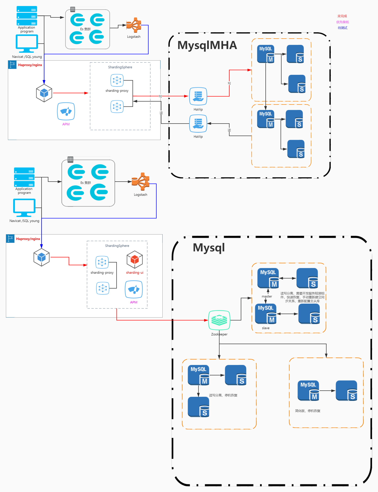

本次操作需要一定的docker基础，不妨碍先给自己吹一波，绝对的好文，原创，每一步遇见的坑都记录下来了，怎么解决，有什么其他方案。  

**写在前面的话，不支持的项**

## 不支持项

### 路由至多数据节点

不支持CASE WHEN、HAVING、UNION (ALL)，有限支持子查询。

除了分页子查询的支持之外(详情请参考[分页](https://blog.nxhz1688.com/go/?url=https://shardingsphere.apache.org/document/legacy/4.x/document/cn/features/sharding/use-norms/pagination))，也支持同等模式的子查询。无论嵌套多少层，ShardingSphere都可以解析至第一个包含数据表的子查询，一旦在下层嵌套中再次找到包含数据表的子查询将直接抛出解析异常。

例如，以下子查询可以支持：

```sql
SELECT COUNT(*) FROM (SELECT * FROM t_order o)
```

以下子查询不支持：

```sql
SELECT COUNT(*) FROM (SELECT * FROM t_order o WHERE o.id IN (SELECT id FROM t_order WHERE status = ?))
```

不支持包含schema的SQL。因为ShardingSphere的理念是像使用一个数据源一样使用多数据源，因此对SQL的访问都是在同一个逻辑schema之上。虚拟库概念。

### 对分片键进行操作

运算表达式和函数中的分片键会导致全路由。

假设`create_time`为分片键，则无法精确路由形如SQL：

```sql
SELECT * FROM t_order WHERE to_date(create_time, 'yyyy-mm-dd') = '2019-01-01';
```

由于ShardingSphere只能通过SQL`字面`提取用于分片的值，因此当分片键处于运算表达式或函数中时，ShardingSphere无法提前获取分片键位于数据库中的值，从而无法计算出真正的分片值。

当出现此类分片键处于运算表达式或函数中的SQL时，ShardingSphere将采用全路由的形式获取结果。

### 不支持的SQL

|                             SQL                              |          不支持原因          |
| :----------------------------------------------------------: | :--------------------------: |
|    INSERT INTO tbl_name (col1, col2, …) VALUES(1+2, ?, …)    |  VALUES语句不支持运算表达式  |
| INSERT INTO tbl_name (col1, col2, …) SELECT col1, col2, … FROM tbl_name WHERE col3 = ? |       INSERT .. SELECT       |
| SELECT COUNT(col1) as count_alias FROM tbl_name GROUP BY col1 HAVING count_alias > ? |            HAVING            |
|    SELECT * FROM tbl_name1 UNION SELECT * FROM tbl_name2     |            UNION             |
|  SELECT * FROM tbl_name1 UNION ALL SELECT * FROM tbl_name2   |          UNION ALL           |
|                  SELECT * FROM ds.tbl_name1                  |          包含schema          |
|      SELECT SUM(DISTINCT col1), SUM(col1) FROM tbl_name      | 详见DISTINCT支持情况详细说明 |
| SELECT * FROM tbl_name WHERE to_date(create_time, ‘yyyy-mm-dd’) = ? |         会导致全路由         |

## DISTINCT支持情况详细说明

### 支持的SQL

|                             SQL                              |
| :----------------------------------------------------------: |
|        SELECT DISTINCT * FROM tbl_name WHERE col1 = ?        |
|              SELECT DISTINCT col1 FROM tbl_name              |
|        SELECT DISTINCT col1, col2, col3 FROM tbl_name        |
|       SELECT DISTINCT col1 FROM tbl_name ORDER BY col1       |
|       SELECT DISTINCT col1 FROM tbl_name ORDER BY col2       |
|             SELECT DISTINCT(col1) FROM tbl_name              |
|           SELECT AVG(DISTINCT col1) FROM tbl_name            |
|           SELECT SUM(DISTINCT col1) FROM tbl_name            |
|          SELECT COUNT(DISTINCT col1) FROM tbl_name           |
|   SELECT COUNT(DISTINCT col1) FROM tbl_name GROUP BY col1    |
|       SELECT COUNT(DISTINCT col1 + col2) FROM tbl_name       |
| SELECT COUNT(DISTINCT col1), SUM(DISTINCT col1) FROM tbl_name |
| SELECT COUNT(DISTINCT col1), col1 FROM tbl_name GROUP BY col1 |
| SELECT col1, COUNT(DISTINCT col1) FROM tbl_name GROUP BY col1 |

### 不支持的SQL

|                        SQL                         |               不支持原因               |
| :------------------------------------------------: | :------------------------------------: |
| SELECT SUM(DISTINCT col1), SUM(col1) FROM tbl_name | 同时使用普通聚合函数和DISTINCT聚合函数 |

## 分页性能

### 性能瓶颈

查询偏移量过大的分页会导致数据库获取数据性能低下，以MySQL为例：

```sql
SELECT * FROM t_order ORDER BY id LIMIT 1000000, 10
```

这句SQL会使得MySQL在无法利用索引的情况下跳过1000000条记录后，再获取10条记录，其性能可想而知。 而在分库分表的情况下（假设分为2个库），为了保证数据的正确性，SQL会改写为：

```sql
SELECT * FROM t_order ORDER BY id LIMIT 0, 1000010
```

即将偏移量前的记录全部取出，并仅获取排序后的最后10条记录。这会在数据库本身就执行很慢的情况下，进一步加剧性能瓶颈。 因为原SQL仅需要传输10条记录至客户端，而改写之后的SQL则会传输`1,000,010 * 2`的记录至客户端。

### ShardingSphere的优化

ShardingSphere进行了2个方面的优化。

首先，采用流式处理 + 归并排序的方式来避免内存的过量占用。由于SQL改写不可避免的占用了额外的带宽，但并不会导致内存暴涨。 与直觉不同，大多数人认为ShardingSphere会将`1,000,010 * 2`记录全部加载至内存，进而占用大量内存而导致内存溢出。 但由于每个结果集的记录是有序的，因此ShardingSphere每次比较仅获取各个分片的当前结果集记录，驻留在内存中的记录仅为当前路由到的分片的结果集的当前游标指向而已。 对于本身即有序的待排序对象，归并排序的时间复杂度仅为`O(n)`，性能损耗很小。

其次，ShardingSphere对仅落至单分片的查询进行进一步优化。 落至单分片查询的请求并不需要改写SQL也可以保证记录的正确性，因此在此种情况下，ShardingSphere并未进行SQL改写，从而达到节省带宽的目的。

## 分页方案优化

由于LIMIT并不能通过索引查询数据，因此如果可以保证ID的连续性，通过ID进行分页是比较好的解决方案：

```sql
SELECT * FROM t_order WHERE id > 100000 AND id <= 100010 ORDER BY id
```

或通过记录上次查询结果的最后一条记录的ID进行下一页的查询：

```sql
SELECT * FROM t_order WHERE id > 100000 LIMIT 10
```

 

| **数据层**    | **缓存**          | **数据同步** |
| ------------- | ----------------- | ------------ |
| **Mysql MHA** | **Elasticsearch** | **Logstash** |

**需求如下：**

​    目前涉及到的是生产环境改造：底层数据由mysql存储，mha实现集群高可用，目前数据集群没有 配置vip漂移策略，也没有什么前置代理，所以后端服务直接怼的是主master节点，这里有个问题，主从同步由半同步插件在做，MHA高可用其实只完成了一半，为啥这样，别问我😂，问就是不知道，后台数据通过logstash将主节点数据实时同步只ES，查询通过ES进行。现在的问题是数据量大，很大，有多大，一个索引一个月已经120G。好吧，这个数据是按照设备走的，咱不关心，现在问题是ES这么大了，mysql咋办。

**需要考虑的问题如下：**

- MHA 代理服务如何处理？ 不能把所有的节点都配置成，分表插件的代理节点吧？
- Logstash访问的代理服务，如何处理？
- 底层服务访问的代理服务，如何处理？
- 分表插件对于MHA集群如何分片？如何分表？
- 分库分表后，数据同步Logstash如何进行数据同步？
- 分库分表插件，代理、分片、分库怎样进行合理操作？
- 怎样保证上下游高可用？

问题有点多，还都比较棘手，先不说其他，先整下ShardingSphere，为啥不用MyCat,一个是资源，一个是坑大，为啥说坑大，google搜搜，或者看看前面提到的**[Mycat与ShardingSphere如何选择](https://blog.nxhz1688.com/2021/01/19/mycat-shardingsphere/)**

 

**本次使用docker进行ShardingSphere组件搭建😉生产环境请根据自己公司的具体情况进行选择**

| **组件**           | **实现方式**     |
| ------------------ | ---------------- |
| **MySQL MHA**      | **Centos部署**   |
| **Zookeeper**      | **Docker**       |
| **Sharding-Proxy** | **Docker**       |
| **Sharding-UI**    | **Docker**       |
| **Sharding-JDBC**  | **代码服务层面** |

## 1.部署Zookeeper服务，做注册中心

 zookeeper 比较常用，占用的资源也很小，所以我用了 –restart unless-stopped，表示除非人工stop这个容器，否则这个容器每次都自动重启。

```
docker run -p 2181:2181 --name zk --restart unless-stopped -d zookeeper
```

## 2.新建mysql实例，我这里使用docker-compose新建4个mysql8.0实例用作测试

| 新建docker-compose.yml                                       |
| ------------------------------------------------------------ |
| vim /home/mysql/docker-compose.yml                           |
| `version: '3.7' services:    mysql8_1:        image: mysql:8.0.17        container_name: mysql8_1        ports:            - "33080:3306"        environment:            MYSQL_ROOT_PASSWORD: 12345678    mysql8_2:        image: mysql:8.0.17        container_name: mysql8_2        ports:            - "33081:3306"        environment:            MYSQL_ROOT_PASSWORD: 12345678    mysql8_3:        image: mysql:8.0.17        container_name: mysql8_3        ports:            - "33082:3306"        environment:            MYSQL_ROOT_PASSWORD: 12345678    mysql8_4:        image: mysql:8.0.17        container_name: mysql8_4        ports:            - "33083:3306"        environment:            MYSQL_ROOT_PASSWORD: 12345678` |
| 启动服务,弱弱说一句，这个有问题，找度娘很好解决 cd /home/mysql docker-compose up |

## 3.部署**Sharding-Proxy**

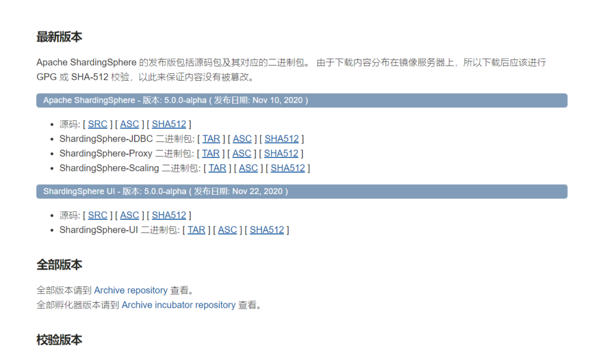

```
1.先获取镜像，可以通过search查询最新版👀有点懵，去官方看看推荐用什么版本 官方版本
docker search sharding-proxy 
2.下载镜像，不写版本默认最新
docker pull apache/sharding-proxy
3.运行容器修改配置文件指向主机地址，替换自己的地址，我的配置放在home下了，别学我
```

docker run –name sharding-proxy -d -v /home/sharding-proxy/conf:/opt/sharding-proxy/conf -v /home/sharding-proxy/ext-lib:/opt/sharding-proxy/ext-lib -p13308:3308 -e PORT=3308 apache/sharding-proxy:latest

## 4.配置shardingProxy先做个测试

在自己的配置文件夹下面新建文件，例如：

```
cd /home/sharding-proxy/conf
vim config-test.yaml
```

内容如下：

```
schemaName: sharding_db

dataSources:
  ds_0:
    url: jdbc:mysql://mysql8_1:3306/demo_ds_0?serverTimezone=GMT&allowPublicKeyRetrieval=true&useSSL=false&characterEncoding=utf8
  ds_1:
    url: jdbc:mysql://mysql8_1:3306/demo_ds_1?serverTimezone=GMT&allowPublicKeyRetrieval=true&useSSL=false&characterEncoding=utf8

dataSourceCommon:
  username: root
  password: 12345678
  connectionTimeoutMilliseconds: 300000
  idleTimeoutMilliseconds: 600000
  maxLifetimeMilliseconds: 1800000
  maxPoolSize: 10000
  minPoolSize: 100
  maintenanceIntervalMilliseconds: 3000000

rules:
- !SHARDING
  tables:
    t_order:
      actualDataNodes: ds_${0..1}.t_order_${0..1}
      tableStrategy:
        standard:
          shardingColumn: order_id
          shardingAlgorithmName: t_order_inline
      keyGenerateStrategy:
        column: order_id
        keyGeneratorName: snowflake
    t_order_item:
      actualDataNodes: ds_${0..1}.t_order_item_${0..1}
      tableStrategy:
        standard:
          shardingColumn: order_id
          shardingAlgorithmName: t_order_item_inline
      keyGenerateStrategy:
        column: order_item_id
        keyGeneratorName: snowflake
  bindingTables:
    - t_order,t_order_item
  defaultDatabaseStrategy:
    standard:
      shardingColumn: user_id
      shardingAlgorithmName: database_inline
  defaultTableStrategy:
    none:

  shardingAlgorithms:
    database_inline:
      type: INLINE
      props:
        algorithm-expression: ds_${user_id % 2}
    t_order_inline:
      type: INLINE
      props:
        algorithm-expression: t_order_${order_id % 2}
    t_order_item_inline:
      type: INLINE
      props:
        algorithm-expression: t_order_item_${order_id % 2}

  keyGenerators:
    snowflake:
      type: SNOWFLAKE
      props:
        worker-id: 123
```

**vim server.yaml**

```
# 用户通过Navicat访问sharding-proxy的用户名密码
authentication:
  users:
    root: # 自定义用户名
      password: 12345678 # 自定义密码
    sharding: # 自定义用户名
      password: sharding # 自定义密码
      authorizedSchemas: sharding_db, replica_query_db # 该用户授权可访问的数据库，多个用逗号分隔。缺省将拥有 root 权限，可访问全部数据库。

# sharding-proxy相关配置，建议sql.show设置为true，方便定位问题
props:
  max.connections.size.per.query: 1
  acceptor.size: 16
  executor.size: 16
  proxy.transaction.enabled: false
  proxy.opentracing.enabled: false
  sql-show: true  
```

## 5.测试sharding-proxy代理服务，建表写入数据，进行查询

| **5.1跟着俺，单实例mysql，代理配置测试，连接mysql，注意连接的是真实数据库，330801** |
| ------------------------------------------------------------ |
| `DROP SCHEMA IF EXISTS demo_ds_0; DROP SCHEMA IF EXISTS demo_ds_1; CREATE SCHEMA IF NOT EXISTS demo_ds_0; CREATE SCHEMA IF NOT EXISTS demo_ds_1;` |
| **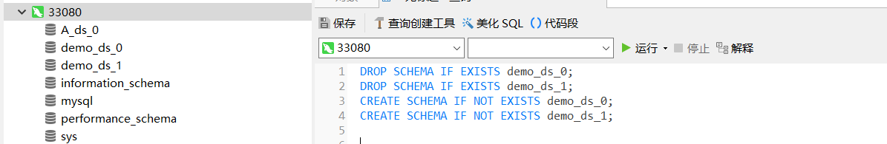** |
| **5.2启动sharding-proxy容器 **                               |
| `docker restart sharding-proxy docker logs -f sharding-proxy` |
| 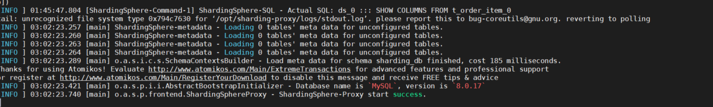 |
| **5.3 使用工具或者安装了mysql客户端的命令访问sharding-proxy代理服务** |
| **5.3.1mysql 客户端操作，如下操作认为服务已经代理成功**      |
| **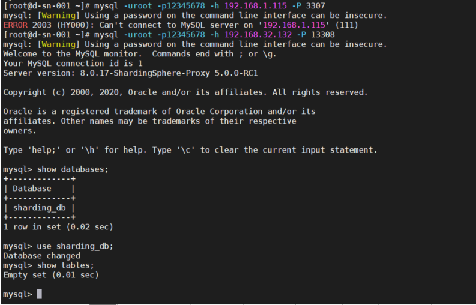** |
| **到这一步就可以直接操作数据库了，测试一下，建表，写库，查询** |
| **建表**                                                     |
| CREATE TABLE IF NOT EXISTS demo_ds_0.t_order (order_id BIGINT NOT NULL AUTO_INCREMENT, user_id INT NOT NULL, status VARCHAR(50), PRIMARY KEY (order_id)); CREATE TABLE IF NOT EXISTS demo_ds_1.t_order (order_id BIGINT NOT NULL AUTO_INCREMENT, user_id INT NOT NULL, status VARCHAR(50), PRIMARY KEY (order_id));CREATE TABLE IF NOT EXISTS demo_ds_0.t_order_item (order_item_id BIGINT NOT NULL AUTO_INCREMENT, order_id BIGINT NOT NULL, user_id INT NOT NULL, status VARCHAR(50), PRIMARY KEY (order_item_id)); CREATE TABLE IF NOT EXISTS demo_ds_1.t_order_item (order_item_id BIGINT NOT NULL AUTO_INCREMENT, order_id BIGINT NOT NULL, user_id INT NOT NULL, status VARCHAR(50), PRIMARY KEY (order_item_id));** ** |
| 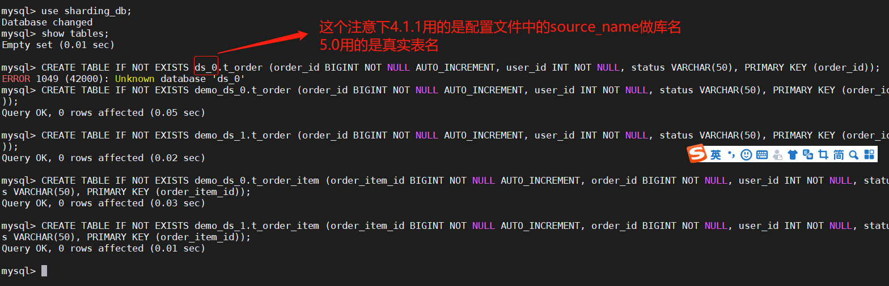 |
| **写数据**                                                   |
| **INSERT INTO t_order (user_id, status) VALUES (1, ‘init’); INSERT INTO t_order (user_id, status) VALUES (1, ‘init’); INSERT INTO t_order (user_id, status) VALUES (2, ‘init’); ** |
| **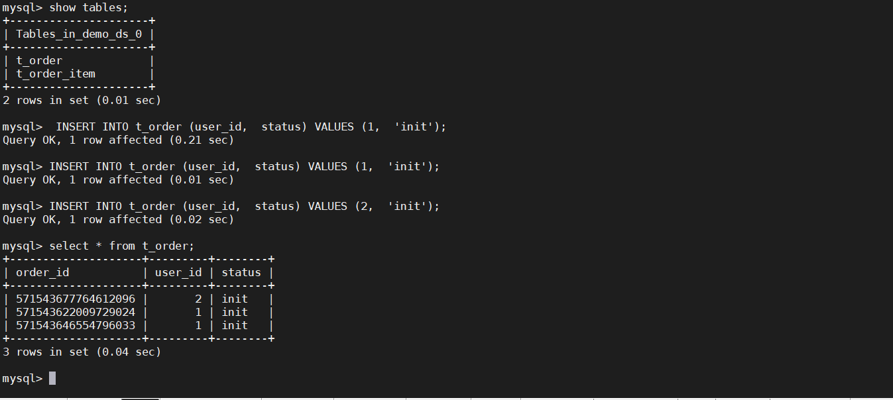** |
| **5.3.2 Navicat Myql建立连接 sharding-proxy 5.0客户端如下显示，5.0有坑，别再往下走了，想用docker的下载4.1.1的源码，自己做docker镜像，不想用的直接跳过，找到4.1.1的服务包，进行部署吧，官方找** |
| **第一步**                                                   |
| 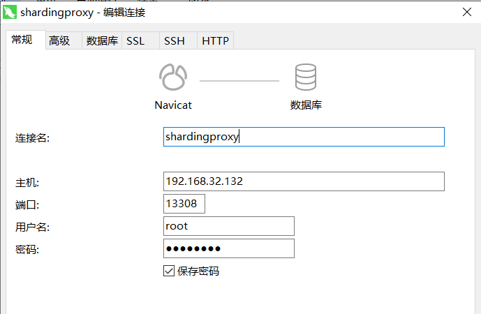** ** |
| **第二步，这个用客户端连接必须要弄，不然没法打开**           |
| 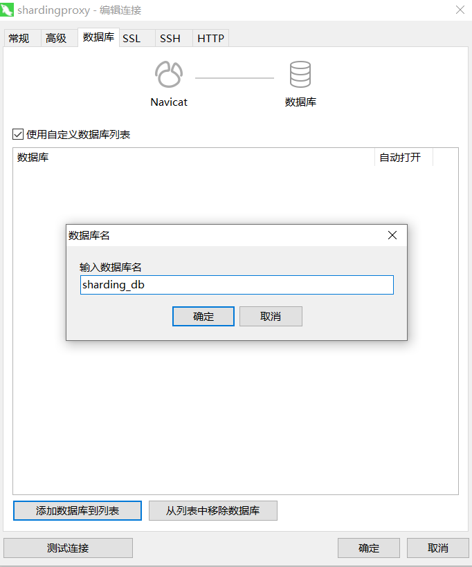** ** |
| **5.0版本还未稳定，有bug,打开连接如下**                      |
| ** ** |
| **sharding-proxy日志显示如下：这是一个bug,官方还没有解决，好吧，我算是掉坑了，但是内测的版本，不应该标注一下吗，直接放在官方最显眼的地方，不仔细看，我都以为5.0可以用了呢，这个bug已经提交，看啥时候能更新，详细信息可以看看：https://github.com/apache/shardingsphere/issues/6693** |
| **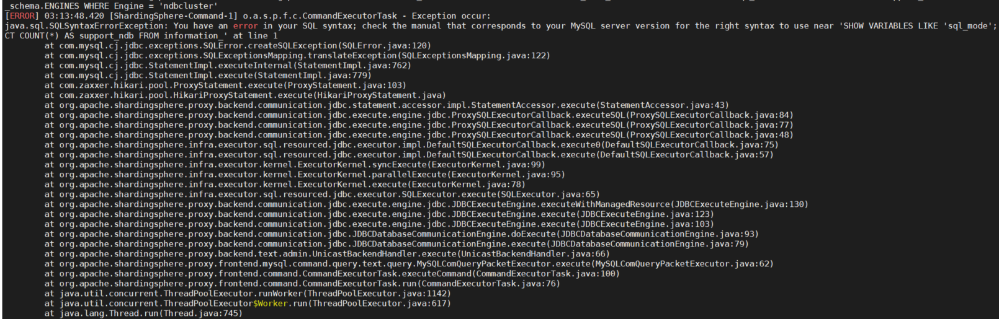** |

**总结下部署遇到的问题，解决方案在下面，请自行查阅，对号入座 ***
\*    弱弱的吐槽一下，sharding的官方文档，最起码给个示例，文档也没有及时更新，可能我在操作的时候用的是5.x脸黑正好赶上了。sharding-proxy启动后各种问题，容器日志 docker logs -f sharding-proxy 命令执行

| **Q1：openJDK问题**                                          |
| ------------------------------------------------------------ |
| **A1: 最终我修改容器配置处理了，使用的就是上面提到修改/var/lib/docker/containers/ 下的配置文件，这一步大家应该也用不到，除非，你就是要用容器部署，想和使用主机的JDK** |

| **Q2: 配置文件属性找不到，类似：Caused by: org.yaml.snakeyaml.error.YAMLException: Unable to find property ‘keyGeneratorColumnName’ on class: 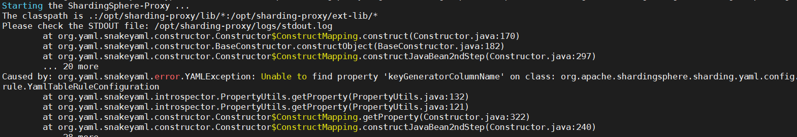 ** |
| ------------------------------------------------------------ |
| **A2: 解决方案在下面，这里就是我要吐槽的地方了，文档写的不清楚，没有跟上代码版本。**     我在git仓库：https://gitee.com/Sharding-Sphere，这里github与gitee，代码是一致的，在示例中拷贝的代码，和官方文档上面的代码，竟然都不能正常启动，一直报这个问题，所以我最后只能去看源码来找这里的配置，还好源码上面也有示例，与镜像匹配，没有太深入挖代码，源码下载地址就不贴了，怕写了人家有变动，放在这里给大家做个参考，快速定位问题 |

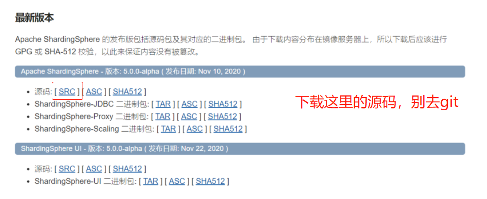

官方配置：

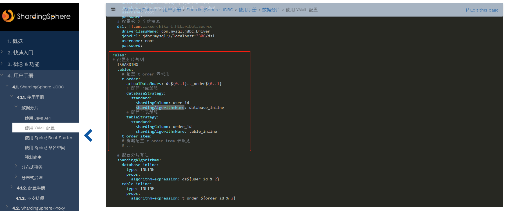

git仓库中的示例配置：

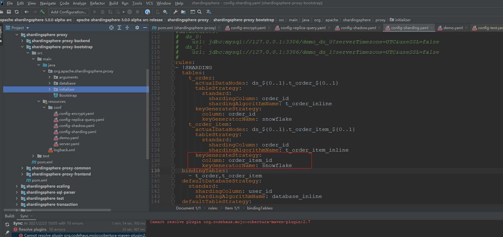

源码中的配置：

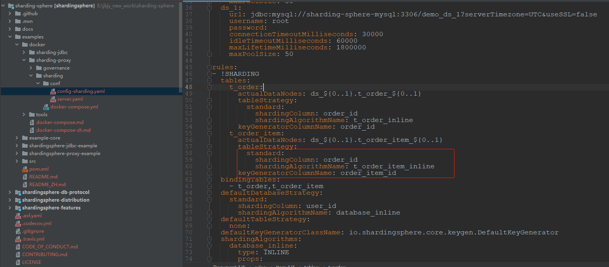

**Q3:网络问题**

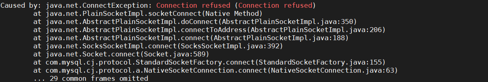

**A3: 容器网络建立，会的大神，自己操作就好，因为我的mysql使用docker-compose启动的，sharding-proxy是单独启动的，要把sharding加入mysql网络中。我就不详细写了，大家看图：**

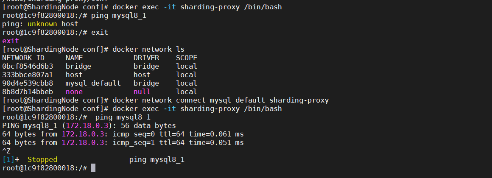

以下内容是给大家排错解决问题用的，是我在配置时遇到的问题记录，没有遇到对应问题，不要跟着执行😊

docker restart sharding-proxy重启服务查看日志

```
docker logs -f sharding-proxy
```

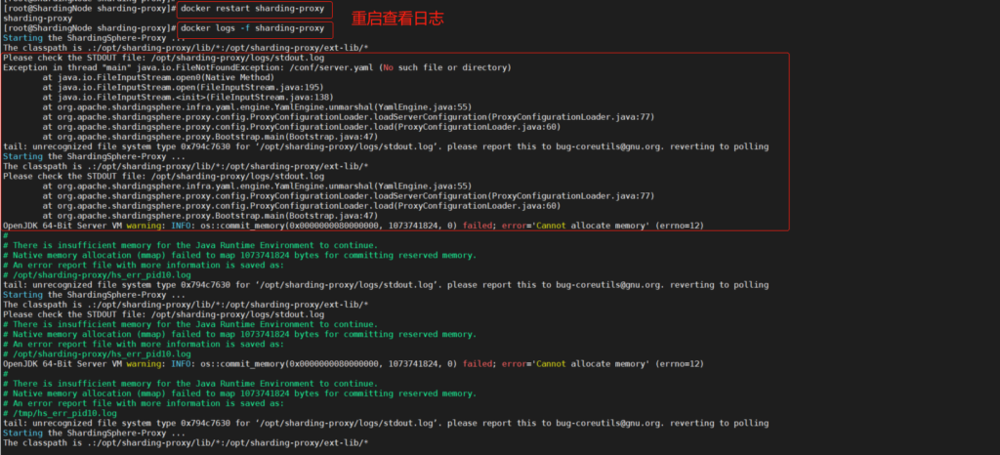

😒没找到文件，用的还是openJDK，这怎么能忍，赶紧处理掉

一个一个解决，首先是配置文件的问题，仔细查看原来是建立容器是时的指向问题

```
停止服务
docker stop sharding-proxy
查看挂载目录
docker inspect -f "{{.Mounts}}" sharding-proxy
```

简单的办法，直接删除容器重现建立，麻烦的办法，去修改配置文件

删除容器 docker rm sharding-proxy 查看进程 docker ps 查看所有进程，包括未启动 docker ps -a 重新建立服务 docker run –name sharding-proxy -d -v /home/sharding-proxy/conf:/opt/sharding-proxy/conf -v /home/sharding-proxy/ext-lib:/opt/sharding-proxy/ext-lib -p13308:3308 -e PORT=3308 apache/sharding-proxy:latest

现在去看日志，发现只有openJDK的问题了

先进容器看看配置

```
docker exec -it sharding-proxy bash
```

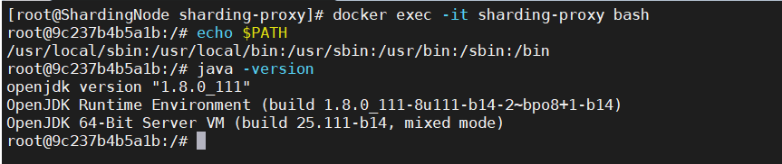

这里给提供个思路，容器内部是可以做修改的，言归正传，看我怎么处理sharding-proxy容器,对了从容器里面退出用**EXIT**命令

😉看好喽，骚操作来了

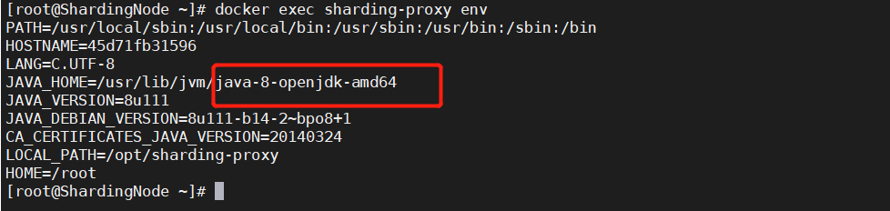

第一步，把容器删了😂，没闪到腰吧`docker stop sharding-proxy docker rm sharding-proxy`第二步，重新建立容器，把宿主机的JDK挂载到容器中,启动容器 docker run –name sharding-proxy -d -v /usr/java/jdk1.8.0_231:/usr/java/jdk1.8.0_231 -v /home/sharding-proxy/conf:/opt/sharding-proxy/conf -v /home/sharding-proxy/ext-lib:/opt/sharding-proxy/ext-lib -p13308:3308 -e PORT=3308 apache/sharding-proxy:latest第三步，去容器里面设置环境变量,这个和宿主机的配置一致     进入容器内 docker exec -it sharding-proxy /bin/bash 记录一下id, root@d098b005cf7a:/#一会要保存新镜像 进入目录修改环境变量 cd /etc/profile.d/ 把JDK环境写入java.sh,这里不对劲，我后面发现这样环境变量设置失败，直接把主机的java.sh中内容复制 放到 echo “”里面执行一下，后面步骤一致，环境变量就设置好了 echo “#!/bin/bash” >> java.sh echo “JAVA_HOME=/usr/java/jdk1.8.0_231 PATH=$JAVA_HOME/bin:$PATH export JRE_HOME=${JAVA_HOME}/jre export CLASSPATH=.:${JAVA_HOME}/lib:${JRE_HOME}/lib export PATH” >> java.sh 执行java.sh sh java.sh 刷新环境变量 source /etc/profile 查看版本 java -version 保存修改过 docker commit da50a26be864 sharding-proxy:v1

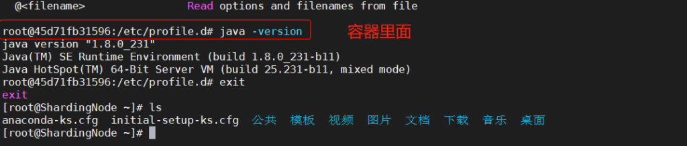

| 还有一种办法，把主机的配置文件直接拷贝到容器中，就不用删容器了，我就不做演示了，给提供一下相关命令 `那串编号是容器id 可以用docker ps 来查看docker cp ~/Downloads/java-1.8.0-openjdk-amd64 08343b40ab39:/usr/lib/jvm/` |
| ------------------------------------------------------------ |
| 又来了，把容器删了😂`docker stop sharding-proxy docker rm sharding-proxy`使用新的镜像来执行：docker run –name sharding-proxy -d -v /usr/java/jdk1.8.0_231:/usr/java/jdk1.8.0_231 -v /home/sharding-proxy/conf:/opt/sharding-proxy/conf -v /home/sharding-proxy/ext-lib:/opt/sharding-proxy/ext-lib -p13308:3308 -e PORT=3308 sharding-proxy:v1 |
| 大爷的又失败了，我放大招了，把主机添加环境变量的文件，挂到容器内，我就不在写什么删除容器，重建容器了，直接开始了，也不在容器中编辑文件了，直接运行挂载的文件，还有一种办法，把主机的配置文件直接拷贝到容器中，就不用删容器了，我就不做演示了，给提供一下相关命令 |
| 具体操作如下，给大家做个参考，红框的地方注意下               |

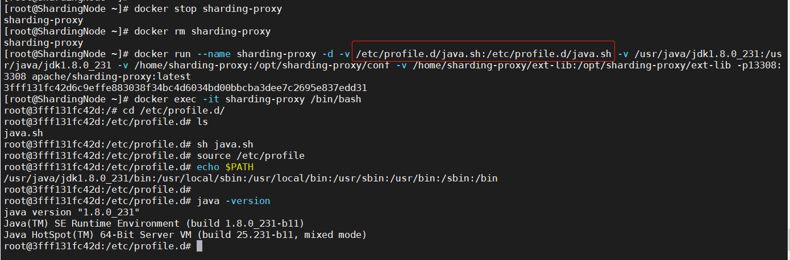

执行完了，保存为v2版本

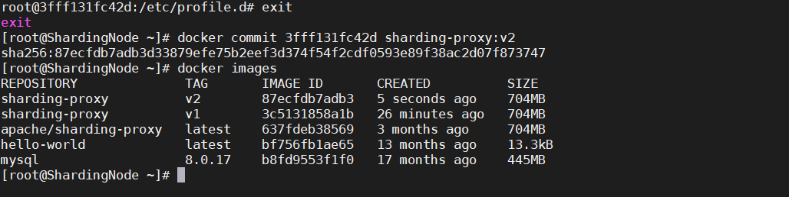

| 又来了，删除容器，用v2版本重启    docker run –name sharding-proxy -d -v /etc/profile.d/java.sh:/etc/profile.d/java.sh -v /usr/java/jdk1.8.0_231:/usr/java/jdk1.8.0_231 -v /home/sharding-proxy/conf:/opt/sharding-proxy/conf -v /home/sharding-proxy/ext-lib:/opt/sharding-proxy/ext-lib -e JVM_OPTS=”-Djava.awt.headless=true”-p13308:3308 -e PORT=3308 sharding-proxy:v2 |
| ------------------------------------------------------------ |
|  还是openJDK，经过踩坑发现环境变量类的，在容器中修改生效，退出容器后直接失效了，/etc/hosts, /etc/resolv.conf和/etc/hostname，容器中的这三个文件不存在于镜像，而是存在于/var/lib/docker/containers/ |
| 提供两种方法任选一来解决： 1.停止服务，修改对应容器下的配置文件，在进行重启 2.使用docker-compose 进行容器编排，直接配置 |

我选择第一种，快速修改实现目的。

进入容器，把这俩环境拷贝出来

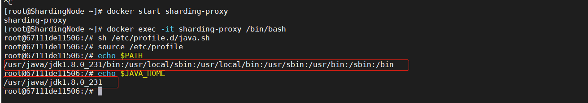

**停止服务，在进行修改配置文件，**🤷‍♂️**注意: 这一步是必须的，因为docker的守护进程，服务启动，修改配置文件没有用，所以生成环境，建议采用第二种进行容器编排，别影响其他服务。危险，谨慎处理。**

service docker stop

使用docker inspect查看容器ID

docker inspect sharding-proxy

进入文件目录,红色的是容器Id

cd /var/lib/docker/containers/67111de11506468976b58b83c09aa29b587319459c153dce20578c6547b757b2/

进入对应id下的目录修改config.v2.json配置文件，把文件里面的环境变量替换掉，然后重启服务，怎么修改文件就不操作说明了，截图看下结果

docker inspect sharding-proxy

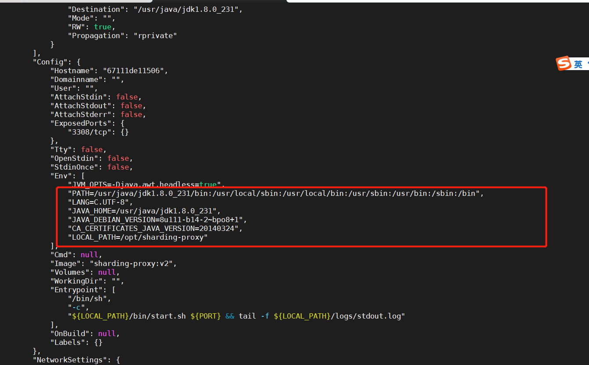

 