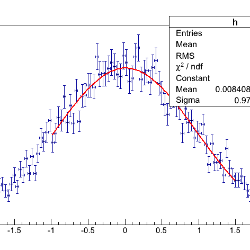

[数据库设计](https://www.zhihu.com/topic/19614808)

[PolarDB](https://www.zhihu.com/topic/20101217)

# tidb后面如何面对阿里xdb和polardb？

个人感觉tidb架构上落后xdb和polardb,也许有失偏颇，望专业人士解惑一下，谢谢

关注者**363**

被浏览

**58,349**

关注问题写回答

邀请回答

好问题 1

2 条评论

分享

#### 10 个回答

默认排序

[余米知](https://www.zhihu.com/people/baryeah)

工程师，金融业搬砖

26 人赞同了该回答

利益相关：POLARDB是cloud native设计，在成本、性能、稳定性、复杂的云环境和生态对接上花了很多的笔墨，特别是在针对银行业核心数据库的低延迟、高稳定、高可靠、容灾场景上有深的理解，架构是为了业务和技术实现，所以一开始的目标就很不一样。POLARDB作为更大更强的MySQL是目前服务大量云数据库用户的RDS的延续，在百T级别的存储上模糊了OLTP和OLAP的界限，Oracle关键特性兼容的能力模糊了主流数据库的边界，低延迟的特性在实时的场景普适性会更强大，和开源社区的合作让更多人可以参与进来。POLARDB我更愿意理解是个完整的数据库体系而不是单一产品，POLARDB for MySQL\PG\MongoDB很快都会问世。热烈欢迎大家一起开创下一代数据库的未来！

[编辑于 2017-11-27](https://www.zhihu.com/question/66715254/answer/262125439)

赞同 269 条评论

分享

收藏喜欢

继续浏览内容

知乎

发现更大的世界

打开

Chrome

继续

[Ed Huang](https://www.zhihu.com/people/huang-dong-xu)

TiDB的亲爹之一，如有问题欢迎到asktug.com问

98 人赞同了该回答

设计理念其实不太一样。TiDB 的设计目标排在第一位的是扩展性和可用性，希望在架构上尽可能减少对硬件和特殊 API 的依赖，当然了，我也不会排斥新的硬件带来的提升。整个分布式数据库的技术方向现在分成两个流派，一个是类似的 Aurora 的「共享存储」型（具体就不展开了，资料很多），还有一个流派是 Spanner 为代表的纯 Share nothing 的架构，我觉得并没有谁比谁高级和落后，Share nothing 的架构在单集群更大规模下的使用场景我觉得会更好，而 Aurora 的架构更适合云（多租户 + 更好的兼容性）。我一直认为大规模分布式系统本身是特别脆弱的，架构的先进与否并不重要，甚至某些情况下性能（延迟）都是可以放弃的。普适性、高质量的实现、完备且极端的测试在我看来更加重要。嘛~跑车的引擎是很先进，但是去穿越大沙漠的话，我还是相信我自己能修的引擎。// 两年过去了，似乎不用面对 XDB 了

[编辑于 2019-11-11](https://www.zhihu.com/question/66715254/answer/245210447)

赞同 989 条评论

分享

收藏喜欢

继续浏览内容

知乎

发现更大的世界

打开

Chrome

继续

[Wonder](https://www.zhihu.com/people/wang-de-hao-51)

愚人见石，智者见泉

17 人赞同了该回答

利益相关，X-DB项目成员。看来大家对X-DB了解还不多。由于阿里巴巴业务复杂、数据量巨大，而且存在双十一这样的极端场景，这些都对数据库有极高的要求。X-DB的设计的目的便是要解决这些世界级的问题。简单介绍下，它的能力主要包括：既然是分布式数据库，很强的水平扩展能力是必须要有的，毕竟业务增长很快。在阿里巴巴业务场景下，高可用也是必须要达到的（5个9）。全面100%兼容MySQL，对用户来讲，跟使用MySQL一模一样。这一点至关重要，业务无缝切换。超高性能，我们自研的新一代的存储引擎X-Engine，目前sysbench标准化测试下做到了65万的TPS，相同硬件下是InnoDB最优性能（11万左右）的6倍左右。当然这个我们有信心最终做到10倍以上。而且磁盘占用在InnoDB的30%。 高性能低成本也是X-DB的一大优势。数据强一致，基于我们自研的X-Paxo，保证跨AZ、跨城副本之间强一致，并且性能损失很小。其实，今年双十一已经上X-DB 1.0了，零点32.5万笔/秒的峰值，X-DB交出完美答卷，这么大压力下平稳过渡。
补充一个最近的进展: https://zhuanlan.zhihu.com/p/35462656

[编辑于 2018-04-12](https://www.zhihu.com/question/66715254/answer/269238776)

赞同 1712 条评论

分享

收藏喜欢

继续浏览内容

知乎

发现更大的世界

打开

Chrome

继续

[realzyy](https://www.zhihu.com/people/zhang-yun-yang-4)

阿里云数据库资深产品专家

2 人赞同了该回答

关公战秦琼

[发布于 2017-11-19](https://www.zhihu.com/question/66715254/answer/262281007)

赞同 2添加评论

分享

收藏喜欢

继续浏览内容

知乎

发现更大的世界

打开

Chrome

继续

[无名](https://www.zhihu.com/people/wu-ming-15-12)

京东 架构师

12 人赞同了该回答

看过各个大厂的数据库高大上的宣传资料和PPT，真正看到源码，可以动手在自己笔记本上搭起来的就只有tidb，其他一些分布式数据库也玩儿过一些，老外的东西不如本土有亲和力，plardb、xdb虽然nb但玩儿一次太贵

[发布于 2019-04-04](https://www.zhihu.com/question/66715254/answer/641273157)

赞同 12添加评论

分享

收藏喜欢

继续浏览内容

知乎

发现更大的世界

打开

Chrome

继续

[interma](https://www.zhihu.com/people/interma)

R.A.P

2 人赞同了该回答

水平不够，不谈技术架构，只说脑补的感受：认为Polardb更先进一些：有足够的业务打磨产品：无论是产品成熟度上还是架构挑战上。已经开始采用先进硬件解决瓶颈问题，降低用户使用成本（如果阿里没骗我的话。。。。）另外还有一个对tidb不利的地方：未来大多数数据库都会运行于（公用）云上，目前公有云是大厂逐鹿的天下，大厂们还都有自己的数据库产品（甚至为了产品闭环，数据库可以少/不赚钱），tidb得远远胜于这些亲儿子才能有机会。这个tidb该如何应对呢？

[编辑于 2017-10-16](https://www.zhihu.com/question/66715254/answer/245221335)

赞同 211 条评论

分享

收藏喜欢

继续浏览内容

知乎

发现更大的世界

打开

Chrome

继续

[Jack Yu](https://www.zhihu.com/people/jackyu)

粒子物理PhD，已转码农

1 人赞同了该回答

架构上tidb比aurora是先进的，所以也比polardb先进。xdb没了解过。

[编辑于 2017-10-16](https://www.zhihu.com/question/66715254/answer/245355996)

赞同 13 条评论

分享

收藏喜欢

继续浏览内容

知乎

发现更大的世界

打开

Chrome

继续

[Joffe Chiu](https://www.zhihu.com/people/joffe-chiu)

一个没有继承玄学的玄学世家/广告程序员/摄影爱好者/农民工/全能好爸爸/

1 人赞同了该回答

TiDB这类开源的数据库才能让你完全脱离平台,达到某种程度上的完全兼容任意平台方案,单单这点polarDb就做不到如果一个系统,要求用户只能搭建在阿里云,那这个系统多少有些不自由

[发布于 07-16](https://www.zhihu.com/question/66715254/answer/2000873368)

赞同 11 条评论

分享

收藏喜欢

继续浏览内容

知乎

发现更大的世界

打开

Chrome

继续

[二十吉吉](https://www.zhihu.com/people/wan-a-zhi-shi-tiao)

1 人赞同了该回答

polardb写节点只有一个!!!tidb写节点可以有多个 单凭这一点架构就完爆porladb

[编辑于 06-15](https://www.zhihu.com/question/66715254/answer/1941765758)

赞同 1添加评论

分享

收藏喜欢

继续浏览内容

知乎

发现更大的世界

打开

Chrome

继续

[BlackHole](https://www.zhihu.com/people/blackhole-13-93)

2 人赞同了该回答

说这么多干嘛呢? tidb 上一个国际tpcc 性能测试 能否把 阿里OB 打下来再说 . 2020年6月 PingCAP tidb 去了日本paypay , 懂日语的技术人才不多,但不代表没有人不懂, 但 paypay 根本没有发文说用了tidb , 该公司用Aurora为主 , DBA招聘信息也是Aurora为主. 除此之外还造假性能测试 , TiFlash用clickhouse存储引擎,跟Oracle , GreenPlum,MySQL 比 , 里面数据脚本和SQL语句是Clickhouse官方网站提供的,数据是"美国交通部"的 . 地址如下: cloud点tencent点com/developer/article/1582796

[发布于 2020-06-20](https://www.zhihu.com/question/66715254/answer/1292405884)