# 云原生数据库设计新思路

返回全部

黄东旭2021-01-14

> 本文作者为 PingCAP 联合创始人兼 CTO 黄东旭，将分享分布式数据库的发展趋势以及云原生数据库设计的新思路。

在讲新的思路之前，先为过去没有关注过数据库技术的朋友们做一个简单的历史回顾，接下来会谈谈未来的数据库领域，在云原生数据库设计方面的新趋势和前沿思考。首先来看看一些主流数据库的设计模式。

## 常见的分布式数据库流派

分布式数据库的发展历程，我按照年代进行了分类，到目前为止分成了四代。第一代是基于简单的分库分表或者中间件来做 Data Sharding 和 水平扩展。第二代系统是以 Cassandra、HBase 或者 MongoDB 为代表的 NoSQL 数据库，一般多为互联网公司在使用，拥有很好的水平扩展能力。

第三代系统我个人认为是以 Google Spanner 和 AWS Aurora 为代表的新一代云数据库，他们的特点是融合了 SQL 和 NoSQL 的扩展能力，对业务层暴露了 SQL 的接口，在使用上可以做到水平的扩展。

第四代系统是以现在 TiDB 的设计为例，开始进入到混合业务负载的时代，一套系统拥有既能做交易也能处理高并发事务的特性，同时又能结合一些数据仓库或者分析型数据库的能力，所以叫 HTAP，就是融合型的数据库产品。

未来是什么样子，后面的分享我会介绍关于未来的一些展望。从整个时间线看，从 1970 年代发展到现在，database 也算是个古老的行业了，具体每个阶段的发展情况，我就不过多展开。

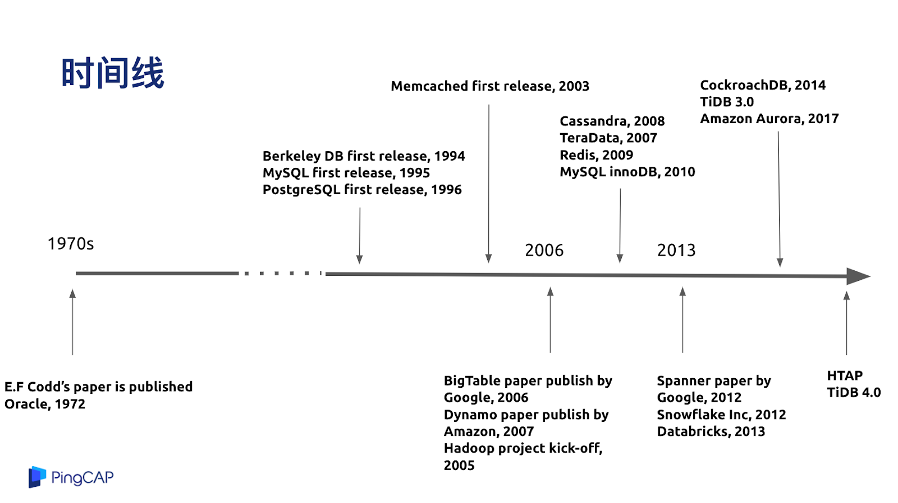

## 数据库中间件

对于数据库中间件来说，第一代系统是中间件的系统，基本上整个主流模式有两种，一种是在业务层做手动的分库分表，比如数据库的使用者在业务层里告诉你；北京的数据放在一个数据库里，而上海的数据放在另一个数据库或者写到不同的表上，这种就是业务层手动的最简单的分库分表，相信大家操作过数据库的朋友都很熟悉。

第二种通过一个数据库中间件指定 Sharding 的规则。比如像用户的城市、用户的 ID、时间来做为分片的规则，通过中间件来自动的分配，就不用业务层去做。

这种方式的优点就是简单。如果业务在特别简单的情况下，比如说写入或者读取基本能退化成在一个分片上完成，在应用层做充分适配以后，延迟还是比较低的，而整体上，如果 workload 是随机的，业务的 TPS 也能做到线性扩展。

但是缺点也比较明显。对于一些比较复杂的业务，特别是一些跨分片的操作，比如说查询或者写入要保持跨分片之间的数据强一致性的时候就比较麻烦。另外一个比较明显的缺点是它对于大型集群的运维是比较困难的，特别是去做一些类似的表结构变更之类的操作。想象一下如果有一百个分片，要去加一列或者删一列，相当于要在一百台机器上都执行操作，其实很麻烦。

## NoSQL - Not Only SQL

在 2010 年前后，好多互联网公司都发现了这个大的痛点，仔细思考了业务后，他们发现业务很简单，也不需要 SQL 特别复杂的功能，于是就发展出了一个流派就是 NoSQL 数据库。NoSQL 的特点就是放弃到了高级的 SQL 能力，但是有得必有失，或者说放弃掉了东西总能换来一些东西，NoSQL 换来的是一个对业务透明的、强的水平扩展能力，但反过来就意味着你的业务原来是基于 SQL 去写的话，可能会带来比较大的改造成本，代表的系统有刚才我说到的 MongoDB、Cassandra、HBase 等。

最有名的系统就是 MongoDB，MongoDB 虽然也是分布式，但仍然还是像分库分表的方案一样，要选择分片的 key，他的优点大家都比较熟悉，就是没有表结构信息，想写什么就写什么，对于文档型的数据比较友好，但缺点也比较明显，既然选择了 Sharding Key，可能是按照一个固定的规则在做分片，所以当有一些跨分片的聚合需求的时候会比较麻烦，第二是在跨分片的 ACID 事务上没有很好的支持。

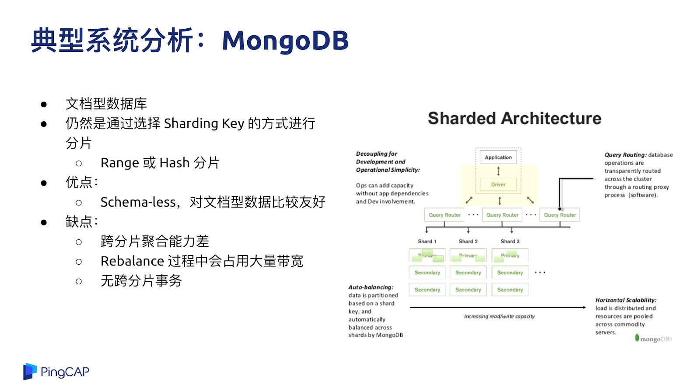

HBase 是 Hadoop 生态下的比较有名的分布式 NoSQL 数据库，它是构建在 HDFS 之上的一个 NoSQL 数据库。Cassandra 是一个分布式的 KV 数据库，其特点是在 KV 操作上提供多种一致性模型，缺点与很多 NoSQL 的问题一样，包括运维的复杂性， KV 的接口对于原有业务改造的要求等。

## 第三代分布式数据库 NewSQL

刚才说过 Sharding 或者分库分表，NoSQL 也好，都面临着一个业务的侵入性问题，如果你的业务是重度依赖 SQL，那么用这两种方案都是很不舒适的。于是一些技术比较前沿的公司就在思考，能不能结合传统数据库的优点，比如 SQL 表达力，事务一致性等特性，但是又跟 NoSQL 时代好的特性，比如扩展性能够相结合发展出一种新的、可扩展的，但是用起来又像单机数据库一样方便的系统。在这个思路下就诞生出了两个流派，一个是 Spanner，一个是 Aurora，两个都是顶级的互联网公司在面临到这种问题时做出的一个选择。

### Shared Nothing 流派

Shared Nothing 这个流派是以 Google Spanner 为代表，好处是在于可以做到几乎无限的水平扩展，整个系统没有端点，不管是 1 个 T、10 个 T 或者 100 个 T，业务层基本上不用担心扩展能力。第二个好处是他的设计目标是提供强 SQL 的支持，不需要指定分片规则、分片策略，系统会自动的帮你做扩展。第三是支持像单机数据库一样的强一致的事务，可以用来支持金融级别的业务。

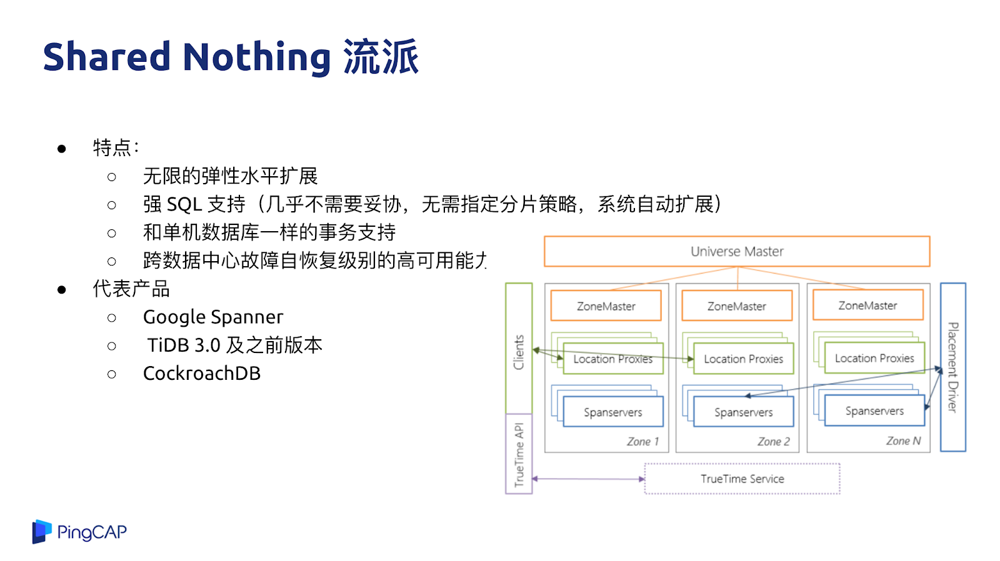

代表产品就是 Spanner 与 TiDB，这类系统也有一些缺点，从本质上来说一个纯分布式数据库，很多行为没有办法跟单机行为一模一样。举个例子，比如说延迟，单机数据库在做交易事务的时候，可能在单机上就完成了，但是在分布式数据库上，如果要去实现同样的一个语义，这个事务需要操作的行可能分布在不同的机器上，需要涉及到多次网络的通信和交互，响应速度和性能肯定不如在单机上一次操作完成，所以在一些兼容性和行为上与单机数据库还是有一些区别的。即使是这样，对于很多业务来说，与分库分表相比，分布式数据库还是具备很多优势，比如在易用性方面还是比分库分表的侵入性小很多。

### Shared Everything 流派

第二种流派就是 Shared Everything 流派，代表有 AWS Aurora、阿里云的 PolarDB，很多数据库都定义自己是 Cloud-Native Database，但我觉得这里的 Cloud-Native 更多是在于通常这些方案都是由公有云服务商来提供的，至于本身的技术是不是云原生，并没有一个统一的标准。从纯技术的角度来去说一个核心的要点，这类系统的计算与存储是彻底分离的，计算节点与存储节点跑在不同机器上，存储相当于把一个 MySQL 跑在云盘上的感觉，我个人认为类似 Aurora 或者 PolarDB 的这种架构并不是一个纯粹的分布式架构。

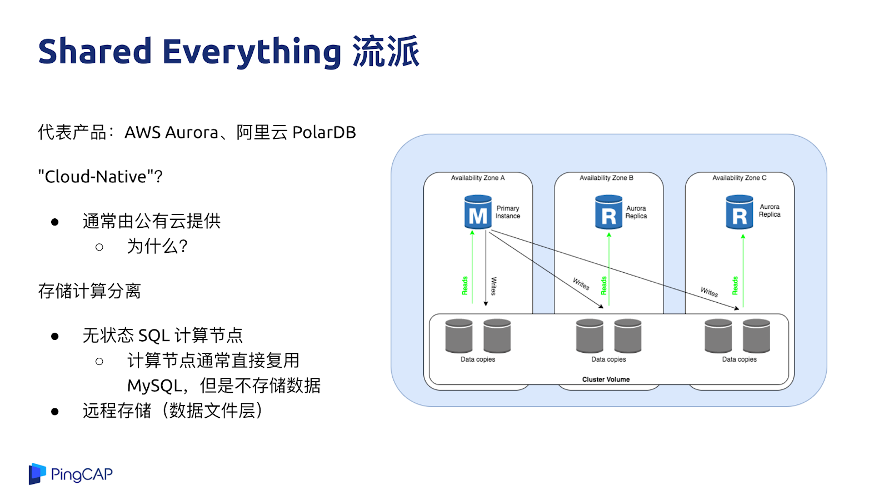

原来 MySQL 的主从复制都走 Binlog，Aurora 作为一种在云上 Share Everything Database 的代表，Aurora 的设计思路是把整个 IO 的 flow 只通过 redo log 的形式来做复制，而不是通过整个 IO 链路打到最后 Binlog，再发到另外一台机器上，然后再 apply 这个 Binlog，所以 Aurora 的 IO 链路减少很多，这是一个很大的创新。

日志复制的单位变小，意味着我发过去的只有 Physical log，不是 Binlog，也不是直接发语句过去，直接发物理的日志能代表着更小的 IO 的路径以及更小的网络包，所以整个数据库系统的吞吐效率会比传统的 MySQL 的部署方案好很多。

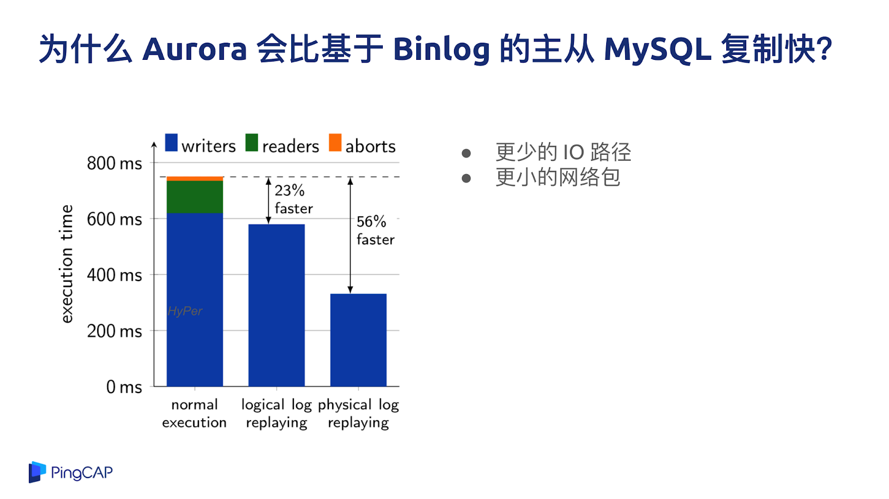

Aurora 的优势是 100% 兼容 MySQL，业务兼容性好，业务基本上不用改就可以用，而且对于一些互联网的场景，对一致性要求不高的话，数据库的读也可以做到水平扩展，不管是 Aurora 也好，PolarDB 也好，读性能是有上限的。

Aurora 的短板大家也能看得出来，本质上这还是一个单机数据库，因为所有数据量都是存储在一起的，Aurora 的计算层其实就是一个 MySQL 实例，不关心底下这些数据的分布，如果有大的写入量或者有大的跨分片查询的需求，如果要支持大数据量，还是需要分库分表，所以 Aurora 是一款更好的云上单机数据库。

## 第四代系统：分布式 HTAP 数据库

第四代系统就是新形态的 HTAP 数据库，英文名称是 Hybrid Transactional and Analytical Processing，通过名字也很好理解，既可以做事务，又可以在同一套系统里面做实时分析。HTAP 数据库的优势是可以像 NoSQL 一样具备无限水平扩展能力，像 NewSQL 一样能够去做 SQL 的查询与事务的支持，更重要的是在混合业务等复杂的场景下，OLAP 不会影响到 OLTP 业务，同时省去了在同一个系统里面把数据搬来搬去的烦恼。目前，我看到在工业界基本只有 TiDB 4.0 加上 TiFlash 这个架构能够符合上述要求。

### 分布式 HTAP 数据库：TiDB (with TiFlash)

为什么 TiDB 能够实现 OLAP 和 OLTP 的彻底隔离，互不影响？因为 TiDB 是计算和存储分离的架构，底层的存储是多副本机制，可以把其中一些副本转换成列式存储的副本。OLAP 的请求可以直接打到列式的副本上，也就是 TiFlash 的副本来提供高性能列式的分析服务，做到了同一份数据既可以做实时的交易又做实时的分析，这是 TiDB 在架构层面的巨大创新和突破。

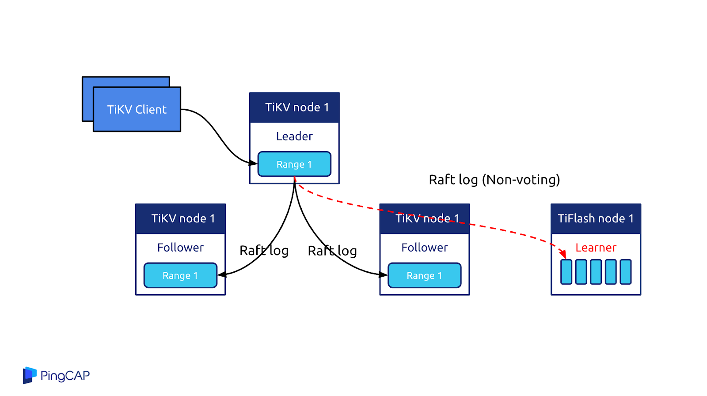

下图是 TiDB 的测试结果，与 MemSQL 进行了对比，根据用户场景构造了一种 workload，横轴是并发数，纵轴是 OLTP 的性能，蓝色、黄色、绿色这些是 OLAP 的并发数。这个实验的目的就是在一套系统上既跑 OLTP 又跑 OLAP，同时不断提升 OLTP 和 OLAP 的并发压力，从而查看这两种 workload 是否会互相影响。可以看到在 TiDB 这边，同时加大 OLTP 和 OLAP 的并发压力，这两种 workload 的性能表现没有什么明显变化，几乎是差不多的。但是，同样的实验发生在 MemSQL 上，大家可以看到 MemSQL 的性能大幅衰减，随着 OLAP 的并发数变大，OLTP 的性能下降比较明显。

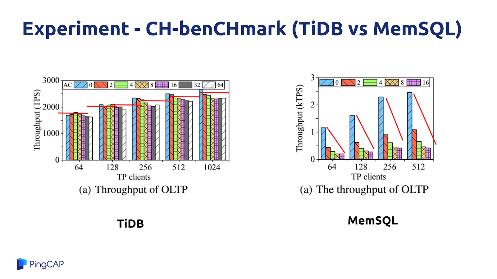

接下来是 TiDB 在一个用户实际业务场景的例子，在进行 OLAP 业务的查询的时候，OLTP 业务仍然可以实现平滑的写入操作，延迟一直维持在较低的水平。

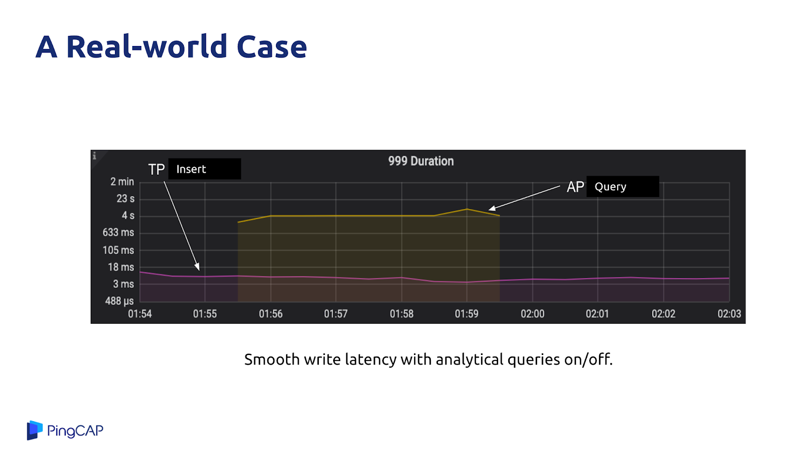

## 未来在哪里

### Snowflake

Snowflake 是一个 100% 构建在云上的数据仓库系统，底层的存储依赖 S3，基本上每个公有云都会提供类似 S3 这样的对象存储服务，Snowflake 也是一个纯粹的计算与存储分离的架构，在系统里面定义的计算节点叫 Virtual Warehouse，可以认为就是一个个 EC2 单元，本地的缓存有日志盘，Snowflake 的主要数据存在 S3 上，本地的计算节点是在公有云的虚机上。

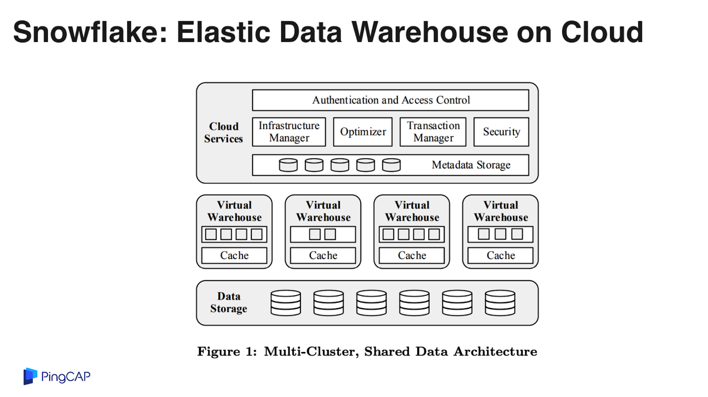

这是 Snowflake 在 S3 里面存储的数据格式的特点，每一个 S3 的对象是 10 兆一个文件，只追加，每一个文件里面包含源信息，通过列式的存储落到磁盘上。

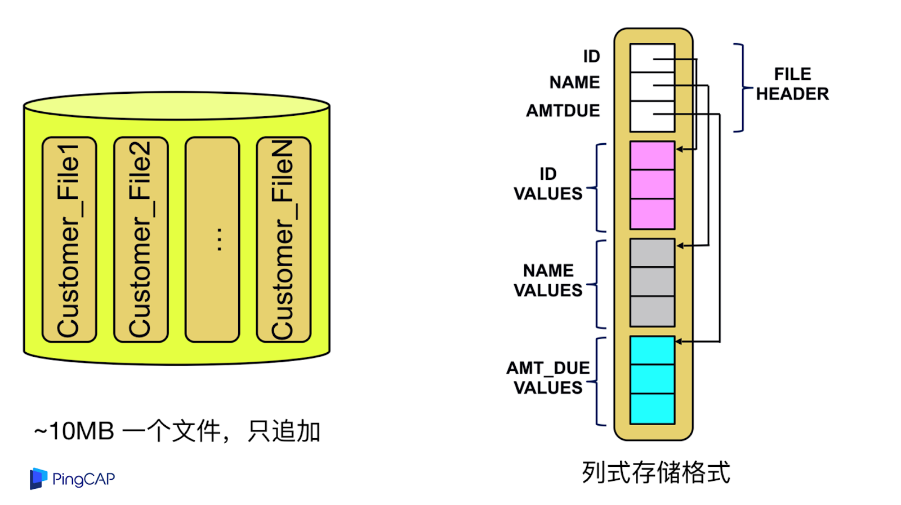

Snowflake 这个系统最重要的一个闪光点就是对于同一份数据可以分配不同的计算资源进行计算，比如某个 query 可能只需要两台机器，另外一个 query 需要更多的计算资源，但是没关系，实际上这些数据都在 S3 上面，简单来说两台机器可以挂载同一块磁盘分别去处理不同的工作负载，这就是一个计算与存储解耦的重要例子。

### Google BigQuery

第二个系统是 BigQuery，BigQuery 是 Google Cloud 上提供的大数据分析服务，架构设计上跟 Snowflake 有点类似。BigQuery 的数据存储在谷歌内部的分布式文件系统 Colossus 上面，Jupiter 是内部的一个高性能网络，上面这个是谷歌的计算节点。

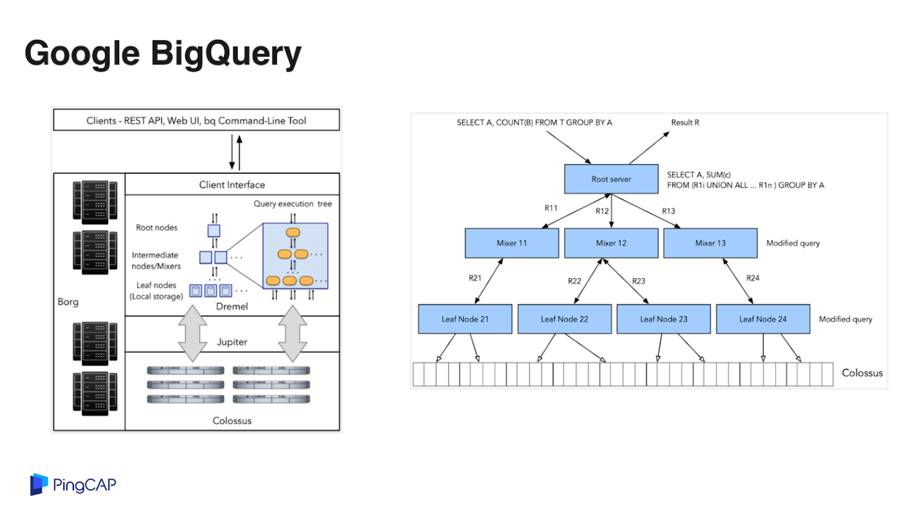

BigQuery 的处理性能比较出色，每秒在数据中心内的一个双向的带宽可以达到 1 PB，如果使用 2000 个专属的计算节点单元，大概一个月的费用是四万美金。BigQuery 是一个按需付费的模式，一个 query 可能就用两个 slot，就收取这两个 slot 的费用，BigQuery 的存储成本相对较低，1 TB 的存储大概 20 美金一个月。

### RockSet

第三个系统是 RockSet，大家知道 RocksDB 是一个比较有名的单机 KV 数据库，其存储引擎的数据结构叫 LSM-Tree，LSM-Tree 的核心思想进行分层设计，更冷的数据会在越下层。RockSet 把后面的层放在了 S3 的存储上面，上面的层其实是用 local disk 或者本地的内存来做引擎，天然是一个分层的结构，你的应用感知不到下面是一个云盘还是本地磁盘，通过很好的本地缓存让你感知不到下面云存储的存在。

所以刚才看了这三个系统，我觉得有几个特点，一个是首先都是天然分布式的，第二个是构建在云的标准服务上面的，尤其是 S3 和 EBS，第三是 pay as you go，在架构里面充分利用了云的弹性能力。我觉得这三点最重要的一点是存储，存储系统决定了云上数据库的设计方向。

## 为什么 S3 是关键？

在存储里边我觉得更关键的可能是 S3。EBS 其实我们也有研究过，TiDB 第一阶段其实已经正在跟 EBS 块存储做融合，但从更长远的角度来看，我觉得更有意思的方向是在 S3 这边。

首先第一点 S3 非常划算，价格远低于 EBS，第二 S3 提供了 9 个 9 很高的可靠性，第三是具备线性扩展的吞吐能力，第四是天然跨云，每一个云上都有 S3 API 的对象存储服务。但是 S3 的问题就是随机写入的延迟非常高，但是吞吐性能不错，所以我们要去利用这个吞吐性能不错的这个特点，规避延迟高的风险。这是 S3 benchmark 的一个测试，可以看到随着机型的提升，吞吐能力也是持续的提升。

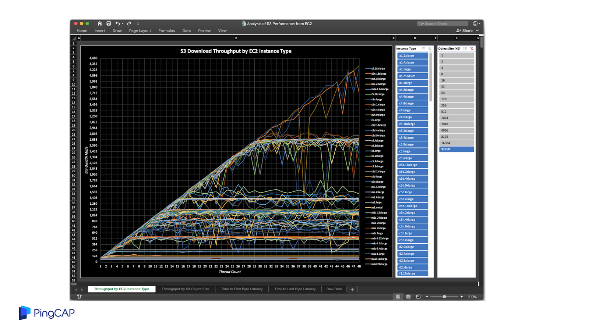

## 如何解决 Latency 的问题？

如果要解决 S3 的 Latency 问题，这里提供一些思路，比如像 RockSet 那样用 SSD 或者本地磁盘来做 cache，或者通过 kinesis 写入日志，来降低整个写入的延迟。还有数据的复制或者你要去做一些并发处理等，其实可以去做 Zero-copy data cloning，也是降低延迟的一些方式。

上述例子有一些共同点都是数据仓库，不知道大家有没有发现，为什么都是数据仓库？数据仓库对于吞吐的要求其实是更高的，对于延迟并不是那么在意，一个 query 可能跑五秒出结果就行了，不用要求五毫秒之内给出结果，特别是对于一些 Point Lookup 这种场景来说，Shared Nothing 的 database 可能只需要从客户端的一次 rpc，但是对于计算与存储分离的架构，中间无论如何要走两次网络，这是一个核心的问题。

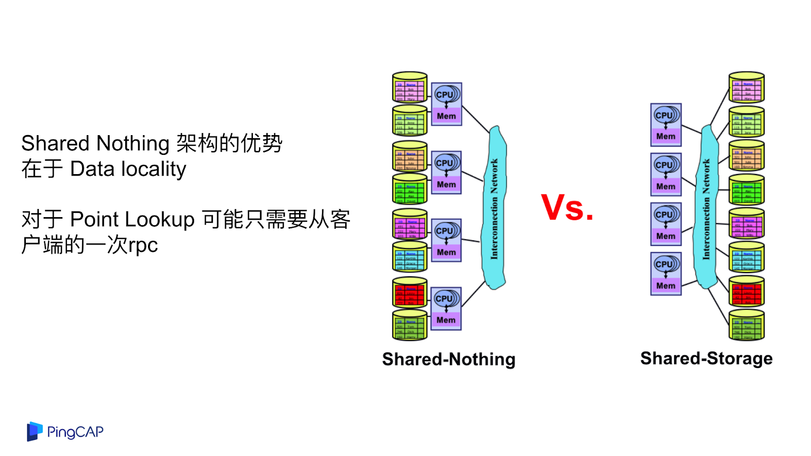

你可能会说没有关系，反正计算和存储已经分离了，大力出奇迹，可以加计算节点。但是我觉得新思路没必要这么极端，Aurora 是一个计算存储分离架构，但它是一个单机数据库，Spanner 是一个纯分布式的数据库，纯 Shared Nothing 的架构并没有利用到云基础设施提供的一些优势。

比如说未来我们的数据库可以做这样的设计，在计算层其实带着一点点状态，因为每台 EC2 都会带一个本地磁盘，现在主流的 EC2 都是 SSD，比较热的数据可以在这一层做 Shared Nothing，在这一层去做高可用，在这一层去做随机的读取与写入。热数据一旦 cache miss，才会落到 S3 上面，可以在 S3 只做后面几层的数据存储，这种做法可能会带来问题，一旦穿透了本地 cache，Latency 会有一些抖动。

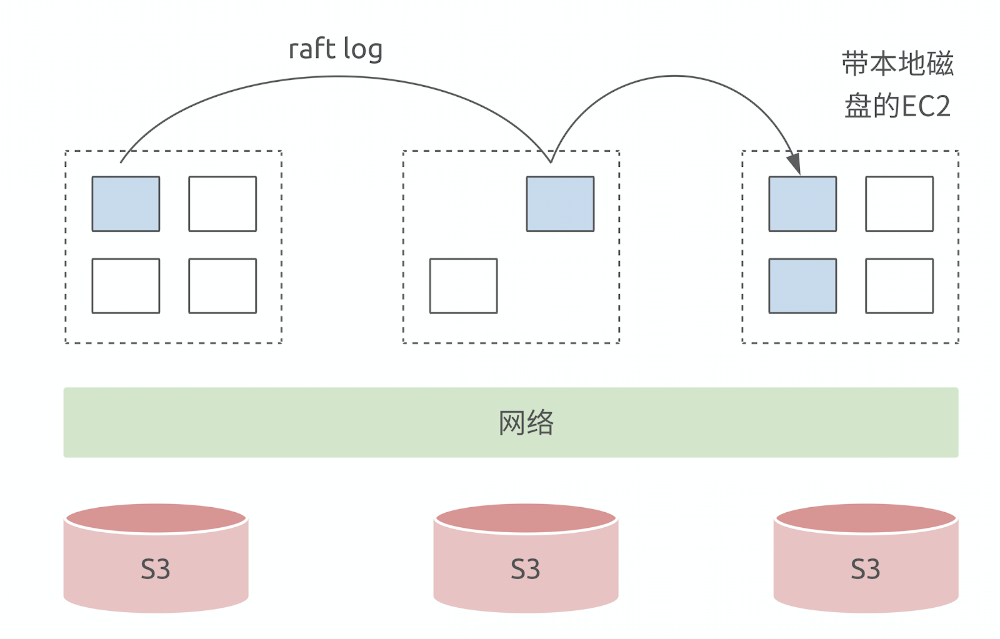

这种架构设计的好处：首先，拥有对实时业务的数据计算亲和力，在 local disk 上会有很多数据，在这点上很多传统数据库的一些性能优化技巧可以用起来；第二，数据迁移其实会变得很简单，实际上底下的存储是共享的，都在 S3 上面，比如说 A 机器到 B 机器的数据迁移其实不用真的做迁移，只要在 B 机器上读取数据就行了。

这个架构的缺点是：第一，缓存穿透了以后，Latency 会变高；第二，计算节点现在有了状态，如果计算节点挂掉了以后，Failover 要去处理日志回放的问题，这可能会增加一点实现的复杂度。

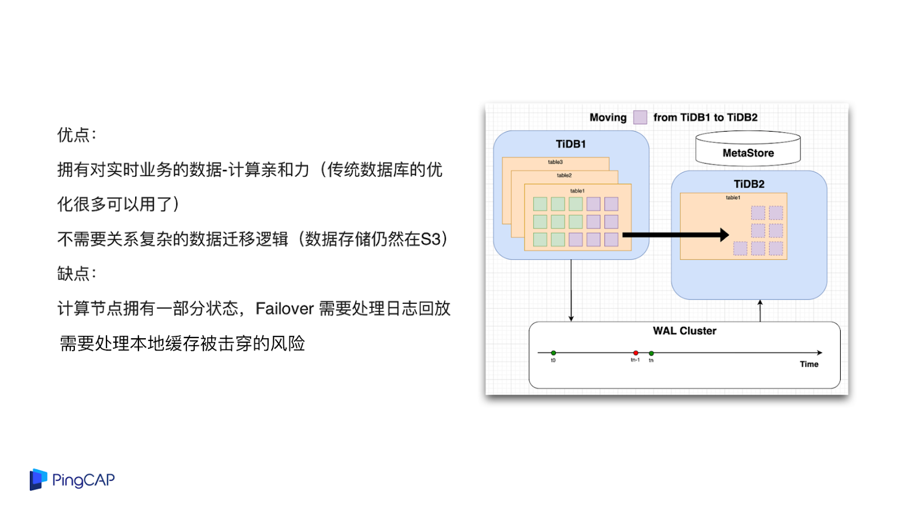

## 还有很多值得研究的课题

上面的架构只是一个设想，TiDB 其实还不是这样的架构，但未来可能会在这方向去做一些尝试或者研究，在这个领域里面其实还有很多 open question 我们还没有答案，包括云厂商、包括我们，包括学术界都没有答案。

现在有一些研究的课题，第一，如果我们要利用本地磁盘，应该缓存多少数据，LRU 的策略是什么样子，跟 performance 到底有什么关系，跟 workload 有什么关系。第二，对于网络，刚才我们看到 S3 的网络吞吐做的很好，什么样的性能要配上什么样的吞吐，要配多少个计算节点，特别是对于一些比较复杂查询的 Reshuffle；第三，计算复杂度和计算节点、机型的关系是什么？这些问题其实都是比较复杂的问题，特别是怎么用数学来表达，因为需要自动化地去做这些事情。

即使这些问题都解决了，我觉得也只是云上数据库时代的一个开始。未来在 Serverless，包括 AI-Driven 几大方向上，怎么设计出更好的 database，这是我们努力的方向。最后引用屈原的一句话，就是路漫漫其修远兮，我们还有很多事情需要去做，谢谢大家。