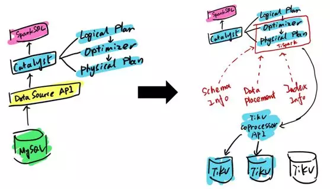

# 敢啃“硬骨头”，开源分布式数据库 TiDB 如何炼成？

- 技术琐话

**2020 年 5 月 29 日

**[文化 & 方法](https://www.infoq.cn/topic/culture-methods)[最佳实践](https://www.infoq.cn/topic/best-practices)[方法论](https://www.infoq.cn/topic/methodologies)

如今硬件的性价比越来越高，网络传输速度越来越快，数据库分层的趋势逐渐显现，人们已经不再强求用一个解决方案来解决所有的存储问题，而是通过分层，让缓存与数据库负责各自擅长的业务场景。

TiDB 作为一款 HTAP 数据库，在高性能的实现 OLTP 特性基础之上，也同时提供基于实时交易数据的实时业务分析需求。

## 什么是 TiDB 数据库？

TiDB 是一个数据库。我们知道市面上有很多类似 MySQL、Oracle 的数据库。 **为什么还需要一个新的数据库？**

相信大家 90% 都使用过 MySQL。但是当 MySQL 的数据量比较大或者说并发开始撑不住的时候，能有什么选择？

其实选择没多少。一个是完全不用 MySQL，而是用 NoSQL。比如说 HBase 或者 Cassandra 去做数据库。

但是相应的代价就是失去了 SQL 的复杂查询的能力，还有整个 MySQL 的 EcoSystem。

NoSQL 可以带来横向的水平拓展能力，但是会面临整个业务代码的重写。这在很多场景下是不太现实的。

所以很多时候还是得用 MySQL，但是 MySQL 在数量方面有各种各样的限制。所以过去我们能做的事情就是 Sharding，水平分区，分库分表。

**但是很多时候虽然你做了水平切分，分库分表，但是 Scale 还是一个非常大的问题。**

另外一点比如说你用了读写分离，或者你可能用了 Cassandra 这样的最终一致性的系统，对于开发者来说这个心智负担是比较大的。

**如果你没有一个强一致的、持久化的存储系统，你的业务层的代码是很难写的，特别是对一些金融场景或者说对一致性要求比较高的业务。**

另外，我们的数据仓库、大数据分析的解决方案和数据库的解决方案中间基本是彻底割裂的。这两年大家常用的 RabbitMQ 或者 Kafka 这样的管道系统，就是尝试在数据库和数据仓库之间构建一个桥梁。有没有办法能够把实时的 OLAP 直接就在数据库层面做？

或者说现在你用了 MySQL 的 Sharding，要去做一个简单的跨业务的 join 的分析，都得把这个数据通过 ETL 导到 Hadoop 或者 data warehouse 里面再去做分析。

维护 ETL 的过程是一个比较麻烦的事情。另外一个问题是数据分析师可能不是一个工程师或者说一个技术很强的人，所以在技术选型上会有各种限制。

**能不能就直接在数据库上去做一些 in-place 的查询呢，这是一个问题。**

另外一个就是大的趋势，大家都在思考数据库这样的业务怎么去跟现有云架构去整合。

举例来说你不可能直接把一个 MySQL 实例放到一个 Container 里面，因为如果 Container 挂了，数据就没了。

**怎么去面向一个云环境或者一个可以弹性伸缩的容器环境，设计一个可以弹性伸缩的数据库，这其实是个很大的问题。**

还有一个特别大的痛点，就是在做高可用的时候人是会出错的。

我们现在做数据库碰到这些问题的原因是什么呢？

我个人认为关系型数据库像 MySQL，Oracle 这些本身不是面向分布式去做设计的。另外，即使你勉强做这个分库分表等操作，本质上来说你只是把 MySQL 再复制了一遍，并不是针对它是一个分布式系统来做存储和计算的优化。

这就是问题，而这也是为什么我们会觉得我在做一些跨业务的查询或者说一些跨物理的这个机器的查询和写入会比较麻烦的原因。

**但是终于这个情况在发生变化， 因为在 2000 年以后，分布式系统理论开始变为主流。**

这有一个历史发展的背景，就是过去硬件价格昂贵，而且网络环境不好。所以尽可能把计算给放在本地去做。

因为 SSD 的出现，现在磁盘 IO 基本上问题已经不大了，而 Intel 很快会发布持久化内存。像这种技术基本上解决了数据库 IO 层上的问题。

现在在 Google 内部，同一个数据中心内读取远程磁盘，跟读取本地磁盘的吞吐和延迟基本是可以做到一致的。

在这种情况下你可以认为整个数据中心就是一台计算机，你重新去设计数据库的时候，它本质上就是一个分布式系统。

第三点就是大家的思维在发生改变，大家不再幻想有一个完美的解决方案去解决掉所有存储上的问题。

### 易维护

TiDB 这个项目是在三年前开始的。项目就是上面介绍的背景，我过去在豌豆荚一直维护 MySQL 集群。

后来因为关系型数据库不易维护，经常想能不能有一个数据库可以结合 MySQL 和 NoSQL 的优点。

**所以这就是最开始的初心，我们要去做一个功能完备的 SQL，百分之百去兼容现有的，至少是这些常用的复杂查询、子查询业务。**

然后同时要以一个 MySQL 的协议和用法去面向客户，或者用户。这一点很重要，它可以极大地降低用户去试你产品的成本。

### 事务

**第二点就是事务，事务是绝对不能少的。我觉得过去这十年 NoSQL 的社区有一个特别大的问题就是追求可扩展性，但是放弃了强一致事务的支持，这是不对的。**

过去不实现这个功能的理由是这个功能会导致系统延迟，性能下降。但是我觉得以牺牲数据准确性为代价去实现这个功能是不现实的。

这就相当于本来这个事情应该数据库来做，这些 NoSQL 系统却强行把这个事情交给业务层做。这会给写业务带来一个极大的问题。

**另外一个就是扩展的易用性，就是能不能做到我这里用了一个词叫做 push-button scaling。**

我简单地扔一台机器进去，不做任何的 resharding，不做任何的修改配置，这个系统自己就扩大了，自己去做 rebalancing，这跟传统的 Sharding 方案有本质的区别。

### 高可用

然后 HA 是什么？HA 就是高可用，这个问题是传统方案很难解决的。就是一切都是需要人工去做这个数据校验和流量的切换。

有没有办法能做到真正的 HA，这个数据库能不能自动地自己去运维、自己去修复自己，自己去保证这个系统的可用性。

**在这块我们也做了一些工作，就是我们在底下的整个数据模型完全放弃掉了主从的模型，完全基于 Raft 跟 Paxos 这样的一种分布式选举算法来做。**

**这个还比较重要，因为如果一个系统你不能保证它的可用性，谈再多的性能都是没有意义的，特别是对于 OLTP 系统来说。**

我的这个系统能不能既在上面去支持 ACID 事务，同时又可以利用 Spark 或者 Hadoop 去用整个机群的计算资源和能力，再去做一些复杂的 SQL 查询的时候能加速。这个其实是可以做到的。

### 开源

**最后一点就是一定是百分之百开源，通用的技术软件不开源是绝对没有未来的。**

因为现在时代已经变了，过去那种闭门造车，然后招一大堆销售，挨家敲门说你要不要试一下的搞法是不对的，特别是平台性质的软件。

而且开源会更加有利于去做软件推广，你的用户越多，用户给你的反馈就越多。

这会比自己在内部去做软件速度快得多。这也是为什么这个项目才开始三年，我们的客户就超过了 2000 多家。

## TiDB 数据库的四大“杀手锏”

现在我来总结一下 TiDB 数据库有哪些应用场景可以在你自己的业务里面去使用。

### 用例 1：MySQL 分片与合并

**第一种场景就是 MySQL，比如已有的业务使用了 MySQL Sharding，没问题。现在 TiDB 因为在业务层实时兼容 MySQL 的这个访问协议。**

**而且我们做了一个工具 Syncer，它能够把 TiDB 作为一个 MySQL Master 的 Slave，在业务层前端可以是一个主库 MySQL，而作为从库的 TiDB 可以看做一个大的 MySQL。**

过去我们有一个说法叫一主多从， 但现在有了 TiDB 以后，可以反过来说多主一从。

你可以把这多个 MySQL 组的不同的表、不同的业务、不同的库，实时的 Binlog 的数据全都同步、汇总到一个大的分布式的 MySQL 上。

这个分布式 MySQL 就是 TiDB。在这个 MySQL 之上，你可以去用一些比较复杂的 Query，比如 join，groupby 全都可以。所以这个是一种用户场景。

Syncer 是什么？我刚才简单提了下，Syncer 是可以把自己伪装成一个 MySQL 的 Slave 去做数据的同步的工具。

它本质上是一个 Binlog Listener，会去监听 MySQL 的 Binlog，然后把它变成数据库的语句。

### 用例 2：直接替换 MySQL

另外一个应用场景就非常简单粗暴，最简单的情况是业务在快速地增长，但是原来业务就是 MySQL 写的，也没考虑什么分库分表，架构这样的事情。

**摩拜早期的时候就用 MySQL。后来发现业务开始快速增长，公司在 30 人团队规模的时候开始使用 TiDB。然后一年之内整个公司人数增长到 800 人，数据从很小的数据集到后来在 TiDB 上有几十 T 的数据，不需要再去做分库分表。**

所以在业务快速增长的场景下 TiDB 是个很好的选择。

然后对于 OLTP 的业务来说，TiDB 也是一个很好的选择。对吞吐来说，TiDB 基本上可以做到线型扩张，机器越多，性能越好。而对于延迟来说，TiDB 也有非常出色的表现。

### 用例 3：数据仓库

**还有一类使用场景是直接把 TiDB 作为数据仓库用。 TiDB 在 OLAP 的性能测评方面表现非常出众。**

如果有一些特别复杂的 SQL，TiDB 的 SQL 层还是搞不定，我这边也做了一个开源的项目，叫 TiSpark 。它其实是一个 Spark 的插件，能够让用户直接用 Spark SQL 来实时地在 TiKV 上做大数据分析。

**第三个应用场景，TiDB 本身是一个存储跟计算分开的一个项目。它底下 Key-Value 的那一层也可以单独拿出来用，你可以把它当作一个 Hbase 的替代品， 同时支持跨行的事务。**

TiDB 的项目其实是受到了 Google Spanner 这个系统的启发，是通过 NoSQL 这一层支持 transaction 的。

TiKV 提供了两层 API，一层是支持跨行事物 transaction 的 API。第二层 API 叫弱 API，主要用来做单行的事务，不提供跨行事务的 ACID 的支持，但是换取的是整个性能和延迟的进一步提升。

所以如果有需要，事务可以用 transaction 的 API，如果需要性能，但是没有强一致事务的跨行事务的需求，就用弱 API。弱 API 跟 Hbase 的一致性级别是一样的。

### 用例 4：作为其他系统的基石

**基于通用的 KV 层，我们是可以做到很多我们想做的事情。TiDB 并不只是一个简单的数据库项目，它应该是其他的分布式系统的 building block，可以作为其他系统构建的基石。**

TiDB 本身对外提供的是 MySQL 的接口，但是社区里面的小伙伴直接去给 TiKV 层去封装一个 Redis 的协议层。然后能让用户直接用 Redis 的协议去做 TiKV。这样就变成了可持久化的 Scalable 的 Redis。

然后另外一个 Case，是在今日头条用的，就是对外提供一个 S3，你想造自己的 S3 没有问题。但是造 S3 最难的部分是在源信息管理这块，并不是它的 data nodes，所以如果你已经有了一个支持跨事务的一个源信息存储系统，你可以做到自己去建造 S3。

我知道已经有一些社区的同学构建一整套新的分布式存储的服务，现在 API 还没有开源，但我觉得不久的未来会开源。

## 如何从 MySQL 迁移到 TiDB？

既然 TiDB 这么好，那现在怎么把 MySQL 迁移到 TiDB 上呢？因为 TiDB 其实是基于 MySQL 生态的，当然可以用 MySQLDump。

**我们自己做了一个数据的导入导出工具叫 Lightning。** 为什么要做这个呢？

比如说过去我们如果直接是用 MySQL 的协议，用 MyDumper、Myloader，就是简单粗暴的导出导入。

那 TiDB 想要做什么事情呢？

因为大家知道 MyDumper Dump 出来的就是 MySQL 一条条的语句。然后在 TiDB 这边要从 SQL，到它的 parser 到执行计划、指导事务、到 KV，最后才写到单机的 RocksDB 上面。

这个过程一遍遍重复执行是一个很慢的过程，如下图：

我们就想，有没有办法能够直接绕过中间所有的东西，直接利用 MyDumper Dump 出来的这个 SQL 语句直接生成底下的 RocksDB 的数据的格式呢？当然可以。

所以这就是 Lightning 在做的事情。你可以认为这是一个升级版的 MySQLDumper，直接 Dump 出 SQL 语句。

然后我们在 TiDB Lightning 这个项目内部直接去做了这个 Record to KV，就是直接生成底层的 key-value pairs。然后同时在内部去做数据分片，提前分好。

第三个就是直接去绕过中间所有的这些 SQL，直接去生成 RocksDB 的 SSD 文件，相当于存储的格式文件发送给不同的机器。然后这个机器直接去把文件 Load 到数据库里面就完成了，中间其实是很快的。

**部署 TiDB，我们选的技术方案是 Ansible，所有的部署都是可以一键完成。然后包括性能调优什么的完全是开源的。**

另外，[TiKV 这个项目已经捐给了 CNCF 基金会](http://mp.weixin.qq.com/s?__biz=MzI3NDIxNTQyOQ==&mid=2247486584&idx=2&sn=13b86ade5c4932719aadcf3ecfea0638&chksm=eb162b12dc61a20483dd4b1e1e2da0fc252cea4959fd9e78e4d877a0f22695e385d16e7cce35&scene=21#wechat_redirect)， TiDB 与 Kubernetes 整合的项目—— [TiDB Operator 也已经开源了](http://mp.weixin.qq.com/s?__biz=MzI3NDIxNTQyOQ==&mid=2247486525&idx=1&sn=342f1b43912b5de5ce22253e5380a108&chksm=eb162b57dc61a241272a87892549c6886ebaa196c19e040e533c0f109745bd7e781397d1321e&scene=21#wechat_redirect)。

当然，如果你说想在本地自己去玩一玩，但是 TiDB 这么多组件，我能不能用一条命令就能在本地搭建一个完整的 TiDB Cluster 去做测试呢？当然可以。

我们这边是有 Docker Compose，是两条路径，一条是 git clone，然后第二条是启动。

它会启动包括 Dashboard，数据的迁移、可视化，TiDB MySQL 的 Service endpoint、TiSpark 全都会在你的 Docker Container 去创建。

另外这还不够，我们把一些核心算法通过数学的方式去形式化地证明它是正确的。这个 TLA+ 的源码文件开源了，大家如果想在自己的分布式系统里面去用 TLA+ 做数学上的证明，你可以去参考我们写的文档。所以我觉得测试反而是这个公司最重要的一块资产。

## 总结

最后，有几个大的问题也是这段时间我思考得比较多的，比如说你整个集群云化了以后，在数据库的层面上 Multi—tenancy 该怎么做？就是如何能去做到更有效的资源隔离和复用？

现在并没有太好的解决方案，因为整个 IO 的隔离还是比较大的问题。

第二个就是自治，这个数据库能不能拥有智能，就是我再不需要人工去做运维。

这个数据库能够自己部署，自己维护，自己更新。然后数据出现问题，自己修复；性能出现问题，自己调优。

我们也在尝试去把一些我们运营时的 Metric 往 Tensorflow 里面去导，自动地去做调优。这个工作正在做，然后应该 CMU 是一些比较有意思的工作。

还有就是软硬件的结合，就是说怎么去利用这些新时代的硬件来提升你的整个数据库的稳定性能。

2020 年 5 月 29 日 15:291178

**[文化 & 方法](https://www.infoq.cn/topic/culture-methods)[最佳实践](https://www.infoq.cn/topic/best-practices)[方法论](https://www.infoq.cn/topic/methodologies)

**轻点一下，留下你的鼓励

## 评论

发布

暂无评论

### 更多内容推荐

- ###### [蚂蚁金服：OceanBase 如何实现透明可扩展的企业级数据库？](https://www.infoq.cn/article/pUL7O3zafPgWBldK-IRV?utm_source=related_read_bottom&utm_medium=article)

  分布式技术的最高境界是什么？这个问题见仁见智，从个人的角度而言，我认为分布式技术的最高境界就是没有分布式。

  **[QCon](https://www.infoq.cn/topic/QCon)[阿里巴巴](https://www.infoq.cn/topic/alibaba)[数据库](https://www.infoq.cn/topic/Database)

- ###### [TiDB 在 360 商业化的应用和实践](https://www.infoq.cn/article/RY73WWYFBx6m1MXB04mr?utm_source=related_read_bottom&utm_medium=article)

  本文主要介绍 TiDB 在 360 商业化业务线的应用实践，以及出现写热点时的优化思路和方法。

  **[文化 & 方法](https://www.infoq.cn/topic/culture-methods)[最佳实践](https://www.infoq.cn/topic/best-practices)[方法论](https://www.infoq.cn/topic/methodologies)

- ###### [SAP 的 HANA 战略（上）](https://time.geekbang.org/column/article/16617?utm_source=related_read&utm_medium=article&utm_term=related_read)

  2009年全球知名ERP公司SAP开始了一场声势浩大的战略转型。这场以HANA这个内存数据库为核心的转型波澜壮阔，集技术和商业为一体，在实际中拯救了SAP。

  2018 年 9 月 5 日

- ###### [TiDB：一个国产新数据库的创业故事](https://time.geekbang.org/column/article/10942?utm_source=related_read&utm_medium=article&utm_term=related_read)

  TiDB是位于北京的一家创业公司PingCAP的产品，它的目标是实现一个开源的类似谷歌Spanner一样的系统。

  2018 年 5 月 16 日

- ###### [滴滴从 KV 存储到 NewSQL 实战](https://www.infoq.cn/article/Z7Dcgyhz94SOgM3PvGVO?utm_source=related_read_bottom&utm_medium=article)

  Fusion-NewSQL是由滴滴自研的在分布式KV存储基础上构建的NewSQL存储系统。Fusion-NewSQL兼容了MySQL协议，支持二级索引功能，提供超大规模数据持久化存储和高性能读写。

  **[ArchSummit](https://www.infoq.cn/topic/ArchSummit)[运维](https://www.infoq.cn/topic/operation)[数据库](https://www.infoq.cn/topic/Database)[架构](https://www.infoq.cn/topic/architecture)[最佳实践](https://www.infoq.cn/topic/best-practices)[性能调优](https://www.infoq.cn/topic/Performance_Tuning)[SQL](https://www.infoq.cn/topic/SQL)

- ###### [从大数据到数据库，聊聊我对未来的看法](https://www.infoq.cn/article/buk4GeD4DZrFaAUAvJv7?utm_source=related_read_bottom&utm_medium=article)

  本文介绍大数据与数据库之间的异同。

  **[大数据](https://www.infoq.cn/topic/bigdata)[数据库](https://www.infoq.cn/topic/Database)[开源](https://www.infoq.cn/topic/opensource)[架构](https://www.infoq.cn/topic/architecture)[硬件](https://www.infoq.cn/topic/hardware)[文化 & 方法](https://www.infoq.cn/topic/culture-methods)[最佳实践](https://www.infoq.cn/topic/best-practices)[方法论](https://www.infoq.cn/topic/methodologies)

- ###### [Cockroach DB 1.0 发布](https://www.infoq.cn/news/2017/06/Cockroach-DB-Production-Release?utm_source=related_read_bottom&utm_medium=article)

  分布式SQL数据库Cockroach DB遵循软件产品以动物命名的模式。近日，该数据库的第一个生产就绪版本1.0发布。本文将介绍Cockroach，将其和Google Spanner进行比较，并介绍我们在开发和生产系统中如何开始使用它。

  **[数据库](https://www.infoq.cn/topic/Database)[语言 & 开发](https://www.infoq.cn/topic/development)[架构](https://www.infoq.cn/topic/architecture)

- ###### [PingCAP 开源社区运营最强 5 招：招招精彩](https://www.infoq.cn/article/H-p0YyspzNfF6ZqGykHC?utm_source=related_read_bottom&utm_medium=article)

  TiDB 社区运营的那些创新与突破

  **[开源](https://www.infoq.cn/topic/opensource)[方法论](https://www.infoq.cn/topic/methodologies)[TGO鲲鹏会](https://www.infoq.cn/topic/TGO)

- ###### [怎样打造一个分布式数据库](https://www.infoq.cn/news/how-to-build-a-distributed-database?utm_source=related_read_bottom&utm_medium=article)

  基于 MySQL 的方案它的天花板在哪里，它的天花板特别明显。有一个思路是能不能通过 MySQL 的 server 把 InnoDB 变成一个分布式数据库，听起来这个方案很完美，但是很快就会遇到天花板。因为 MySQL 生成的执行计划是个单机的……

  **[数据库](https://www.infoq.cn/topic/Database)[语言 & 开发](https://www.infoq.cn/topic/development)[架构](https://www.infoq.cn/topic/architecture)

- ###### [正确性案例（中）：常见分布式数据方案的设计原理是什么？](https://time.geekbang.org/column/article/340181?utm_source=related_read&utm_medium=article&utm_term=related_read)

  这节课我们学习了分布式数据系统的设计原理，分析了Redis，RocksDB、Spanner和TiDB在架构上的取舍思路。

  2021 年 2 月 3 日

- ###### [突破容量极限：TiDB 的海量数据“无感扩容”秘籍](https://xie.infoq.cn/article/1d32200ca31d7475c73705504?utm_source=related_read_bottom&utm_medium=article)

  11 月 26 日，京东智联云与英特尔联合举办了主题为“突破极限，TiDB 在京东智联云的技术架构与实践”的线上直播活动。直播邀请到京东智联云云产品研发部架构师葛集斌老师，和 PingCAP TiDB 生态技术布道专家戚铮老师分别带来分享。

  2020 年 12 月 7 日

- ###### [TiKV 正式从 CNCF 毕业，旨在为云原生时代构建分布式系统](https://www.infoq.cn/article/xUwubxr5OHf3j1VszVo3?utm_source=related_read_bottom&utm_medium=article)

  今日，云原生计算基金会 ( CNCF ) 宣布 TiKV 正式从 CNCF 毕业。TiKV 是继 Harbor 之后在 CNCF 毕业的第二个中国原创开源项目。

  **[云原生](https://www.infoq.cn/topic/CloudNative)[开源](https://www.infoq.cn/topic/opensource)[社区](https://www.infoq.cn/topic/community)

- ###### [如何构建一个分布式块存储产品？| 下篇](https://www.infoq.cn/article/hQia8vMEdK4PuXC9E85J?utm_source=related_read_bottom&utm_medium=article)

  本文主要介绍分布式块存储中的存储引擎。

  **[运维](https://www.infoq.cn/topic/operation)[硬件](https://www.infoq.cn/topic/hardware)[数据库](https://www.infoq.cn/topic/Database)[大数据](https://www.infoq.cn/topic/bigdata)[架构](https://www.infoq.cn/topic/architecture)[最佳实践](https://www.infoq.cn/topic/best-practices)[企业动态](https://www.infoq.cn/topic/ industrynews)

- ###### [BigTable 的开源实现：HBase](https://time.geekbang.org/column/article/70253?utm_source=related_read&utm_medium=article&utm_term=related_read)

  今天我们就来领略一下BigTable对应的NoSQL系统HBase，看看它是如何大规模处理海量数据的。

  2018 年 11 月 29 日

- ###### [HTAP 会成为数据库的未来吗？](https://www.infoq.cn/article/hjf6Phfe7X1h7J4SCoM8?utm_source=related_read_bottom&utm_medium=article)

  在访问量和数据量急剧膨胀的今天，关系型数据库已经难以支撑庞大复杂的系统规模。在此背景下，备受关注的数据库新理念 HTAP，会是一条“正确”的路吗？

  **[硬件](https://www.infoq.cn/topic/hardware)[运维](https://www.infoq.cn/topic/operation)[语言 & 开发](https://www.infoq.cn/topic/development)[数据库](https://www.infoq.cn/topic/Database)[华为云](https://www.infoq.cn/topic/huaweicloud)[方法论](https://www.infoq.cn/topic/methodologies)

- ###### [亚马逊的大数据故事：创新和拿来并存的云服务](https://time.geekbang.org/column/article/8747?utm_source=related_read&utm_medium=article&utm_term=related_read)

  亚马逊除了在Hadoop生态系统里蓬勃发展，还推出了自己的数据分析产品：有些是他们自己研发的，有些则是拿开源的包装一下。

  2018 年 4 月 9 日

- ###### [2010 年代的分布式系统（一）：存储之数据库篇](https://www.infoq.cn/article/x7hVZr1qtGaMwbXOW0BL?utm_source=related_read_bottom&utm_medium=article)

  无论哪个时代，存储都是一个重要的话题，今天先聊聊数据库。在过去的几年，数据库技术上出现了几个很明显的趋势。

  **[数据库](https://www.infoq.cn/topic/Database)[语言 & 开发](https://www.infoq.cn/topic/development)[开源](https://www.infoq.cn/topic/opensource)[架构](https://www.infoq.cn/topic/architecture)[最佳实践](https://www.infoq.cn/topic/best-practices)[方法论](https://www.infoq.cn/topic/methodologies)[社区](https://www.infoq.cn/topic/community)

- ###### [DRDS 与 TiDB 浅析](https://www.infoq.cn/article/1K3tGBMEsbRobh6EiJZL?utm_source=related_read_bottom&utm_medium=article)

  DRDS vs TiDB

  **[云计算](https://www.infoq.cn/topic/cloud-computing)[架构](https://www.infoq.cn/topic/architecture)[运维](https://www.infoq.cn/topic/operation)[方法论](https://www.infoq.cn/topic/methodologies)

- ###### [Imply：基于 Druid 的大数据分析公司](https://time.geekbang.org/column/article/10056?utm_source=related_read&utm_medium=article&utm_term=related_read)

  开源大数据项目Druid由Metamarkets开发。开始时籍籍无名，后来被Airbnb使用和推广以后，受到了很多关注。

  2018 年 5 月 9 日

- ###### [解读 TiDB：行走在 GKE 上的 NewSQL 开源数据库](https://www.infoq.cn/article/auMJPEkVXddOAvyoZaWF?utm_source=related_read_bottom&utm_medium=article)

  数字化时代下，企业的发展与数据库的建设息息相关。如果搭建云下数据库，不仅要通过大量的运维投入保证数据库稳定运行，随着企业规模与数据量的发展，还要应对数据库扩容、弹性、运维、备份等各种各样的问题，云下数据库对企业提出的要求日益增长。

  **[架构](https://www.infoq.cn/topic/architecture)[数据库](https://www.infoq.cn/topic/Database)[方法论](https://www.infoq.cn/topic/methodologies)[最佳实践](https://www.infoq.cn/topic/best-practices)