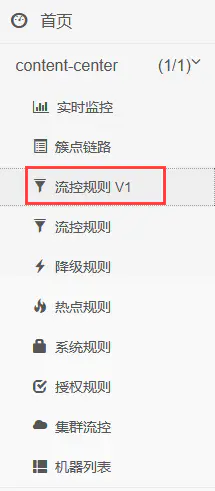

# Spring Cloud Alibaba之服务容错组件 - Sentinel [规则持久化篇]

[](https://www.jianshu.com/u/cad5241af2e3)

[端碗吹水](https://www.jianshu.com/u/cad5241af2e3)关注

0.4412019.08.20 20:42:00字数 2,721阅读 480

[TOC]

------

### 规则持久化 - 拉模式

在Sentinel控制台对某个微服务的接口资源配置了流控、降级等规则后，若重启了该微服务，那么配置的相关规则就会丢失，因为Sentinel默认将规则存放在内存中。每次重启微服务都得重新配置规则显然是不合理的，所以我们需要将配置好的规则进行持久化存储，而Sentinel提供了两种规则持久化模式：

- 拉模式（pull）
- 推模式（push）

本小节先介绍一下拉模式（pull），该模式的架构图如下：


image.png

- Tips：规则在代码中实际上是一个对象，所以通常是转换成json字符串后再存储至本地文件

因为需要读写本地文件，所以实现拉模式需要编写一些代码，首先在项目中添加如下依赖：


```xml
<!-- Sentinel Datasource -->
<dependency>
    <groupId>com.alibaba.csp</groupId>
    <artifactId>sentinel-datasource-extension</artifactId>
</dependency>
```

由于Sentinel有好几种规则，所以需要写的代码也有点多，具体代码如下示例：


```java
package com.zj.node.contentcenter.sentinel;

import com.alibaba.csp.sentinel.command.handler.ModifyParamFlowRulesCommandHandler;
import com.alibaba.csp.sentinel.datasource.*;
import com.alibaba.csp.sentinel.init.InitFunc;
import com.alibaba.csp.sentinel.slots.block.authority.AuthorityRule;
import com.alibaba.csp.sentinel.slots.block.authority.AuthorityRuleManager;
import com.alibaba.csp.sentinel.slots.block.degrade.DegradeRule;
import com.alibaba.csp.sentinel.slots.block.degrade.DegradeRuleManager;
import com.alibaba.csp.sentinel.slots.block.flow.FlowRule;
import com.alibaba.csp.sentinel.slots.block.flow.FlowRuleManager;
import com.alibaba.csp.sentinel.slots.block.flow.param.ParamFlowRule;
import com.alibaba.csp.sentinel.slots.block.flow.param.ParamFlowRuleManager;
import com.alibaba.csp.sentinel.slots.system.SystemRule;
import com.alibaba.csp.sentinel.slots.system.SystemRuleManager;
import com.alibaba.csp.sentinel.transport.util.WritableDataSourceRegistry;
import com.alibaba.fastjson.JSON;
import com.alibaba.fastjson.TypeReference;
import lombok.extern.slf4j.Slf4j;

import java.io.File;
import java.io.FileNotFoundException;
import java.io.IOException;
import java.util.List;

/**
 * 规则持久化 - 拉模式
 *
 * @author 01
 * @date 2019-08-02
 **/
@Slf4j
public class FileDataSourceInitial implements InitFunc {
    /**
     * 定义并实现各个规则对象的转换器，用于将json格式的数据转换为相应的Java对象
     */
    private Converter<String, List<FlowRule>> flowRuleListParser = source -> JSON.parseObject(
            source,
            new TypeReference<List<FlowRule>>() {
            }
    );

    private Converter<String, List<DegradeRule>> degradeRuleListParser = source -> JSON.parseObject(
            source,
            new TypeReference<List<DegradeRule>>() {
            }
    );

    private Converter<String, List<SystemRule>> systemRuleListParser = source -> JSON.parseObject(
            source,
            new TypeReference<List<SystemRule>>() {
            }
    );

    private Converter<String, List<AuthorityRule>> authorityRuleListParser = source -> JSON.parseObject(
            source,
            new TypeReference<List<AuthorityRule>>() {
            }
    );

    private Converter<String, List<ParamFlowRule>> paramFlowRuleListParser = source -> JSON.parseObject(
            source,
            new TypeReference<List<ParamFlowRule>>() {
            }
    );

    @Override
    public void init() throws Exception {
        // 规则持久化文件所存放的路径及文件名，可以按需求自行修改
        String ruleDir = System.getProperty("user.home") + "/sentinel/rules";
        String flowRulePath = ruleDir + "/flow-rule.json";
        String degradeRulePath = ruleDir + "/degrade-rule.json";
        String systemRulePath = ruleDir + "/system-rule.json";
        String authorityRulePath = ruleDir + "/authority-rule.json";
        String paramFlowRulePath = ruleDir + "/param-flow-rule.json";

        // 目录路径及文件若不存在则创建
        this.mkdirIfNotExits(ruleDir);
        this.createFileIfNotExits(flowRulePath);
        this.createFileIfNotExits(degradeRulePath);
        this.createFileIfNotExits(systemRulePath);
        this.createFileIfNotExits(authorityRulePath);
        this.createFileIfNotExits(paramFlowRulePath);

        // 注册各个规则的可读写数据源
        this.registerFlowRWDS(flowRulePath);
        this.registerDegradeRWDS(degradeRulePath);
        this.registerSystemRWDS(systemRulePath);
        this.registerAuthorityRWDS(authorityRulePath);
        this.registerParamRWDS(paramFlowRulePath);
    }

    /**
     * 注册流控规则的可读写数据源
     */
    private void registerFlowRWDS(String flowRulePath) throws FileNotFoundException {
        // 构建可读数据源，用于定时读取本地的json文件
        ReadableDataSource<String, List<FlowRule>> flowRuleRDS = new FileRefreshableDataSource<>(
                flowRulePath,
                flowRuleListParser
        );
        // 将可读数据源注册至FlowRuleManager，当文件里的规则内容发生变化时，就会更新到缓存里
        FlowRuleManager.register2Property(flowRuleRDS.getProperty());

        // 构建可写数据源
        WritableDataSource<List<FlowRule>> flowRuleWDS = new FileWritableDataSource<>(
                flowRulePath,
                this::toJson
        );
        // 将可写数据源注册至transport模块的WritableDataSourceRegistry中
        // 这样收到控制台推送的规则时，Sentinel会先更新到内存，然后将规则写入到文件中
        WritableDataSourceRegistry.registerFlowDataSource(flowRuleWDS);
    }

    /**
     * 注册降级规则的可读写数据源
     */
    private void registerDegradeRWDS(String degradeRulePath) throws FileNotFoundException {
        ReadableDataSource<String, List<DegradeRule>> degradeRuleRDS = new FileRefreshableDataSource<>(
                degradeRulePath,
                degradeRuleListParser
        );
        DegradeRuleManager.register2Property(degradeRuleRDS.getProperty());
        WritableDataSource<List<DegradeRule>> degradeRuleWDS = new FileWritableDataSource<>(
                degradeRulePath,
                this::toJson
        );
        WritableDataSourceRegistry.registerDegradeDataSource(degradeRuleWDS);
    }

    /**
     * 注册系统规则的可读写数据源
     */
    private void registerSystemRWDS(String systemRulePath) throws FileNotFoundException {
        ReadableDataSource<String, List<SystemRule>> systemRuleRDS = new FileRefreshableDataSource<>(
                systemRulePath,
                systemRuleListParser
        );
        SystemRuleManager.register2Property(systemRuleRDS.getProperty());
        WritableDataSource<List<SystemRule>> systemRuleWDS = new FileWritableDataSource<>(
                systemRulePath,
                this::toJson
        );
        WritableDataSourceRegistry.registerSystemDataSource(systemRuleWDS);
    }

    /**
     * 注册授权规则的可读写数据源
     */
    private void registerAuthorityRWDS(String authorityRulePath) throws FileNotFoundException {
        ReadableDataSource<String, List<AuthorityRule>> authorityRuleRDS = new FileRefreshableDataSource<>(
                authorityRulePath,
                authorityRuleListParser
        );
        AuthorityRuleManager.register2Property(authorityRuleRDS.getProperty());
        WritableDataSource<List<AuthorityRule>> authorityRuleWDS = new FileWritableDataSource<>(
                authorityRulePath,
                this::toJson
        );
        WritableDataSourceRegistry.registerAuthorityDataSource(authorityRuleWDS);
    }

    /**
     * 注册热点参数规则的可读写数据源
     */
    private void registerParamRWDS(String paramFlowRulePath) throws FileNotFoundException {
        ReadableDataSource<String, List<ParamFlowRule>> paramFlowRuleRDS = new FileRefreshableDataSource<>(
                paramFlowRulePath,
                paramFlowRuleListParser
        );
        ParamFlowRuleManager.register2Property(paramFlowRuleRDS.getProperty());
        WritableDataSource<List<ParamFlowRule>> paramFlowRuleWDS = new FileWritableDataSource<>(
                paramFlowRulePath,
                this::toJson
        );
        ModifyParamFlowRulesCommandHandler.setWritableDataSource(paramFlowRuleWDS);
    }

    private void mkdirIfNotExits(String filePath) {
        File file = new File(filePath);
        if (!file.exists()) {
            boolean result = file.mkdirs();
            log.info("创建目录: {} filePath: {}", result ? "成功" : "失败", filePath);
        }
    }

    private void createFileIfNotExits(String filePath) throws IOException {
        File file = new File(filePath);
        if (!file.exists()) {
            boolean result = file.createNewFile();
            log.info("创建文件: {} filePath: {}", result ? "成功" : "失败", filePath);
        }
    }

    private <T> String toJson(T t) {
        return JSON.toJSONString(t);
    }
}
```

这里有两个重要的API：

- `FileRefreshableDataSource` 定时从指定文件中读取规则JSON文件【上图中的本地文件】，如果发现文件发生变化，就更新规则缓存
- `FileWritableDataSource` 接收控制台规则推送，并根据配置，修改规则JSON文件【上图中的本地文件】

编写完以上代码后，还需要在项目的 `resources/META-INF/services` 目录下创建一个文件，名为 `com.alibaba.csp.sentinel.init.InitFunc` ，如下图所示：


image.png


然后编辑文件内容如下：


```bash
# 修改为上面FileDataSourceInitial的包名类名全路径
com.zj.node.contentcenter.sentinel.FileDataSourceInitial
```

完成以上步骤后，重启项目，此时就可以自行测试一下规则是否能持久化存储了。

拉模式的优缺点：

- 优点：
  - 简单易懂，没有多余依赖（如配置中心、缓存等依赖）
- 缺点：
  - 由于规则是用 FileRefreshableDataSource 定时更新的，所以规则更新会有延迟。如果FileRefreshableDataSource定时时间过大，可能长时间延迟；如果FileRefreshableDataSource过小，又会影响性能
  - 规则存储在本地文件，如果有一天需要迁移微服务，那么需要把规则文件一起迁移，否则规则会丢失

如果有了解过规则持久化相关配置的小伙伴可能会有疑问，Spring Cloud Alibaba不是提供了如下配置了吗？为什么要全部自己写呢？


```bash
spring.cloud.sentinel.datasource.ds1.file.file=classpath: degraderule.json
spring.cloud.sentinel.datasource.ds1.file.rule-type=flow

#spring.cloud.sentinel.datasource.ds1.file.file=classpath: flowrule.json
#spring.cloud.sentinel.datasource.ds1.file.data-type=custom
#spring.cloud.sentinel.datasource.ds1.file.converter-class=com.alibaba.cloud.examples.JsonFlowRuleListConverter
#spring.cloud.sentinel.datasource.ds1.file.rule-type=flow
```

关于这个问题，可以查看一下这个[Issues](https://links.jianshu.com/go?to=https%3A%2F%2Fgithub.com%2Falibaba%2Fspring-cloud-alibaba%2Fissues%2F756)

官方文档：

- [在生产环境中使用-Sentinel#pull模式](https://links.jianshu.com/go?to=https%3A%2F%2Fgithub.com%2Falibaba%2FSentinel%2Fwiki%2F%E5%9C%A8%E7%94%9F%E4%BA%A7%E7%8E%AF%E5%A2%83%E4%B8%AD%E4%BD%BF%E7%94%A8-Sentinel%23pull%E6%A8%A1%E5%BC%8F)

------

### 规则持久化 - 推模式

在上一小节中，我们了解了规则持久化中拉模式的原理及使用方式，本小节将介绍在生产环境中更为常用的推模式（push）。

推模式的架构图如下：


image.png

- Sentinel控制台不再是调用客户端的API推送规则数据，而是将规则推送到Nacos或其他远程配置中心
- Sentinel客户端通过连接Nacos，来获取规则配置；并监听Nacos配置变化，如发生变化，就更新本地缓存（从而让本地缓存总是和Nacos一致）
- Sentinel控制台也监听Nacos配置变化，如发生变化就更新本地缓存（从而让Sentinel控制台的本地缓存总是和Nacos一致）

#### 改造Sentinel控制台

使用推模式进行规则的持久化还是稍微有些麻烦的，因为需要改动Sentinel控制台的源码，对控制台的改造主要是为了实现：

- DynamicRuleProvider：从Nacos上读取配置
- DynamicRulePublisher：将规则推送到Nacos上

这里仅演示对流控规则的改造让其支持推模式的规则持久化，因为其他规则的改造过程也是类似的，稍微琢磨一下就可以了。首先需要[下载Sentinel的源码包](https://links.jianshu.com/go?to=https%3A%2F%2Fgithub.com%2Falibaba%2FSentinel%2Freleases)，我这里使用的是1.6.3版本：


image.png


下载并解压完成后，使用IDE打开sentinel-dashboard这个项目，如下：


image.png

**第一步：**修改该项目的pom.xml文件，找到如下依赖项：


```xml
<!-- for Nacos rule publisher sample -->
<dependency>
    <groupId>com.alibaba.csp</groupId>
    <artifactId>sentinel-datasource-nacos</artifactId>
    <scope>test</scope>
</dependency>
```

将`<scope>test</scope>`一行注释掉，即修改为如下：


```xml
<!-- for Nacos rule publisher sample -->
<dependency>
    <groupId>com.alibaba.csp</groupId>
    <artifactId>sentinel-datasource-nacos</artifactId>
    <!-- <scope>test</scope> -->
</dependency>
```

**第二步：**找到 `sentinel-dashboard/src/test/java/com/alibaba/csp/sentinel/dashboard/rule/nacos`目录，将整个目录拷贝到 `sentinel-dashboard/src/main/java/com/alibaba/csp/sentinel/dashboard/rule/nacos`下，如下图所示：


image.png


拷贝完成后rule包结构如下图：


image.png

**第三步：**修改流控规则Controller，到`com.alibaba.csp.sentinel.dashboard.controller.v2.FlowControllerV2`类的源码中找到这一段：


```java
@Autowired
@Qualifier("flowRuleDefaultProvider")
private DynamicRuleProvider<List<FlowRuleEntity>> ruleProvider;
@Autowired
@Qualifier("flowRuleDefaultPublisher")
private DynamicRulePublisher<List<FlowRuleEntity>> rulePublisher;
```

修改`@Qualifier`注解的内容，将其修改为：


```java
@Autowired
@Qualifier("flowRuleNacosProvider")
private DynamicRuleProvider<List<FlowRuleEntity>> ruleProvider;
@Autowired
@Qualifier("flowRuleNacosPublisher")
private DynamicRulePublisher<List<FlowRuleEntity>> rulePublisher;
```

**第四步：**打开`sentinel-dashboard/src/main/webapp/resources/app/scripts/directives/sidebar/sidebar.html`文件，找到一段被注释的代码，如下：


```html
  <!--<li ui-sref-active="active" ng-if="entry.appType==0">-->
    <!--<a ui-sref="dashboard.flow({app: entry.app})">-->
      <!--<i class="glyphicon glyphicon-filter"></i>&nbsp;&nbsp;流控规则 V1</a>-->
  <!--</li>-->
```

只需要把注释解开，即改为：


```html
  <li ui-sref-active="active" ng-if="entry.appType==0">
    <a ui-sref="dashboard.flow({app: entry.app})">
      <i class="glyphicon glyphicon-filter"></i>&nbsp;&nbsp;流控规则 V1</a>
  </li>
```

到这步为止，我们就对sentinel-dashboard源码改造完毕了，现在流控规则就可以支持推模式的持久化了，接下来就是编译、启动以及测试。

打开idea的terminal，执行如下命令进行打包编译：


```bash
mvn clean package -DskipTests
```

然后进入target目录，使用如下命令执行jar包，启动Sentinel控制台：


```bash
java -jar sentinel-dashboard.jar
```

注：也可以选择直接在idea中点击启动按钮来启动Sentinel控制台，效果是一样的

启动完成后，使用浏览器打开，可以看到Sentinel的菜单栏中比之前多出了一项**流控规则 V1**：



image.png


注：若没有显示该项，可以尝试清除浏览器缓存或换个浏览器打开

------

#### 改造Sentinel客户端（ 微服务）

改造完控制台后，接下来开始改造客户端，首先在项目中添加如下依赖：


```xml
<dependency>
    <groupId>com.alibaba.csp</groupId>
    <artifactId>sentinel-datasource-nacos</artifactId>
</dependency>
```

然后添加各个规则配置：


```yml
spring:
  cloud:
    sentinel:
      datasource:
        # 名称随意
        flow:
          nacos:
            server-addr: localhost:8848
            dataId: ${spring.application.name}-flow-rules
            groupId: SENTINEL_GROUP
            # 规则类型，取值见：
            # org.springframework.cloud.alibaba.sentinel.datasource.RuleType
            rule-type: flow
        degrade:
          nacos:
            server-addr: localhost:8848
            dataId: ${spring.application.name}-degrade-rules
            groupId: SENTINEL_GROUP
            rule-type: degrade
        system:
          nacos:
            server-addr: localhost:8848
            dataId: ${spring.application.name}-system-rules
            groupId: SENTINEL_GROUP
            rule-type: system
        authority:
          nacos:
            server-addr: localhost:8848
            dataId: ${spring.application.name}-authority-rules
            groupId: SENTINEL_GROUP
            rule-type: authority
        param-flow:
          nacos:
            server-addr: localhost:8848
            dataId: ${spring.application.name}-param-flow-rules
            groupId: SENTINEL_GROUP
            rule-type: param-flow
```

完成以上步骤后重启项目，然后回到Sentinel控制台里的**流控规则 V1**中新增流控规则，之所以不在簇点链路中添加，是因为簇点链路中的按钮依旧是调用之前的逻辑添加到内存中。新增流控规则如下：


image.png


新增完成后，到Nacos Server的配置列表上，可以看到该规则的配置数据，证明已经持久化存储到Nacos了：


image.png

若直接在Nacos上修改流控规则，然后刷新Sentinel控制台，控制台上的显示也会被修改

此时重启Sentinel控制台和微服务，然后刷新控制台，可以发现该流控规则依旧存在：


image.png

以上折腾了那么多只实现了流控规则的持久化，这还是因为官方准备好了示例代码。Sentinel有若干种规则，例如降级规则、系统规则、授权规则、热点规则等，都需要使用类似的方式，修改 `com.alibaba.csp.sentinel.dashboard.controller` 包中对应的Controller，才能实现持久化，所以本小节仅是抛砖引玉，其他规则可以自行动手参考着实现。

**推模式优缺点：**

- 优点：
  - 一致性良好，性能优秀，贴近生产使用
- 缺点：
  - 需要对控制台的源码进行改动比较麻烦，并且所有规则加起来的改动工作量较大
  - 引入额外的依赖（Nacos）

官方文档：

- [在生产环境中使用-Sentinel#push模式](https://links.jianshu.com/go?to=https%3A%2F%2Fgithub.com%2Falibaba%2FSentinel%2Fwiki%2F%E5%9C%A8%E7%94%9F%E4%BA%A7%E7%8E%AF%E5%A2%83%E4%B8%AD%E4%BD%BF%E7%94%A8-Sentinel%23push%E6%A8%A1%E5%BC%8F)

------

### 将应用接入阿里云 AHAS 服务

在生产环境使用Sentinel是必须要实现规则持久化的，而通过以上两个小节的学习，我们可以得知不管使用哪个模式都需要进行相应的改动，其中想要实现贴近生产使用的推模式需要改动的地方更多更麻烦。

如果不想做这些麻烦的改动，又希望在生产环境使用Sentinel的话，则需要考虑使用阿里云提供的在线托管Sentinel控制台（AHAS），该在线Sentinel控制台实现了推模式的规则持久化并可用于生产：

- 开通地址：[应用高可用服务](https://links.jianshu.com/go?to=https%3A%2F%2Fwww.aliyun.com%2Fproduct%2Fahas)
- 开通说明：[https://help.aliyun.com/document_detail/90323.html](https://links.jianshu.com/go?to=https%3A%2F%2Fhelp.aliyun.com%2Fdocument_detail%2F90323.html)

接下来演示一下如何使用这个在线的Sentinel控制台，根据开通说明文档注册了阿里云账户后，进入开通页面：


image.png

根据提示开通完成后，进入管理控制台，点击接入应用流控：


image.png

进入应用接入界面后可以选择不同的应用接入，这里按照Spring Boot应用接入的说明完成相应步骤：


image.png

需要说明一下的是，**第二步中的HTTP接口埋点和普通接口埋点都可以省略掉**，因为`spring-cloud-starter-alibaba-sentinel`依赖包里已经实现了，但需要排除该依赖中的`sentinel-transport-simple-http`模块，避免连接了本地的Sentinel控制台，即修改依赖如下并添加AHAS Client依赖：


```xml
<!-- Sentinel -->
<dependency>
    <groupId>org.springframework.cloud</groupId>
    <artifactId>spring-cloud-starter-alibaba-sentinel</artifactId>
    <!-- 排除该模块的目的是不与本地的Sentinel控制台进行通信，以免造成不必要的干扰 -->
    <exclusions>
        <exclusion>
            <groupId>com.alibaba.csp</groupId>
            <artifactId>sentinel-transport-simple-http</artifactId>
        </exclusion>
    </exclusions>
</dependency>
<!-- ahas client -->
<dependency>
    <groupId>com.alibaba.csp</groupId>
    <artifactId>spring-boot-starter-ahas-sentinel-client</artifactId>
    <version>1.3.3</version>
</dependency>
```

除了修改依赖以外，还需要将配置文件中关于Sentinel控制台的配置都注释掉，因为此时我们连接的是在线的Sentinel控制台。如下：


image.png

然后只需要添加AHAS的启动参数：


```yml
ahas:
  license: xxxxxxxxx
  namespace: default
project:
  name: ${spring.application.name}
```

完成以上步骤后，重启项目并访问该项目的接口，应用正常接入的情况下可以在阿里云的控制台中看到该应用的展示，如下：


image.png

点击该应用就可以进入到Sentinel控制台，可以看到这里基本上和我们自己搭建的Sentinel控制台是差不多的，同样支持实时监控、查看簇点链路及配置各种规则：


image.png

例如流控规则的添加也是一样的，只是界面稍微好看一点而已：


image.png

至此就完成将应用接入AHAS了，由于操作与Sentinel控制台基本一样这里就不展开介绍了，可以自行测试捣鼓一下，反正可视化的页面使用起来还是比较容易的。

------

### 集群流控

Sentinel的集群流控功能目前还不支持在生产环境使用，并且通过集成网关组件也可以实现类似集群流控的效果，所以这里不做过多的介绍，若感兴趣的话，可以参考官方文档和相关教程：

- [集群流控](https://links.jianshu.com/go?to=https%3A%2F%2Fgithub.com%2Falibaba%2FSentinel%2Fwiki%2F%E9%9B%86%E7%BE%A4%E6%B5%81%E6%8E%A7)
- [Sentinel 实战-集群限流环境搭建(详细图文描述)](https://www.jianshu.com/p/bb198c08b418)