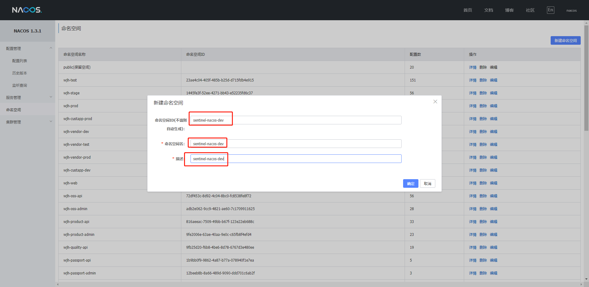
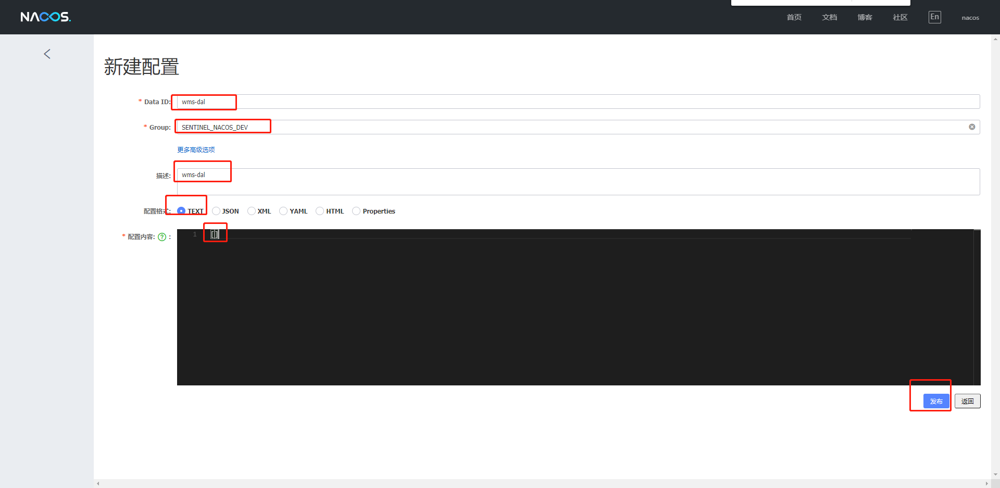
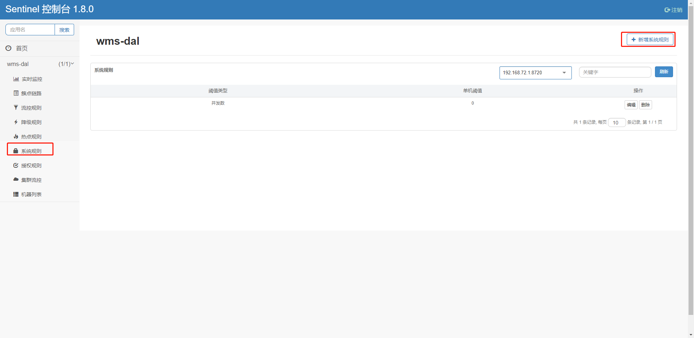
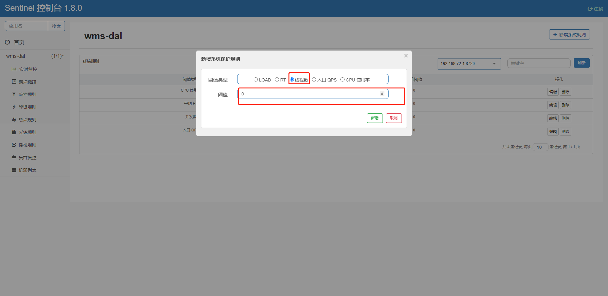
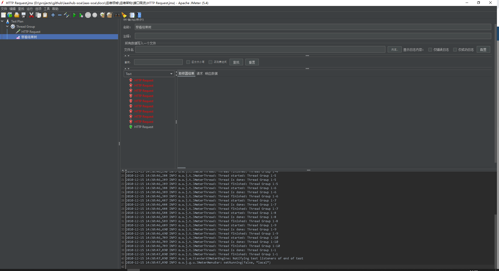
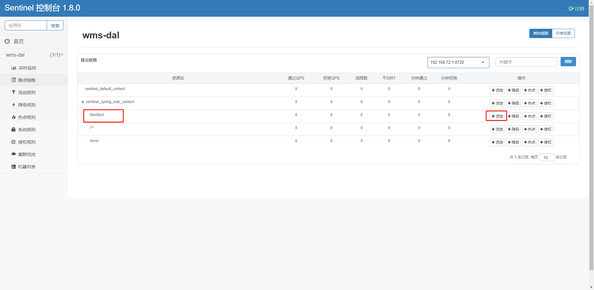
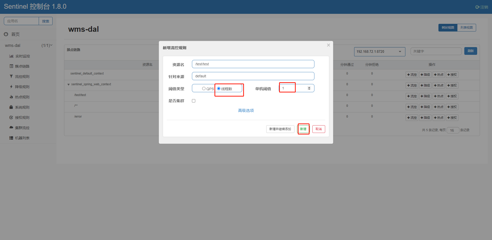

[toc]

# 写在开头的话

加东西一定要谨慎, 加东西之前先问自己几个问题: 是不是一定要加? 还有没有其他办法? 这个办法的适配度是否真的很好?

# 思路

应用对外接口进行限流, 防止因为外部调用次数过多, 导致服务短时间内不能处理请求, 形成服务假死的现象

虽然也可以通过自动水平扩容实现效果, 但是扩容仍然需要一段时间, 在该时间内服务仍然是不可用状态

限流不能阻断接口攻击, 阻断接口攻击需要另外的项目去做

项目整体接口/单独接口限流

实现思路: 

通过量 + 通过频率

漏桶/令牌桶 + 固定窗口/滑动窗口

漏桶: 存请求、抽请求、发送请求, 有额外消耗, 保持稳定效果更加明显

令牌桶: 生成令牌, 查询令牌, 额外消耗更小, 稳定性更低

固定窗口: 例如每n秒使用一次桶策略

滑动窗口: 例如每n+m秒使用一次桶策略


影响通过量的因素:

当前服务的线程量、中间件承载量

下一级服务的通过量

# 集成

## 服务端

### jar包方式

在 https://github.com/alibaba/Sentinel/releases 下载release包

运行

```
java -jar -Dserver.port=8080 -Dcsp.sentinel.dashboard.server=localhost:8080 -Dproject.name=sentinel-dashboard -Dsentinel.dashboard.auth.username=admin -Dsentinel.dashboard.auth.password=tristan666  sentinel-dashboard-1.8.0.jar
```

访问: http://localhost:8080 	账号/密码: sentinel/sentinel


### docker方式

构建镜像

下载jar包, 推荐上传jar包, 因为服务器从github下载文件速度太慢

```
wget https://github.com/alibaba/Sentinel/releases/download/v1.8.0/sentinel-dashboard-1.8.0.jar
```

Dockerfile

```
FROM openjdk:8
ARG VERSION
ADD sentinel-dashboard-${VERSION}.jar sentinel-dashboard.jar
RUN chmod -R +x sentinel-dashboard.jar
EXPOSE 8080
CMD java ${JAVA_OPTS} -jar sentinel-dashboard.jar
```

构建镜像

```
docker build --build-arg VERSION=1.8.0 -t registry.cn-shenzhen.aliyuncs.com/wjh-public/sentinel:1.8.0 .
docker login   registry.cn-shenzhen.aliyuncs.com   --username="" --password=""
docker push registry.cn-shenzhen.aliyuncs.com/wjh-public/sentinel:1.8.0
docker rmi registry.cn-shenzhen.aliyuncs.com/wjh-public/sentinel:1.8.0
```

运行镜像

```
docker pull registry.cn-shenzhen.aliyuncs.com/wjh-public/sentinel:1.8.0

docker stop sentinel && docker rm sentinel
docker run -d --name sentinel -p 8081:8080 --env JAVA_OPTS="-Dserver.port=8080 -Dcsp.sentinel.dashboard.server=localhost:8080 -Dproject.name=sentinel-dashboard -Dsentinel.dashboard.auth.username=admin -Dsentinel.dashboard.auth.password=tristan666" registry.cn-shenzhen.aliyuncs.com/wjh-public/sentinel:1.8.0
docker logs -f --tail 100 sentinel
```


### kubernetes deployments编排文件方式

sentinel-deployment.yaml

```
---
apiVersion: apps/v1
kind: Deployment
metadata:
  namespace: dev
  name: sentinel
  labels:
    app: sentinel
spec:
  replicas: 1
  template:
    metadata:
      name: sentinel
      labels:
        app: sentinel
    spec:
      containers:
        - name: sentinel
          image: registry.cn-shenzhen.aliyuncs.com/wjh-public/sentinel:1.8.0
          imagePullPolicy: IfNotPresent
          env:
          - name: JAVA_OPTS
            value: "-Dserver.port=8080 -Dcsp.sentinel.dashboard.server=localhost:8080 -Dproject.name=sentinel-dashboard -Dsentinel.dashboard.auth.username=admin -Dsentinel.dashboard.auth.password=tristan666"
          livenessProbe:
            tcpSocket:
              port: 8080
            initialDelaySeconds: 60
            periodSeconds: 45
      restartPolicy: Always
  selector:
    matchLabels:
      app: sentinel
```

sentinel-service.yaml

```
---
apiVersion: v1
kind: Service
metadata:
  name: sentinel
  namespace: dev
spec:
  selector:
    app: sentinel
  ports:
    - protocol: TCP
      port: 80
      targetPort: 8080
```

部署

```
kubectl delete -f sentinel-deployment.yaml
kubectl apply -f sentinel-deployment.yaml

kubectl delete -f sentinel-service.yaml
kubectl apply -f sentinel-service.yaml

kubectl -n dev get deployment|grep sentinel
kubectl -n dev describe deployment/sentinel
kubectl -n dev get pod |grep sentinel

kubectl -n dev logs -f --tail 100 sentinel-76d7cc596-m7h56
```

服务端访问地址:

```
# 内部
kubectl delete deployments/load-generator
kubectl run -i --tty load-generator --image=busybox /bin/sh
kubectl delete deployments/load-generator

wget sentinel.dev.svc

# 外部
# 打一个高位端口
kubectl -n dev expose deployment sentinel --port=8080 --type=NodePort --name=sentinel-out
kubectl -n dev describe services sentinel-out
```

## 客户端

加入依赖配置, 与控制台保持通信, 接受dashboard的fetch

```
        <dependency>
            <groupId>com.alibaba.cloud</groupId>
            <artifactId>spring-cloud-starter-alibaba-sentinel</artifactId>
        </dependency>
```

但是需要注意这个starter里面的版本与服务端的版本并不是一致的

修改配置文件

application.yml

```
management:
  endpoints:
    web:
      exposure:
        include: prometheus,info,metrics
  metrics:
    tags:
      application: ${spring.application.name}
```

假设为: application.properties, 如果已经将nacos作为配置中心, 那么这些配置建议放到nacos中进行统一管理

```
# 配置sentinel 服务端
spring.cloud.sentinel.transport.dashboard=localhost:8080
# 配置sentinel 客户端连接端口, 可默认
spring.cloud.sentinel.transport.port=8720
# 配置sentinel 客户端 存储数据指向nacos
spring.cloud.sentinel.datasource.ds.nacos.server-addr=192.168.90.232:8848
spring.cloud.sentinel.datasource.ds.nacos.dataId=${spring.application.name}
spring.cloud.sentinel.datasource.ds.nacos.groupId=SENTINEL_NACOS_DEV
spring.cloud.sentinel.datasource.ds.nacos.rule-type=flow
spring.cloud.sentinel.datasource.ds.nacos.namespace=sentinel-nacos-dev
```

启动完成之后需要手动访问一下服务端, 这样使得sentinel dashboard中能看到该服务, 多刷几次接口才能看到/**端点, 实际上这个端点并没有什么用

如果不使用持久化, 客户端重启之后控制规则会直接丢失(需要重新配置)

### 客户端使用nacos进行持久化

nacos中的规则为: 命名空间作为逻辑隔离, 分组和数据ID作为物理隔离, 意味着不同的文件要放到不同的分组里面

添加依赖配置

```
        <!-- sentinel-nacos -->
        <dependency>
            <groupId>com.alibaba.csp</groupId>
            <artifactId>sentinel-datasource-nacos</artifactId>
            <version>1.5.2</version>
        </dependency>
```

创建sentinel-nacos专用命名空间



为项目项目创建专用sentinel-nacos配置文件



注意内容至少要填 []

一个案例数据如下:

```yaml
[{
	"app": "wms-server",
	"clusterMode": false,
	"controlBehavior": 0,
	"count": 2.0,
	"gmtModified": 1597052308717,
	"grade": 1,
	"id": 1,
	"limitApp": "default",
	"maxQueueingTimeMs": 2000,
	"resource": "/receipt/getProposedPrice",
	"strategy": 0,
	"warmUpPeriodSec": 10
}]
```

resource的值为接口路径

count的值为限制量

maxQueueingTimeMs为时间窗口值

# 使用

找到项目

找到接口路径

需要注意, 由于浏览器的一些原因, 用浏览器测试接口限流并不能达到效果

## 整体接口限流





设置的阈值的值为你期望的阈值的值-1

测试结果如下




貌似需要给每一个运行的服务添加一次, 但是由于服务运行在容器中, ip经常会变化, 所以这样是否意味着每一次发版都要重新设置一次

## 单个接口限流

首先找到接口



新增一个接口控制



这里的阈值与期望的阈值是一样的

如果期望的是1分钟调用一次, 那么实际上该接口即使限制到最小, 仍然是随着该接口的实际调用时间去决定限制的时间, 而非期望的1分钟

报表型接口是否真的应该分离业务接口与下载接口, 使得不会阻塞线程