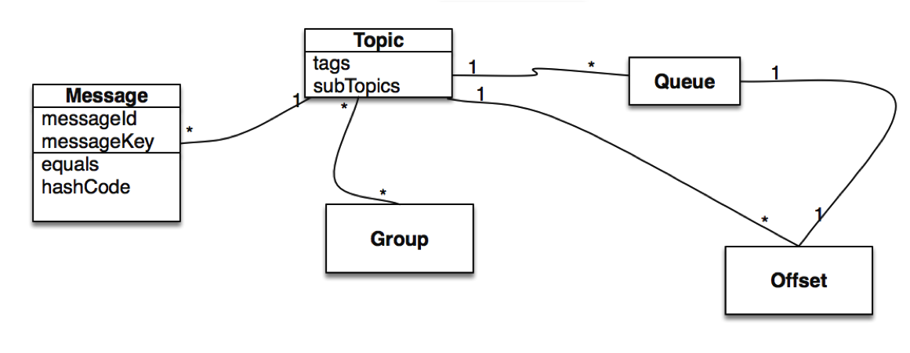

# 核心理念

根据上面的模型，我们可以深入挖掘一些消息系统设计的主题：

 在本页[制作人](https://rocketmq.apache.org/docs/core-concept/#producer)[制作人组](https://rocketmq.apache.org/docs/core-concept/#producer-group)[消费者](https://rocketmq.apache.org/docs/core-concept/#consumer)[拉动消费者](https://rocketmq.apache.org/docs/core-concept/#pullconsumer)[推送消费者](https://rocketmq.apache.org/docs/core-concept/#pushconsumer)[消费群体](https://rocketmq.apache.org/docs/core-concept/#consumer-group)[话题](https://rocketmq.apache.org/docs/core-concept/#topic)[信息](https://rocketmq.apache.org/docs/core-concept/#message)[消息队列](https://rocketmq.apache.org/docs/core-concept/#message-queue)[标签](https://rocketmq.apache.org/docs/core-concept/#tag)[经纪人](https://rocketmq.apache.org/docs/core-concept/#broker)[名称服务器](https://rocketmq.apache.org/docs/core-concept/#name-server)[消息模型](https://rocketmq.apache.org/docs/core-concept/#message-model)[留言顺序](https://rocketmq.apache.org/docs/core-concept/#message-order)

- 消费者并发
- 消费者热点问题
- 消费者负载平衡
- 消息路由器
- 连接复用
- 金丝雀部署

# 制作人

生产者将业务应用系统生成的消息发送给代理。RocketMQ 提供了多种发送范式：同步、异步和单向。

## 制作人组

相同角色的生产者被分组在一起。代理可能会联系同一生产者组的不同生产者实例以提交或回滚事务，以防原始生产者在事务后崩溃。

**警告**：考虑到提供的生产者在发送消息方面足够强大，每个生产者组只允许一个实例，以避免不必要的生产者实例初始化。

# 消费者

消费者从代理中提取消息并将它们提供给应用程序。从用户应用的角度来看，提供了两种类型的消费者：

## 拉动消费者

拉消费者主动从代理拉取消息。一旦批量消息被拉取，用户应用程序就会启动消费过程。

## 推送消费者

而推送消费者则将消息拉取、消费进度和维护其他工作封装在里面，留下回调接口给终端用户实现，消息到达时执行。

## 消费群体

与前面提到的生产者组类似，角色完全相同的消费者被分组在一起并命名为**Consumer Group**。

消费者组是一个很好的概念，在消息消费方面，通过它实现负载平衡和容错的目标非常容易。

**警告**：消费者组的消费者实例**必须**具有完全相同的主题订阅。

# 话题

主题是生产者传递消息和消费者拉取消息的类别。主题与生产者和消费者的关系非常松散。具体来说，一个主题可能有零个、一个或多个生产者向它发送消息；相反，生产者可以发送不同主题的消息。从消费者的角度来看，一个主题可能被零个、一个或多个消费者组订阅。同样，消费者组可以订阅一个或多个主题，只要该组的实例保持订阅一致即可。

# 信息

消息是要传递的信息。一条消息必须有一个主题，可以将其解释为您要邮寄的信件地址。一条消息也可能有一个可选的标签和额外的键值对。例如，您可以为消息设置业务密钥并在代理服务器上查找消息以诊断开发过程中的问题。

## 消息队列

主题被划分为一个或多个子主题，即“消息队列”。

## 标签

标签，即子主题，为用户提供了额外的灵活性。使用标签，来自同一业务模块的不同用途的消息可能具有相同的主题和不同的标签。标签有助于保持代码的整洁和连贯，标签也可以方便 RocketMQ 提供的查询系统。

## 经纪人

Broker 是 RocketMQ 系统的主要组件。它接收从生产者发送的消息，存储它们并准备处理来自消费者的拉取请求。它还存储与消息相关的元数据，包括消费者组、消费进度偏移和主题/队列信息。

# 名称服务器

名称服务器充当路由信息提供者。生产者/消费者客户端查找主题以找到相应的代理列表。

# 消息模型

- 聚类
- 广播

# 留言顺序

当使用 DefaultMQPushConsumer 时，您可以决定按顺序或并发地消费消息。

- 有顺序地

有序消费消息意味着消息的消费顺序与生产者为每个消息队列发送的顺序相同。如果您正在处理全局顺序是强制性的场景，请确保您使用的主题只有一个消息队列。

**警告**：如果指定了有序消费，则消息消费的最大并发数为消费组订阅的消息队列数。

- 同时

并发消费消息时，消息消费的最大并发仅受为每个消费者客户端指定的线程池限制。

**警告**：在此模式下不再保证消息顺序。

 **更新：** 2016 年 12 月 16 日