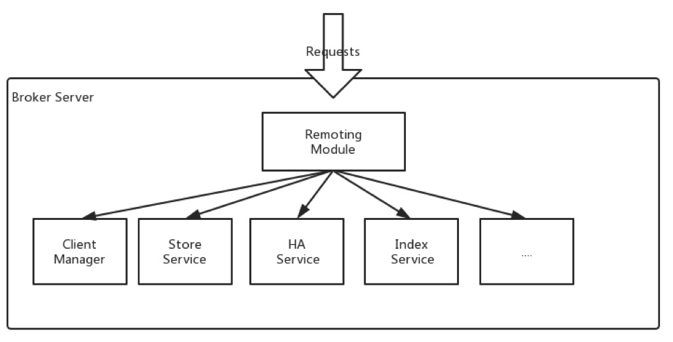

# RocketMQ 架构

 在本页[概述](https://rocketmq.apache.org/docs/rmq-arc/#overview)[名称服务器](https://rocketmq.apache.org/docs/rmq-arc/#nameserver)[代理服务器](https://rocketmq.apache.org/docs/rmq-arc/#broker-server)

# 概述

Apache RocketMQ 是一个分布式消息和流媒体平台，具有低延迟、高性能和可靠性、万亿级容量和灵活的可扩展性。它由四部分组成：名称服务器、代理、生产者和消费者。它们中的每一个都可以水平扩展而没有单一的故障点。如上图所示。

**名称服务器集群**

名称服务器提供轻量级服务发现和路由。每个 Name Server 记录完整的路由信息，提供相应的读写服务，并支持快速存储扩展。

**代理集群**

Brokers 通过提供轻量级的 TOPIC 和 QUEUE 机制来处理消息存储。它们支持Push和Pull模型，包含容错机制（2副本或3副本），并提供强大的峰值填充和按原始时间顺序累积数千亿条消息的能力。此外，Brokers 提供灾难恢复、丰富的指标统计和警报机制，这些都是传统消息传递系统所缺乏的。

**生产者集群**

生产者支持分布式部署。分布式生产者通过多种负载均衡方式向 Broker 集群发送消息。发送进程支持快速失败并具有低延迟。

**消费群**

消费者也支持推拉模型中的分布式部署。它还支持集群消费和消息广播。提供实时消息订阅机制，可以满足大部分消费者的需求。RocketMQ 的网站为感兴趣的用户提供了一个简单的快速入门指南。

# 名称服务器

NameServer 是一个功能齐全的服务器，主要包括两个功能：

- Broker 管理，**NameServer**接受来自 Broker 集群的注册，并提供心跳机制来检查 Broker 是否处于活动状态。
- 路由管理，每个 NameServer 将保存有关代理集群的完整路由信息和客户端查询的**队列**信息。

我们知道，RocketMQ 客户端（生产者/消费者）会从 NameServer 查询队列路由信息，但是客户端如何找到 NameServer 地址呢？

有四种方法可以将 NameServer 地址列表提供给客户端：

- 程序化方式，如`producer.setNamesrvAddr("ip:port")`.
- Java 选项，使用`rocketmq.namesrv.addr`.
- 环境变量，使用`NAMESRV_ADDR`.
- HTTP 端点。

有关如何查找 NameServer 地址的更多详细信息，请参阅[此处](https://rocketmq.apache.org/rocketmq/four-methods-to-feed-name-server-address-list/)。

# 代理服务器

Broker Server 负责消息存储和传递、消息查询、HA 保证等。

如下图所示，Broker 服务器有几个重要的子模块：

- 远程模块，代理的入口，处理来自客户端的请求。
- 客户端管理器，管理客户端（生产者/消费者）并维护消费者的主题订阅。
- 存储服务，提供简单的 API 来存储或查询物理磁盘中的消息。
- HA Service，提供主代理和从代理之间的数据同步功能。
- 索引服务，通过指定的key为消息建立索引，并提供快速的消息查询。

 **更新：** 2017 年 4 月 24 日