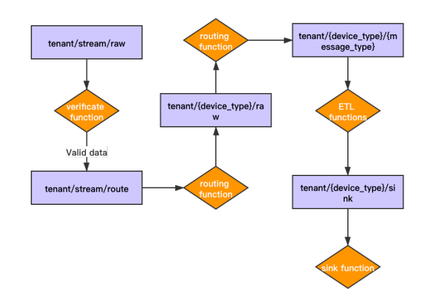
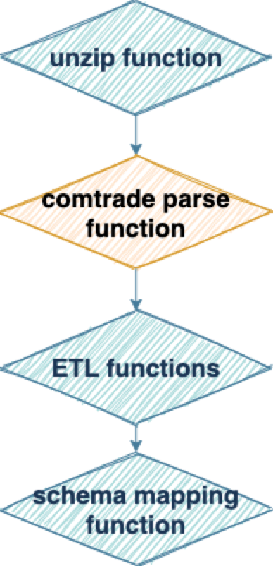
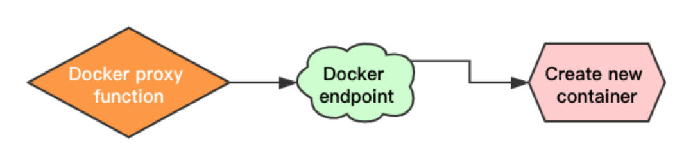

## Apache Pulsar 在能源互联网领域的落地实践

发布于2021-04-03 21:40   阅读(995)   评论(0)   点赞(1)   收藏(0)

------

> # 关于 Apache Pulsar
>
> Apache Pulsar 是 Apache 软件基金会顶级项目，是下一代云原生分布式消息流平台，集消息、存储、轻量化函数式计算为一体，采用计算与存储分离架构设计，支持多租户、持久化存储、多机房跨区域数据复制，具有强一致性、高吞吐、低延时及高可扩展性等流数据存储特性。
> GitHub 地址：http://github.com/apache/pulsar/

> 案例导读：本案例介绍了清华大学能源互联网创新研究院将 Apache Pulsar 落地能源互联网方向的实践。Pulsar 的云原生架构、Schema、Functions 等特性满足了相关业务需求，也减轻了他们开发和运维负担。

阅读本文需要大约 8 分钟。

# 团队及业务简介

能源互联网是电力与能源工业发展的方向。随着信息、通信和互联网技术的飞速发展，可获取的数据量正以爆炸式方式迅猛增长，传统的数据处理方法已难以应对这些海量且增长极快的信息资产，大数据理论正是在这样的状态下应运而生。大数据处理技术能帮助我们透过海量数据快速分辨其运行状态及发展趋势，在纷繁的世界中独具洞察力。

清华大学能源互联网创新研究院能源大数据与开放生态研究中心汇集了国内外能源及电力大数据领域的多位专家，致力于推动大数据基础理论和实践应用的全面创新。能源大数据与开放生态研究中心将大数据技术应用于能源互联网、智能电网和智慧用能等工程场景，结合高性能优化、并行计算和人工智能等先进技术，研发适用于能源电力行业特点的大数据 / 云计算平台，和基于数据驱动的能源电力系统的高级应用，从而实现大数据产业的发展，形成以数据为核心的新型产业链，推动我国能源产业的转型与升级。

# 挑战

我们团队的业务主要是与电力相关的物联网场景，旨在实现用户对传感器等设备数据的需求开发。我们团队规模较小，但任务繁杂，希望能更快更稳地实现客户的需求。

在整理业务需求后，我们提出以后端即服务（BaaS）为主、基于消息的服务方案。在物联网领域内，基于这样的解决方案，我们可以共用更多基础设施服务，同时可以快速应对不同需求进行业务开发。考虑到特殊的业务需求，我们的平台需要具备以下特性：

•多租户：平台要实现业务分离，服务不分离，又可以确保安全审核，满足客户对数据安全性的敏感需求，就必须支持多租户。此外，还可以在通讯、数据、业务这三方面提供一些基础服务，比如自定义数据结构的 Schema Registry，自定义数据归属的 ACL 权限管理（增加删改的 API 接口），以及实现各种业务的自定义函数引擎。•Schema Registry：满足不同需求和应用场景下设备多变的数据结构，提供允许自定义数据结构的 Schema Registry。•通用 API：提供包含增加删改的 HTTP RESTful APIs 和相应的 WebSocket 接口，确保在通讯上提供基础服务，并基于这一基础服务进行扩展。•ACL 权限管理：可自定义数据的 ACL 权限控制服务，保障数据安全。•时序数据库：多数情况下，物联网场景都在和时序数据打交道，所以我们选择了基于 PostgreSQL 的开源 TimeScaleDB，并且依托 TimeScaleDB 做了一系列时序数据的聚合查询接口。•用户自定义 functions：实现各种业务的自定义函数引擎。

之前我们使用基于 RabbitMQ 和 Celery 的方案来实现用户自定义 functions 的函数引擎。这一方案的最初使用效果良好，但随着业务的增长，问题越来越多。我们的小团队不得不花更多时间来解决问题和优化整体方案。当 Celery 作为任务队列时，这些问题尤为严重。

我们花费大量的时间和精力处理的问题主要有两个：

•需要仔细配置 Celery 的 worker 和 task，避免执行时间长的任务阻塞其他任务；•Worker 更新时需要中断服务，更新时间也相对较长。

此外，在特殊场景中，如果单个消息比较大且消息处理时间长时，Celery 和 RabbitMQ 的内存负担都比较大。

随着客户数量和项目数量的增加，这些问题变得日益突出，我们决定找一个新产品替代原有方案。

# 为什么选择 Apache Pulsar？

如上所述，我们希望消息中间件可以提供以下特性：

•多租户•可靠性和高可用•支持多协议，尤其可以很方便地转换协议：在物联网领域，我们需要应对不同的通信协议，把不同通信协议的数据全部导入到消息中间件中。•支持多语言：我们团队主要使用 Go 语言，但我们会和很多使用其他语言的团队合作，所以消息中间件最好可以支持其他语言。•作为轻量级计算引擎实现简单的消息处理。

在调研不同的消息中间件时，我们很快发现了 Pulsar。通过 Pulsar 的文档和发布日志，我们了解到 Pulsar 有很多优秀的特性，所以决定对 Pulsar 进行测试和评估。经过深入研究、学习，我们发现 Pulsar 的云原生架构、Schema、Functions 等非常适合我们的业务需求。

•云原生：Pulsar 支持云原生，拥有诸多优秀的特性，如计算与存储分离，可以很好地利用云的弹性伸缩能力，保证扩容和容错。此外，Pulsar 对 Kubernetes 的良好支持也在一定程度上帮助我们将一部分业务轻松迁移到了 Kubernetes 上。•Pulsar Functions：Pulsar Functions 是一个优秀的轻量级计算引擎，可以很好地取代 Celery 方案。我们可以更多地尝试使用 Pulsar Functions 来处理业务，这是我们选择 Pulsar 的主要原因。•分层存储：这一特性能够节约存储成本。我们的使用场景会产生很多传感器的原始数据，需要作为冷数据存储。借助分层存储，我们可以直接将这些冷数据存储在价格更低的存储服务中，也无需开发额外的服务来存储数据。•MQTT/MoP：Pulsar 对各种协议的兼容展示了社区的开放性。在 MoP 发布前，我们开发了 MQTT 协议的转发工具，把 MQTT 协议上的数据转发到 Pulsar 中。•Pulsar Schema：我们的平台通过 JSON 来描述数据 schema，通过对接 Pulsar Schema 和我们自己的 Schema Registry，可以实现消息序列化的工作。目前 Pulsar 在 Go Schema 的功能仍处于起步阶段，我们也会尝试做一些实践与贡献。•多语言：我们很看重多语言支持，尤其是 Go 语言。Pulsar 有 Go 语言相应的客户端、Go function runtime、基于 Go 语言实现的 Pulsarctl 等。我们也希望 Pulsar 未来可以支持更多语言，因为我们不能预见客户的需求，支持多语言能够帮助我们更轻松地解决问题。•Pulsar Manager & Dashboard：Pulsar 在各个层级都启动了接口来获取 Metrics。Pulsar 的其他工具（如 Prometheus、Grafana、Pulsar Manager）能够帮助我们减轻运维、优化、排错的投入。•开源：Pulsar 社区开放、活跃、友好。有 StreamNative 这样的公司做支撑，用户可以放心地选择 Pulsar，把业务迁移到 Pulsar 上。

深入了解 Pulsar 后，我们决定对 Pulsar 进行测试，并尝试迁移一个生产环境的应用。

# 迁移试验：楼宇智慧用电

楼宇智慧用电是我们在用电分析和预测领域做的一次尝试，我们希望采集到办公室中每一个用电点的用电信息。在研究院新办公楼装修初期，我们进行了技术评估，将使用 zigbee 协议的智能插座列入了装修方案。整个部署包含三层楼，约 700 个智能插座和 50 个 zigbee 网关。插座部署在办公场所的所有用电点，包含工位插座、墙壁插座以及中央空调风机插座。所有数据通过智能插座厂商提供的局域网广播方案，将广播数据转发到 Pulsar 中实现数据点的采集和预处理。目前用电量数据每 10 秒钟上送一次，其他与用户相关的操作（包括开关插座、插拔用电设备）则实时上送。针对这些数据，我们做了一些数据可视化的尝试，并把数据贡献给研究院的其他团队进行分析，或用作开发算法的参考信息和原始数据。

基于智能插座设备厂商提供的 MQTT 方案，我们尝试将 MQTT 协议的数据都转发到 Pulsar 中。在转发过程中，我们遇到的主要问题是 MQTT topic 和 Pulsar topic 的映射。我们的解决方案是直接把所有的 MQTT 数据转发到同一个 Pulsar topic 中，同时把部分元数据包装在转发的消息中，再通过 Pulsar Functions 做消息路由，把消息转发到不同的业务 topic 中。下图展示了如何将传感器产生的数据传送至平台并最终入库。

在从 MQTT 转发数据到 Pulsar 的过程中，我们默认把所有设备的数据都转发到同一个 topic 中，并通过 verificate function 进行验证（包括解密和内容检查），保障数据的合法性。合法的数据会被转发到一个中间 topic 等待消息路由分发，消息分发的 function 会从数据中解析出设备类型和消息类型，再转发到对应业务 topic 中，等待被对应业务 topic 绑定的 ETL function 做处理。在使用 ETL function 处理时，我们也会根据设备类型提取不同的数据，对网关设备提取网关状态、设备信息，对插座提取用电数据和插座的状态信息。这些信息会匹配我们平台的 Schema Registry 数据结构，我们再把生成的数据做 Schema Mapping（通过 Functions 实现），最后统一转发这些结构化的数据到 sink topic 中，由 sink function 写入到数据库。

楼宇智慧用电的迁移测试有力验证了 Pulsar 符合我们的需求。在迁移过程中，我们查阅了 Pulsar 文档，从社区获得了大力支持和帮助，迁移过程高效、顺利。借助 Functions 的开放与便利，我们很快完成了流程图中所有 function 的开发和调试，上线了整个业务系统。

在业务迁移过程中，Pulsar 运行状态良好，团队一致认为 Pulsar 可以帮助我们减轻开发和运维负担，所以我们选择 Pulsar 作为研究中心唯一的消息中间件服务，我们的小团队也开始跟随 Pulsar 一起进行一系列云原生迁移和优化工作。

决定方案后，我们将 Apache Pulsar 进一步应用到电网智能传感和智能变电所的场景，这些场景都与物联网、能源和电力相关。下文将详细介绍我们如何使用 Pulsar 和 Pulsar Functions，以及如何通过 Pulsar Functions 简化传感器数据流的相关处理。

# Pulsar x 电网智能传感

电网智能传感场景主要基于清华大学能源互联网创新研究院与电网公司合作的输电线路智能多参数传感器集成研究项目。该项目的传感器来自不同的厂家，分布在输电线路的各个位置，传感器类型因此也不尽相同，包括杆塔、杆塔上、输电线路侧等十多种。整个系统目前接入总长度约六百公里，包含六百多个杆塔的输电线路传感器。这一场景主要负责对各种传感器的数据进行在线监测和告警，同时，我们也单独针对电压传感器做了暂态电压分析。

这个应用场景有两个难点：一是来自不同厂商的传感器没有统一的通信协议，有的使用电力相关的 IEC104 规约，有的使用 protobuf 或其他厂商自定义协议；二是项目数据量比较大，有些传感器可能会单次产生 20 MB 甚至更大的消息，有些传感器则每秒上传一次数据。

借助 Pulsar，我们选择在 producer 端不做任何数据处理，直接将数据转发到 Pulsar 中，再通过 Pulsar Functions 做进一步的数据预处理和其他业务操作。以电压传感器为例，电压传感器会产生三类数据，分别是心跳数据、稳态波形数据和暂态波形数据。其中心跳数据和稳态波形数据通过 protobuf 协议传输，暂态数据则通过 zip 压缩文件的形式传输。接收到 protobuf 的数据后，借助 Pulsar Functions 进行一系列的数据处理，包括通过解密 function 完成数据解密和 protobuf 的反序列化，再对数据进行路由，通过对应的 ETL function 做数据处理和解析，最后通过 Schema Mapping 将数据入库。我们把这个流程的每一步都封装成独立的 Pulsar function，这样做出于三点考虑：

•我们希望监控到整个数据流过程中每一个环节的状态，采集每个过程的 metrics，并且观测一些重点指标，比如是否存在 backlog 积压。状态监测方便我们调整每个环节 function 的并行数量。•使整个数据流更加灵活，便于我们在不同流程中新增和删除 function。•更大程度地保障了我们可以重用自己维护的 function。

这个方案也遇到了一些小困难，比如由于 function 比较多，我们需要花更多时间部署、维护每一个过程的中间 topic。目前，我们的解决方案是直接写对应的代码一次性完成部署和维护。虽然需要投入更多精力，但我们认为这种 function 的开发和部署模式是值得的。上文提到电压传感器除了会产生 protobuf 的两种数据外，还会产生一种暂态数据。暂态数据一般在电网发生故障或异常时产生，类似电力系统的快照，记录故障发生前到发生时，再到发生后的波形状态。在电力系统中，暂态数据通常有标准的存储方案和特定的解析接口。相对于传感器产生的其他数据来说，这类数据的特点是比较大，动辄几十兆。我们应对暂态数据的方案是先解压缩这些数据，再分析数据文件。这里我们借助了 Pulsar Functions 多语言支持的特性，流程图中的蓝色部分使用 Go function 实现，黄色部分使用 Python 实现，Python 有一个解析电网暂态数据的库，可以调用，就免去了我们自己花时间实现一套 Go 版本解析接口的工作。

# Pulsar x 智能变电所

智能变电所是我们在变电系统中变电环节的一些尝试，这个项目基于我们合作的智能输变电设备厂商，希望基于开关柜等变电所设备实现变电所的数据接入。这个项目的主要目标是实现实时监测、故障诊断和异常监测这三大功能。

在智能变电所的场景中，通常由设备生产厂商提供设备的故障诊断算法或诊断应用，我们需要将不同性质的算法或应用集成到现有方案中。客户提供的算法可能直接在 Pulsar Functions 中调用，也可能是已经编译好的可执行文件，甚至可能是其他语言的实现，比如 R 语言。针对这一系列问题，我们先把客户提供的实现封装在 Docker 容器中，在容器中实现一个最小的 Pulsar function runtime，再通过 Docker proxy function 和 Docker endpoint 沟通，在触发 function 时创建对应算法的容器实现计算，最后将结果回传到 Pulsar 对应的 topic 中。

另外，在这一场景中我们也遇到了一些应用层面的需求，比如消息推送。我们借助 Pulsar Functions 实现了一些业务功能，在 Functions 中可以很方便地调用不同服务商的接口，实现消息推送，比如短信、邮件、应用程序的推送服务。此外，通过 Pulsar Functions，我们得以把消息推送的业务需求从平台中解藕出来，把服务做成 function，便于后续在有同样需求的场景中直接使用。

# 使用 Pulsar 遇到的问题及解决方案

我们在使用 Pulsar 的过程中遇到了一些问题，下文会分享解决这些问题的一些经验，希望可以对准备或者已经在使用 Pulsar 的同学提供一些帮助。

第一个是关于 Pulsar 默认消息大小的问题。在默认配置下，Pulsar 支持的最大消息是 5 MB，在上文提到的智慧电网案例中，单条消息有时会超过 20 MB。我们根据文档修改了 broker 配置文件中的 `MaxMessageSize` 参数，但修改的配置并没有生效，超过 5 MB 的消息依然不能正常传递到 Pulsar 中。于是我们在 Pulsar 社区寻求帮助，得到了社区的迅速回应。这个问题的主要原因是 Pulsar 2.4.0 中 `MaxMessageSize` 没有同步到 BookKeeper，所以即使 broker 可以接收更大的消息，broker 仍然不能把消息传递到负责存储的 BookKeeper 中。因此除了修改 `MaxMessageSize` 值外，还需要修改 broker 和 BookKeeper 中 `nettyFrameSizeBytes` 相关配置，这些配置保持一致，Pulsar 就可以处理更大的单条消息。

第二个问题是我们在使用 Pulsar Functions 处理数据时，topic 中可能会出现 backlog 积压越来越多的情况。Backlog 包括没有发送给 Functions（consumer）的数据，也包括已发送但未被 Functions（consumer）ack 的数据。根据我们的经验，在 Functions 场景下，消息积压可能是因为 function 处理单条消息的速度慢，处理时间长，或者 function 崩溃。如果是因为 function 处理消息慢，一种解决方案是增加 function 的并行数量，再具体分析执行速度慢的原因并进行优化；另一种方案是把复杂的 function 分成多个简单的 function，也就是在智能电网场景中提到的把一个复杂的 function 拆成多个 function，通过 function 的链式模式把整个流程链接起来。这样我们可以很方便地观测每一个 function 的状态，也可以针对某个 function 做进一步的优化。如果由于 function 崩溃造成 backlog 积压，则需要保障 function 的稳定性，并借助 function 的 log topic 进行调试。

第三个问题是当 producer 数量增加时，很难统一管理和观测每个 producer 的状态，即 producer 与 broker 之间的通信状态和 producer 与数据源之间的通信状态。针对这个问题，我们目前的解决方案是给 producer 增加心跳消息到对应的心跳 topic 做整体监控，同时，监控 producer 和 broker 的状态连接。通过这些改动，我们可以较好地聚合观测 producer 的运行状态。我们注意到 GitHub 上也在讨论类似问题，期待和社区一起提出更优秀的解决方案。

# 期待

我们期待 Pulsar 能改善或增加以下功能。

•Pulsar Functions Mesh 实现了对 function 进行类似于 Kubernetes 的服务编排，我们期待该功能的发布。上文提到我们实现了链式 function 的解决方案，但这种方式在维护上遇到很大挑战，希望 Functions Mesh 可以解决这个问题。•希望 Pulsar functions 支持更多语言的 runtime。我们用 function 做 Docker proxy function，这个方案虽然可行，但希望有更优秀的解决方案。•IoT 场景很注重边缘计算，我们希望 Pulsar 可以在边缘计算上做一些尝试。我们关注到 Pulsar 允许将 Functions 的消息推送到另一个 Pulsar 集群中，允许 Functions 与外部 Pulsar 集群通讯。通过这一改动，可以尝试将 Pulsar 部署到边缘设备上，并使用 Pulsar Functions 在这些设备上进行计算。部署 Pulsar 对内存的需求较大，在一些运算能力较弱的边缘设备上部署 Pulsar 比较困难，希望 Pulsar 能在后续版本中优化或提供其他方案解决这一困扰。

# 结语

作为一个开源项目，Pulsar 正在快速发展，文档更新迅速，社区响应及时，社区规模不断壮大。我们希望深入了解 Pulsar，参与 Pulsar 开发贡献，和社区分享我们的实践经验，与 Pulsar 社区共同发展。

在使用 Pulsar 的过程中，我们遇到一些困惑，感谢 StreamNative 团队小伙伴们的大力支持，帮助我们顺利将 Pulsar 应用到上述业务场景中。未来，我们会积极尝试 Pulsar 的各种新功能，并将 Pulsar 应用于更多的能源互联网场景中。

# 作者简介

胡军，清华大学电机系副教授，清华大学能源互联网创新研究院能源大数据与开放生态研究中心执行主任，IEEE Member，CIGRE Member。

# 相关阅读

•[案例 | Apache Pulsar 助力江苏移动重塑 5G 时代计费支撑系统](https://mp.weixin.qq.com/s?__biz=MzUyMjkzMjA1Ng%3D%3D&idx=1&mid=2247485911&scene=21&sn=cf8c1813f3e5a33cff4d578e118c991e#wechat_redirect)•[案例 | Apache Pulsar 在腾讯 Angel PowerFL 联邦学习平台上的实践](https://mp.weixin.qq.com/s?__biz=MzUyMjkzMjA1Ng%3D%3D&idx=1&mid=2247485518&scene=21&sn=7ac37336041fd89a2cc87164b476bbab#wechat_redirect)•[Apache Pulsar 在 BIGO 的性能调优实战（上）](https://mp.weixin.qq.com/s?__biz=MzUyMjkzMjA1Ng%3D%3D&idx=1&mid=2247485229&scene=21&sn=7c60cb714e7583f1c292bf40558145f3#wechat_redirect)•[新功能详解：Pulsar Function Mesh](https://mp.weixin.qq.com/s?__biz=MzUyMjkzMjA1Ng%3D%3D&idx=1&mid=2247487026&scene=21&sn=308a43c10c6c2777978462314fb04d15#wechat_redirect)

