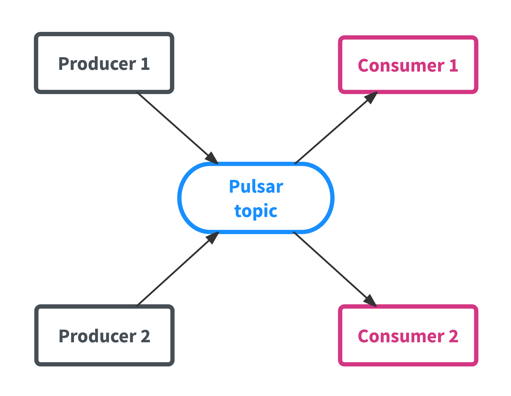
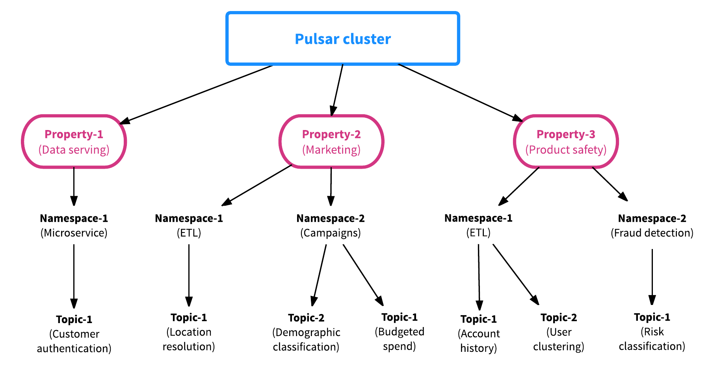
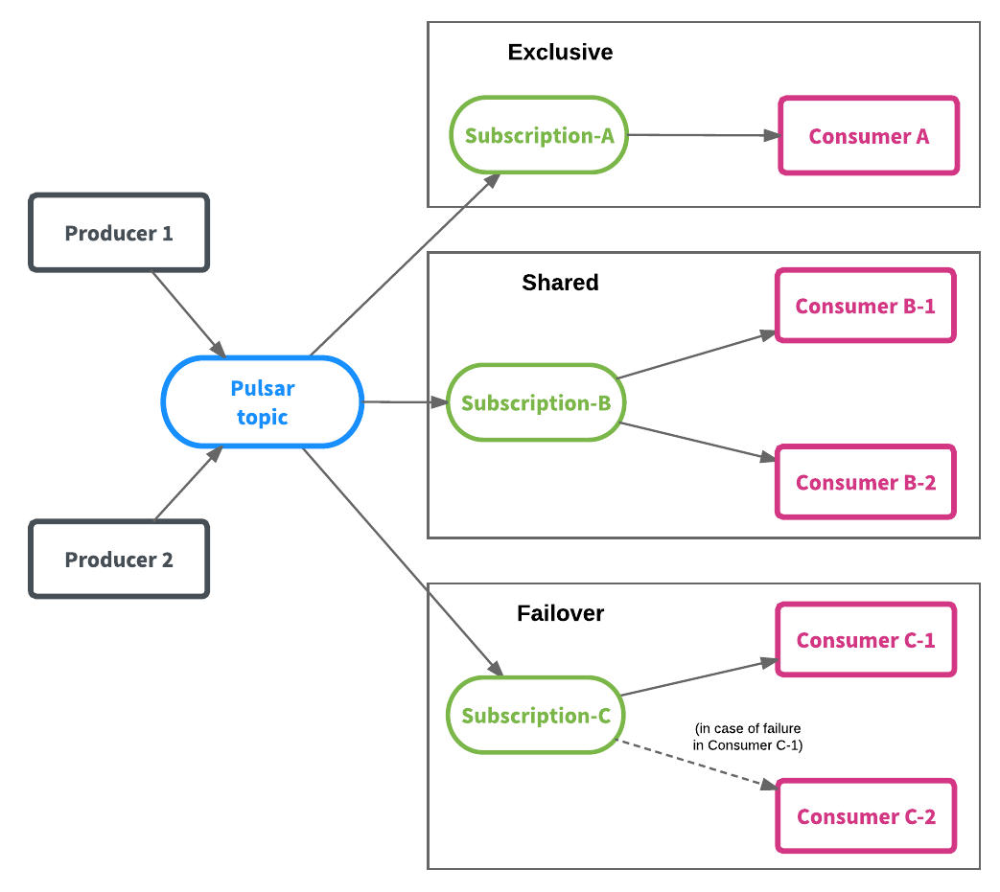
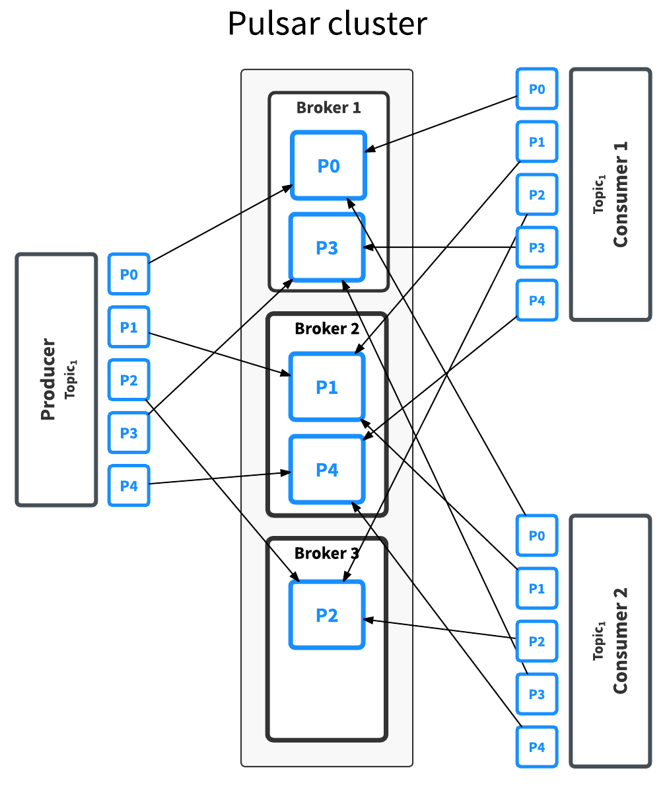

# 发布订阅消息系统 Apache Pulsar 简介

- Matteo Merli
- Karthik Ramasamy

- 薛命灯

**2017 年 11 月 21 日

**[Apache](https://www.infoq.cn/topic/Apache)[语言 & 开发](https://www.infoq.cn/topic/development)[架构](https://www.infoq.cn/topic/architecture)

[Apache Pulsar ](https://pulsar.incubator.apache.org/)（孵化器项目）是一个企业级的发布订阅（pub-sub）消息系统，最初由 Yahoo 开发，并于[ 2016 年底开源](https://yahooeng.tumblr.com/post/150078336821/open-sourcing-pulsar-pub-sub-messaging-at-scale)，现在是[ Apache 软件基金会](https://www.apache.org/)的一个孵化器项目。Pulsar 在 Yahoo 的生产环境运行了三年多，助力 Yahoo 的主要应用，如 Yahoo Mail、Yahoo Finance、Yahoo Sports、Flickr、Gemini 广告平台和 Yahoo 分布式键值存储系统 Sherpa。

**Pulsar 相关概念和术语**

向 Pulsar 发送数据的应用程序叫作生产者（producer），而从 Pulsar 读取数据的应用程序叫作消费者（consumer）。有时候消费者也被叫作订阅者。主题（topic）是 Pulsar 的核心资源，一个主题可以被看成是一个通道，消费者向这个通道发送数据，消费者从这个通道拉取数据。

图 1：生产者、消费者和主题

构建 Pulsar 的目的是为了支持多租户（multi-tenant）应用场景。Pulsar 的多租户机制包含了两种资源：资产（property）和命名空间（namespace）。资产代表系统里的租户。假设有一个 Pulsar 集群用于支持多个应用程序（就像 Yahoo 那样），集群里的每个资产可以代表一个组织的团队、一个核心的功能或一个产品线。一个资产可以包含多个命名空间，一个命名空间可以包含任意个主题。

图 2：Pulsar 各个组件间的关系

[命名空间](http://pulsar.incubator.apache.org/docs/latest/getting-started/ConceptsAndArchitecture/#properties-and-namespaces)是 Pulsar 最基本的管理单元。在命名空间层面，我们可以设置权限、调整复制选项、管理[跨集群的数据复制](http://pulsar.incubator.apache.org/docs/latest/admin/GeoReplication/)、[控制消息的过期时间](http://pulsar.incubator.apache.org/docs/latest/advanced/RetentionExpiry/)或执行其他关键任务。命名空间里的主题会继承命名空间的配置，所以我们可以一次性对同一个命名空间内的所有主题进行配置。命名空间可以分为两种：

- **本地（local）**——本地命名空间只在集群内可见。
- **全局（global）**——命名空间对多个集群可见，可以是同一个数据中心内的集群，也可以是跨地域数据中心的集群。该功能取决于是否启用了集群复制功能。

虽然本地命名空间和全局命名空间的作用域不同，但它们都可以在不同的团队或不同的组织内共享。如果应用程序获得了命名空间的写入权限，就可以往该命名空间内的所有主题写入数据。如果写入的主题不存在，就会创建该主题。

每个命名空间可以包含一到多个主题，每个主题可以有多个订阅者，每个订阅者可以接收所有发布到该主题的消息。为了给应用程序提供更大的灵活性，Pulsar 提供了[三种订阅类型](http://pulsar.incubator.apache.org/docs/latest/getting-started/ConceptsAndArchitecture/#subscription-modes)，它们可以共存在同一个主题上：

- **独享（exclusive）订阅**——同时只能有一个消费者。
- **共享（shared）订阅**——可以由多个消费者订阅，每个消费者接收其中的一部分消息。
- **失效备援（failover）订阅**——允许多个消费者连接到同一个主题上，但只有一个消费者能够接收消息。只有在当前消费者发生失效时，其他消费者才开始接收消息。

图 3 展示了这三种类型的订阅。Pulsar 的订阅机制解耦了消息的生产者和消费者，在不增加复杂性和开发工作量的情况下为应用程序提供了更大的弹性。

图 3：不同类型的 Pulsar 订阅

**数据分区**

写入主题的数据可能只有几个 MB，也有可能是几个 TB。所以，在某些情况下主题的吞吐量很低，有时候又很高，完全取决于消费者的数量。那么碰到有些主题吞吐量很高而有些又很低的情况该怎么处理？为了解决这个问题，Pulsar 将一个主题的数据分布到多台机器上，也就是所谓的[分区](http://pulsar.incubator.apache.org/docs/latest/advanced/PartitionedTopics/)。

在处理海量数据时，为了保证高吞吐量，分区是一种很常见的手段。默认情况下，Pulsar 的主题是不进行分区的，但通过命令行工具或 API 可以很容易地[创建分区主题](http://pulsar.incubator.apache.org/docs/latest/advanced/PartitionedTopics/#create)，并指定分区的数量。

在创建好分区主题之后，Pulsar 可以自动对数据进行分区，不会影响到生产者和消费者。也就是说，一个应用程序向一个主题写入数据，对主题分区之后，不需要修改应用程序的代码。分区只是一个运维操作，应用程序不需要关心分区是如何进行的。

主题的分区操作由一个叫作 broker 的进程来处理，Pulsar 集群里的每个节点都会运行自己的 broker。

图 4：将一个主题分到多个 broker 上

主题分区不会影响到应用程序，除此之外，Pulsar 还提供了几种[消息路由策略](http://pulsar.incubator.apache.org/docs/latest/getting-started/ConceptsAndArchitecture/#routing-modes)，帮助我们更好地跨分区、跨消费者分布数据。

- **单个分区**——生产者随机挑选一个分区，并将数据写入该分区。该策略与非分区主题提供的保证是一样的，不过如果有多个生产者向同一个主题写入数据，该策略就会很有用。
- **轮询（round robin）分区**——生产者通过轮询的方式将数据平均地分布到各个分区上。比如，第一个消息写入第一个分区，第二个消息写入第二个分区，并以此类推。
- **哈希（hash）分区**——每个消息会带上一个键，要写入哪个分区取决于它所带的键。这种分区方式可以保证次序。
- **自定义分区**——生产者使用自定义函数生成分区对应的数值，然后根据这个数值将消息写入对应的分区。

**持久性**

Pulsar broker 在收到消息并进行确认之后，就必须确保消息在任何情况下都不会丢失。与其他消息系统不同的是，Pulsar 使用[ Apache BookKeeper ](http://bookkeeper.apache.org/)来保证持久性。BookKeeper 提供了低延迟的持久化存储。Pulsar 在收到消息之后，将消息发送给多个 BookKeeper 节点（具体由复制系数来定），节点将数据写入预写式日志（write ahead log），同时在内存里也保存一份。节点在对消息进行确认之前，强制将日志写入到持久化的存储上，因此即使出现电力故障，数据也不会丢失。因为 Pulsar broker 将数据发给了多个节点，所以只会在大多数节点（quorum）确认写入成功之后它才会将确认消息发给生产者。Pulsar 就是通过这种方式来保证即使在出现了硬件故障、网络故障或其他故障的情况下仍然能够保证数据不丢失。在后续的文章中，我们将深入探讨这方面的细节。

**生产环境实践**

Pulsar 目前在助力 Yahoo 的主要应用，如[ Yahoo Mail ](https://mail.yahoo.com/)、[ Yahoo Finance ](https://finance.yahoo.com/)、[ Yahoo Sports ](https://sports.yahoo.com/)、[ Gemini 广告平台](https://gemini.yahoo.com/)和 Yahoo 分布式键值存储系统[ Sherpa ](https://yahooeng.tumblr.com/post/120730204806/sherpa-scales-new-heights)。很多场景都要求很强的持久性保证，比如零数据丢失，同时又要求很高的性能。Pulsar 从 2015 年开始部署到生产环境，现在在 Yahoo 的生产环境里大规模地运行。

- Pulsar 被部署在 10 多个数据中心里，具备了全网格复制能力
- 每天处理超过 1000 亿个消息
- 支持着 140 万个主题
- 整体的消息发布延迟小于 5 毫秒

**总结**

在这篇文章里，我们简单介绍了 Apache Pulsar 的一些概念，并解释了 Pulsar 是如何通过在发送确认消息前提交数据来保证持久性的，以及通过分区来提高吞吐量，等等。在后续的文章中，我们将深入探讨 Pulsar 的整体架构和特性细节，我们也将提供一些指南教大家如何更好地使用 Pulsar。

**查看英文原文**：[ Introduction to the Apache Pulsar pub-sub messaging platform](https://streaml.io/blog/intro-to-pulsar/)

------

感谢[杜小芳](http://www.infoq.com/cn/author/杜小芳)对本文的审校。

给InfoQ 中文站投稿或者参与内容翻译工作，请邮件至[ editors@cn.infoq.com ](mailto:editors@cn.infoq.com)。也欢迎大家通过新浪微博（[ @InfoQ ](http://www.weibo.com/infoqchina)，[ @丁晓昀](http://weibo.com/u/1451714913)），微信（微信号：[ InfoQChina ](http://www.geekbang.org/ivtw)）关注我们。

2017 年 11 月 21 日 18:006871

文章版权归极客邦科技InfoQ所有，未经许可不得转载。

![用户头像](data:image/png;base64,iVBORw0KGgoAAAANSUhEUgAAAHoAAAB6CAYAAABwWUfkAAAAGXRFWHRTb2Z0d2FyZQBBZG9iZSBJbWFnZVJlYWR5ccllPAAAAyhpVFh0WE1MOmNvbS5hZG9iZS54bXAAAAAAADw/eHBhY2tldCBiZWdpbj0i77u/IiBpZD0iVzVNME1wQ2VoaUh6cmVTek5UY3prYzlkIj8+IDx4OnhtcG1ldGEgeG1sbnM6eD0iYWRvYmU6bnM6bWV0YS8iIHg6eG1wdGs9IkFkb2JlIFhNUCBDb3JlIDUuNi1jMDY3IDc5LjE1Nzc0NywgMjAxNS8wMy8zMC0yMzo0MDo0MiAgICAgICAgIj4gPHJkZjpSREYgeG1sbnM6cmRmPSJodHRwOi8vd3d3LnczLm9yZy8xOTk5LzAyLzIyLXJkZi1zeW50YXgtbnMjIj4gPHJkZjpEZXNjcmlwdGlvbiByZGY6YWJvdXQ9IiIgeG1sbnM6eG1wTU09Imh0dHA6Ly9ucy5hZG9iZS5jb20veGFwLzEuMC9tbS8iIHhtbG5zOnN0UmVmPSJodHRwOi8vbnMuYWRvYmUuY29tL3hhcC8xLjAvc1R5cGUvUmVzb3VyY2VSZWYjIiB4bWxuczp4bXA9Imh0dHA6Ly9ucy5hZG9iZS5jb20veGFwLzEuMC8iIHhtcE1NOkRvY3VtZW50SUQ9InhtcC5kaWQ6RDI1RjA3RkVCQ0ExMTFFODkyQTY4NDdDNjQ4Q0I3Q0QiIHhtcE1NOkluc3RhbmNlSUQ9InhtcC5paWQ6RDI1RjA3RkRCQ0ExMTFFODkyQTY4NDdDNjQ4Q0I3Q0QiIHhtcDpDcmVhdG9yVG9vbD0iQWRvYmUgUGhvdG9zaG9wIENDIDIwMTcgKE1hY2ludG9zaCkiPiA8eG1wTU06RGVyaXZlZEZyb20gc3RSZWY6aW5zdGFuY2VJRD0ieG1wLmlpZDozNDQ5RjBBQUI4QzIxMUU4OEM2QkI5MDlENENEOUU3NiIgc3RSZWY6ZG9jdW1lbnRJRD0ieG1wLmRpZDozNDQ5RjBBQkI4QzIxMUU4OEM2QkI5MDlENENEOUU3NiIvPiA8L3JkZjpEZXNjcmlwdGlvbj4gPC9yZGY6UkRGPiA8L3g6eG1wbWV0YT4gPD94cGFja2V0IGVuZD0iciI/PjC0dCMAAAp5SURBVHja7J0LbFxHFYaP18/dtb3e+hHHcRI3oS2PUipApYUgSpBKEaiKGwgSLZBCqEShQJEQpSAQUKpKIZFAgNKmQhU0QhRoFQpVBAJBKSmqgAaahrRRqHFsZ+NXYq93117ba85/72y0sb3rfdzHzOz80S9LbnfuzPl8587MnTNbc+z4f0gD1bOvYl8tfm5hb2J3sduF6/J8doE9IRxjDwifYh9nv8yeVz1ANYqC7ma/m32D8DXsBpeulWb/m/2c8DPsYQPapXoKoB9g38y+VvzOL73IPsI+zD7KXjKgKxPu1I+xd7E3SlrHM+zH2T8Rd74BXaRC7NvYe9jXKdZDPs9+hH2InTSgVxcGTp9h38XuUHzsM87+EfuH7FED2hagfklADpNeSgjYewX8qgQdZH+R/WV2C+mtGfaD7P3slB8VCPjUcAyuTrLvrwLIULNo60nRdu1B97KfYv9cLGhUmzaJtv/G61mEl6Axij4h5sLVrvezX2J/SifQWH78FftglXTTxQqxeJj9pIiR0qAxD36Bfavhmlc72MfcXjNwEzS6pWdI3hUtmdQrYnWnSqBR5j7RLTUahkULsXpITMECsoPG3PiXYn5sVJ7uETEMygoac8Wn2f2GVcXqF7Fslg10hP179o2GkWO6UcQ0Igto/NXh3ez1ho3jul7Ettlv0HileNhAdh32r0WsfQGNHR4/ZW83LFwXtk0dogp21VQC+gEyCyFeaoeIuaeg72Dfa2Lvue4VsS+9+y3jffSb2c86Pc8zKlp4n/1O9j/cvKOj7CcMZF+F2OMlUZuboLGsudnE2neBwQG3QO9mf9DEWBp9mP1Rp5/RPWSnp0RNfKXSebLTkEacuqN/YCBLqahg40jXjW0v5kWFvOoXjCoCjSzFfSaW0mu/YFU26LvJTkM1kltXClZlDcZa2f8lDzauGTki5HcjL3y61Dv6cwayUgKrz5d6R2PV5VUqcfVFRoVDIWptCVs/Gxvqqba21vr94uIizaXnKZFM0nQ8Yf3UQFPsPvaF5f8h33EPe1SHfFlbhLo62xnu6gch1NXVWQ6HgtTV0c7Q0zQ6NkGTF6ZUbnZEsPtuMXc04J8mRVNmAHZT73oKBctbjk+mUjQ4dNYCr6gG2VvJPpul4DO6X1XIzeEwXbG1r2zIED6LMlCWogK7ncUMxu5UE3KItmzupdpA5dvgUAbKQpmKas9aoC8nBbcGNfAgq29jL9XUOHd+DcpCmShbQW0XU628oG8n/3Kmy++rNvTwaNr5aqNMlK2gEIzbCoHepVqLom2t1sjZvelZ0LqGgtqVD/TryX7lpZQwNdLhGi7oasF0Behb1FsMCVJTo/t5fLiGm72Gi7plNdA3qdaK1uZmLa/loN67HDSy77ep1oqQh3dZSM07+h1kv5y6CBppH8rNIxobG7S8loMC07flgt6mYivqxAsK3a7lsLblgr6BjHTV23NBX6tiCxYzGS2v5bDelAWNQ847VWzB3Fxay2s5LLDtDpCCiyRZpWZntbyWG3c1QF+hau2n4zNaXssFbQHoPlVrP5NI0vzCguvXwTVwLYXVpzTopaUlGpuYdP06uAaupTroTpVbMD5x3tVtPygb11BcncqDxp12ZvisK3ecm2V7rA6AVv37KyiRTNFw7Jzj5aJMlK2BOrDjU4vTCyYmL1AN/+vpXkeV7ijCDTwci1llaqIQQNfp0prxSft5vWnDemvPdjla4BH2IHfX8ZkEaaQ67OteIs2EbIx1ne3UHm2jQJG7QjOZDE2cv0DnxiasLA7dpCXoXODRSCu1tjRTKNh0MR0nKwBNpmatxZDzU9NaAs4FjRyUVqoCoTvP7vvGS4oFDxZbJNE0HmRL1dJagK0atMvGlwAdJ4eOCvbuzqwt+tnrtDJWT6BcFx8H6DGyv9NBWgEqnrWRSAuFg0HfIOfCTqRSNDUVt57tGfnfVY8B9ITUM/3LotTd1bFiIOX3H15LOGx5/bpOio2OW1M7mZcZADom64h5c28PtTTLndWIem5Yv84a2f9vaETWkXsMfeCAfMEL0Na+jdJDzhXqijq7kQPmgAakBL1xQw8Fm5qUG9qizpIm5VmgT8lUIyS0RVqUzIqwhC482ibdJOYUQL8oS22Qk9zdpfRbU0sYPDqZq+2AjgM0houDMtQGJww01NcrDxptkOi0BLCdzI4cXpCl29NFErXFYpsFfVSWO1oXSdSWo7mgn5WhRvUadNu53bck+msuaHwRh+8bl2sDAW1AB+RoC5j+PRf0HPtPftdKp/fBkrTlz4LtJScePO13rdLz89qAlqQtv73Yw+T88im2r69h4jNJbUBL0JaMYLoC9JDfo+/peFwb0BK05TnBdAVo6HE/a4Y91LOzc8pDRhsk2A9+CcvloH+Gx4uftRs5N6o8aAnakBYs84IeZz/p77MtofTGedRdgj3hYDhWCDR00O9aIhVGxXxk1NmN1KAy9MiKef0q/9Mf2f/ys5ZIahs4M2xtqFfmTua6os4SJOSdYP+hGNCo6X6/a4uADY3E6PTAIKVS8h4rgbqhjqirJFmX+2iVLdz5vjwFp6dhQ4I0J/FjI16ktYVCoSZqqG/wbcvO4mKG0vNpSiZnaWo6TvGEVDlaZ9ivWW1AXVdg1PYd9kPSLEBwQCULqoy6P9+sqdAXnOH1y0ladpK7kbTCl9G9lr3q2muh/g8f+IqJnzK6Lx/ktUBDv2D/xcRQeoFRwVXNtUBj9PYFjEFMLKUV2NxDayRLFjN0/Sf7eyae0ur7ZG8cKahCg7FcIWUC24IvN3GVbgB2DXvN6Uixk1EUdIfpwqXrsj9RDORSQEPYlrLXxFca7RVMilKxXXfu3BqFm4Pc/dXf2O+iEl4pl7qOiHkavjhr1MTaNyH2H6IS9w2Us2A8JGCnTcw9V1rEfqjUD5b7ZgDd92dN3D3X3aU8l50ADWGDwoMm9p4JsX643A9X+q7vPpJgR0oV6KCINfkFGstun2Y/Zli4psdEjJf8BJ2duO82sF2DvJscWKhyapsGKvJx9gHDxjEdEDF1ZDXSyf04SAG5i/0tqqJjJ10QYvdtEUvHUqQCLlTyG2SvwZp5dnnzZMTu607fLG7tsHuU/R72WcOuaJ0VMXvUjcLd3EqJUxTeQmaHSjFCjN5KLp48EfDgr3S76M4XDM8VQky+KWI04uaFSn17VYnw9bY/Zl9l+Fp6WTyPPUlV9nIXPBqEry/GfvH5KgaMtj8gYuFZPrrX6Q7IrfmaaOSRKoR8RLT9qyIWpCvorJAI9j72DvZLVQAY7b1VtPmEHxXw+4ykw2Rvbrud/YqGgF8RbXsj+Zx3LsNhWFj9OcR+HXsnSXKKoQPjkZ2iTYfI50OAvB51l6Lr2J9kf4StygGhyNzHcRJIQn9etsrJCjorQO4ne/vMTWSn88okLFn+juzUpSdIgtMXVQWdq6iAfbNwt0/1iInR8xEBWYkvl1YJ9CX1JjtFFNuOt4kpyxtcuOPTYlZwjOzlSZzdhVRi5d7OqQp6NSGp/0r2VrJTh5DXjeP824XbxOAzm/y/IAZJOChlQhgn+bxKdqrLaTFq1mLp9v8CDAChjN4Gkw4l1AAAAABJRU5ErkJggg==)

薛命灯

发布了 321 篇内容， 共 114.3 次阅读， 收获喜欢 116 次。

**关注

**[Apache](https://www.infoq.cn/topic/Apache)[语言 & 开发](https://www.infoq.cn/topic/development)[架构](https://www.infoq.cn/topic/architecture)