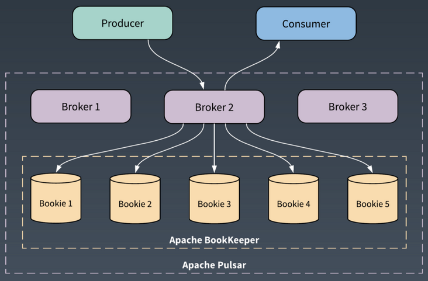
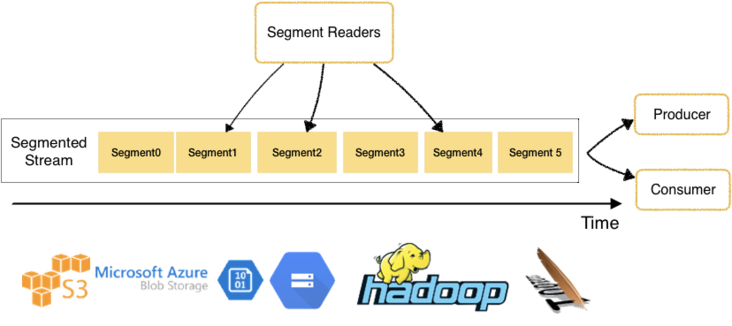

# [揭秘 Apache Pulsar 如何挑战 Kafka！](https://segmentfault.com/a/1190000025136121)

[**ApachePulsar**](https://segmentfault.com/u/apachepulsar)发布于 2020-09-27

[**🔥🔥🔥 SegmentFault D-Day 后端架构演进之路（杭州站），快来报名 >>>**](https://sponsor.segmentfault.com/ck.php?oaparams=2__bannerid=526__zoneid=25__cb=13ff957873__oadest=https%3A%2F%2Fsegmentfault.com%2Fe%2F1160000040440065)

> 本专访对 StreamNative 联合创始人兼CTO、Apache Pulsar PMC 翟佳的采访内容。在本采访中，主要介绍了 Apache Pulsar 作为云原生流数据工具在消息处理领域的优势特性、与 Kafka 的一些对比概要以及 StreamNative 公司的介绍和发展方向。

开源流数据公司 StreamNative 近期宣布完成数百万美元 Pre-A 轮融资，日前正式加入 CNCF。其创始团队成员是 Apache Pulsar、Apache BookKeeper 项目的原生核心开发者，StreamNative 也被称为开源消息系统基础设施 Pulsar 背后的公司。（本文中 Pulsar、BookKeeper 分别指代 Apache Pulsar、Apache BookKeeper）

StreamNative 是一家基于 Pulsar 的商业公司，提供云原生的实时消息和流数据处理技术。Pulsar 是 Yahoo 内部在 2012 年为构建统一消息平台而构建的，采用分层分片的系统架构。上层 Pulsar Broker 提供无状态的服务层；底层 BookKeeper 提供高性能、低延迟和强一致性的 IO 服务。

在今年 6 月的 Pulsar Summit 中，Splunk 和 Yahoo 做了测试和分析：Pulsar 帮助 Splunk 将成本降低了 1.5 - 2 倍，延迟降低了 5 - 50 倍，运营成本降低 2 - 3 倍；在 Yahoo 的部署中，Pulsar 支持同等规模的业务量，还在保证更高数据服务质量的情况下，消耗只有 Apache Kafka 的一半的实际硬件资源成本。

不过，在目前开源的分布式消息系统中，Kafka 依旧有很高的知名度和使用率，也同样是 Apache 基金会的顶级项目。Pulsar 在技术和生态上有什么地方上优于 Kafka？未来是否有更大的发展空间？Pulsar 和 StreamNative 是如何共生的？ StreamNative 因何获得投资，这对其他开源项目公司有什么启发？

对此，我们采访了 StreamNative 联合创始人兼 CTO 翟佳，通过他更多地了解 StreamNative 的产品与团队，和 Pulsar、BookKeeper 两个项目。

> 嘉宾介绍：
> 翟佳，StreamNative 联合创始人兼 CTO。在创办 StreamNative 之前，在 EMC 从事分布式、文件系统、流存储相关的设计和开发，目前是 Apache BookKeeper 和 Apache Pulsar 两个项目的 PMC 成员。

## 开源消息系统基础设施 Pulsar

翟佳介绍，Pulsar 诞生于 2012 年，最初的目的是为在 Yahoo 内部，取代其他消息系统，构建统一逻辑大集群的消息平台。当时的其他消息系统（包括 Kafka），都不能满足 Yahoo 的需求，比如大集群多租户、稳定可靠的 IO 服务质量、百万级 Topic、跨地域复制等，因此 Pulsar 应运而生。

“当时在 Yahoo 内部叫 CMS（Cloud Message Service），从名字可以看出 Pulsar 诞生时就坚定了云的方向”，翟佳介绍，2015 年，Pulsar 完成了在 Yahoo 内部的部署和替换，大规模部署在 Yahoo 内部， 服务于 Yahoo mail、 Yahoo Finance、 Yahoo Sports/ Flickr 及广告平台等大规模的场景。2017 年 6 月 Pulsar 被捐赠给 Apache 基金会，2018 年 9 月毕业成为 ASF 顶级项目。

现在，Pulsar 被  StreamNative 看做是一个兼属“流数据+云原生”领域的项目。那么 Pulsar 作为一个以“云”为方向的消息基础设施，其“流数据”和“云原生”特性都是如何实现的呢？这里翟佳介绍了一些 Pulsar 的技术特性。

**Pulsar 作为消息的基础设施，必然会和存储、和计算层有深入的交互。**

在存储方面，Pulsar 利用 Apache BookKeeper 的优势，积极扩展和挖掘 Pulsar 架构的优势。基于 Pulsar 对 Topic 的分片存储，我们可以很自然地将老的分片从 BookKeeper 迁移到的二级存储中。通过层级存储，可以支持无限量的流数据。此外我们正在二级存储中支持列存模式的支持，这样可以更高效的支撑批处理的请求，真正实现批流融合的存储需求。

对于计算层，Pulsar 的思路是更多地拥抱其他开源项目。我们在 Pulsar 中提供了结构化（Schema）的支持，保证 Pulsar 中的数据可以按照数据结构被其他系统理解。比如 StreamNative 开源的 pulsar-spark、pulsar-flink 连接器等，都是为了更好的和其他大数据引擎整合的例子。Pulsar SQL 也是直接整合 Presto 来支持 Pulsar 中的数据查询。

函数式轻量化计算（Pulsar Functions），是 Pulsar 结合 Serverless 的理念在消息领域的一个创新。函数的编写很简单，运行时，每个消息触发一次函数的计算。这种轻量级的计算，为用户提供了 Spark、Flink 之外一个很好的补充，可以方便用户处理很多常见的简单计算场景，比如数据的清洗、路由、Enhancement 等。

Pulsar 借助在存储层的优势，通过和更多的大数据生态整合，为用户提供一整套基于事件流的数据处理平台。

**在消息领域，Pulsar 是第一个将存储计算分离云原生架构落地的开源项目。**

除了存储计算的分层架构，Pulsar 系统中的节点对等、大集群管理带来的资源池化、高可用特性带来的系统弹性等和云原生的理念十分契合。

流数据按照有没有明确的起止位置，可以分为有界流和无界流。流入消息平台中每个 Topic 的数据，很自然地可以作为事件流的一种数据表现。Pulsar 的 Pub/Sub 接口，可以让计算平台更方便地把 Topic 当作流数据来处理。同时 Pulsar 底层的存储层 BookKeeper，又将一个 Topic 分为了多个有界的分片，和 HDFS 中的数据块对应，直接访问 BookKeeper 中的分片，更加方便批数据的处理引擎。结合 Pulsar，可以更便捷地完成在数据处理中的批流统一。

在批流统一的实践中，Flink/Spark 等计算引擎都有了很好的抽象，但是在数据的存储层没有太多的工作，StreamNative 认为 Pulsar 的架构很匹配批流融合的存储需求，这是 Pulsar 在数据处理领域的一个优势。

StreamNative 正在 Pulsar 的二级存储中支持列存格式，让访问 Pulsar 的批处理引擎更加高效。这样 Pulsar 提供了统一的数据存储层，用户只用关心上层的数据处理，而不用关心底层的数据存储细节。

## Pulsar 使用 BookKeeper 作为存储中心

Pulsar 使用 BookKeeper 作为存储中心。BookKeeper 提供的 API 抽象度很高，简单来说就是一个提供无限个 Write-Ahead-Log（WAL）的分布式存储系统。

从 BookKeeper 毕业成为 Apache 顶级项目，已经有 5 年多的时间，期间一直有 Yahoo、Twitter、Salesforce、EMC 等公司的深度使用和积极贡献，BookKeeper 相对来说已经比较稳定和成熟。StreamNative 主要通过 Pulsar 的社区增长来带动 BookKeeper 的社区增长。

根据 Pulsar 的功能需求，相应地增加 BookKeeper 的功能。StreamNative 组织的线上线下活动中，也常邀请 BookKeeper 的相关用户参与分享和交流。从 GitHub 上 BookKeeper 项目 Star 数的增长趋势，也可以很明显的看到两个社区的相互带动。

**Pulsar 和 Kafka 对比**

开发者最关心的问题可能还是 Pulsar 好用在哪？翟佳从三个方面对比 Pulsar 与 Kafka，以说明 Pulsar 的特点和优势：

第一，从应用场景来说，Pulsar 对用户来说提供了统一的消息模型，一方面可以满足各种 MQ，例如 RabbitMQ、ActiveMQ 等线上交易系统的需求；一方面可以满足和 Kafka 类似的高吞吐的需求的场景。这决定了 Pulsar 在生态上，有比 Kafka 更多的使用场景和需求。

第二，架构上，Pulsar 有存储计算分离的云原生架构的优势。由于在 Broker 层不存储任何数据，这种架构为用户带来了更高的可用性、更灵活的扩容和管理、避免数据的 reblance 和 catch-up。

BookKeeper 作为 Pulsar 的存储层，它诞生时就是为元数据的一致性服务的，可以在保证高带宽、低延迟的情况下，为用户提供更好的一致性保障；相比 Kafka 依赖文件系统来保证一致性，BookKeeper 有原生的一致性协议，数据实时刷盘，读写硬件隔离，这些都为 Pulsar 带来了更高可靠性和数据服务质量。

第三，在社区上，Kafka 作为当时流数据的唯一选择有一定的先发优势。Pulsar 凭借架构和功能方面的优势，在过去两年的关注度和使用量不断快速增加，国内外的 Pulsar 用户和贡献者数量也在快速增加。在前两周，全球项目贡献者人数已突破 300 位。

目前公司对消息平台的需求升级集中在降低成本、便捷操作两个方面。Pulsar 以下的特性正是符合消息平台发展的趋势：

- 云原生，降低系统的人工运维和管理的成本
- 大集群，统一管控系统资源
- 统一平台，便捷数据的共享和管理

翟佳总结，Pulsar 的优势在于其独特设计和分层分片的系统架构。借助 Pulsar 的架构和功能，用户可以部署统一的集群，通过池化的资源和多租户，来满足整个组织内部的各种消息场景的需求，减少小集群、多集群的复杂管理，提高资源利用率，方便集群内部数据的共享。

Pulsar 借助 BookKeeper 也为用户提供了更好的数据服务质量， 在保证高带宽、低延迟的同时，提供了更高的一致性和持久化。从运维和资源弹性角度看，Pulsar 集群的扩缩容更加迅速便捷；节点的替换和更新不会影响业务的可靠性和可用性。从线上部署成本来说，对比 Kafka，Pulsar 也有相当大的优势。

> StreamNative 近期也发文详细对比 Pulsar 与 Kafka：
>
> **《Pulsar vs. Kafka — Part 1 — A More Accurate Perspective on Performance, Architecture, and Features》**
> 🔗 [https://streamnative.io/blog/...](https://link.segmentfault.com/?enc=ZKm8NOmQeikM958Pb%2FW6EQ%3D%3D.O5xPti35Yonolszimkpiz%2BrUyV1HkxzklZIKPuCfv%2F8QIC0L%2F4yMtK%2BWQrpWBazaVul3ugM96gFtqHjKc%2FC71%2FvVIQsYwFUrK%2BAzq00g%2BzE%3D)
>
> **《Pulsar vs Kafka - Part 2 - Adoption, Use Cases, Differentiators, and Community》**
> 🔗 [https://streamnative.io/blog/...](https://link.segmentfault.com/?enc=FfyS%2FXUyKWMqG6bQZEHUJA%3D%3D.3DkSkCPRQQGeQuMR5eXBvCNIapDSZNxSn%2F9OUmmOglwgjRCbdzfZot5wsluCMFN8ZeVLo7PObvIlOoZZZlsz5SQcxdtHWrGNwX4606H0ffk%3D)

## 基于 Pulsar 的 StreamNative

在了解了 Pulsar 的基础之上，才能更好理解 StreamNative。

StreamNative 在开发与运维 Pulsar 的同时，主要提供基于 Pulsar 的云端托管与运维、技术支持服务。需要注意的是，Pulsar 是 Apache 基金会下的顶级开源项目，其所有权属于中立的基金会，这也是 StreamNative 可以为 Pulsar 做社区运营的信任基础。

StreamNative 成立于 2019 年，公司开发人员都是 Apache Pulsar 早期的一批贡献者，很多成员也是 Apache Pulsar 的 PMC 成员或 Committer，其联合创始人兼 CEO 郭斯杰 是 Apache Pulsar 原型设计和主要开发者。

翟佳介绍，StreamNative 聚焦的两个主要方向是 Pulsar 社区和云，这也是投资人极为看好的方向。

产品方面，StreamNative 的产品是 StreamNative Cloud，为企业在云上提供全托管式的 “Apache Pulsar 即服务”，翟佳介绍，“熟悉 Pulsar 的工程师会对 Pulsar 的存储计算分离和分层分片的弹性系统架构，印象比较深刻，这也是StreamNative 常说 Pulsar 拥有云原生架构的一个原因。”StreamNative 的服务适合对 Pulsar 集群运行质量、管控和维护有更高需求的客户。

**StreamNative 团队目前的主要工作内容还包括完善 Pulsar 社区。**

对 Pulsar 社区的构建主要是集中在产品及与用户的互动，贡献和改进 Pulsar 的功能、丰富 Pulsar 的周边生态、帮助 Pulsar 的版本发布和维护、沟通社区用户并帮忙解决上线 Pulsar 中遇到的障碍、组织参加相关 Pulsar 的 meetup 等推广宣传活动等。这些工作主要是完善 Pulsar 的文档、降低 Pulsar 的入门门槛，丰富 Pulsar 和其他系统的集成和交互，做好用户起步的基础工作。

**“长期来看，更重要的是丰富社区的用户场景、吸引更多的用户参与社区，构建一个活跃的、可以长期持续发展的社区”****，**翟佳透露，除了 Pulsar 自身的优势，社区和客户的认可也是促成 Pre-A 轮融资成功的原因之一。目前 Pulsar 已经在一线的互联网场景中得到了广泛的应用。

此外，StreamNative 也在完善 StreamNative 基于 K8S 的云平台。目前已经在 Google Cloud 上发布了云平台预览版 StreamNative Cloud，预计在年底发布国内的预览版。

## 开源项目与商业公司

在这次访谈中，翟佳大部分时间都在介绍 Pulsar。他认为，开源项目与商业公司是相互成就的。

> 成功的开源项目背后，都有一家商业化公司来为社区和用户持续提供核心支持：社区用户被开源产品的架构和功能所吸引，参与社区；公司在服务社区的过程中，不断获得反馈和创新，完善开源产品在各种生产环境的综合表现；公司再利用成熟的项目和积淀来服务有需要的社区客户——这样形成一个良性循环。
>
> 由 Pulsar 核心团队带领的 StreamNative 公司和 Pulsar 社区也是这样一种关系。

谈到创业商机，作为技术人的翟佳表示自己一直抱着“技术改变世界”的梦想，“StreamNative 创始团队成员亲身见证经历了 3000+ Pulsar 存储集群规模的搭建和运维，见证和经历了 Pulsar 和 BookKeeper 在 Yahoo、Twitter 线上的长期磨砺和迭代，明确感受到 Pulsar 在架构和功能方面的优势，以及与云原生方向的匹配和一致性。同时，我们看到开发者对 Pulsar 的架构和产品的认可，也感受到用户在使用时遇到的痛点。”

此外近两年开源商业化的模式不断成熟，在 Spark、ES、MongoDB、TiDB 等开源项目背后，都有商业公司在崛起，StreamNative 认为 Pulsar 和 StreamNative 有同样的机会。

不过，StreamNative 花费了如此多的时间与精力在 Pulsar 与其社区生态上，是否会造成 Pulsar 与商业公司绑定，削弱项目的开源协作属性呢？

对此翟佳认为，**这种绑定，是对开源协作的促进，而非削弱。**

Pulsar 的核心是全部开源的，StreamNative 公司和社区用户用的是同样的一份代码。StreamNative 投入社区会带来社区的信任和发展；社区的反馈会带来 Pulsar 的成熟和创新迭代；最终会有更多的用户相信 Pulsar 和 StreamNative。

其次，金融、证券、零售、IoT 等领域都有客户在拥抱和使用 Pulsar。StreamNative 在支持这些客户的同时，Pulsar 也通过不同的场景变得更加成熟。通过对客户的服务，StreamNative 可以了解相关垂直领域的需求，进而不断接触和满足更多相同领域的客户。

Pulsar 和 Kafka 很类似，都是 Apache 软件基金会的项目，Linkedin 在捐赠 Kafka 之后，成为了 Kafka 的用户，Yahoo 现在也是 Pulsar 的用户。 在 Linkedin 和 Yahoo 的角度，维护开源项目（Kafka/Pulsar）在原公司的使用，满足原公司线上的业务需求是最重要的，除此之外开源能让项目更加成熟和健壮，对原公司有不少好处。

综上， Pulsar 项目本身往云原生方向发展，看好此方向的 StreamNative 投入绝对的精力和时间在 Pulsar 上，一方面帮助拓展 Pulsar 的生态，反刍自身的商业资源，另一方面握住 Pulsar 和 BookKeeper 的技术优势，以区别其他的 Pulsar 服务商。这些或许就是投资人现在看好 StreamNative 的原因，未来也可能会是更多开发者和用户选择 StreamNative 的理由。

> 文中 “Apache”、“Apache Pulsar”、“Apache BookKeeper”、“Pulsar”、“BookKeeper” 皆为 Apache 软件基金会在美国或/和其他国家地区的注册商标或商标。所有其他品牌和商标均为其各自所有者资产。

[kafka](https://segmentfault.com/t/kafka)[pulsar](https://segmentfault.com/t/pulsar)[apache](https://segmentfault.com/t/apache)[云原生-cloud-native](https://segmentfault.com/t/云原生-cloud-native)[分布式](https://segmentfault.com/t/分布式)