# RocketMQ 实现高可用多副本架构的关键：基于 Raft 协议的 commitlog 存储库 DLedger

- 金融通
- 武文良

- 蔡芳芳

**2019 年 8 月 08 日

**[大数据](https://www.infoq.cn/topic/bigdata)[开源](https://www.infoq.cn/topic/opensource)[架构](https://www.infoq.cn/topic/architecture)[高可用](https://www.infoq.cn/topic/ high availability)

> 在 RocketMQ 4.5 版本之前，RocketMQ 只有 Master/Slave 一种部署方式，虽然这种模式可以提供一定的高可用性但也存在比较大的缺陷。为了实现新的高可用多副本架构，RockeMQ 最终选用了基于 Raft 协议的 commitlog 存储库 DLedger。

## 一、DLedger 引入目的

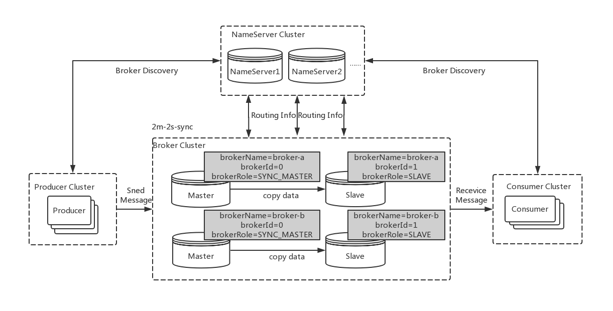

在 RocketMQ 4.5 版本之前，RocketMQ 只有 Master/Slave 一种部署方式，一组 Broker 中有一个 Master，有零到多个 Slave，Slave 通过同步复制或异步复制方式去同步 Master 的数据。Master/Slave 部署模式，提供了一定的高可用性。

但这样的部署模式有一定缺陷。比如故障转移方面，如果主节点挂了还需要人为手动的进行重启或者切换，无法自动将一个从节点转换为主节点。因此，我们希望能有一个新的多副本架构，去解决这个问题。

新的多副本架构首先需要解决自动故障转移的问题，本质上来说是自动选主的问题。这个问题的解决方案基本可以分为两种：

利用第三方协调服务集群完成选主，比如 zookeeper 或者 etcd。这种方案会引入了重量级外部组件，加重部署，运维和故障诊断成本，比如在维护 RocketMQ 集群还需要维护 zookeeper 集群，并且 zookeeper 集群故障会影响到 RocketMQ 集群。

利用 raft 协议来完成一个自动选主，raft 协议相比前者的优点，是它不需要引入外部组件，自动选主逻辑集成到各个节点的进程中，节点之间通过通信就可以完成选主。

因此最后选择用 raft 协议来解决这个问题，而 DLedger 就是一个基于 raft 协议的 commitlog 存储库，也是 RocketMQ 实现新的高可用多副本架构的关键。

## 二、DLedger 设计理念

### 1、DLedger 的定位

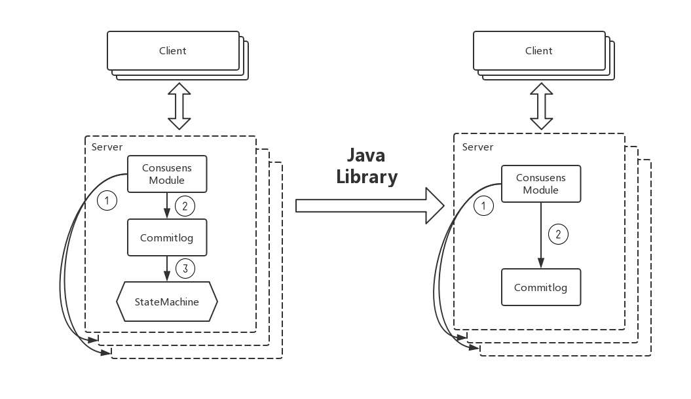

raft 协议是复制状态机的实现，这种模型应用到消息系统中就会存在问题。对于消息系统来说，它本身是一个中间代理，commitlog 的状态是系统最终的状态，并不需要状态机再去完成一次状态的构建。因此 DLedger 去掉了 raft 协议中状态机的部分，但基于 raft 协议保证 commitlog 是一致的，并且是高可用的。

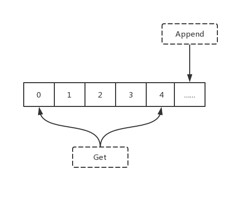

另一方面 DLedger 它又是一个轻量级的 java library。它对外提供的 API 非常简单，append 和 get。Append 向 Dledger 添加数据，并且添加的数据会对应一个递增的索引，而 get API 可以根据索引去获得相应的数据。所以 DLedger 是一个 append only 的日志系统。

### 2、DLedger 的应用场景

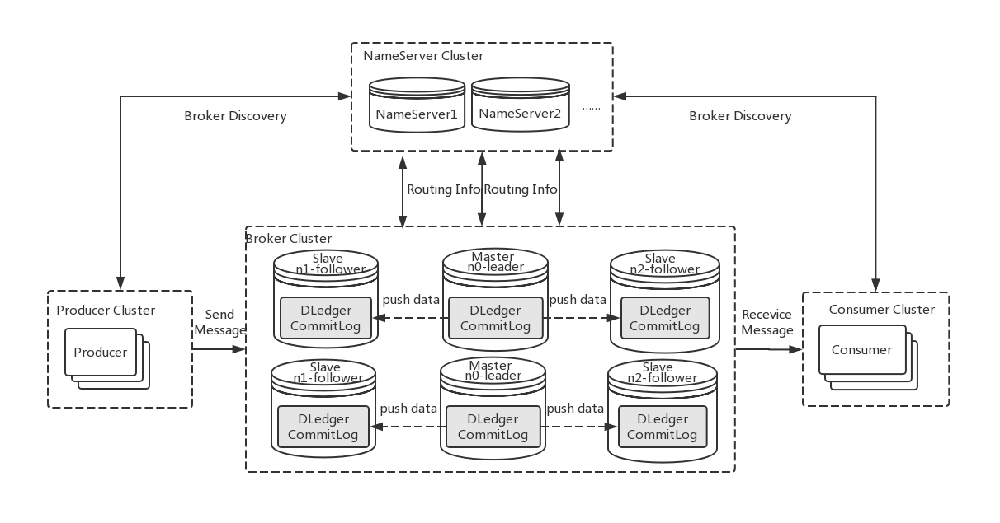

DLedger 的其中一个应用就是在分布式消息系统中，RocketMQ 4.5 版本发布后，可以采用 RocketMQ on DLedger 方式进行部署。

DLedger commitlog 代替了原来的 commitlog，使得 commitlog 拥有了选举复制能力，然后通过角色透传的方式，raft 角色透传给外部 broker 角色，leader 对应原来的 Master，follower 和 candidate 对应原来的 Slave。

因此 RocketMQ 的 broker 拥有了自动故障转移的能力，如果在一组 broker 中，一个 Master 挂了以后，依靠 DLedger 自动选主的能力，会重新选出 leader，然后通过角色透传变成新的 Master。

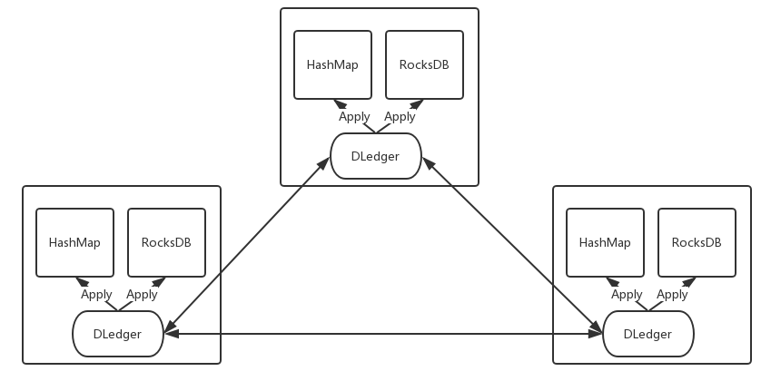

DLedger 还可以构建高可用的嵌入式 KV 存储。我们把对一些数据的操作记录到 DLedger 中，然后根据数据量或者实际需求，恢复到 hashmap 或者 rocksDB，从而构建一致的，高可用的 KV 存储系统，应用到元信息管理等场景。

## 三、DLedger 的优化

### 1、性能优化

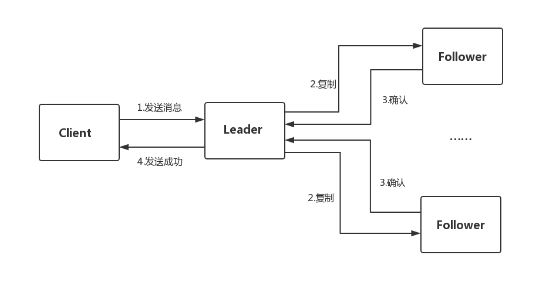

Raft 协议复制过程可以分为四步，先是发送消息给 leader，leader 除了本地存储之外，会把消息复制给 follower，然后等待 follower 确认，如果得到多数节点确认，该消息就可以被提交，并向客户端返回发送成功的确认。DLedger 中如何去优化这一复制过程？

#### （1）异步的线程模型

DLedger 采用一个异步线程模型，异步的线程模型可以减少等待。在一个系统中，如果阻塞点越少，每个线程处理请求时能减少等待，就能更好的利用 CPU，提高吞吐量和性能。

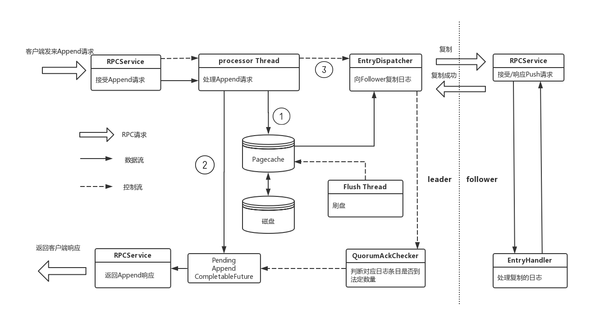

以 DLedger  Server 处理 Append 请求的整个过程来讲述 DLedger 异步线程模型。图中粗箭头表示 RPC 请求，实现箭头表示数据流，虚线表示控制流。

首先客户端发送 Append 请求，由 Dledger 的通信模块处理，当前 DLedger 默认的通信模块是利用 Netty 实现的，因此 Netty IO 线程会把请求交给业务线程池中的线程进行处理，然后 IO 线程直接返回，处理下一个请求。业务处理线程处理 Append 请求有三个步骤：

首先是把 Append 数据写入自己日志中，也就是 pagecache 中。

然后生成 Append CompletableFuture ，放入一个 Pending Map 中，由于该日志还没有得到多数的确认，所以它是一个判定状态。

第三步唤醒 EnrtyDispatcher 线程，通知该线程去向 follower 复制日志。

三步完成以后业务线程就可以去处理下一个 Append 请求，中间几乎没有任何等待。

另一方面，复制线程 EntryDispatcher 会向 follower 复制日志，每一个 follower 都对应一个 EntryDispatcher 线程，该线程去记录自己对应 follower 的复制位点，每次位点移动后都会去通知 QurumAckChecker 线程，这个线程会根据复制位点的情况，判断是否一条日志已经复制到了多数节点上，如果已经被复制到了大多数的节点，该日志就可以被提交，并去完成对应的 Append，通知通信模块向客户端返回响应。

#### （2）独立并发的复制过程

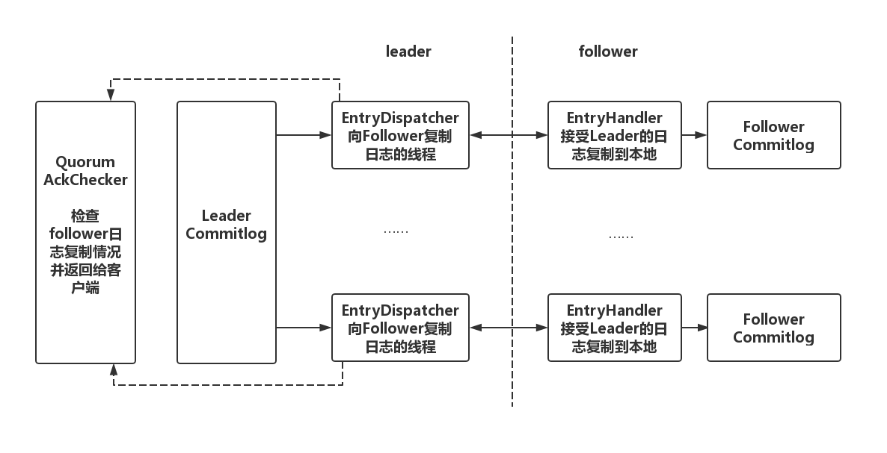

在 DLedger 中，leader 向所有 follower 发送日志也是完全相互独立和并发的，leader 为每个 follower 分配一个线程去复制日志，并记录相应的复制的位点，然后再由一个单独的异步线程根据位点情况检测日志是否被复制到了多数节点上，返回给客户端响应。

#### （3）日志并行复制

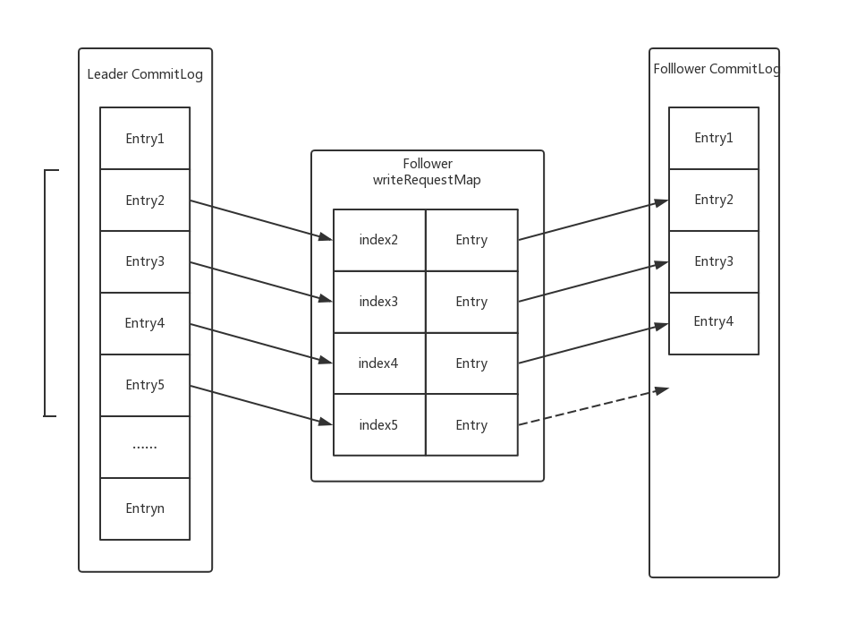

传统的线性复制是 leader 向 follower 复制日志，follower 确认后下一个日志条目再复制，也就是 leader 要等待 follower 对前一条日志确认后才能复制下一条日志。

这样的复制方式保证了顺序性，且不会出错，但吞吐量很低，时延也比较高，因此 DLedger 设计并实现日志并行复制的方案，不再需要等待前一个日志复制完成再复制下一个日志，只需在 follower 中维护一个按照日志索引排序请求列表，follower 线程按照索引顺序串行处理这些复制请求，对于并行复制后可能出现数据缺失问题，可以通过少量数据重传解决。

### 2.可靠性优化

#### （1）DLedger 对网络分区的优化

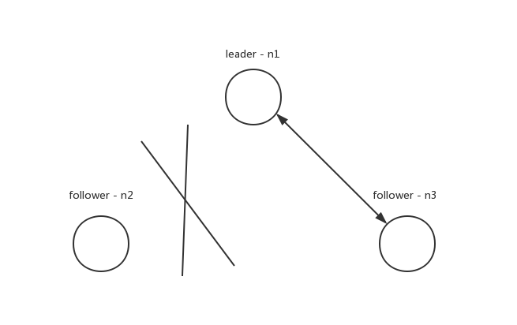

如果出现上图的网络分区，n2 与集群中的其他节点发生了网络隔离，按照 raft 论文实现，n2 会一直请求投票，但得不到多数的投票，term 一直增大。一旦网络恢复后，n2 就会去打断正在正常复制的 n1 和 n3，进行重新选举。

为了解决这种情况，DLedger 的实现改进了 raft 协议，请求投票的过程分成了多个阶段，其中有两个重要阶段：WAIT_TO_REVOTE 和 WAIT_TO_VOTE_NEXT。

WAIT_TO_REVOTE 是初始状态，这个状态请求投票时不会增加 term。

WAIT_TO_VOTE_NEXT 则会在下一轮请求投票开始前增加 term。

对于图中 n2 情况，当有效的投票数量没有达到多数量时。可以将节点状态设置 WAIT_TO_REVOTE，term 不会增加。通过这个方法，提高了 Dledger 对网络分区的容忍性。

#### （2）DLedger 可靠性测试

DLedger 还有非常高的容错性。它可以容忍各种各样原因导致节点无法正常工作，比如：

- 进程异常崩溃
- 机器节点异常崩溃（机器断电，操作系统崩溃）
- 慢节点（出现 Full GC，OOM 等）
- 网络故障，各种各样的网络分区

为了验证 Dledger 对这些故障的容忍性，除了本地对 DLedger 进行了各种各样的测试，还利用分布式系统验证与故障注入框架 Jepsen 来检测存在的问题，并验证系统的可靠性。

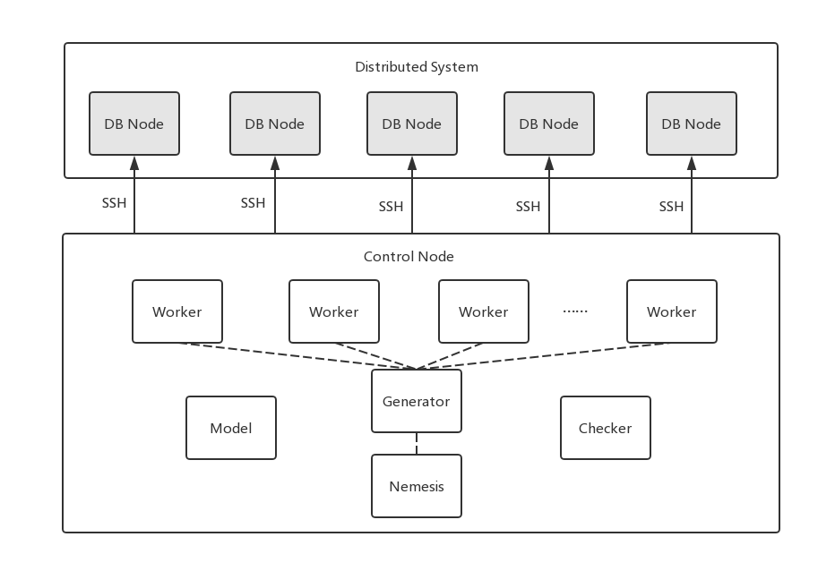

Jepsen 框架主要是在特定故障下验证系统是否满足一致性。Jepsen 验证系统由 6 个节点组成，一个控制节点（Control Node），五个 DB 节点（DB Node）。

控制节点可以通过 SSH 登录到 DB 节点，通过控制节点的控制，可以在 DB 节点完成分布式系统的下载，部署，组成一个待测试的集群。测试开始后，控制节点会创建一组 Worker 进程，每一个 Worker 都有自己的分布式系统客户端。

Generator 产生每个客户端执行的操作，客户端进程将操作应用于待测试的分布式系统。每个操作的开始和结束以及操作结果记录在历史记录中。

同时，一个特殊的 Client 进程 Nemesis 将故障引入系统。测试结束后，Checker 分析历史记录是否正确，是否符合一致性。

根据 DLedger 的定位，它是一个基于 raft 协议的 commitlog 存储库，是一个 Append only 的日志系统，采用 Jepsen 的 Set 模型进行测试。

Set 模型的测试流程分为两个阶段。第一阶段由不同的客户端并发地向待测试集群添加不同的数据，中间会进行故障注入。第二阶段，向待测试集群进行一次最终读取，获得读取的结果集。最后验证每一个成功添加的元素都在最终结果集中，并且最终的结果集也仅包含企图添加的元素。

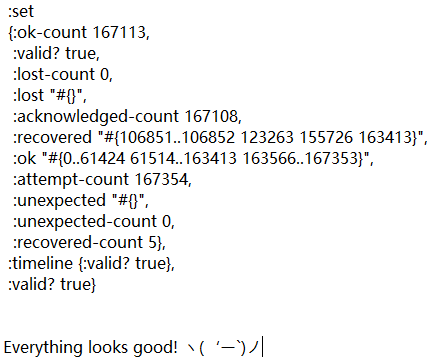

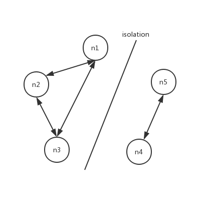

上图是 DLedger 其中一次测试结果，有 30 个客户端进程并发地向待测试的 DLedger 集群添加数据，中间会引入随机对称网络分区，故障引入的间隔时间默认是 30s，也就是 30s 正常运行，30s 的故障引入，再 30s 正常运行、30s 故障引入，一直循环。整个阶段一共持续 600s。可以看到最后一共发送了 16 万个数据，中间没有出现数据丢失，lost-count=0，也没有出现不应该存在的数据，uexpected-count=0，一致性测试通过。

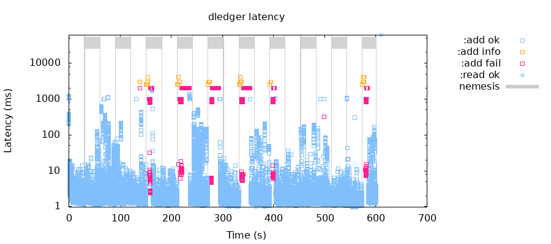

上图展示了该次测试中客户端对 DLedger 集群每一次操作情况，蓝色小框表示添加成功，红色小框表示添加失败，黄色小框表示不确定是否添加成功（比如多数认证超时），图中灰色部分表示故障引入的时间段。

可以看出一些故障引入时间段造成集群短暂的不可用，一些故障时间段则没有，这是合理的。因为是随机网络隔离，所以需要看隔离的节点会不会造成集群重新选举。但即使造成集群重新选举，一段时间后，DLedger 集群也会恢复可用性。

除了测试对称网络分区故障，还测试了其他故障下 Dledger 的表现情况，包括随机杀死节点，随机暂停一些节点的进程模拟慢节点的状况，以及 bridge、partition-majorities-ring 等复杂的非对称网络分区。在这些故障下，DLedger 都保证了一致性，验证了 DLedger 有很好可靠性。

## 四、DLedger 的未来发展

DLedger 接下来的计划包括:

- Leader 节点优先选择
- RocketMQ on DLedger Jepsen 测试
- 运行时成员变更
- 增加观察者（只参与复制，不参与投票）
- 构建高可用的 K/V 存储
- ……

DLedger 现在是在 OpenMessaging 下的一个项目，欢迎社区的同学一起加入，来构建高可用高性能的 commitlog 存储库。

**作者介绍：**

金融通：2018 年中间件性能挑战赛优胜奖，RocketMQ 源码爱好者、RocketMQ Contributor。

武文良：SnoWalker，中间件发烧友，RocketMQ 北京社区联合发起人之一，社区布道师。专注于后端分布式领域，对分布式架构、中间件原理、Devops 有着较为深刻的认识和丰富的实践经验。

2019 年 8 月 08 日 12:029385

**[大数据](https://www.infoq.cn/topic/bigdata)[开源](https://www.infoq.cn/topic/opensource)[架构](https://www.infoq.cn/topic/architecture)[高可用](https://www.infoq.cn/topic/ high availability)