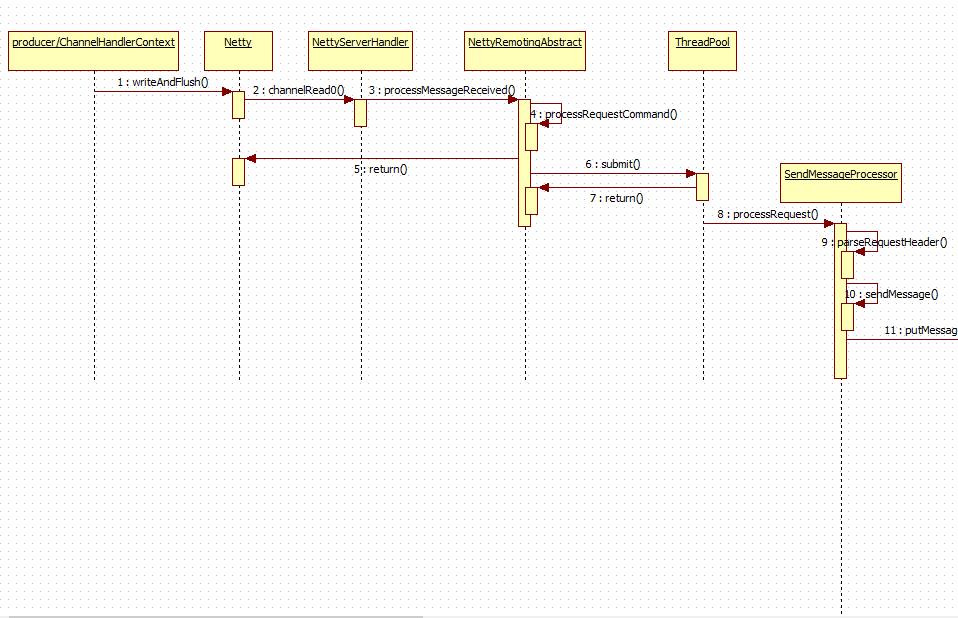
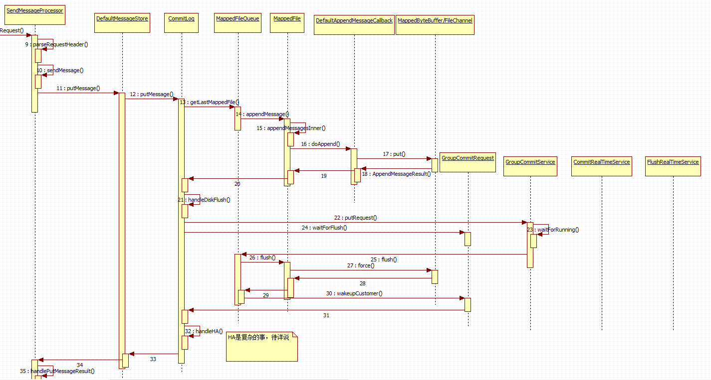
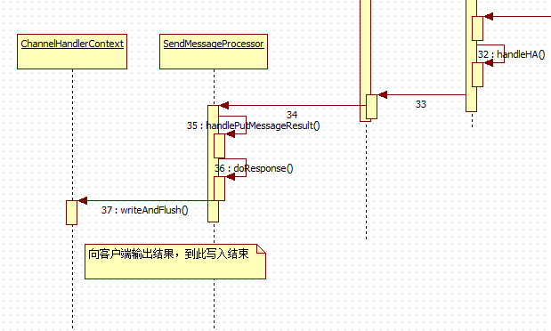

# [RocketMQ（四）：生产者消息数据写入实现细节](https://www.cnblogs.com/yougewe/p/12133260.html)


**目录**

- [1. broker与客户端的通信: broker 服务端端口的暴露](https://www.cnblogs.com/yougewe/p/12133260.html#_label0)
- [2. 消息的具体写入框架逻辑](https://www.cnblogs.com/yougewe/p/12133260.html#_label1)
- [3. CommitLog 如何写入数据？](https://www.cnblogs.com/yougewe/p/12133260.html#_label2)


------

　　producer 在消息send之后，其实就是调用了 broker 对应的api，要想了解消息的具体写入过程就得细看broker。今天我们就来看看 broker是如何进行消息的存储的！（消息消费另说）

　　broker启动起来之后，就可以接收客户端的生产消费请求了！

 

[返回顶部](https://www.cnblogs.com/yougewe/p/12133260.html#_labelTop)

### 1. broker与客户端的通信: broker 服务端端口的暴露

[](javascript:void(0);)

```
    // org.apache.rocketmq.remoting.netty.NettyRemotingServer#start
    @Override
    public void start() {
        this.defaultEventExecutorGroup = new DefaultEventExecutorGroup(
            nettyServerConfig.getServerWorkerThreads(),
            new ThreadFactory() {

                private AtomicInteger threadIndex = new AtomicInteger(0);

                @Override
                public Thread newThread(Runnable r) {
                    return new Thread(r, "NettyServerCodecThread_" + this.threadIndex.incrementAndGet());
                }
            });
        // 创建共享的 handler, 如 serverHandler
        prepareSharableHandlers();

        ServerBootstrap childHandler =
            this.serverBootstrap.group(this.eventLoopGroupBoss, this.eventLoopGroupSelector)
                .channel(useEpoll() ? EpollServerSocketChannel.class : NioServerSocketChannel.class)
                .option(ChannelOption.SO_BACKLOG, 1024)
                .option(ChannelOption.SO_REUSEADDR, true)
                .option(ChannelOption.SO_KEEPALIVE, false)
                .childOption(ChannelOption.TCP_NODELAY, true)
                .childOption(ChannelOption.SO_SNDBUF, nettyServerConfig.getServerSocketSndBufSize())
                .childOption(ChannelOption.SO_RCVBUF, nettyServerConfig.getServerSocketRcvBufSize())
                .localAddress(new InetSocketAddress(this.nettyServerConfig.getListenPort()))
                .childHandler(new ChannelInitializer<SocketChannel>() {
                    @Override
                    public void initChannel(SocketChannel ch) throws Exception {
                        // 标准 netty 服务接入，注册系列 handler
                        // 编解码器，空闲管理，连接管理，业务处理处理器
                        ch.pipeline()
                            .addLast(defaultEventExecutorGroup, HANDSHAKE_HANDLER_NAME, handshakeHandler)
                            .addLast(defaultEventExecutorGroup,
                                encoder,
                                new NettyDecoder(),
                                new IdleStateHandler(0, 0, nettyServerConfig.getServerChannelMaxIdleTimeSeconds()),
                                connectionManageHandler,
                                // 最重要的是 serverHandler
                                serverHandler
                            );
                    }
                });

        if (nettyServerConfig.isServerPooledByteBufAllocatorEnable()) {
            childHandler.childOption(ChannelOption.ALLOCATOR, PooledByteBufAllocator.DEFAULT);
        }

        try {
            ChannelFuture sync = this.serverBootstrap.bind().sync();
            InetSocketAddress addr = (InetSocketAddress) sync.channel().localAddress();
            this.port = addr.getPort();
        } catch (InterruptedException e1) {
            throw new RuntimeException("this.serverBootstrap.bind().sync() InterruptedException", e1);
        }

        if (this.channelEventListener != null) {
            this.nettyEventExecutor.start();
        }
        // 超时定时扫描
        this.timer.scheduleAtFixedRate(new TimerTask() {

            @Override
            public void run() {
                try {
                    NettyRemotingServer.this.scanResponseTable();
                } catch (Throwable e) {
                    log.error("scanResponseTable exception", e);
                }
            }
        }, 1000 * 3, 1000);
    }
```

[](javascript:void(0);)

　　可以看出，最重要的处理器是 serverHandler, 它是直接被 new 出来的一个内部类, 在 serverBootstrap 启动之前创建！

[](javascript:void(0);)

```
    private void prepareSharableHandlers() {
        handshakeHandler = new HandshakeHandler(TlsSystemConfig.tlsMode);
        encoder = new NettyEncoder();
        connectionManageHandler = new NettyConnectManageHandler();
        serverHandler = new NettyServerHandler();
    }
    // org.apache.rocketmq.remoting.netty.NettyRemotingServer.NettyServerHandler
    @ChannelHandler.Sharable
    class NettyServerHandler extends SimpleChannelInboundHandler<RemotingCommand> {

        @Override
        protected void channelRead0(ChannelHandlerContext ctx, RemotingCommand msg) throws Exception {
            // 主要业务处理即由 processMessageReceived 处理
            processMessageReceived(ctx, msg);
        }
    }
    // 
    /**
     * Entry of incoming command processing.
     *
     * <p>
     * <strong>Note:</strong>
     * The incoming remoting command may be
     * <ul>
     * <li>An inquiry request from a remote peer component;</li>
     * <li>A response to a previous request issued by this very participant.</li>
     * </ul>
     * </p>
     *
     * @param ctx Channel handler context.
     * @param msg incoming remoting command.
     * @throws Exception if there were any error while processing the incoming command.
     */
    public void processMessageReceived(ChannelHandlerContext ctx, RemotingCommand msg) throws Exception {
        final RemotingCommand cmd = msg;
        if (cmd != null) {
            switch (cmd.getType()) {
                case REQUEST_COMMAND:
                    // 客户端请求为 REQUEST_COMMAND
                    processRequestCommand(ctx, cmd);
                    break;
                case RESPONSE_COMMAND:
                    processResponseCommand(ctx, cmd);
                    break;
                default:
                    break;
            }
        }
    }

    // org.apache.rocketmq.remoting.netty.NettyRemotingAbstract#processRequestCommand
    /**
     * Process incoming request command issued by remote peer.
     *
     * @param ctx channel handler context.
     * @param cmd request command.
     */
    public void processRequestCommand(final ChannelHandlerContext ctx, final RemotingCommand cmd) {
        final Pair<NettyRequestProcessor, ExecutorService> matched = this.processorTable.get(cmd.getCode());
        final Pair<NettyRequestProcessor, ExecutorService> pair = null == matched ? this.defaultRequestProcessor : matched;
        // opaque 相当于是一个请求id, 用于找到对应的请求和响应
        final int opaque = cmd.getOpaque();

        if (pair != null) {
            Runnable run = new Runnable() {
                @Override
                public void run() {
                    try {
                        // rpc 钩子处理
                        doBeforeRpcHooks(RemotingHelper.parseChannelRemoteAddr(ctx.channel()), cmd);
                        // 此处有许多的 processor, 而处理 producer 请求的是  SendMessageProcessor
                        final RemotingCommand response = pair.getObject1().processRequest(ctx, cmd);
                        doAfterRpcHooks(RemotingHelper.parseChannelRemoteAddr(ctx.channel()), cmd, response);

                        if (!cmd.isOnewayRPC()) {
                            if (response != null) {
                                response.setOpaque(opaque);
                                response.markResponseType();
                                try {
                                    ctx.writeAndFlush(response);
                                } catch (Throwable e) {
                                    log.error("process request over, but response failed", e);
                                    log.error(cmd.toString());
                                    log.error(response.toString());
                                }
                            } else {

                            }
                        }
                    } catch (Throwable e) {
                        log.error("process request exception", e);
                        log.error(cmd.toString());

                        if (!cmd.isOnewayRPC()) {
                            final RemotingCommand response = RemotingCommand.createResponseCommand(RemotingSysResponseCode.SYSTEM_ERROR,
                                RemotingHelper.exceptionSimpleDesc(e));
                            response.setOpaque(opaque);
                            ctx.writeAndFlush(response);
                        }
                    }
                }
            };

            if (pair.getObject1().rejectRequest()) {
                final RemotingCommand response = RemotingCommand.createResponseCommand(RemotingSysResponseCode.SYSTEM_BUSY,
                    "[REJECTREQUEST]system busy, start flow control for a while");
                response.setOpaque(opaque);
                ctx.writeAndFlush(response);
                return;
            }

            try {
                final RequestTask requestTask = new RequestTask(run, ctx.channel(), cmd);
                // 将请求提交到 对应的线程池中，然后返回
                pair.getObject2().submit(requestTask);
            } catch (RejectedExecutionException e) {
                if ((System.currentTimeMillis() % 10000) == 0) {
                    log.warn(RemotingHelper.parseChannelRemoteAddr(ctx.channel())
                        + ", too many requests and system thread pool busy, RejectedExecutionException "
                        + pair.getObject2().toString()
                        + " request code: " + cmd.getCode());
                }

                if (!cmd.isOnewayRPC()) {
                    final RemotingCommand response = RemotingCommand.createResponseCommand(RemotingSysResponseCode.SYSTEM_BUSY,
                        "[OVERLOAD]system busy, start flow control for a while");
                    response.setOpaque(opaque);
                    ctx.writeAndFlush(response);
                }
            }
        } else {
            String error = " request type " + cmd.getCode() + " not supported";
            final RemotingCommand response =
                RemotingCommand.createResponseCommand(RemotingSysResponseCode.REQUEST_CODE_NOT_SUPPORTED, error);
            response.setOpaque(opaque);
            ctx.writeAndFlush(response);
            log.error(RemotingHelper.parseChannelRemoteAddr(ctx.channel()) + error);
        }
    }
```

[](javascript:void(0);)

　　当接到外部消息后，经过初步判断进行简单封装，更多的处理放入到下游的线程池中进行处理。

　　标准的 netty 服务处理流程: 编解码器 -> 空闲管理 -> 连接管理 -> 业务处理处理器

 

[返回顶部](https://www.cnblogs.com/yougewe/p/12133260.html#_labelTop)

### 2. 消息的具体写入框架逻辑

　　消息写入由 SendMessageProcessor 进行管理。

[](javascript:void(0);)

```
    // org.apache.rocketmq.broker.processor.SendMessageProcessor#processRequest
    @Override
    public RemotingCommand processRequest(ChannelHandlerContext ctx,
                                          RemotingCommand request) throws RemotingCommandException {
        SendMessageContext mqtraceContext;
        switch (request.getCode()) {
            case RequestCode.CONSUMER_SEND_MSG_BACK:
                return this.consumerSendMsgBack(ctx, request);
            default:
                // 获取 header
                SendMessageRequestHeader requestHeader = parseRequestHeader(request);
                if (requestHeader == null) {
                    return null;
                }

                mqtraceContext = buildMsgContext(ctx, requestHeader);
                // 写入钩子判定
                this.executeSendMessageHookBefore(ctx, request, mqtraceContext);

                RemotingCommand response;
                if (requestHeader.isBatch()) {
                    response = this.sendBatchMessage(ctx, request, mqtraceContext, requestHeader);
                } else {
                    // 普通写入消息
                    response = this.sendMessage(ctx, request, mqtraceContext, requestHeader);
                }

                this.executeSendMessageHookAfter(response, mqtraceContext);
                return response;
        }
    }
    // org.apache.rocketmq.broker.processor.AbstractSendMessageProcessor#parseRequestHeader
    protected SendMessageRequestHeader parseRequestHeader(RemotingCommand request)
        throws RemotingCommandException {

        SendMessageRequestHeaderV2 requestHeaderV2 = null;
        SendMessageRequestHeader requestHeader = null;
        switch (request.getCode()) {
            case RequestCode.SEND_BATCH_MESSAGE:
            case RequestCode.SEND_MESSAGE_V2:
                requestHeaderV2 =
                    (SendMessageRequestHeaderV2) request
                        .decodeCommandCustomHeader(SendMessageRequestHeaderV2.class);
            case RequestCode.SEND_MESSAGE:
                if (null == requestHeaderV2) {
                    requestHeader =
                        (SendMessageRequestHeader) request
                            .decodeCommandCustomHeader(SendMessageRequestHeader.class);
                } else {
                    requestHeader = SendMessageRequestHeaderV2.createSendMessageRequestHeaderV1(requestHeaderV2);
                }
            default:
                break;
        }
        return requestHeader;
    }

    // 消息发送逻辑
    // org.apache.rocketmq.broker.processor.SendMessageProcessor#sendMessage
    private RemotingCommand sendMessage(final ChannelHandlerContext ctx,
                                        final RemotingCommand request,
                                        final SendMessageContext sendMessageContext,
                                        final SendMessageRequestHeader requestHeader) throws RemotingCommandException {
        // 响应类
        final RemotingCommand response = RemotingCommand.createResponseCommand(SendMessageResponseHeader.class);
        final SendMessageResponseHeader responseHeader = (SendMessageResponseHeader)response.readCustomHeader();

        response.setOpaque(request.getOpaque());

        response.addExtField(MessageConst.PROPERTY_MSG_REGION, this.brokerController.getBrokerConfig().getRegionId());
        response.addExtField(MessageConst.PROPERTY_TRACE_SWITCH, String.valueOf(this.brokerController.getBrokerConfig().isTraceOn()));

        log.debug("receive SendMessage request command, {}", request);
        // 时间检查
        final long startTimstamp = this.brokerController.getBrokerConfig().getStartAcceptSendRequestTimeStamp();
        if (this.brokerController.getMessageStore().now() < startTimstamp) {
            response.setCode(ResponseCode.SYSTEM_ERROR);
            response.setRemark(String.format("broker unable to service, until %s", UtilAll.timeMillisToHumanString2(startTimstamp)));
            return response;
        }

        response.setCode(-1);
        super.msgCheck(ctx, requestHeader, response);
        if (response.getCode() != -1) {
            return response;
        }

        final byte[] body = request.getBody();

        int queueIdInt = requestHeader.getQueueId();
        TopicConfig topicConfig = this.brokerController.getTopicConfigManager().selectTopicConfig(requestHeader.getTopic());

        if (queueIdInt < 0) {
            queueIdInt = Math.abs(this.random.nextInt() % 99999999) % topicConfig.getWriteQueueNums();
        }

        MessageExtBrokerInner msgInner = new MessageExtBrokerInner();
        msgInner.setTopic(requestHeader.getTopic());
        msgInner.setQueueId(queueIdInt);

        if (!handleRetryAndDLQ(requestHeader, response, request, msgInner, topicConfig)) {
            return response;
        }

        msgInner.setBody(body);
        msgInner.setFlag(requestHeader.getFlag());
        MessageAccessor.setProperties(msgInner, MessageDecoder.string2messageProperties(requestHeader.getProperties()));
        msgInner.setPropertiesString(requestHeader.getProperties());
        msgInner.setBornTimestamp(requestHeader.getBornTimestamp());
        msgInner.setBornHost(ctx.channel().remoteAddress());
        msgInner.setStoreHost(this.getStoreHost());
        msgInner.setReconsumeTimes(requestHeader.getReconsumeTimes() == null ? 0 : requestHeader.getReconsumeTimes());
        PutMessageResult putMessageResult = null;
        Map<String, String> oriProps = MessageDecoder.string2messageProperties(requestHeader.getProperties());
        String traFlag = oriProps.get(MessageConst.PROPERTY_TRANSACTION_PREPARED);
        if (traFlag != null && Boolean.parseBoolean(traFlag)) {
            if (this.brokerController.getBrokerConfig().isRejectTransactionMessage()) {
                response.setCode(ResponseCode.NO_PERMISSION);
                response.setRemark(
                    "the broker[" + this.brokerController.getBrokerConfig().getBrokerIP1()
                        + "] sending transaction message is forbidden");
                return response;
            }
            putMessageResult = this.brokerController.getTransactionalMessageService().prepareMessage(msgInner);
        } else {
            // 将消息放入 messagestore 中
            putMessageResult = this.brokerController.getMessageStore().putMessage(msgInner);
        }
        // 处理写入结果
        return handlePutMessageResult(putMessageResult, response, request, msgInner, responseHeader, sendMessageContext, ctx, queueIdInt);

    }
```

[](javascript:void(0);)

　　如上，由 SendMessageProcessor 进行总控消息的写入。主要分这么几步：

　　　　1. 解析消息头 SendMessageRequestHeader;
　　　　2. 从消息头中判定出处理流程，如是针对单个消息写入还是批量消息的处理，转到处理逻辑;
　　　　3. 针对单条消息的写入，进来先判断是否处理超时，如果超时就不再处理了;
　　　　4. 写入消息，不管成功失败;
　　　　5. 处理写入结果，判定成功或失败;

　　其中写入消息还是调用内部的逻辑处理，当然只是为了进一步调用 commitLog, 进行真正的存入。

[](javascript:void(0);)

```
    // org.apache.rocketmq.store.DefaultMessageStore#putMessage
    public PutMessageResult putMessage(MessageExtBrokerInner msg) {
        if (this.shutdown) {
            log.warn("message store has shutdown, so putMessage is forbidden");
            return new PutMessageResult(PutMessageStatus.SERVICE_NOT_AVAILABLE, null);
        }
        // SLAVE 不可写入数据 
        if (BrokerRole.SLAVE == this.messageStoreConfig.getBrokerRole()) {
            long value = this.printTimes.getAndIncrement();
            if ((value % 50000) == 0) {
                log.warn("message store is slave mode, so putMessage is forbidden ");
            }

            return new PutMessageResult(PutMessageStatus.SERVICE_NOT_AVAILABLE, null);
        }

        if (!this.runningFlags.isWriteable()) {
            long value = this.printTimes.getAndIncrement();
            if ((value % 50000) == 0) {
                log.warn("message store is not writeable, so putMessage is forbidden " + this.runningFlags.getFlagBits());
            }

            return new PutMessageResult(PutMessageStatus.SERVICE_NOT_AVAILABLE, null);
        } else {
            this.printTimes.set(0);
        }

        if (msg.getTopic().length() > Byte.MAX_VALUE) {
            log.warn("putMessage message topic length too long " + msg.getTopic().length());
            return new PutMessageResult(PutMessageStatus.MESSAGE_ILLEGAL, null);
        }

        if (msg.getPropertiesString() != null && msg.getPropertiesString().length() > Short.MAX_VALUE) {
            log.warn("putMessage message properties length too long " + msg.getPropertiesString().length());
            return new PutMessageResult(PutMessageStatus.PROPERTIES_SIZE_EXCEEDED, null);
        }

        if (this.isOSPageCacheBusy()) {
            return new PutMessageResult(PutMessageStatus.OS_PAGECACHE_BUSY, null);
        }

        long beginTime = this.getSystemClock().now();
        // 放入 commitLog 中
        PutMessageResult result = this.commitLog.putMessage(msg);

        long elapsedTime = this.getSystemClock().now() - beginTime;
        if (elapsedTime > 500) {
            log.warn("putMessage not in lock elapsed time(ms)={}, bodyLength={}", elapsedTime, msg.getBody().length);
        }
        this.storeStatsService.setPutMessageEntireTimeMax(elapsedTime);

        if (null == result || !result.isOk()) {
            this.storeStatsService.getPutMessageFailedTimes().incrementAndGet();
        }

        return result;
    }
```

[](javascript:void(0);)

 

[返回顶部](https://www.cnblogs.com/yougewe/p/12133260.html#_labelTop)

### 3. CommitLog 如何写入数据？

　　CommitLog 会执行真正的写入数据逻辑,主要借助 MappedFileQueue 和 MappedFile。

[](javascript:void(0);)

```
    // org.apache.rocketmq.store.CommitLog#putMessage
    public PutMessageResult putMessage(final MessageExtBrokerInner msg) {
        // Set the storage time
        msg.setStoreTimestamp(System.currentTimeMillis());
        // Set the message body BODY CRC (consider the most appropriate setting
        // on the client)
        msg.setBodyCRC(UtilAll.crc32(msg.getBody()));
        // Back to Results
        AppendMessageResult result = null;

        StoreStatsService storeStatsService = this.defaultMessageStore.getStoreStatsService();

        String topic = msg.getTopic();
        int queueId = msg.getQueueId();

        final int tranType = MessageSysFlag.getTransactionValue(msg.getSysFlag());
        if (tranType == MessageSysFlag.TRANSACTION_NOT_TYPE
            || tranType == MessageSysFlag.TRANSACTION_COMMIT_TYPE) {
            // Delay Delivery
            if (msg.getDelayTimeLevel() > 0) {
                if (msg.getDelayTimeLevel() > this.defaultMessageStore.getScheduleMessageService().getMaxDelayLevel()) {
                    msg.setDelayTimeLevel(this.defaultMessageStore.getScheduleMessageService().getMaxDelayLevel());
                }

                topic = ScheduleMessageService.SCHEDULE_TOPIC;
                queueId = ScheduleMessageService.delayLevel2QueueId(msg.getDelayTimeLevel());

                // Backup real topic, queueId
                MessageAccessor.putProperty(msg, MessageConst.PROPERTY_REAL_TOPIC, msg.getTopic());
                MessageAccessor.putProperty(msg, MessageConst.PROPERTY_REAL_QUEUE_ID, String.valueOf(msg.getQueueId()));
                msg.setPropertiesString(MessageDecoder.messageProperties2String(msg.getProperties()));

                msg.setTopic(topic);
                msg.setQueueId(queueId);
            }
        }

        long elapsedTimeInLock = 0;
        MappedFile unlockMappedFile = null;
        // 获取最后一个 mappedFile, 写入数据
        MappedFile mappedFile = this.mappedFileQueue.getLastMappedFile();
        // 上锁写入
        putMessageLock.lock(); //spin or ReentrantLock ,depending on store config
        try {
            long beginLockTimestamp = this.defaultMessageStore.getSystemClock().now();
            this.beginTimeInLock = beginLockTimestamp;

            // Here settings are stored timestamp, in order to ensure an orderly
            // global
            msg.setStoreTimestamp(beginLockTimestamp);

            if (null == mappedFile || mappedFile.isFull()) {
                mappedFile = this.mappedFileQueue.getLastMappedFile(0); // Mark: NewFile may be cause noise
            }
            if (null == mappedFile) {
                log.error("create mapped file1 error, topic: " + msg.getTopic() + " clientAddr: " + msg.getBornHostString());
                beginTimeInLock = 0;
                return new PutMessageResult(PutMessageStatus.CREATE_MAPEDFILE_FAILED, null);
            }
            // 向 mappedFile 中添加数据
            result = mappedFile.appendMessage(msg, this.appendMessageCallback);
            switch (result.getStatus()) {
                case PUT_OK:
                    break;
                case END_OF_FILE:
                    unlockMappedFile = mappedFile;
                    // Create a new file, re-write the message
                    mappedFile = this.mappedFileQueue.getLastMappedFile(0);
                    if (null == mappedFile) {
                        // XXX: warn and notify me
                        log.error("create mapped file2 error, topic: " + msg.getTopic() + " clientAddr: " + msg.getBornHostString());
                        beginTimeInLock = 0;
                        return new PutMessageResult(PutMessageStatus.CREATE_MAPEDFILE_FAILED, result);
                    }
                    result = mappedFile.appendMessage(msg, this.appendMessageCallback);
                    break;
                case MESSAGE_SIZE_EXCEEDED:
                case PROPERTIES_SIZE_EXCEEDED:
                    beginTimeInLock = 0;
                    return new PutMessageResult(PutMessageStatus.MESSAGE_ILLEGAL, result);
                case UNKNOWN_ERROR:
                    beginTimeInLock = 0;
                    return new PutMessageResult(PutMessageStatus.UNKNOWN_ERROR, result);
                default:
                    beginTimeInLock = 0;
                    return new PutMessageResult(PutMessageStatus.UNKNOWN_ERROR, result);
            }

            elapsedTimeInLock = this.defaultMessageStore.getSystemClock().now() - beginLockTimestamp;
            beginTimeInLock = 0;
        } finally {
            putMessageLock.unlock();
        }

        if (elapsedTimeInLock > 500) {
            log.warn("[NOTIFYME]putMessage in lock cost time(ms)={}, bodyLength={} AppendMessageResult={}", elapsedTimeInLock, msg.getBody().length, result);
        }

        if (null != unlockMappedFile && this.defaultMessageStore.getMessageStoreConfig().isWarmMapedFileEnable()) {
            this.defaultMessageStore.unlockMappedFile(unlockMappedFile);
        }

        PutMessageResult putMessageResult = new PutMessageResult(PutMessageStatus.PUT_OK, result);

        // Statistics
        storeStatsService.getSinglePutMessageTopicTimesTotal(msg.getTopic()).incrementAndGet();
        storeStatsService.getSinglePutMessageTopicSizeTotal(topic).addAndGet(result.getWroteBytes());
        // 通知进行刷盘操作
        handleDiskFlush(result, putMessageResult, msg);
        // HA 处理，在要求同步刷盘时，要求 SLAVE 也写入数据，才算成功
        handleHA(result, putMessageResult, msg);

        return putMessageResult;
    }

    // org.apache.rocketmq.store.MappedFile#appendMessage(org.apache.rocketmq.store.MessageExtBrokerInner, org.apache.rocketmq.store.AppendMessageCallback)
    public AppendMessageResult appendMessage(final MessageExtBrokerInner msg, final AppendMessageCallback cb) {
        return appendMessagesInner(msg, cb);
    }
    // org.apache.rocketmq.store.MappedFile#appendMessagesInner
    public AppendMessageResult appendMessagesInner(final MessageExt messageExt, final AppendMessageCallback cb) {
        assert messageExt != null;
        assert cb != null;
        // 写入位置
        int currentPos = this.wrotePosition.get();

        if (currentPos < this.fileSize) {
            ByteBuffer byteBuffer = writeBuffer != null ? writeBuffer.slice() : this.mappedByteBuffer.slice();
            byteBuffer.position(currentPos);
            AppendMessageResult result;
            if (messageExt instanceof MessageExtBrokerInner) {
                result = cb.doAppend(this.getFileFromOffset(), byteBuffer, this.fileSize - currentPos, (MessageExtBrokerInner) messageExt);
            } else if (messageExt instanceof MessageExtBatch) {
                result = cb.doAppend(this.getFileFromOffset(), byteBuffer, this.fileSize - currentPos, (MessageExtBatch) messageExt);
            } else {
                return new AppendMessageResult(AppendMessageStatus.UNKNOWN_ERROR);
            }
            this.wrotePosition.addAndGet(result.getWroteBytes());
            this.storeTimestamp = result.getStoreTimestamp();
            return result;
        }
        log.error("MappedFile.appendMessage return null, wrotePosition: {} fileSize: {}", currentPos, this.fileSize);
        return new AppendMessageResult(AppendMessageStatus.UNKNOWN_ERROR);
    }
        // org.apache.rocketmq.store.CommitLog.DefaultAppendMessageCallback#doAppend
        public AppendMessageResult doAppend(final long fileFromOffset, final ByteBuffer byteBuffer, final int maxBlank,
            final MessageExtBrokerInner msgInner) {
            // STORETIMESTAMP + STOREHOSTADDRESS + OFFSET <br>

            // PHY OFFSET
            long wroteOffset = fileFromOffset + byteBuffer.position();

            this.resetByteBuffer(hostHolder, 8);
            String msgId = MessageDecoder.createMessageId(this.msgIdMemory, msgInner.getStoreHostBytes(hostHolder), wroteOffset);

            // Record ConsumeQueue information
            keyBuilder.setLength(0);
            keyBuilder.append(msgInner.getTopic());
            keyBuilder.append('-');
            keyBuilder.append(msgInner.getQueueId());
            String key = keyBuilder.toString();
            Long queueOffset = CommitLog.this.topicQueueTable.get(key);
            if (null == queueOffset) {
                queueOffset = 0L;
                CommitLog.this.topicQueueTable.put(key, queueOffset);
            }

            // Transaction messages that require special handling
            final int tranType = MessageSysFlag.getTransactionValue(msgInner.getSysFlag());
            switch (tranType) {
                // Prepared and Rollback message is not consumed, will not enter the
                // consumer queuec
                case MessageSysFlag.TRANSACTION_PREPARED_TYPE:
                case MessageSysFlag.TRANSACTION_ROLLBACK_TYPE:
                    queueOffset = 0L;
                    break;
                case MessageSysFlag.TRANSACTION_NOT_TYPE:
                case MessageSysFlag.TRANSACTION_COMMIT_TYPE:
                default:
                    break;
            }

            /**
             * Serialize message
             */
            final byte[] propertiesData =
                msgInner.getPropertiesString() == null ? null : msgInner.getPropertiesString().getBytes(MessageDecoder.CHARSET_UTF8);

            final int propertiesLength = propertiesData == null ? 0 : propertiesData.length;

            if (propertiesLength > Short.MAX_VALUE) {
                log.warn("putMessage message properties length too long. length={}", propertiesData.length);
                return new AppendMessageResult(AppendMessageStatus.PROPERTIES_SIZE_EXCEEDED);
            }

            final byte[] topicData = msgInner.getTopic().getBytes(MessageDecoder.CHARSET_UTF8);
            final int topicLength = topicData.length;

            final int bodyLength = msgInner.getBody() == null ? 0 : msgInner.getBody().length;

            final int msgLen = calMsgLength(bodyLength, topicLength, propertiesLength);

            // Exceeds the maximum message
            if (msgLen > this.maxMessageSize) {
                CommitLog.log.warn("message size exceeded, msg total size: " + msgLen + ", msg body size: " + bodyLength
                    + ", maxMessageSize: " + this.maxMessageSize);
                return new AppendMessageResult(AppendMessageStatus.MESSAGE_SIZE_EXCEEDED);
            }

            // Determines whether there is sufficient free space
            if ((msgLen + END_FILE_MIN_BLANK_LENGTH) > maxBlank) {
                this.resetByteBuffer(this.msgStoreItemMemory, maxBlank);
                // 1 TOTALSIZE
                this.msgStoreItemMemory.putInt(maxBlank);
                // 2 MAGICCODE
                this.msgStoreItemMemory.putInt(CommitLog.BLANK_MAGIC_CODE);
                // 3 The remaining space may be any value
                // Here the length of the specially set maxBlank
                final long beginTimeMills = CommitLog.this.defaultMessageStore.now();
                byteBuffer.put(this.msgStoreItemMemory.array(), 0, maxBlank);
                return new AppendMessageResult(AppendMessageStatus.END_OF_FILE, wroteOffset, maxBlank, msgId, msgInner.getStoreTimestamp(),
                    queueOffset, CommitLog.this.defaultMessageStore.now() - beginTimeMills);
            }

            // 依次写入协议数据
            // Initialization of storage space
            this.resetByteBuffer(msgStoreItemMemory, msgLen);
            // 1 TOTALSIZE
            this.msgStoreItemMemory.putInt(msgLen);
            // 2 MAGICCODE
            this.msgStoreItemMemory.putInt(CommitLog.MESSAGE_MAGIC_CODE);
            // 3 BODYCRC
            this.msgStoreItemMemory.putInt(msgInner.getBodyCRC());
            // 4 QUEUEID
            this.msgStoreItemMemory.putInt(msgInner.getQueueId());
            // 5 FLAG
            this.msgStoreItemMemory.putInt(msgInner.getFlag());
            // 6 QUEUEOFFSET
            this.msgStoreItemMemory.putLong(queueOffset);
            // 7 PHYSICALOFFSET
            this.msgStoreItemMemory.putLong(fileFromOffset + byteBuffer.position());
            // 8 SYSFLAG
            this.msgStoreItemMemory.putInt(msgInner.getSysFlag());
            // 9 BORNTIMESTAMP
            this.msgStoreItemMemory.putLong(msgInner.getBornTimestamp());
            // 10 BORNHOST
            this.resetByteBuffer(hostHolder, 8);
            this.msgStoreItemMemory.put(msgInner.getBornHostBytes(hostHolder));
            // 11 STORETIMESTAMP
            this.msgStoreItemMemory.putLong(msgInner.getStoreTimestamp());
            // 12 STOREHOSTADDRESS
            this.resetByteBuffer(hostHolder, 8);
            this.msgStoreItemMemory.put(msgInner.getStoreHostBytes(hostHolder));
            //this.msgBatchMemory.put(msgInner.getStoreHostBytes());
            // 13 RECONSUMETIMES
            this.msgStoreItemMemory.putInt(msgInner.getReconsumeTimes());
            // 14 Prepared Transaction Offset
            this.msgStoreItemMemory.putLong(msgInner.getPreparedTransactionOffset());
            // 15 BODY
            this.msgStoreItemMemory.putInt(bodyLength);
            if (bodyLength > 0)
                this.msgStoreItemMemory.put(msgInner.getBody());
            // 16 TOPIC
            this.msgStoreItemMemory.put((byte) topicLength);
            this.msgStoreItemMemory.put(topicData);
            // 17 PROPERTIES
            this.msgStoreItemMemory.putShort((short) propertiesLength);
            if (propertiesLength > 0)
                this.msgStoreItemMemory.put(propertiesData);

            final long beginTimeMills = CommitLog.this.defaultMessageStore.now();
            // Write messages to the queue buffer
            byteBuffer.put(this.msgStoreItemMemory.array(), 0, msgLen);

            AppendMessageResult result = new AppendMessageResult(AppendMessageStatus.PUT_OK, wroteOffset, msgLen, msgId,
                msgInner.getStoreTimestamp(), queueOffset, CommitLog.this.defaultMessageStore.now() - beginTimeMills);

            switch (tranType) {
                case MessageSysFlag.TRANSACTION_PREPARED_TYPE:
                case MessageSysFlag.TRANSACTION_ROLLBACK_TYPE:
                    break;
                case MessageSysFlag.TRANSACTION_NOT_TYPE:
                case MessageSysFlag.TRANSACTION_COMMIT_TYPE:
                    // The next update ConsumeQueue information
                    CommitLog.this.topicQueueTable.put(key, ++queueOffset);
                    break;
                default:
                    break;
            }
            return result;
        }
    // org.apache.rocketmq.store.CommitLog#handleDiskFlush
    public void handleDiskFlush(AppendMessageResult result, PutMessageResult putMessageResult, MessageExt messageExt) {
        // Synchronization flush
        if (FlushDiskType.SYNC_FLUSH == this.defaultMessageStore.getMessageStoreConfig().getFlushDiskType()) {
            final GroupCommitService service = (GroupCommitService) this.flushCommitLogService;
            if (messageExt.isWaitStoreMsgOK()) {
                GroupCommitRequest request = new GroupCommitRequest(result.getWroteOffset() + result.getWroteBytes());
                service.putRequest(request);
                boolean flushOK = request.waitForFlush(this.defaultMessageStore.getMessageStoreConfig().getSyncFlushTimeout());
                if (!flushOK) {
                    log.error("do groupcommit, wait for flush failed, topic: " + messageExt.getTopic() + " tags: " + messageExt.getTags()
                        + " client address: " + messageExt.getBornHostString());
                    putMessageResult.setPutMessageStatus(PutMessageStatus.FLUSH_DISK_TIMEOUT);
                }
            } else {
                service.wakeup();
            }
        }
        // Asynchronous flush
        else {
            if (!this.defaultMessageStore.getMessageStoreConfig().isTransientStorePoolEnable()) {
                // 唤醒刷盘服务，进行异步刷盘
                flushCommitLogService.wakeup();
            } else {
                commitLogService.wakeup();
            }
        }
    }

    // 处理写入数据的结果
    // org.apache.rocketmq.broker.processor.SendMessageProcessor#handlePutMessageResult
    private RemotingCommand handlePutMessageResult(PutMessageResult putMessageResult, RemotingCommand response,
                                                   RemotingCommand request, MessageExt msg,
                                                   SendMessageResponseHeader responseHeader, SendMessageContext sendMessageContext, ChannelHandlerContext ctx,
                                                   int queueIdInt) {
        if (putMessageResult == null) {
            response.setCode(ResponseCode.SYSTEM_ERROR);
            response.setRemark("store putMessage return null");
            return response;
        }
        boolean sendOK = false;

        switch (putMessageResult.getPutMessageStatus()) {
            // Success
            case PUT_OK:
                sendOK = true;
                response.setCode(ResponseCode.SUCCESS);
                break;
            case FLUSH_DISK_TIMEOUT:
                response.setCode(ResponseCode.FLUSH_DISK_TIMEOUT);
                sendOK = true;
                break;
            case FLUSH_SLAVE_TIMEOUT:
                response.setCode(ResponseCode.FLUSH_SLAVE_TIMEOUT);
                sendOK = true;
                break;
            case SLAVE_NOT_AVAILABLE:
                response.setCode(ResponseCode.SLAVE_NOT_AVAILABLE);
                sendOK = true;
                break;

            // Failed
            case CREATE_MAPEDFILE_FAILED:
                response.setCode(ResponseCode.SYSTEM_ERROR);
                response.setRemark("create mapped file failed, server is busy or broken.");
                break;
            case MESSAGE_ILLEGAL:
            case PROPERTIES_SIZE_EXCEEDED:
                response.setCode(ResponseCode.MESSAGE_ILLEGAL);
                response.setRemark(
                    "the message is illegal, maybe msg body or properties length not matched. msg body length limit 128k, msg properties length limit 32k.");
                break;
            case SERVICE_NOT_AVAILABLE:
                response.setCode(ResponseCode.SERVICE_NOT_AVAILABLE);
                response.setRemark(
                    "service not available now, maybe disk full, " + diskUtil() + ", maybe your broker machine memory too small.");
                break;
            case OS_PAGECACHE_BUSY:
                response.setCode(ResponseCode.SYSTEM_ERROR);
                response.setRemark("[PC_SYNCHRONIZED]broker busy, start flow control for a while");
                break;
            case UNKNOWN_ERROR:
                response.setCode(ResponseCode.SYSTEM_ERROR);
                response.setRemark("UNKNOWN_ERROR");
                break;
            default:
                response.setCode(ResponseCode.SYSTEM_ERROR);
                response.setRemark("UNKNOWN_ERROR DEFAULT");
                break;
        }

        String owner = request.getExtFields().get(BrokerStatsManager.COMMERCIAL_OWNER);
        // 写入成功，则直接响应
        if (sendOK) {
            // 状态统计
            this.brokerController.getBrokerStatsManager().incTopicPutNums(msg.getTopic(), putMessageResult.getAppendMessageResult().getMsgNum(), 1);
            this.brokerController.getBrokerStatsManager().incTopicPutSize(msg.getTopic(),
                putMessageResult.getAppendMessageResult().getWroteBytes());
            this.brokerController.getBrokerStatsManager().incBrokerPutNums(putMessageResult.getAppendMessageResult().getMsgNum());

            response.setRemark(null);

            responseHeader.setMsgId(putMessageResult.getAppendMessageResult().getMsgId());
            responseHeader.setQueueId(queueIdInt);
            responseHeader.setQueueOffset(putMessageResult.getAppendMessageResult().getLogicsOffset());
            // 直接向客户端输出结果
            doResponse(ctx, request, response);

            if (hasSendMessageHook()) {
                sendMessageContext.setMsgId(responseHeader.getMsgId());
                sendMessageContext.setQueueId(responseHeader.getQueueId());
                sendMessageContext.setQueueOffset(responseHeader.getQueueOffset());

                int commercialBaseCount = brokerController.getBrokerConfig().getCommercialBaseCount();
                int wroteSize = putMessageResult.getAppendMessageResult().getWroteBytes();
                int incValue = (int)Math.ceil(wroteSize / BrokerStatsManager.SIZE_PER_COUNT) * commercialBaseCount;

                sendMessageContext.setCommercialSendStats(BrokerStatsManager.StatsType.SEND_SUCCESS);
                sendMessageContext.setCommercialSendTimes(incValue);
                sendMessageContext.setCommercialSendSize(wroteSize);
                sendMessageContext.setCommercialOwner(owner);
            }
            return null;
        } else {
            if (hasSendMessageHook()) {
                int wroteSize = request.getBody().length;
                int incValue = (int)Math.ceil(wroteSize / BrokerStatsManager.SIZE_PER_COUNT);

                sendMessageContext.setCommercialSendStats(BrokerStatsManager.StatsType.SEND_FAILURE);
                sendMessageContext.setCommercialSendTimes(incValue);
                sendMessageContext.setCommercialSendSize(wroteSize);
                sendMessageContext.setCommercialOwner(owner);
            }
        }
        return response;
    }
```

[](javascript:void(0);)

 

\4. 刷盘的实现

　　前面的put操作只是将数据写入到mappedByteBuffer中，还没有进行真正的磁盘写入，所以需要进行刷盘。

　　刷盘动作分为同步刷盘和异常刷盘，同步可以保证写入的及时性及可靠性，但是性能会有比较大的影响。异步刷盘：能够充分利用OS的PageCache的优势，只要消息写入PageCache即可将成功的ACK返回给Producer端。消息刷盘采用后台异步线程提交的方式进行，降低了读写延迟，提高了MQ的性能和吞吐量。

　　同步刷盘由 GroupCommitRequest 进行处理，而异步刷盘则是由 CommitLog$FlushRealTimeService/CommitLog$CommitRealTimeService/CommitLog$GroupCommitService 进行处理。源码解释如下:

[](javascript:void(0);)

```
    // org.apache.rocketmq.store.CommitLog#handleDiskFlush
    public void handleDiskFlush(AppendMessageResult result, PutMessageResult putMessageResult, MessageExt messageExt) {
        // Synchronization flush
        if (FlushDiskType.SYNC_FLUSH == this.defaultMessageStore.getMessageStoreConfig().getFlushDiskType()) {
            final GroupCommitService service = (GroupCommitService) this.flushCommitLogService;
            if (messageExt.isWaitStoreMsgOK()) {
                // 初始化要写入的数据偏移
                GroupCommitRequest request = new GroupCommitRequest(result.getWroteOffset() + result.getWroteBytes());
                // 将要刷盘的数据放入队列中
                service.putRequest(request);
                // 等待刷盘结果
                boolean flushOK = request.waitForFlush(this.defaultMessageStore.getMessageStoreConfig().getSyncFlushTimeout());
                if (!flushOK) {
                    log.error("do groupcommit, wait for flush failed, topic: " + messageExt.getTopic() + " tags: " + messageExt.getTags()
                        + " client address: " + messageExt.getBornHostString());
                    putMessageResult.setPutMessageStatus(PutMessageStatus.FLUSH_DISK_TIMEOUT);
                }
            } else {
                service.wakeup();
            }
        }
        // Asynchronous flush
        else {
            if (!this.defaultMessageStore.getMessageStoreConfig().isTransientStorePoolEnable()) {
                flushCommitLogService.wakeup();
            } else {
                commitLogService.wakeup();
            }
        }
    }
    
```

[](javascript:void(0);)

　　4.1 同步刷盘服务

[](javascript:void(0);)

```
        // org.apache.rocketmq.store.CommitLog.GroupCommitRequest#GroupCommitRequest
        public GroupCommitRequest(long nextOffset) {
            this.nextOffset = nextOffset;
        }
        // org.apache.rocketmq.store.CommitLog.GroupCommitService#putRequest
        public synchronized void putRequest(final GroupCommitRequest request) {
            synchronized (this.requestsWrite) {
                this.requestsWrite.add(request);
            }
            if (hasNotified.compareAndSet(false, true)) {
                waitPoint.countDown(); // notify
            }
        }
        // org.apache.rocketmq.store.CommitLog.GroupCommitRequest#waitForFlush
        public boolean waitForFlush(long timeout) {
            try {
                // 提交request后，就一直在此处等待
                this.countDownLatch.await(timeout, TimeUnit.MILLISECONDS);
                return this.flushOK;
            } catch (InterruptedException e) {
                log.error("Interrupted", e);
                return false;
            }
        }
        //后台会有一个线程一直扫描 request 队列!
        // org.apache.rocketmq.store.CommitLog.GroupCommitService#run
        public void run() {
            CommitLog.log.info(this.getServiceName() + " service started");

            while (!this.isStopped()) {
                try {
                    // 调用父类 ServiceThread 模板方法，覆写 onWaitEnd() 方法
                    // 此处理休眠等待的同时，也进行了队列的转换，如从 requestsWrite 队列转换数据到  requestsRead 中
                    this.waitForRunning(10);
                    // 提交 requestsRead 队列
                    this.doCommit();
                } catch (Exception e) {
                    CommitLog.log.warn(this.getServiceName() + " service has exception. ", e);
                }
            }
            // 以下为异常处理流程
            // Under normal circumstances shutdown, wait for the arrival of the
            // request, and then flush
            try {
                Thread.sleep(10);
            } catch (InterruptedException e) {
                CommitLog.log.warn("GroupCommitService Exception, ", e);
            }

            synchronized (this) {
                this.swapRequests();
            }

            this.doCommit();

            CommitLog.log.info(this.getServiceName() + " service end");
        }
    // org.apache.rocketmq.common.ServiceThread#waitForRunning
    protected void waitForRunning(long interval) {
        if (hasNotified.compareAndSet(true, false)) {
            // GroupCommitService 覆写，进行队列交换
            this.onWaitEnd();
            return;
        }

        //entry to wait
        waitPoint.reset();

        try {
            waitPoint.await(interval, TimeUnit.MILLISECONDS);
        } catch (InterruptedException e) {
            log.error("Interrupted", e);
        } finally {
            hasNotified.set(false);
            this.onWaitEnd();
        }
    }
        // org.apache.rocketmq.store.CommitLog.GroupCommitService#onWaitEnd
        @Override
        protected void onWaitEnd() {
            this.swapRequests();
        }
        private void swapRequests() {
            // 通过 requestsWrite, 减少 requestsRead 队列上锁竞争机会
            // 只有在交换的短瞬间可能存在竞争，它会保证 放入写队列操作不会被 刷写操作阻塞，从而提高性能
            List<GroupCommitRequest> tmp = this.requestsWrite;
            this.requestsWrite = this.requestsRead;
            this.requestsRead = tmp;
        }
        // doCommit 进行真正的 数据刷盘操作
        // org.apache.rocketmq.store.CommitLog.GroupCommitService#doCommit
        private void doCommit() {
            // 同步操作，保证线程安全，由于 requestsWrite 与 requestsRead 经常进行交换操作，所以，此处的锁也相当于分段锁，并不会锁全局
            synchronized (this.requestsRead) {
                // 队列为空，则无需刷盘
                if (!this.requestsRead.isEmpty()) {
                    for (GroupCommitRequest req : this.requestsRead) {
                        // There may be a message in the next file, so a maximum of
                        // two times the flush
                        // 为防止消息写入后，还有一段数据是被写入到第二个 mapfile中，所以，会再尝试刷写入第二次
                        boolean flushOK = false;
                        for (int i = 0; i < 2 && !flushOK; i++) {
                            // 此处有两种情况
                            // 1. 消息未刷入file, !flushOK
                            // 2. 消息写入了file, 但是被分到了两个文件中, 从而 flushedWhere变小, 需要再刷一次 !flushOK
                            // 具体每次刷写多少数据，且看后续分解
                            flushOK = CommitLog.this.mappedFileQueue.getFlushedWhere() >= req.getNextOffset();

                            if (!flushOK) {
                                CommitLog.this.mappedFileQueue.flush(0);
                            }
                        }

                        req.wakeupCustomer(flushOK);
                    }

                    long storeTimestamp = CommitLog.this.mappedFileQueue.getStoreTimestamp();
                    if (storeTimestamp > 0) {
                        CommitLog.this.defaultMessageStore.getStoreCheckpoint().setPhysicMsgTimestamp(storeTimestamp);
                    }

                    this.requestsRead.clear();
                } else {
                    // Because of individual messages is set to not sync flush, it
                    // will come to this process
                    CommitLog.this.mappedFileQueue.flush(0);
                }
            }
        }
    // org.apache.rocketmq.store.MappedFileQueue#flush
    public boolean flush(final int flushLeastPages) {
        boolean result = true;
        MappedFile mappedFile = this.findMappedFileByOffset(this.flushedWhere, this.flushedWhere == 0);
        if (mappedFile != null) {
            long tmpTimeStamp = mappedFile.getStoreTimestamp();
            // 调用 mappedFile 进行写数据
            int offset = mappedFile.flush(flushLeastPages);
            long where = mappedFile.getFileFromOffset() + offset;
            result = where == this.flushedWhere;
            this.flushedWhere = where;
            if (0 == flushLeastPages) {
                this.storeTimestamp = tmpTimeStamp;
            }
        }

        return result;
    }
    // org.apache.rocketmq.store.MappedFile#flush
    /**
     * @return The current flushed position
     */
    public int flush(final int flushLeastPages) {
        if (this.isAbleToFlush(flushLeastPages)) {
            if (this.hold()) {
                int value = getReadPosition();

                try {
                    //We only append data to fileChannel or mappedByteBuffer, never both.
                    // fileChannel 即是最终的文件通道, 调用 force() 方法进行刷盘
                    if (writeBuffer != null || this.fileChannel.position() != 0) {
                        this.fileChannel.force(false);
                    } else {
                        this.mappedByteBuffer.force();
                    }
                } catch (Throwable e) {
                    log.error("Error occurred when force data to disk.", e);
                }

                this.flushedPosition.set(value);
                this.release();
            } else {
                log.warn("in flush, hold failed, flush offset = " + this.flushedPosition.get());
                this.flushedPosition.set(getReadPosition());
            }
        }
        return this.getFlushedPosition();
    }
```

[](javascript:void(0);)

　　4.2 异步刷盘

　　CommitRealTimeService, 服务线程会一直进行commit..

[](javascript:void(0);)

```
        // org.apache.rocketmq.store.CommitLog.CommitRealTimeService#run
        @Override
        public void run() {
            CommitLog.log.info(this.getServiceName() + " service started");
            while (!this.isStopped()) {
                int interval = CommitLog.this.defaultMessageStore.getMessageStoreConfig().getCommitIntervalCommitLog();

                int commitDataLeastPages = CommitLog.this.defaultMessageStore.getMessageStoreConfig().getCommitCommitLogLeastPages();

                int commitDataThoroughInterval =
                    CommitLog.this.defaultMessageStore.getMessageStoreConfig().getCommitCommitLogThoroughInterval();

                long begin = System.currentTimeMillis();
                if (begin >= (this.lastCommitTimestamp + commitDataThoroughInterval)) {
                    this.lastCommitTimestamp = begin;
                    commitDataLeastPages = 0;
                }

                try {
                    boolean result = CommitLog.this.mappedFileQueue.commit(commitDataLeastPages);
                    long end = System.currentTimeMillis();
                    if (!result) {
                        this.lastCommitTimestamp = end; // result = false means some data committed.
                        //now wake up flush thread.
                        flushCommitLogService.wakeup();
                    }

                    if (end - begin > 500) {
                        log.info("Commit data to file costs {} ms", end - begin);
                    }
                    this.waitForRunning(interval);
                } catch (Throwable e) {
                    CommitLog.log.error(this.getServiceName() + " service has exception. ", e);
                }
            }

            boolean result = false;
            for (int i = 0; i < RETRY_TIMES_OVER && !result; i++) {
                result = CommitLog.this.mappedFileQueue.commit(0);
                CommitLog.log.info(this.getServiceName() + " service shutdown, retry " + (i + 1) + " times " + (result ? "OK" : "Not OK"));
            }
            CommitLog.log.info(this.getServiceName() + " service end");
        }
    }
    commit操作流程如下:
    // org.apache.rocketmq.store.MappedFileQueue#commit
    public boolean commit(final int commitLeastPages) {
        boolean result = true;
        MappedFile mappedFile = this.findMappedFileByOffset(this.committedWhere, this.committedWhere == 0);
        if (mappedFile != null) {
            int offset = mappedFile.commit(commitLeastPages);
            long where = mappedFile.getFileFromOffset() + offset;
            result = where == this.committedWhere;
            this.committedWhere = where;
        }

        return result;
    }
    // org.apache.rocketmq.store.MappedFile#commit
    public int commit(final int commitLeastPages) {
        if (writeBuffer == null) {
            //no need to commit data to file channel, so just regard wrotePosition as committedPosition.
            return this.wrotePosition.get();
        }
        if (this.isAbleToCommit(commitLeastPages)) {
            if (this.hold()) {
                commit0(commitLeastPages);
                this.release();
            } else {
                log.warn("in commit, hold failed, commit offset = " + this.committedPosition.get());
            }
        }

        // All dirty data has been committed to FileChannel.
        if (writeBuffer != null && this.transientStorePool != null && this.fileSize == this.committedPosition.get()) {
            this.transientStorePool.returnBuffer(writeBuffer);
            this.writeBuffer = null;
        }

        return this.committedPosition.get();
    }
    // org.apache.rocketmq.store.MappedFile#commit0
    protected void commit0(final int commitLeastPages) {
        int writePos = this.wrotePosition.get();
        int lastCommittedPosition = this.committedPosition.get();

        if (writePos - this.committedPosition.get() > 0) {
            try {
                ByteBuffer byteBuffer = writeBuffer.slice();
                byteBuffer.position(lastCommittedPosition);
                byteBuffer.limit(writePos);
                this.fileChannel.position(lastCommittedPosition);
                this.fileChannel.write(byteBuffer);
                this.committedPosition.set(writePos);
            } catch (Throwable e) {
                log.error("Error occurred when commit data to FileChannel.", e);
            }
        }
    }
    flush 操作流程如下:
        // org.apache.rocketmq.store.CommitLog.FlushRealTimeService#run
        public void run() {
            CommitLog.log.info(this.getServiceName() + " service started");

            while (!this.isStopped()) {
                boolean flushCommitLogTimed = CommitLog.this.defaultMessageStore.getMessageStoreConfig().isFlushCommitLogTimed();

                int interval = CommitLog.this.defaultMessageStore.getMessageStoreConfig().getFlushIntervalCommitLog();
                int flushPhysicQueueLeastPages = CommitLog.this.defaultMessageStore.getMessageStoreConfig().getFlushCommitLogLeastPages();

                int flushPhysicQueueThoroughInterval =
                    CommitLog.this.defaultMessageStore.getMessageStoreConfig().getFlushCommitLogThoroughInterval();

                boolean printFlushProgress = false;

                // Print flush progress
                long currentTimeMillis = System.currentTimeMillis();
                if (currentTimeMillis >= (this.lastFlushTimestamp + flushPhysicQueueThoroughInterval)) {
                    this.lastFlushTimestamp = currentTimeMillis;
                    flushPhysicQueueLeastPages = 0;
                    printFlushProgress = (printTimes++ % 10) == 0;
                }

                try {
                    // 等待时间间隔
                    if (flushCommitLogTimed) {
                        Thread.sleep(interval);
                    } else {
                        this.waitForRunning(interval);
                    }

                    if (printFlushProgress) {
                        this.printFlushProgress();
                    }

                    long begin = System.currentTimeMillis();
                    // 时间到， flush 
                    CommitLog.this.mappedFileQueue.flush(flushPhysicQueueLeastPages);
                    long storeTimestamp = CommitLog.this.mappedFileQueue.getStoreTimestamp();
                    if (storeTimestamp > 0) {
                        CommitLog.this.defaultMessageStore.getStoreCheckpoint().setPhysicMsgTimestamp(storeTimestamp);
                    }
                    long past = System.currentTimeMillis() - begin;
                    if (past > 500) {
                        log.info("Flush data to disk costs {} ms", past);
                    }
                } catch (Throwable e) {
                    CommitLog.log.warn(this.getServiceName() + " service has exception. ", e);
                    this.printFlushProgress();
                }
            }

            // Normal shutdown, to ensure that all the flush before exit
            boolean result = false;
            for (int i = 0; i < RETRY_TIMES_OVER && !result; i++) {
                result = CommitLog.this.mappedFileQueue.flush(0);
                CommitLog.log.info(this.getServiceName() + " service shutdown, retry " + (i + 1) + " times " + (result ? "OK" : "Not OK"));
            }

            this.printFlushProgress();

            CommitLog.log.info(this.getServiceName() + " service end");
        }
    // org.apache.rocketmq.store.MappedFileQueue#flush
    public boolean flush(final int flushLeastPages) {
        boolean result = true;
        MappedFile mappedFile = this.findMappedFileByOffset(this.flushedWhere, this.flushedWhere == 0);
        if (mappedFile != null) {
            long tmpTimeStamp = mappedFile.getStoreTimestamp();
            // 同样调用 mappedFile.flush() 方法进行刷盘
            int offset = mappedFile.flush(flushLeastPages);
            long where = mappedFile.getFileFromOffset() + offset;
            result = where == this.flushedWhere;
            this.flushedWhere = where;
            if (0 == flushLeastPages) {
                this.storeTimestamp = tmpTimeStamp;
            }
        }

        return result;
    }
```

[](javascript:void(0);)

　　以上刷盘流程，都是调用 mappedFileQueue 的 commit 或者 flush 方法进行。

　　由三个线程完成:

　　　　GroupCommitService, 进行同步请求处理;
　　　　CommitRealTimeService, 进行异步刷盘commit;
　　　　FlushRealTimeService, 同步刷盘服务, 此服务依赖于 broker 配置;

　　

整个处理流程时序图可大致归结如下：

　　1. 网络接入



 

　　2. 数据存储



 

 　3. 客户端响应



 

 

 

　　处理过程还是相对容易理解的。

 

不要害怕今日的苦，你要相信明天，更苦！

标签: [rocketmq](https://www.cnblogs.com/yougewe/tag/rocketmq/), [线程池](https://www.cnblogs.com/yougewe/tag/线程池/), [netty](https://www.cnblogs.com/yougewe/tag/netty/), [fileChannel](https://www.cnblogs.com/yougewe/tag/fileChannel/), [mmap](https://www.cnblogs.com/yougewe/tag/mmap/), [异步刷盘](https://www.cnblogs.com/yougewe/tag/异步刷盘/)