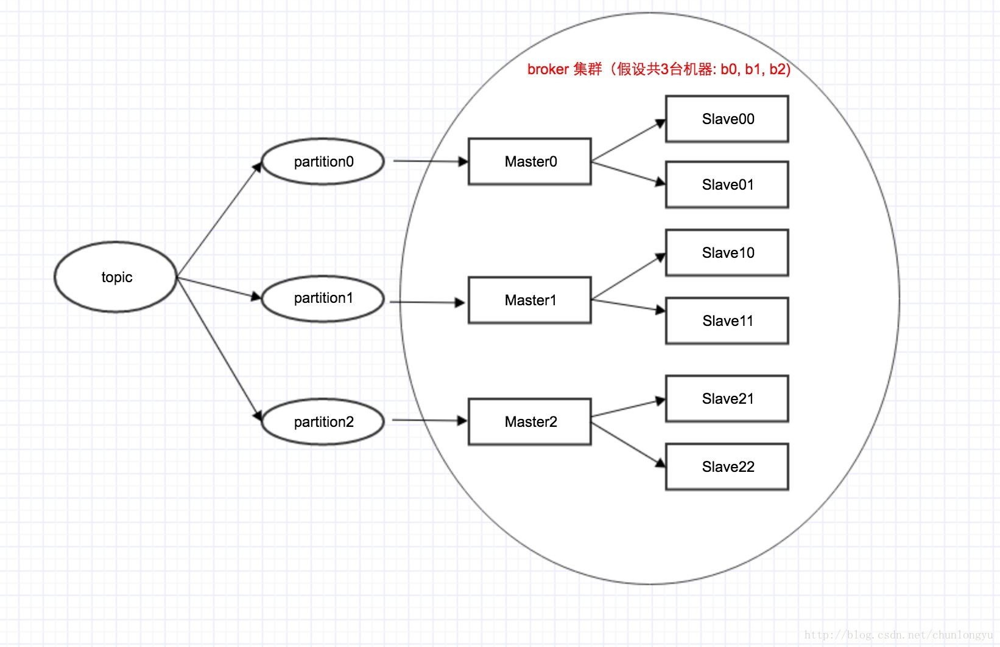

# 分布式消息队列RocketMQ与Kafka架构上的巨大差异之1 -- 为什么RocketMQ要去除ZK依赖？


[StackOverFlower](https://blog.csdn.net/weililansehudiefei) 2017-04-16 16:50:34  1784  收藏 2

分类专栏： [RocketMQ](https://blog.csdn.net/weililansehudiefei/category_6864887.html) 文章标签： [分布式](https://www.csdn.net/tags/MtjaMgzsODQ2OTMtYmxvZwO0O0OO0O0O.html) [RocketMQ](https://www.csdn.net/tags/MtTaEg0sMTA4NzYtYmxvZwO0O0OO0O0O.html) [zookeeper](https://www.csdn.net/tags/MtTaEgxsMDI5NTUtYmxvZwO0O0OO0O0O.html)

[RocketMQ](https://blog.csdn.net/weililansehudiefei/category_6864887.html)专栏收录该内容

4 篇文章0 订阅

订阅专栏

我们知道，在早期的RocketMQ版本中，是有依赖ZK的。而现在的版本中，是去掉了对ZK的依赖，转而使用自己开发的NameSrv。

并且这个NameSrv是无状态的，你可以随意的部署多台，其代码也非常简单，非常轻量。

那不禁要问了：ZooKeeper是业界用来管理集群的一个非常常用的中间件，比如Kafka就是依赖的ZK。那为什么RocketMQ要自己造轮子，自己做集群的管理呢？纯粹就是再做一个Zookeeper吗？

本篇试图通过一个[架构](http://lib.csdn.net/base/architecture)上的巨大差异，来阐述为什么RocketMQ可以去掉ZK。

# Kafka的架构拓扑图

我们知道，在Kafka中，是1个topic有多个partition，每个partition有1个master + 多个slave。对应如下图所示：


注意：这里只有3台机器(b0,b1,b2)，每台机器既是Master，也是Slave。具体来说，比如机器b0，对于partition0来说，它可能是Master；对应partition1来说，它可能又是Slave。

# RocketMQ的架构拓扑图

不同于Kafka里面，一台机器同时是Master和Slave。在RocketMQ里面，1台机器只能要么是Master，要么是Slave。这个在初始的机器配置里面，就定死了。其架构拓扑图如下：


在这里，RocketMQ里面queue这个概念，就对应Kafka里面partition。

有3个Master, 6个Slave，那对应到物理上面，就是3+6，得9台机器！！！而不是上面像Kafka一样，3台机器。

# Master/Slave/Broker概念上的差异

通过上面2张图，我们已经可以直观看出2者的巨大差异。反映到概念上，虽然2者都有Master/Slave/Broker这3个概念，但其含义是不一样的。

# Master/Slave概念差异

Kafka: Master/Slave是个逻辑概念，1台机器，同时具有Master角色和Slave角色。 
RocketMQ: Master/Slave是个物理概念，1台机器，只能是Master或者Slave。在集群初始配置的时候，指定死的。其中Master的broker id = 0，Slave的broker id > 0。

# Broker概念差异

Kafka: Broker是个物理概念，1个broker就对应1台机器。 
RocketMQ：Broker是个逻辑概念，1个broker = 1个master + 多个slave。所以才有master broker, slave broker这样的概念。

那这里，master和slave是如何配对的呢？ 答案是通过broker name。具有同1个broker name的master和slave进行配对。

具体到配置里面，如下：

```scala
//机器1的配置


brokerClusterName=DefaultCluster


brokerName=broker-a


brokerId=0


deleteWhen=04


fileReservedTime=48


brokerRole=ASYNC_MASTER


flushDiskType=ASYNC_FLUSH123456789123456789
//机器2的配置


brokerClusterName=DefaultCluster


brokerName=broker-a


brokerId=1


deleteWhen=04


fileReservedTime=48


brokerRole=SLAVE


flushDiskType=ASYNC_FLUSH1234567812345678
//机器3的配置


brokerClusterName=DefaultCluster


brokerName=broker-a


brokerId=2


deleteWhen=04


fileReservedTime=48


brokerRole=SLAVE


flushDiskType=ASYNC_FLUSH1234567812345678
```

这里机器1和机器2，机器3具有相同的brokerName（broker-a)，一个brokerId = 0，另2个brokerId > 0。所以机器1是Master，机器2, 3是Slave。

所以这里可以看出：RokcetMQ和Kafka关于这2对概念的定义，刚好是反过来的！Kafka是先有Broker，然后产生出Master/Slave；RokcetMQ是先定义Master/Slave，然后组合出Broker。

# 答案：为什么可以去ZK?

从上面对比可以看出，Kafka和RocketMQ在Master/Slave/Broker这个3个概念上的差异。

这个差异，也就影响到topic, partition这种逻辑概念和Master/Slave/Broker这些物理概念上的映射关系。具体来讲就是：

在Kafka里面，Maser/Slave是选举出来的！！！RocketMQ不需要选举！！！

在Kafka里面，Maser/Slave是选举出来的！！！RocketMQ不需要选举！！！

在Kafka里面，Maser/Slave是选举出来的！！！RocketMQ不需要选举！！！

重要的话说三篇。具体来说，在Kafka里面，Master/Slave的选举，有2步：第1步，先通过ZK在所有机器中，选举出一个KafkaController；第2步，再由这个Controller，决定每个partition的Master是谁，Slave是谁。

这里的Master/Slave是动态的，也就是说：当Master挂了之后，会有1个Slave切换成Master。

而在RocketMQ中，不需要选举，Master/Slave的角色也是固定的。当一个Master挂了之后，你可以写到其他Master上，但不会说一个Slave切换成Master。

这种简化，使得RocketMQ可以不依赖ZK就很好的管理Topic/queue和物理机器的映射关系了，也实现了高可用。

这里，也涉及到了我在上1篇里，所说的“消息顺序”的问题：在Kafka里面，一个partition必须与1个Master有严格映射关系，这个Master挂了，就要从其他Slave里面选举出一个Master；而在RocketMQ里面，这个限制放开了，一个queue对应的Master挂了，它会切到其他Master，而不是非要选举出来一个。

说到这，答案基本就知道了：RocketMQ不需要像Kafka那样有很重的选举逻辑，它把这个问题简化了。剩下的就是topic/queue的路由信息，那用个简单的NameServer就搞定了，很轻量，还无状态，可靠性也能得到很好保证。

# Topic的创建过程

下面从使用的角度，看看Kafka和RocketMQ在创建topic的时候，分别都需要指定什么参数？

从这些参数也可以看出，2者的topic, partition这种逻辑概念和物理机器之间的映射关系，有很大不同。

## RocketMQ 创建topic的命令

下面代码来自UpdateTopicSubCommand这个类，也就是RocketMq创建topic时，调用的类。这里有几个关键参数，其他参数我省略了： 
b: 
c: //b和c2选1，b是指定topic所在的机器，c是指定topic所在的cluster

topic: //这个是基本参数，没什么好讲的

readQueueNums/writeQueueNums: //队列个数。缺省2者相等，是8。关于这个readQueueNums/writeQueueNums，是RocketMQ特有的概念，后面再来详细分析。此处就认为他们2者相等，是同1个。

```vbnet
        Option opt = new Option("b", "brokerAddr", true, "create topic to which broker");


        opt.setRequired(false);


        options.addOption(opt);


 


        opt = new Option("c", "clusterName", true, "create topic to which cluster");


        opt.setRequired(false);


        options.addOption(opt);


 


        opt = new Option("t", "topic", true, "topic name");


        opt.setRequired(true);


        options.addOption(opt);


 


        opt = new Option("r", "readQueueNums", true, "set read queue nums");


        opt.setRequired(false);


        options.addOption(opt);


 


        opt = new Option("w", "writeQueueNums", true, "set write queue nums");


        opt.setRequired(false);


        options.addOption(opt);


 


    。。。123456789101112131415161718192021123456789101112131415161718192021
```

## Kafka创建topic的命令

跟RocketMQ相比，有2个同样的参数：1个是topic，一个是队列数目，也就是这里的–partitions。

```haskell
bin/kafka-topics.sh --create --zookeeper localhost:2181 --replication-factor 3 --partitions 1 --topic my-replicated-topic11
```

## 2者在创建topic时一个显著的不同

Kafka有一个参数replication-factor，也就是指定给1个Master配几个Slave?

RocketMQ有一个参数c，也就是clusterName，来指定这个cluster里面，所有的Master和Slave的配对（多个master, 多个slave) 对应同1个topic!!!

缺省情况下，所有的Master和Slave属于同1个集群，也就是上面的3台机器配置中的第1个参数：brokerClusterName=DefaultCluster。

结合上面的架构拓扑图，我们就可以看出： 
对于kafka来说，你指定topic，它的partition个数，它的master/slave配比，然后系统自动从所有机器中，为每个topic_partition分配1个master + 多个slave；

对于RokcetMQ来说，你指定topic，它的queue个数，它对应的cluster。然后系统自动建立这个cluster(多个master + 多个slave) 和你的topic之间的映射关系。