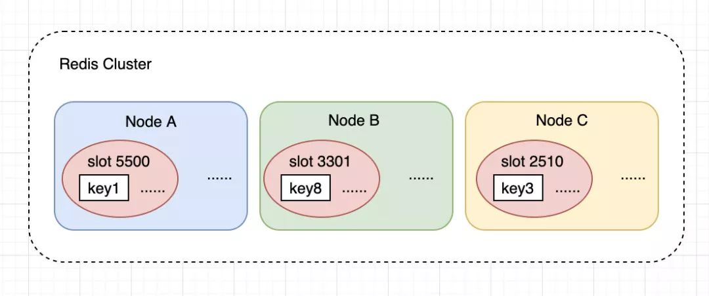

# [Redis Cluster 有哪些优势和限制？Redis Cluster优缺点，Redis Cluster 简介](https://tech.souyunku.com/?p=12239)

2019-12-17 00:04:25 分类：最新文章 阅读(531) 评论(0)

> 内容目录：

1、 简述 Redis Cluster 的 slot
2、 Redis Cluster 的主要优势
3、 Redis Cluster 限制
4、 hash tag 机制

## **1. 概述**

Redis Cluster 是 Redis 原生的数据分片实现，可以自动在多个节点上分布数据，不需要依赖任何外部的工具。

Redis Cluster 中所有 key 会被分派到 `16384` 个 `slot`（hash 槽）中，这些 slot 又会被指派到多个 Redis 节点上。



一个 key 会映射到某个 slot，算法：

```
HASH_SLOT = CRC16(key) mod 16384
```

这个 slot 的机制会给我们带来一点麻烦，后面会讲到。

## **2. 优势**

- 高性能

Redis Cluster 的性能与单节点部署是同级别的。

- 高可用

Redis Cluster 支持标准的 `master-replica` 配置来保障高可用和高可靠。

Redis Cluster 也实现了一个类似 Raft 的共识方式，来保障整个集群的可用性。

- 易扩展

向 Redis Cluster 中添加新节点，或者移除节点，都是透明的，不需要停机。

水平、垂直方向都非常容易扩展。

- 原生

部署 Redis Cluster 不需要其他的代理或者工具，而且 Redis Cluster 和单机 Redis 几乎完全兼容。

## **3. 限制**

### **3.1 需要客户端的支持**

客户端需要修改，以便支持 Redis Cluster。

虽然 Redis Cluster 已经发布有几年时间了，但仍然有些客户端是不支持的，所以需要到 Redis 官网上去查询一下。

### **3.2 只支持一个数据库**

不像单机Redis，Redis Cluster 只支持一个数据库（database 0），`select` 命令就不能用了，但实际也很少有人使用多数据库，所以这个限制并没什么影响。

### **3.3 Multi-Key 操作受限**

Multi-Key（多key）是什么意思？

某些情况是多 key 的操作，例如：

- SUNION，这类命令会操作多个key
- 事务，会在一个事务中操作多个key
- LUA脚本，也会操作多个key

这类情况都需要特别注意，因为：

> Redis Cluster 要求，只有这些 key 都在同一个 slot 时才能执行。

例如，有2个key，key1 和 key2。

key1 是映射到 5500 这个 slot 上，存储在 Node A。

key2 是映射到 5501 这个 slot 上，存储在 Node B。

那么就不能对 key1 和 key2 做事务操作。

## **4. Multi-Key 限制的处理**

对于多key场景，需要做好数据空间的设计，Redis Cluster 提供了一个 `hash tag` 的机制，可以让我们把一组 key 映射到同一个 slot。

例如：`user1000.following` 这个 key 保存用户 user1000 关注的用户；`user1000.followers` 保存用户 user1000 的粉丝。

这两个 key 有一个共同的部分 `user1000`，可以指定对这个共同的部分做 slot 映射计算，这样他们就可以在同一个槽中了。

使用方式：

```
{user1000}.following 和 {user1000}.followers
```

就是把共同的部分使用 `{ }` 包起来，计算 slot 值时，如果发现了花括号，就会只对其中的部分进行计算。

## **5. 小结**

Multi-Key 这一点是 Redis Cluster 对于我们日常使用中最大的限制，一定要注意，如果多key不在同一个 slot 中就会报错，例如：

```
(error) CROSSSLOT Keys in request don't hash to the same slot
```

需要使用 `hash tag` 设计好 key 的空间。

文章永久链接：https://tech.souyunku.com/?p=12239