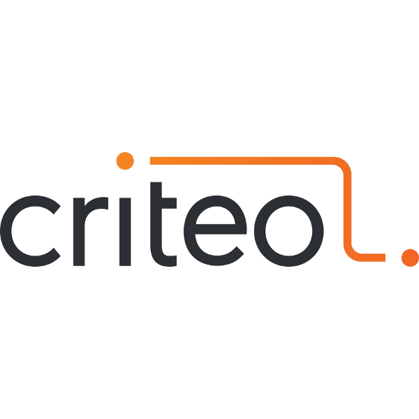
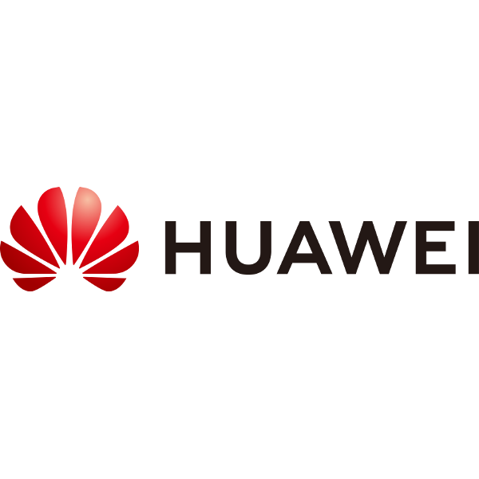
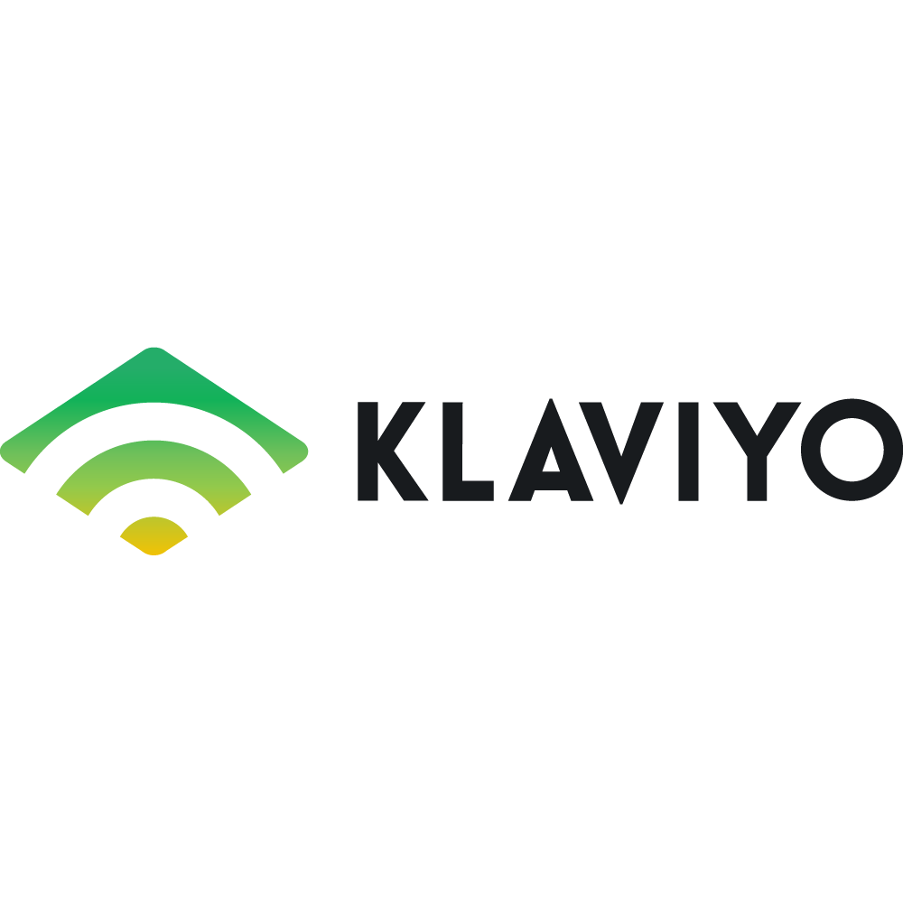
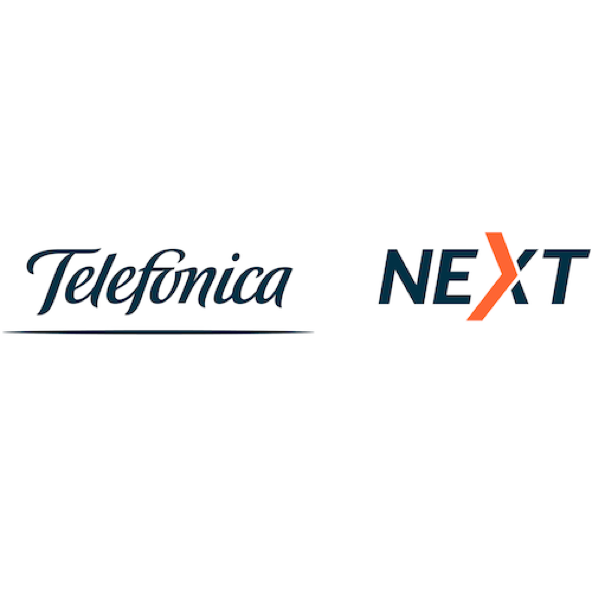

# Flink 用户

------

Apache Flink 为全球许多公司和企业的关键业务提供支持。在这个页面上，我们展示了一些著名的 Flink 用户，他们在生产中运行着有意思的用例，并提供了展示更详细信息的链接。

在项目的 wiki 页面中有一个 [ 谁在使用 Flink ](https://cwiki.apache.org/confluence/display/FLINK/Powered+by+Flink)的页面，展示了更多的 Flink 用户。请注意，该列表*并不全面*。我们只添加明确要求列出的用户。

如果你希望加入此页面，请通过 [Flink 用户邮件列表](https://flink.apache.org/zh/community.html#mailing-lists)告诉我们。

全球最大的零售商阿里巴巴（Alibaba）使用 Flink 的分支版本 Blink 来优化实时搜索排名。

[ 阅读更多有关 Flink 在阿里巴巴扮演角色的信息](https://ververica.com/blog/blink-flink-alibaba-search)

Amazon Kinesis Data Analytics 是一种用于流处理完全托管的云服务，它部分地使用 Apache Flink 来增加其 Java 应用程序功能。

BetterCloud 是一个多 SaaS 管理平台，它使用 Flink 从 SaaS 应用程序活动中获取近乎实时的智能。

[ 请参阅 BetterCloud 在 Flink Forward SF 2017 上的分享](https://www.youtube.com/watch?v=_yHds9SvMfE&list=PLDX4T_cnKjD2UC6wJr_wRbIvtlMtkc-n2&index=10)

Bouygues Telecom 正在运行由 Flink 提供支持的 30 个生产应用程序，每天处理 100 亿个原始事件。

[ 请参阅 Bouygues Telecom 在 Flink Forward 2016 上的分享](http://2016.flink-forward.org/kb_sessions/a-brief-history-of-time-with-apache-flink-real-time-monitoring-and-analysis-with-flink-kafka-hb/)

财富 500 强金融服务公司 Capital One 使用 Flink 进行实时活动监控和报警。

[ 了解 Capital One 的欺诈检测用例](https://www.slideshare.net/FlinkForward/flink-forward-san-francisco-2018-andrew-gao-jeff-sharpe-finding-bad-acorns)

康卡斯特（Comcast）是一家全球媒体和技术公司，它使用 Flink 来实现机器学习模型和近实时事件流处理。

[ 了解 Flink 在康卡斯特的应用](https://www.youtube.com/watch?v=3NlSPKLbGO4&list=PLDX4T_cnKjD1ida8K59YPR3lfWOq6IhV_)

Criteo 是开放互联网的广告平台，使用 Flink 进行实时收入监控和近实时事件处理。

[ 了解 Criteo 的 Flink 用例](https://medium.com/criteo-labs/criteo-streaming-flink-31816c08da50)

滴滴出行是全球卓越的移动出行平台，使用 Apache Flink支持了实时监控、实时特征抽取、实时ETL等业务。

[ 了解滴滴如何使用 Flink 的。](https://blog.didiyun.com/index.php/2018/12/05/realtime-compute/)

Drivetribe是由前“Top Gear”主持人创建的数字社区，它使用 Flink 作为指标和内容推荐。

[ 了解 Flink 在 Drivetribe stack 的应用](https://ververica.com/blog/drivetribe-cqrs-apache-flink/)

Ebay 的监控平台由 Flink 提供支持，可在指标和日志流上计算上千条自定义报警规则。

[ 了解更多 Flink 在 Ebay 的信息](https://vimeo.com/265025956/c7d5576622)

爱立信使用 Flink 构建了一个实时异常检测器，通过大型基础设施进行机器学习。

[ 阅读关于O'Reilly想法的详细概述](https://www.oreilly.com/ideas/applying-the-kappa-architecture-in-the-telco-industry)

Gojek 是一个超级 App: 拥有超过20种服务，并使用 Flink 为其自助平台提供支持，从而实现跨功能的数据驱动决策。

[ 更多信息请访问 Gojek 工程师博客](https://blog.gojekengineering.com/how-our-diy-platform-creates-value-through-network-effects-76e1e8bad0db)

华为是全球领先的 ICT 基础设施和智能设备供应商。华为云提供基于 Flink 的云服务。

[ 了解Flink 如何为云服务提供动力](https://www.slideshare.net/FlinkForward/flink-forward-san-francisco-2018-jinkui-shi-and-radu-tudoran-flink-realtime-analysis-in-cloudstream-service-of-huawei-cloud)

King，Candy Crush Saga的创建者，使用 Flink 为数据科学团队提供实时分析仪表板。

[ 阅读 King 的 Flink 实现](https://www.youtube.com/watch?v=17tUR4TsvpM)

Klaviyo使用 Apache Flink 扩展其实时分析系统，该系统每秒对超过一百万个事件进行重复数据删除和聚合。

[ 阅读 Klaviyo 的实时分析](https://klaviyo.tech/tagged/counting)

Lyft 使用 Flink 作为其流媒体平台的处理引擎，例如为机器学习持续生成特征。

[ 阅读更多关于 Lyft 的流媒体](https://www.slideshare.net/SeattleApacheFlinkMeetup/streaminglyft-greg-fee-seattle-apache-flink-meetup-104398613)

快手是中国领先的短视频分享 App，使用了 Apache Flink 搭建了一个实时监控平台，监控短视频和直播的质量。

[ 阅读 Flink 在快手的应用实践](https://mp.weixin.qq.com/s/BghNofoU6cPRn7XfdHR83w)

MediaMath 是一家程序化营销公司，它使用 Flink 为其实时报告基础架构提供支持。

[ 请参阅 MediaMath 在 Flink Forward SF 2017 上的分享](https://www.youtube.com/watch?v=mSLesPzWplA&index=13&list=PLDX4T_cnKjD2UC6wJr_wRbIvtlMtkc-n2)

Mux 是一家流媒体视频提供商的分析公司，它使用 Flink 进行实时异常检测和报警。

[ 详细了解 Mux 如何使用 Flink](https://mux.com/blog/discovering-anomalies-in-real-time-with-apache-flink/)

OPPO, 作为中国最大的手机厂商之一，利用 Apache Flink 构建了实时数据仓库，用于即时分析运营活动效果及用户短期兴趣。

[ 了解 OPPO 如何使用 Flink](https://mp.weixin.qq.com/s/DPLJA8Q2gDXLZF17FOcczw)

全球第二大在线零售商奥托集团（Otto Group）使用 Flink 进行商业智能流处理。

[ 请参阅 Otto 在 Flink Forward 2016 上的分享](http://2016.flink-forward.org/kb_sessions/flinkspector-taming-the-squirrel/)

OVH 使用 Flink 开发面向流的应用程序，比如实时商业智能系统或警报系统。

[ 详细了解 OVH 如何使用 Flink](https://www.ovh.com/fr/blog/handling-ovhs-alerts-with-apache-flink/)

Pinterest 使用基于 Apache Flink 的实时实验分析平台每天进行上千次的实验。

[ 阅读更多在 Pinterest 有关实时实验分析的信息](https://medium.com/pinterest-engineering/real-time-experiment-analytics-at-pinterest-using-apache-flink-841c8df98dc2)

Razorpay 是印度最大的支付门户网站之一，使用 Flink 构建了自己的内部平台 Mitra，用以扩展 AI 特征生成和实时模型服务。

[ 阅读更多在 Razorpay 有关 Flink 数据分析的信息](https://medium.com/razorpay-unfiltered/data-science-at-scale-using-apache-flink-982cb18848b)

ResearchGate 是科学家的社交网络，它使用 Flink 进行网络分析和近似重复检测。

[ 请参阅 ResearchGate 在 Flink Forward 2016 上的分享](http://2016.flink-forward.org/kb_sessions/joining-infinity-windowless-stream-processing-with-flink/)

三星（SK telecom）是韩国最大的无线运营商。它在很多应用中使用了 Flink，包括智能工厂和移动应用程序。

[ 了解其中一个 SK telecom 的使用案例。](https://www.youtube.com/watch?v=wPQWFy5JENw)

Telefónica NEXT 的 TÜV 认证数据匿名平台由 Flink 提供支持。

[ 了解更多关于 Telefónica NEXT 的信息](https://2016.flink-forward.org/index.html%3Fp=592.html)

作为最大的互联网公司之一，腾讯利用 Apache Flink 构建了一个内部平台，以提高开发和操作实时应用程序的效率。

[ 阅读有关腾讯平台的更多信息。](https://data.qq.com/article?id=3853)

Uber 在 Apache Flink 上构建了基于 SQL 的开源流媒体分析平台 AthenaX。

[ 更多信息请访问Uber工程博客](https://eng.uber.com/athenax/)

Vip，中国最大的品牌特卖网站之一，应用Flink实时的将数据流ETL到Hive中用于数据处理和分析.

[ 详细了解Vip如何使用 Flink](https://yq.aliyun.com/articles/652548)

小米，作为中国最大的专注于硬件与软件开发的公司之一，利用 Flink 构建了一个内部平台，以提高开发运维实时应用程序的效率，并用于实时推荐等场景。

[ 详细了解小米如何使用 Flink 的。](https://files.alicdn.com/tpsservice/d77d3ed3f2709790f0d84f4ec279a486.pdf)

Yelp 利用 Flink 为其数据连接器生态系统和流处理基础架构提供支持。

[ 请参阅 Flink Forward 上的演讲](https://ververica.com/flink-forward/resources/powering-yelps-data-pipeline-infrastructure-with-apache-flink)

Zalando 是欧洲最大的电子商务公司之一，它使用 Flink 进行实时过程监控和 ETL。

[ 更多信息请访问 Zalando 技术博客](https://jobs.zalando.com/tech/blog/complex-event-generation-for-business-process-monitoring-using-apache-flink)