# OPPO数据中台之基石：基于Flink SQL构建实数据仓库

原创 张俊 [AI前线](javascript:void(0);) *2019-05-13 19:15*

作者 | 张俊

编辑 | Vincent

**AI 前线导读：**本文整理自 2019 年 4 月 13 日在深圳举行的 Flink Meetup 会议，分享嘉宾张俊，目前担任 OPPO 大数据平台研发负责人，也是 Apache Flink contributor。本文主要内容如下：

\- OPPO 实时数仓的演进思路；

\- 基于 Flink SQL 的扩展工作；

\- 构建实时数仓的应用案例；

\- 未来工作的思考和展望。

**更多优质内容请关注微信公众号“AI 前线”（ID：ai-front）**

一.OPPO 实时数仓的演进思路

1.1.OPPO 业务与数据规模

大家都知道 OPPO 是做智能手机的，但并不知道 OPPO 与互联网以及大数据有什么关系，下图概要介绍了 OPPO 的业务与数据情况：

OPPO 作为手机厂商，基于 Android 定制了自己的 ColorOS 系统，当前日活跃用户超过 2 亿。围绕 ColorOS，OPPO 构建了很多互联网应用，比如应用商店、浏览器、信息流等。在运营这些互联网应用的过程中，OPPO 积累了大量的数据，上图右边是整体数据规模的演进：从 2012 年开始每年都是 2~3 倍的增长速度，截至目前总数据量已经超过 100PB，日增数据量超过 200TB。

要支撑这么大的一个数据量，OPPO 研发出一整套的数据系统与服务，并逐渐形成了自己的数据中台体系。

1.2.OPPO 数据中台

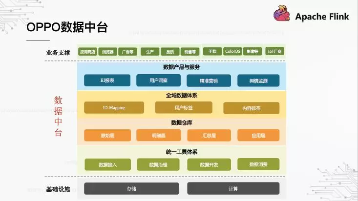

今年大家都在谈数据中台，OPPO 是如何理解数据中台的呢？我们把它分成了 4 个层次：

- 最下层是统一工具体系，涵盖了"接入 - 治理 - 开发 - 消费"全数据链路；
- 基于工具体系之上构建了数据仓库，划分成"原始层 - 明细层 - 汇总层 - 应用层"，这也是经典的数仓架构；
- 再往上是全域的数据体系，什么是全域呢？就是把公司所有的业务数据都打通，形成统一的数据资产，比如 ID-Mapping、用户标签等；
- 最终，数据要能被业务用起来，需要场景驱动的数据产品与服务。

以上就是 OPPO 数据中台的整个体系，而数据仓库在其中处于非常基础与核心的位置。

1.3. 构建 OPPO 离线数仓

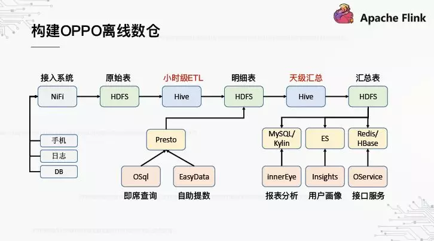

过往 2、3 年，我们的重点聚焦在离线数仓的构建。上图大致描述了整个构建过程：首先，数据来源基本是手机、日志文件以及 DB 数据库，我们基于 Apache NiFi 打造了高可用、高吞吐的接入系统，将数据统一落入 HDFS，形成原始层；紧接着，基于 Hive 的小时级 ETL 与天级汇总 Hive 任务，分别负责计算生成明细层与汇总层；最后，应用层是基于 OPPO 内部研发的数据产品，主要是报表分析、用户画像以及接口服务。此外，中间的明细层还支持基于 Presto 的即席查询与自助提数。

伴随着离线数仓的逐步完善，业务对实时数仓的诉求也愈发强烈。

1.4. 数仓实时化的诉求

对于数仓实时化的诉求，大家通常都是从业务视角来看，但其实站在平台的角度，实时化也能带来切实的好处。首先，从业务侧来看，报表、标签、接口等都会有实时的应用场景，分别参见上图左边的几个案例；其次，对平台侧来说，我们可以从三个案例来看：第一，OPPO 大量的批量任务都是从 0 点开始启动，都是通过 T+1 的方式去做数据处理，这会导致计算负载集中爆发，对集群的压力很大；第二，标签导入也属于一种 T+1 批量任务，每次全量导入都会耗费很长的时间；第三，数据质量的监控也必须是 T+1 的，导致没办法及时发现数据的一些问题。

既然业务侧和平台侧都有实时化的这个诉求，那 OPPO 是如何来构建自己的实时数仓呢？

1.5. 离线到实时的平滑迁移

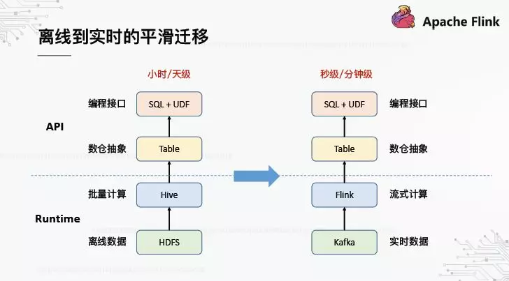

无论是一个平台还是一个系统，都离不开上下两个层次的构成：上层是 API，是面向用户的编程抽象与接口；下层是 Runtime，是面向内核的执行引擎。我们希望从离线到实时的迁移是平滑的，是什么意思呢？从 API 这层来看，数仓的抽象是 Table、编程接口是 SQL+UDF，离线数仓时代用户已经习惯了这样的 API，迁移到实时数仓后最好也能保持一致。而从 Runtime 这层来看，计算引擎从 Hive 演进到了 Flink，存储引擎从 HDFS 演进到了 Kafka。

基于以上的思路，只需要把之前提到的离线数仓 pipeline 改造下，就得到了实时数仓 pipeline。

1.6. 构建 OPPO 实时数仓

从上图可以看到，整个 pipeline 与离线数仓基本相似，只是把 Hive 替换为 Flink，把 HDFS 替换为 Kafka。从总体流程来看，基本模型是不变的，还是由原始层、明细层、汇总层、应用层的级联计算来构成。

因此，这里的核心问题是如何基于 Flink 构建出这个 pipeline，下面就介绍下我们基于 Flink SQL 所做的一些工作。

二. 基于 Flink SQL 的扩展工作

2.1.Why Flink SQL

首先，为什么要用 Flink SQL? 下图展示了 Flink 框架的基本结构，最下面是 Runtime，这个执行引擎我们认为最核心的优势是四个：第一，低延迟，高吞吐；第二，端到端的 Exactly-once；第三，可容错的状态管理；第四，Window & Event time 的支持。基于 Runtime 抽象出 3 个层次的 API，SQL 处于最上层。

Flink SQL API 有哪些优势呢？我们也从四个方面去看：第一，支持 ANSI SQL 的标准；第二，支持丰富的数据类型与内置函数，包括常见的算术运算与统计聚合；第三，可自定义 Source/Sink，基于此可以灵活地扩展上下游；第四，批流统一，同样的 SQL，既可以跑离线也可以跑实时。

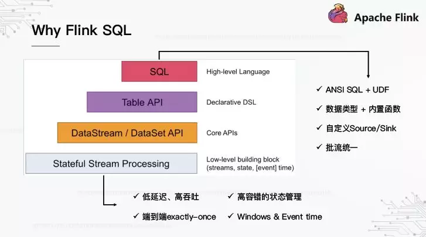

那么，基于 Flink SQL API 如何编程呢？下面是一个简单的演示：

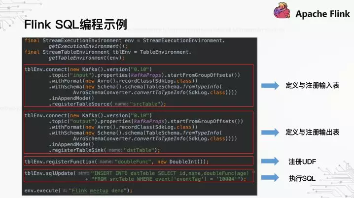

首先是定义与注册输入 / 输出表，这里创建了 2 张 Kakfa 的表，指定 kafka 版本是什么、对应哪个 topic；接下来是注册 UDF，篇幅原因这里没有列出 UDF 的定义；最后是才是执行真正的 SQL。可以看到，为了执行 SQL，需要做这么多的编码工作，这并不是我们希望暴露给用户的接口。

2.2. 基于 WEB 的开发 IDE

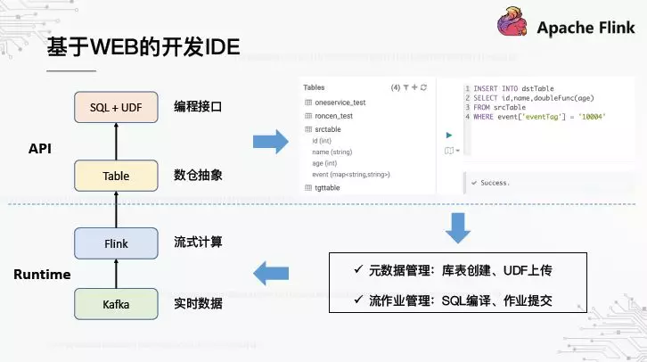

前面提到过，数仓的抽象是 Table，编程接口是 SQL+UDF。对于用户来说，平台提供的编程界面应该是类似上图的那种，有用过 HUE 做交互查询的应该很熟悉。左边的菜单是 Table 列表，右边是 SQL 编辑器，可以在上面直接写 SQL，然后提交执行。要实现这样一种交互方式，Flink SQL 默认是无法实现的，中间存在 gap，总结下来就 2 点：第一，元数据的管理，怎么去创建库表，怎么去上传 UDF，使得之后在 SQL 中可直接引用；第二，SQL 作业的管理，怎么去编译 SQL，怎么去提交作业。

在技术调研过程中，我们发现了 Uber 在 2017 年开源的 AthenaX 框架。

2.3.AthenaX：基于 REST 的 SQL 管理器

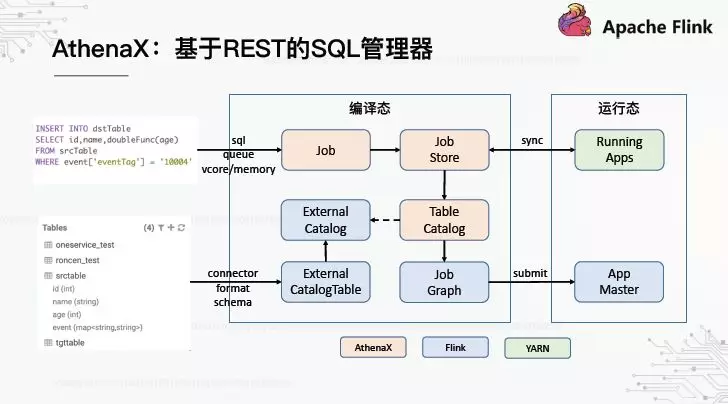

AthenaX 可以看作是一个基于 REST 的 SQL 管理器，它是怎么实现 SQL 作业与元数据管理的呢？

- 对于 SQL 作业提交，AthenaX 中有一个 Job 的抽象，封装了要执行的 SQL 以及作业资源等信息。所有的 Job 由一个 JobStore 来托管，它定期跟 YARN 当中处于 Running 状态的 App 做一个匹配。如果不一致，就会向 YARN 提交对应的 Job。
- 对于元数据管理，核心的问题是如何将外部创建的库表注入 Flink，使得 SQL 中可以识别到。实际上，Flink 本身就预留了与外部元数据对接的能力，分别提供了 ExternalCatalog 和 ExternalCatalogTable 这两个抽象。AthenaX 在此基础上再封装出一个 TableCatalog，在接口层面做了一定的扩展。在提交 SQL 作业的阶段，AthenaX 会自动将 TableCatalog 注册到 Flink，再调用 Flink SQL 的接口将 SQL 编译为 Flink 的可执行单元 JobGraph，并最终提交到 YARN 生成新的 App。

AthenaX 虽然定义好了 TableCatalog 接口，但并没有提供可直接使用的实现。那么，我们怎么来实现，以便对接到我们已有的元数据系统呢？

2.4.Flink SQL 注册库表的过程

首先，我们得搞清楚 Flink SQL 内部是如何注册库表的。整个过程涉及到三个基本的抽象：TableDescriptor、TableFactory 以及 TableEnvironment。

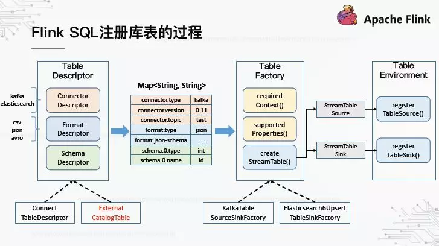

TableDescriptor 顾名思义，是对表的描述，它由三个子描述符构成：第一是 Connector，描述数据的来源，比如 Kafka、ES 等；第二是 Format，描述数据的格式，比如 csv、json、avro 等；第三是 Schema，描述每个字段的名称与类型。TableDescriptor 有两个基本的实现——ConnectTableDescriptor 用于描述内部表，也就是编程方式创建的表；ExternalCatalogTable 用于描述外部表。

有了 TableDescriptor，接下来需要 TableFactory 根据描述信息来实例化 Table。不同的描述信息需要不同的 TableFactory 来处理，Flink 如何找到匹配的 TableFactory 实现呢？实际上，为了保证框架的可扩展性，Flink 采用了 Java SPI 机制来加载所有声明过的 TableFactory，通过遍历的方式去寻找哪个 TableFactory 是匹配该 TableDescriptor 的。TableDescriptor 在传递给 TableFactory 前，被转换成一个 map，所有的描述信息都用 key-value 形式来表达。TableFactory 定义了两个用于过滤匹配的方法——一个是 requiredContext()，用于检测某些特定 key 的 value 是否匹配，比如 connector.type 是否为 kakfa；另一个是 supportedProperties()，用于检测 key 是否能识别，如果出现不识别的 key，说明无法匹配。

匹配到了正确的 TableFactory，接下来就是创建真正的 Table，然后将其通过 TableEnvironment 注册。最终注册成功的 Table，才能在 SQL 中引用。

2.5.Flink SQL 对接外部数据源

搞清楚了 Flink SQL 注册库表的过程，给我们带来这样一个思路：如果外部元数据创建的表也能被转换成 TableFactory 可识别的 map，那么就能被无缝地注册到 TableEnvironment。基于这个思路，我们实现了 Flink SQL 与已有元数据中心的对接，大致过程参见下图：

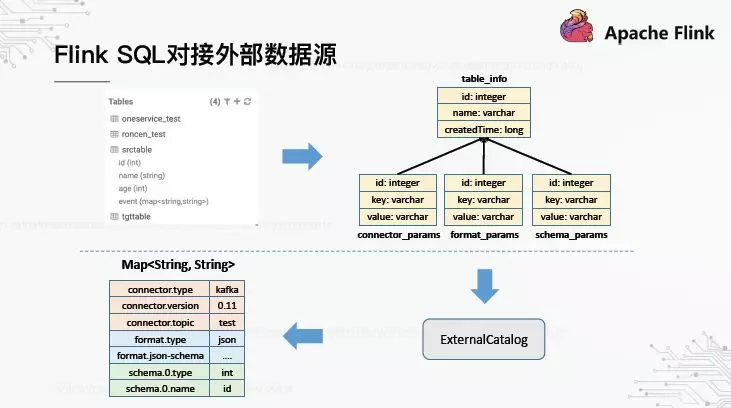

通过元数据中心创建的表，都会将元数据信息存储到 MySQL，我们用一张表来记录 Table 的基本信息，然后另外三张表分别记录 Connector、Format、Schema 转换成 key-value 后的描述信息。之所以拆开成三张表，是为了能够能独立的更新这三种描述信息。接下来是定制实现的 ExternalCatalog，能够读取 MySQL 这四张表，并转换成 map 结构。

2.6. 实时表 - 维表关联

到目前为止，我们的平台已经具备了元数据管理与 SQL 作业管理的能力，但是要真正开放给用户使用，还有一点基本特性存在缺失。通过我们去构建数仓，星型模型是无法避免的。这里有一个比较简单的案例：中间的事实表记录了广告点击流，周边是关于用户、广告、产品、渠道的维度表。

假定我们有一个 SQL 分析，需要将点击流表与用户维表进行关联，这个目前在 Flink SQL 中应该怎么来实现？我们有两种实现方式，一个基于 UDF，一个基于 SQL 转换，下面分别展开来讲一下。

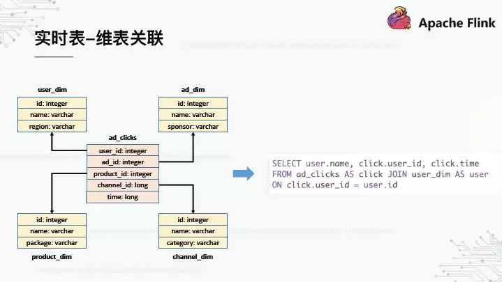

2.7. 基于 UDF 的维表关联

首先是基于 UDF 的实现，需要用户将原始 SQL 改写为带 UDF 调用的 SQL，这里是 userDimFunc，上图右边是它的代码实现。UserDimFunc 继承了 Flink SQL 抽象的 TableFunction，它是其中一种 UDF 类型，可以将任意一行数据转换成一行或多行数据。为了实现维表关联，在 UDF 初始化时需要从 MySQL 全量加载维表的数据，缓存在内存 cache 中。后续对每行数据的处理，TableFunction 会调用 eval() 方法，在 eval() 中根据 user_id 去查找 cache，从而实现关联。当然，这里是假定维表数据比较小，如果数据量很大，不适合全量的加载与缓存，这里不做展开了。

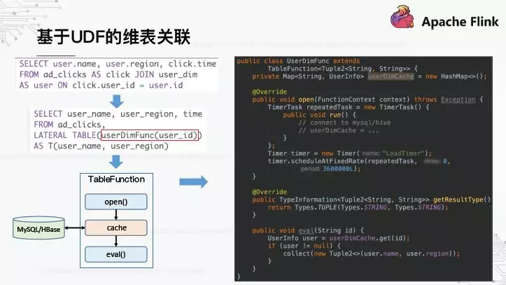

基于 UDF 的实现，对用户和平台来说都不太友好：用户需要写奇怪的 SQL 语句，比如图中的 LATERAL TABLE；平台需要为每个关联场景定制特定的 UDF，维护成本太高。有没有更好的方式呢？下面我们来看看基于 SQL 转换的实现。

2.8. 基于 SQL 转换的维表关联

我们希望解决基于 UDF 实现所带来的问题，用户不需要改写原始 SQL，平台不需要开发很多 UDF。有一种思路是，是否可以在 SQL 交给 Flink 编译之前，加一层 SQL 的解析与改写，自动实现维表的关联？经过一定的技术调研与 POC，我们发现是行得通的，所以称之为基于 SQL 转换的实现。下面将该思路展开解释下。

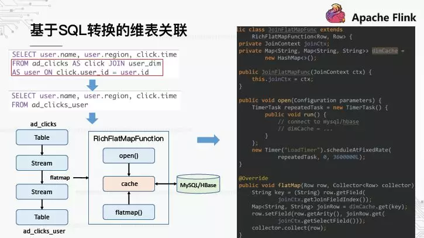

首先，增加的 SQL 解析是为了识别 SQL 中是否存在预先定义的维度表，比如上图中的 user_dim。一旦识别到维表，将触发 SQL 改写的流程，将红框标注的 join 语句改写成新的 Table，这个 Table 怎么得到呢？我们知道，流计算领域近年来发展出“流表二象性”的理念，Flink 也是该理念的践行者。这意味着，在 Flink 中 Stream 与 Table 之间是可以相互转换的。我们把 ad_clicks 对应的 Table 转换成 Stream，再调用 flatmap 形成另一个 Stream，最后再转换回 Table，就得到了 ad_clicks_user。最后的问题是，flatmap 是如何实现维表关联的？

Flink 中对于 Stream 的 flatmap 操作，实际上是执行一个 RichFlatmapFunciton，每来一行数据就调用其 flatmap() 方法做转换。那么，我们可以定制一个 RichFlatmapFunction，来实现维表数据的加载、缓存、查找以及关联，功能与基于 UDF 的 TableFunction 实现类似。

既然 RichFlatmapFunciton 的实现逻辑与 TableFunction 相似，那为什么相比基于 UDF 的方式，这种实现能更加通用呢？核心的点在于多了一层 SQL 解析，可以将维表的信息获取出来（比如维表名、关联字段、select 字段等），再封装成 JoinContext 传递给 RichFlatmapFunciton，使得的表达能力就具备通用性了。

三. 构建实时数仓的应用案例

下面分享几个典型的应用案例，都是在我们的平台上用 Flink SQL 来实现的。

3.1. 实时 ETL 拆分

这里是一个典型的实时 ETL 链路，从大表中拆分出各业务对应的小表：

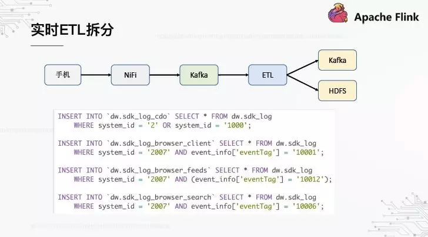

OPPO 的最大数据来源是手机端埋点，从手机 APP 过来的数据有一个特点，所有的数据是通过统一的几个通道上报过来。因为不可能每一次业务有新的埋点，都要去升级客户端，去增加新的通道。比如我们有个 sdk_log 通道，所有 APP 应用的埋点都往这个通道上报数据，导致这个通道对应的原始层表巨大，一天几十个 TB。但实际上，每个业务只关心它自身的那部分数据，这就要求我们在原始层进行 ETL 拆分。

这个 SQL 逻辑比较简单，无非是根据某些业务字段做筛选，插入到不同的业务表中去。它的特点是，多行 SQL 最终合并成一个 SQL 提交给 Flink 执行。大家担心的是，包含了 4 个 SQL，会不会对同一份数据重复读取 4 次？其实，在 Flink 编译 SQL 的阶段是会做一些优化的，因为最终指向的是同一个 kafka topic，所以只会读取 1 次数据。

另外，同样的 Flink SQL，我们同时用于离线与实时数仓的 ETL 拆分，分别落入 HDFS 与 Kafka。Flink 中本身支持写入 HDFS 的 Sink，比如 RollingFileSink。

3.2. 实时指标统计

这里是一个典型的计算信息流 CTR 的这个案例，分别计算一定时间段内的曝光与点击次数，相除得到点击率导入 Mysql，然后通过我们内部的报表系统来可视化。这个 SQL 的特点是它用到了窗口 (Tumbling Window) 以及子查询。

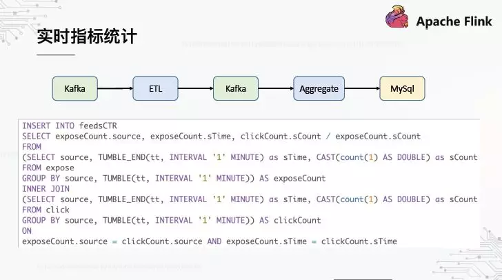

3.3. 实时标签导入

这里是一个实时标签导入的案例，手机端实时感知到当前用户的经纬度，转换成具体 POI 后导入 ES，最终在标签系统上做用户定向。

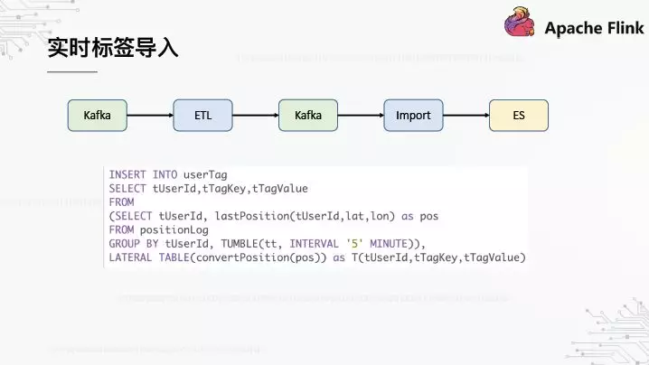

这个 SQL 的特点是用了 AggregateFunction，在 5 分钟的窗口内，我们只关心用户最新一次上报的经纬度。AggregateFunction 是一种 UDF 类型，通常是用于聚合指标的统计，比如计算 sum 或者 average。在这个示例中，由于我们只关心最新的经纬度，所以每次都替换老的数据即可。

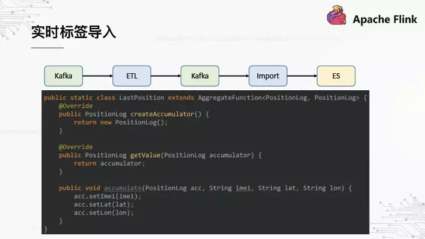

四. 未来工作的思考和展望

最后，给大家分享一下关于未来工作，我们的一些思考与规划，还不是太成熟，抛出来和大家探讨一下。

4.1. 端到端的实时流处理

什么是端到端？一端是采集到的原始数据，另一端是报表 / 标签 / 接口这些对数据的呈现与应用，连接两端的是中间实时流。当前我们基于 SQL 的实时流处理，源表是 Kafka，目标表也是 Kafka，统一经过 Kafka 后再导入到 Druid/ES/HBase。这样设计的目的是提高整体流程的稳定性与可用性：首先，kafka 作为下游系统的缓冲，可以避免下游系统的异常影响实时流的计算（一个系统保持稳定，比起多个系统同时稳定，概率上更高点）；其次，kafka 到 kafka 的实时流，exactly-once 语义是比较成熟的，一致性上有保证。

然后，上述的端到端其实是由割裂的三个步骤来完成的，每一步可能需要由不同角色人去负责处理：数据处理需要数据开发人员，数据导入需要引擎开发人员，数据资产化需要产品开发人员。

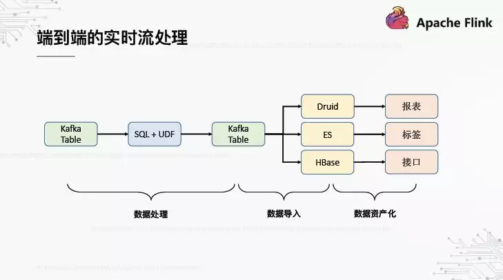

我们的平台能否把端到端给自动化起来，只需要一次 SQL 提交就能打通处理、导入、资产化这三步？在这个思路下，数据开发中看到的不再是 Kafka Table，而应该是面向场景的展示表 / 标签表 / 接口表。比如对于展示表，创建表的时候只要指定维度、指标等字段，平台会将实时流结果数据从 Kafka 自动导入 Druid，再在报表系统自动导入 Druid 数据源，甚至自动生成报表模板。

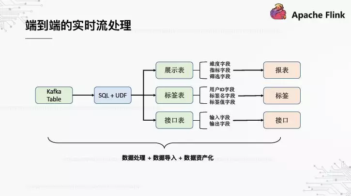

4.2. 实时流的血缘分析

关于血缘分析，做过离线数仓的朋友都很清楚它的重要性，它在数据治理中都起着不可或缺的关键作用。对于实时数仓来说也莫不如此。我们希望构建端到端的血缘关系，从采集系统的接入通道开始，到中间流经的实时表与实时作业，再到消费数据的产品，都能很清晰地展现出来。基于血缘关系的分析，我们才能评估数据的应用价值，核算数据的计算成本。

4.3. 离线 - 实时数仓一体化

最后提一个方向是离线实时数仓的一体化。我们认为短期内，实时数仓无法替代离线数仓，两者并存是新常态。在离线数仓时代，我们积累的工具体系，如何去适配实时数仓，如何实现离线与实时数仓的一体化管理？理论上来讲，它们的数据来源是一致的，上层抽象也都是 Table 与 SQL，但本质上也有不同的点，比如时间粒度以及计算模式。对于数据工具与产品来说，需要做哪些改造来实现完全的一体化，这也是我们在探索和思考的。

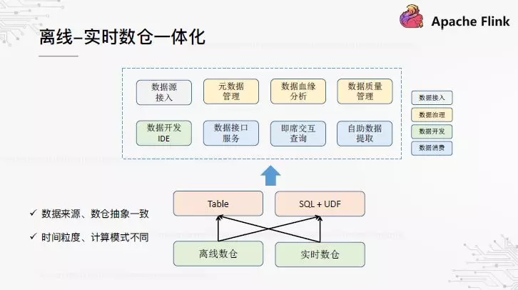