快手目前集群规模有 1500 台左右，作业数量大约是 500 左右，日处理条目数总共有 1.7 万亿，峰值处理条目数大约是 3.7 千万。集群部署都是 On Yarn 模式，分为离线集群和实时集群两类集群，其中离线集群混合部署，机器通过标签进行物理隔离，实时集群是 Flink 专用集群，针对隔离性、稳定性要求极高的业务部署。

二．快手 Flink 技术演进

快手 Flink 技术演进主要分为三部分：

1. 基于特定场景优化，包括 Interval Join 场景优化；
2. 稳定性改进，包括数据源控速、JobManager 稳定性、作业频繁失败；
3. 平台建设。

\1. 场景优化

 1.1 Interval Join 应用场景

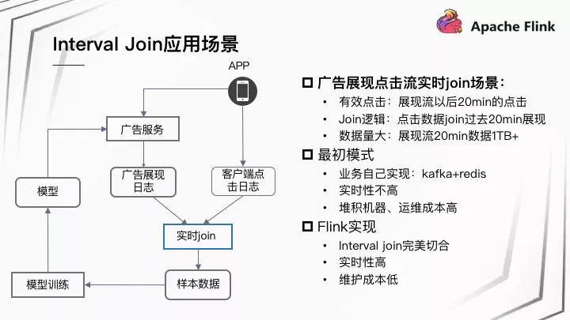

Interval Join 在快手的一个应用场景是广告展现点击流实时 Join 场景：打开快手 App 可能会收到广告服务推荐的广告视频，用户有时会点击展现的广告视频。这样在后端形成两份数据流，一份是广告展现日志，一份是客户端点击日志。这两份数据需进行实时 Join，将 Join 结果作为样本数据用于模型训练，训练出的模型会被推送到线上的广告服务。

该场景下展现以后 20 分钟的点击被认为是有效点击，实时 Join 逻辑则是点击数据 Join 过去 20 分钟展现。其中，展现流的数据量相对比较大，20 分钟数据在 1 TB 以上。最初实时 Join 过程是业务自己实现，通过 Redis 缓存广告展现日志，Kafka 延迟消费客户端点击日志实现 Join 逻辑，该方式缺点是实时性不高，并且随着业务增长需要堆积更多机器，运维成本非常高。基于 Flink 使用 Interval Join 完美契合此场景，并且实时性高，能够实时输出 Join 后的结果数据，对业务来说维护成本非常低，只需要维护一个 Flink 作业即可。

 1.2 Interval Join 场景优化

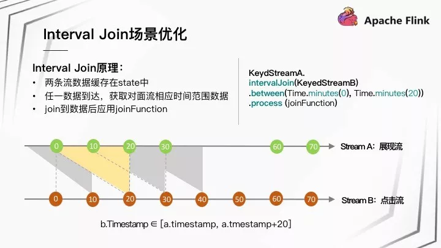

**1.2.1 Interval Join 原理：**

Flink 实现 Interval join 的原理：两条流数据缓存在内部 State 中，任意一数据到达，获取对面流相应时间范围数据，执行 joinFunction 进行 Join。随着时间的推进，State 中两条流相应时间范围的数据会被清理。

在前面提到的广告应用场景 Join 过去 20 分钟数据，假设两个流的数据完全有序到达，Stream A 作为展现流缓存过去 20 分钟数据，Stream B 作为点击流每来一条数据到对面 Join 过去 20 分钟数据即可。

Flink 实现 Interval Join：

```
KeyedStreamA.intervalJoin(KeyedStreamB)
         .between(Time.minutes(0),Time.minutes(20))
         .process(joinFunction)
```

**1.2.2 状态存储策略选择**

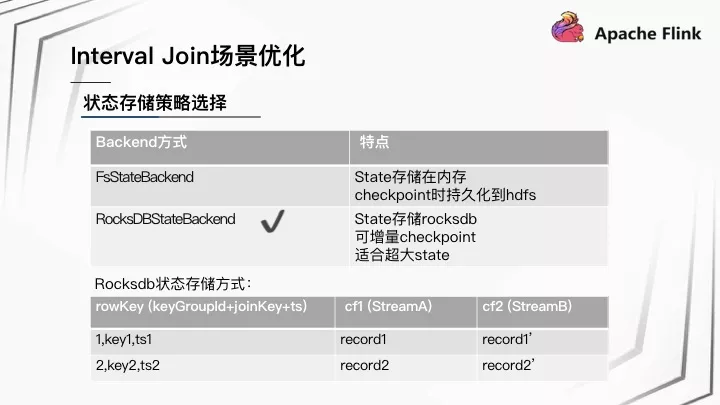

关于状态存储策略选择，生产环境状态存储 Backend 有两种方式：

1. FsStateBackend：State 存储在内存，Checkpoint 时持久化到 HDFS；
2. RocksDBStateBackend：State 存储在 RocksDB 实例，可增量 Checkpoint，适合超大 State。在广告场景下展现流 20 分钟数据有 1 TB 以上，从节省内存等方面综合考虑，快手最终选择的是 RocksDBStateBackend。

在 Interval join 场景下，RocksDB 状态存储方式是将两个流的数据存在两个 Column Family 里，RowKey 根据 keyGroupId+joinKey+ts 方式组织。

**1.2.3 RocksDB 访问性能问题**

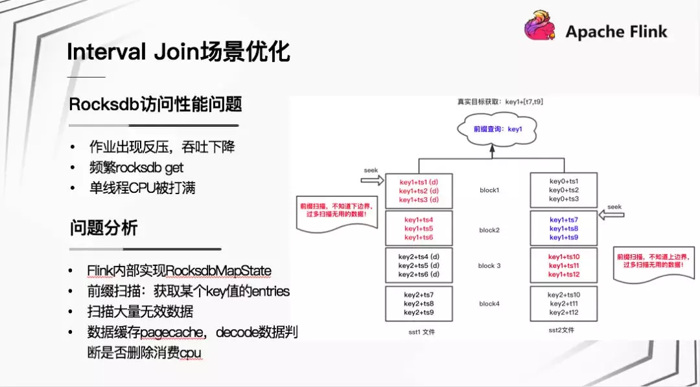

Flink 作业上线遇到的第一个问题是 RocksDB 访问性能问题，表现为：

- 作业在运行一段时间之后出现反压，吞吐下降。
- 通过 Jstack 发现程序逻辑频繁处于 RocksDB get 请求处。
- 通过 Top 发现存在单线程 CPU 持续被打满。

进一步对问题分析，发现：该场景下，Flink 内部基于 RocksDB State 状态存储时，获取某个 Join key 值某段范围的数据，是通过前缀扫描的方式获取某个 Join key 前缀的 entries 集合，然后再判断哪些数据在相应的时间范围内。前缀扫描的方式会导致扫描大量的无效数据，扫描的数据大多缓存在 PageCache 中，在 Decode 数据判断数据是否为 Delete 时，消耗大量  CPU。

以上图场景为例，蓝色部分为目标数据，红色部分为上下边界之外的数据，前缀扫描时会过多扫描红色部分无用数据，在对该大量无效数据做处理时，将单线程 CPU 消耗尽。

**1.2.4 针对 RocksDB 访问性能优化**

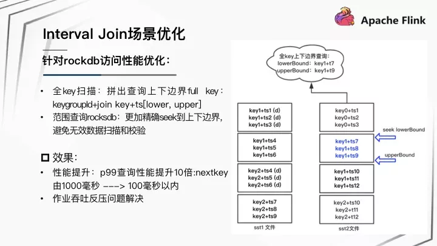

快手在 Interval join 该场景下对 RocksDB 的访问方式做了以下优化：

- 在 Interval join 场景下，是可以精确的确定需访问的数据边界范围。所以用全 Key 范围扫描代替前缀扫描，精确拼出查询上下边界 Full Key 即 keyGroupId+joinKey+ts[lower,upper]。
- 范围查询 RocksDB ，可以更加精确 Seek 到上下边界，避免无效数据扫描和校验。

优化后的效果：P99 查询时延性能提升 10 倍，即 nextKey 获取 RocksDB 一条数据， P99 时延由 1000 毫秒到 100 毫秒以内。作业吞吐反压问题进而得到解决。

**1.2.5 RocksDB 磁盘压力问题**

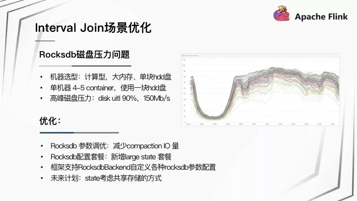


Flink 作业上线遇到的第二个问题是随着业务的增长， RocksDB 所在磁盘压力即将达到上限，高峰时磁盘 util 达到 90%，写吞吐在 150 MB/s。详细分析发现，该问题是由以下几个原因叠加导致：

- Flink 机器选型为计算型，大内存、单块 HDD 盘，在集群规模不是很大的情况下，单个机器会有 4-5 个该作业 Container，同时使用一块 HDD 盘。
- RocksDB 后台会频繁进行 Compaction 有写放大情况，同时 Checkpoint 也在写磁盘。

针对 RocksDB 磁盘压力，快手内部做了以下优化：

- 针对 RocksDB 参数进行调优，目的是减少 Compaction IO 量。优化后 IO 总量有一半左右的下降。
- 为更加方便的调整 RocksDB 参数，在 Flink 框架层新增 Large State  RocksDB 配置套餐。同时支持 RocksDBStateBackend 自定义配置各种 RocksDB 参数。
- 未来计划，考虑将 State 用共享存储的方式存储，进一步做到减少 IO 总量，并且快速 Checkpoint 和恢复。

\2. 稳定性改进

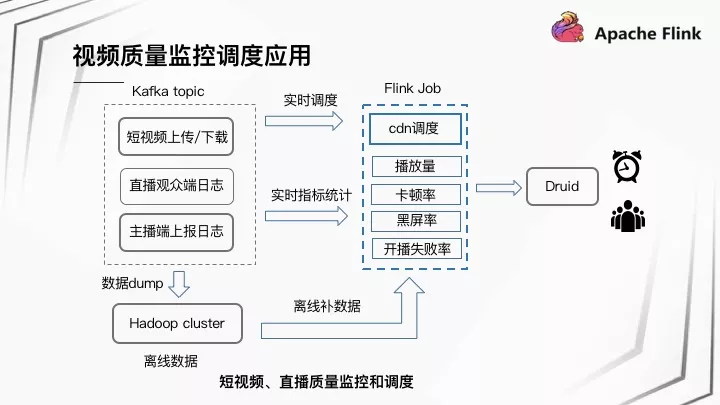

首先介绍下视频质量监控调度应用背景，有多个 Kafka Topic 存储短视频、直播相关质量日志，包括短视频上传 / 下载、直播观众端日志，主播端上报日志等。Flink Job 读取相应 Topic 数据实时统计各类指标，包括播放量、卡顿率、黑屏率以及开播失败率等。指标数据会存到 Druid 提供后续相应的报警监控以及多维度的指标分析。同时还有一条流是进行直播 CDN 调度，也是通过 Flink Job 实时训练、调整各 CDN 厂商的流量配比。

以上 Kafka Topic 数据会同时落一份到 Hadoop 集群，用于离线补数据。实时计算跟离线补数据的过程共用同一份 Flink 代码，针对不同的数据源，分别读取 Kafka 数据或 HDFS 数据。

 2.1 数据源控速

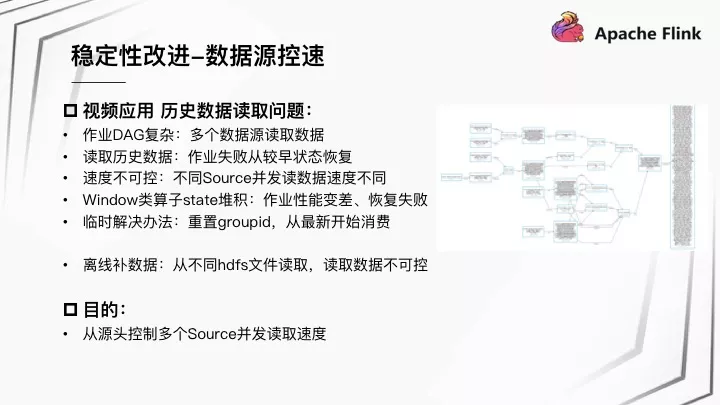

视频应用场景下遇到的问题是：作业 DAG 比较复杂，同时从多个 Topic 读取数据。一旦作业异常，作业失败从较早状态恢复，需要读取部分历史数据。此时，不同 Source 并发读取数据速度不可控，会导致 Window 类算子 State 堆积、作业性能变差，最终导致作业恢复失败。另外，离线补数据，从不同 HDFS 文件读数据同样会遇到读取数据不可控问题。在此之前，实时场景下临时解决办法是重置 GroupID 丢弃历史数据，使得从最新位置开始消费。

针对该问题我们希望从源头控制多个 Source 并发读取速度，所以设计了从 Source 源控速的策略。

**Source 控速策略**

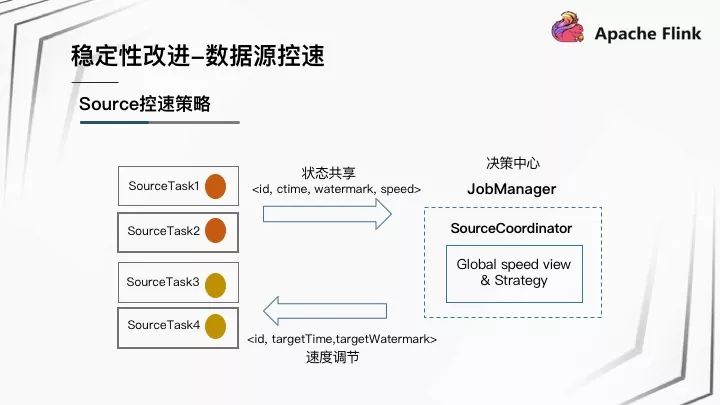

Source 控速策略是 ：

- SourceTask 共享速度状态<id,ctime,watermark,speed>提供给 JobManager。
- JobManager 引入 SourceCoordinator，该 Coordinator 拥有全局速度视角，制定相应的策略，并将限速策略下发给 SourceTask。
- SourceTask 根据 JobManager 下发的速度调节信息执行相应控速逻辑。
- 一个小细节是 DAG 图有子图的话， 不同子图 Source 源之间互相不影响。

**Source 控速策略详细细节**


SourceTask 共享状态

- SourceTask 定期汇报状态给 JobManager，默认 10 s 间隔。
- 汇报内容为<id,clocktime,watermark,speed>。

协调中心 SourceCoordinator

- 限速阈值：最快并发 Watermark - 最慢并发 Watermark > ∆t(默认 5 分钟)。只要在达到限速阈值情况下，才进行限速策略制定。
- 全局预测：各并发 targetWatermark=base+speed*time；Coordinator 先进行全局预测，预测各并发接下来时间间隔能运行到的 Watermark 位置。
- 全局决策：targetWatermark = 预测最慢 Watermark+∆t/2；Coordinator 根据全局预测结果，取预测最慢并发的 Watermark 值再浮动一个范围作为下个周期全局限速决策的目标值。
- 限速信息下发：<targetTime,targetWatermark>。将全局决策的信息下发给所有的 Source task，限速信息包括下一个目标的时间和目标的 Watermark 位置。

以上图为例，A 时刻，4 个并发分别到达如图所示位置，为 A+interval 的时刻做预测，图中蓝色虚线为预测各并发能够到达的位置，选择最慢的并发的 Watermark 位置，浮动范围值为 Watermark + ∆t/2 的时间，图中鲜红色虚线部分为限速的目标 Watermark，以此作为全局决策发给下游 Task。

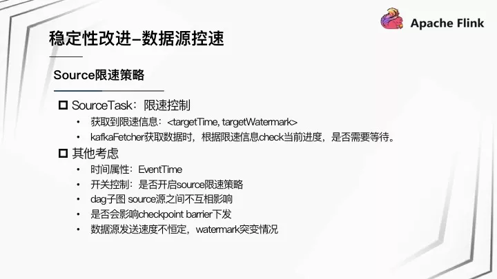

SourceTask 限速控制

- SourceTask 获取到限速信息<targetTime,targetWatermark>后，进行限速控制。
- 以 KafkaSource 为例，KafkaFetcher 获取数据时，根据限速信息 Check 当前进度，确定是否需要限速等待。

该方案中，还有一些其他考虑，例如：

- 时间属性：只针对 EventTime 情况下进行限速执行。
- 开关控制：支持作业开关控制是否开启 Source 限速策略。
- DAG 子图 Source 源之间互相不影响。
- 是否会影响 CheckPoint Barrier 下发。
- 数据源发送速度不恒定，Watermark 突变情况。

**Source 控速结果**

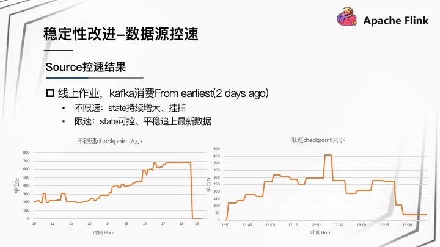

拿线上作业，使用 Kafka 从最早位置（2 days ago）开始消费。如上图，不限速情况下 State 持续增大，最终作业挂掉。使用限速策略后，最开始 State 有缓慢上升，但是 State 大小可控，最终能平稳追上最新数据，并 State 持续在 40 G 左右。

 2.2 JobManager 稳定性

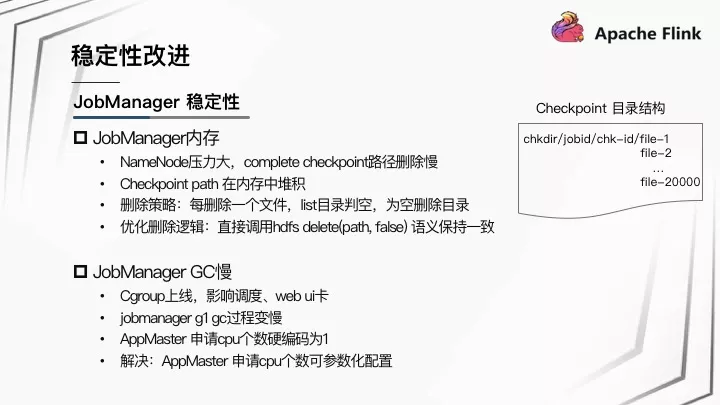

关于 JobManager 稳定性，遇到了两类 Case，表现均为：JobManager 在大并发作业场景 WebUI 卡顿明显，作业调度会超时。进一步分析了两种场景下的问题原因。

场景一，JobManager 内存压力大问题。JobManager 需要控制删除已完成的 Checkpoint 在  HDFS 上的路径。在 NameNode 压力大时，Completed CheckPoint 路径删除慢，导致 CheckPoint Path 在内存中堆积。原来删除某一次 Checkpoint 路径策略为：每删除目录下一个文件，需 List 该目录判断是否为空，如为空将目录删除。在大的 Checkpoint 路径下， List 目录操作为代价较大的操作。针对该逻辑进行优化，删除文件时直接调用 HDFS delete(path,false) 操作，语义保持一致，并且开销小。

场景二，该 Case 发生在 Yarn Cgroup 功能上线之后，JobManager G1 GC 过程变慢导致阻塞应用线程。AppMaster 申请 CPU 个数硬编码为 1，在上线 Cgroup 之后可用的 CPU 资源受到限制。解决该问题的方法为，支持 AppMaster 申请 CPU 个数参数化配置。

 2.3 作业频繁失败


机器故障造成作业频繁失败，具体的场景也有两种：

场景一：磁盘问题导致作业持续调度失败。磁盘出问题导致一些 Buffer 文件找不到。又因为 TaskManager 不感知磁盘健康状况，会频繁调度作业到该 TaskManager，作业频繁失败。

场景二：某台机器有问题导致 TaskManager 在某台机器上频繁出 Core，陆续分配新的 TaskManager 到这台机器上，导致作业频繁失败。

针对机器故障问题解决方法：

- 针对磁盘问题，TaskManager 增加 DiskChecker 磁盘健康检查，发现磁盘有问题  TaskManager 自动退出；
- 针对有些机器频繁出现 TaskManager 出现问题，根据一定的策略将有问题机器加到黑名单中，然后通过软黑名单机制，告知 Yarn 尽量不要调度 Container 到该机器。

\3. 平台化建设

 3.1 平台建设：

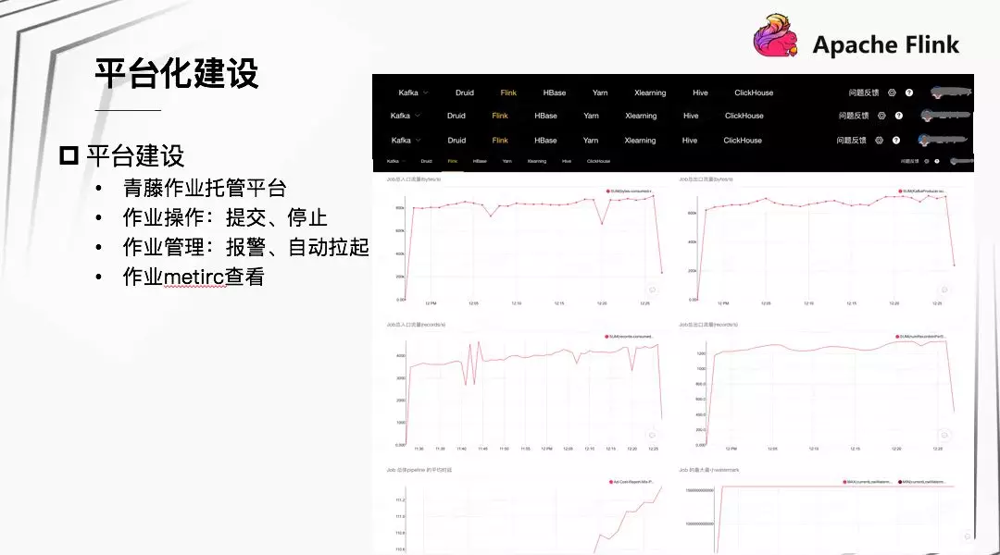

快手的平台化建设主要体现在青藤作业托管平台。通过该平台可进行作业操作、作业管理以及作业详情查看等。作业操作包括提交、停止作业。作业管理包括管理作业存活、性能报警，自动拉起配置等；详情查看，包括查看作业的各类 Metric 等。

上图为青藤作业托管平台的一些操作界面。

 3.2 问题定位流程优化：

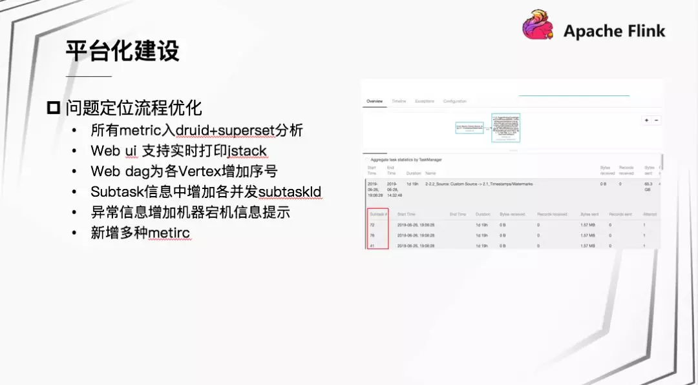

我们也经常需要给业务分析作业性能问题，帮助业务 debug 一些问题，过程相对繁琐。所以该部分我们也做了很多工作，尽量提供更多的信息给业务，方便业务自主分析定位问题。

首先，我们将所有 Metric 入 Druid，通过 Superset 可从各个维度分析作业各项指标。

第二，针对 Flink 的 WebUI 做了一些完善，支持 Web 实时打印 jstack，Web DAG 为各 Vertex 增加序号，Subtask 信息中增加各并发 SubtaskId。第三，丰富异常信息提示，针对机器宕机等特定场景信息进行明确提示。第四，新增各种 Metric。

三．未来计划

快手的未来规划主要分为两个部分：

第一，目前在建设的 Flink SQL 相关工作。因为 SQL 能够减少用户开发的成本，包括我们现在也在对接实时数仓的需求，所以 Flink SQL 是我们未来计划的重要部分之一。

第二，我们希望进行一些资源上的优化。目前业务在提作业时存在需求资源及并发预估不准确的情况，可能会过多申请资源导致资源浪费。另外如何提升整体集群资源的利用率问题，也是接下来需要探索的问题。

**作者介绍**：董亭亭，快手大数据架构实时计算引擎团队负责人。目前负责 Flink 引擎在快手内的研发、应用以及周边子系统建设。2013 年毕业于大连理工大学，曾就职于奇虎 360、58 集团。主要研究领域包括：分布式计算、调度系统、分布式存储等系统。