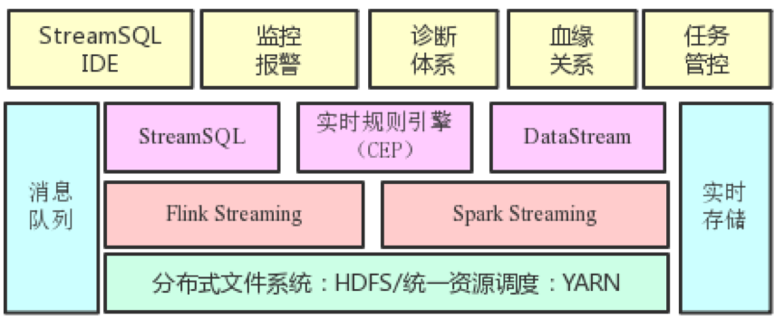

# 滴滴是如何从零构建集中式实时计算平台的？

 2018年12月5日 梁李印

滴滴出行作为一家出行领域的互联网公司，其核心业务是一个实时在线服务。因此具有丰富的实时数据和实时计算场景。本文将介绍滴滴实时计算发展之路以及平台架构实践。

## 1. 实时计算演进

随着滴滴业务的发展，滴滴的实时计算架构也在快速演变。到目前为止大概经历了三个阶段，第一阶段是业务方自建小集群；第二阶段是集中式大集群、平台化；第三阶段是 SQL 化。下图标识了其中重要的里程碑，下面给出详细阐述。

在 2017 年以前滴滴并有没有统一的实时计算平台，而是各个业务方自建小集群。其中用到的引擎有 Storm、JStorm、Spark Streaming、Samza 等。业务方自建小集群模式存在如下弊端：

1. 需要预先采购大量机器，由于单个业务独占，资源利用率通常比较低；
2. 缺乏有效的监控报警体系；
3. 维护难度大，需要牵涉业务方大量精力来保障集群的稳定性；
4. 缺乏有效技术支持，且各自沉淀的东西难以共享。

为了有效解决以上问题，滴滴从 2017 年年初开始构建统一的实时计算集群及平台。技术选型上，我们基于滴滴现状选择了内部用以大规模数据清洗的 Spark Streaming 引擎，同时引入 On-YARN 模式。利用 YARN 的多租户体系构建了认证、鉴权、资源隔离、计费等机制。相对于离线计算，实时计算任务对于稳定性有着更高的要求，为此我们构建了两层资源隔离体系。

第一层是基于 CGroup 做进程（Container）级别的 CPU 及内存隔离。第二层是物理机器级别的隔离。我们通过改造 YARN 的 FairScheduler 使其支持 Node Label。达到的效果如下图所示：普通业务的任务混跑在同一个 Label 机器上，而特殊业务的任务跑在专用 Label 的机器上。

通过集中式大集群和平台化建设，基本消除了业务方自建小集群带来的弊端，实时计算也进入了第二阶段。

伴随着业务的发展，我们发现 Spark Streaming 的 Micro Batch 模式在一些低延时的报警业务及在线业务上显得捉襟见肘。于是我们引入了基于 Native Streaming 模式的 Flink 作为新一代实时计算引擎。Flink 不仅延时可以做到毫秒级，而且提供了基于 Process Time/Event Time 丰富的窗口函数。基于 Flink 我们联合业务方构架了滴滴流量最大的业务网关监控系统，并快速支持了诸如乘客位置变化通知、轨迹异常检测等多个线上业务。

## 2. 实时计算平台架构

为了最大程度方便业务方开发和管理流计算任务，我们构建了下图所示的实时计算平台。在流计算引擎基础上提供了 StreamSQL IDE、监控报警、诊断体系、血缘关系、任务管控等能力。以下分别介绍各自的作用：

1. StreamSQL IDE。下文会介绍，是一个 Web 化的 SQL IDE；
2. 监控报警。提供任务级的存活、延时、流量等监控以及基于监控的报警能力；
3. 诊断体系。包括流量曲线、Checkpoint、GC、资源使用等曲线视图，以及实时日志检索能力；
4. 血缘关系。我们在流计算引擎中内置了血缘上报能力，进而在平台上呈现流任务与上下游的血缘关系；
5. 任务管控。实现了多租户体系下任务提交、启停、资产管理等能力。通过 Web 化任务提交消除了传统客户机模式，使得平台入口完全可控，内置参数及版本优化得以快速上线。

## 3. 实时规则匹配服务建设

在滴滴内部有大量的实时运营场景，比如“某城市乘客冒泡后 10 秒没有下单”。针对这类检测事件之间依赖关系的场景，用 Fink 的 CEP 是非常合适的。但是社区版本的 CEP 不支持描述语言，每个规则需要开发一个应用，同时不支持动态更新规则。为了解决这些问题，滴滴做了大量功能扩展及优化工作。功能扩展方面主要改动有：

1. 支持 wait 算子。对于刚才例子中的运营规则，社区版本是表达不了的。滴滴通过增加 wait 算子，实现了这类需求；
2. 支持 DSL 语言。基于 Groovy 和 Aviator 解析引擎，我们实现了如下图所示的 DSL 描述规则能力；

1. 单任务多规则及规则动态更新。由于实时运营规则由一线运营同学来配置，所以规则数量，规则内容及规则生命周期会经常发生变化。这种情况每个规则一个应用是不太现实的。为此我们开发了多规则模式且支持了动态更新。

除了功能拓展之外，为了应对大规模运营规则的挑战，滴滴在 CEP 性能上也做了大量优化，主要有：

1. SharedBuffer 重构。基于 Flink MapState 重构 SharedBuffer，减少每次数据处理过程中的状态交互。同时剥离规则和用户数据极大降低每次匹配的时候从状态中反序列化的数据量；
2. 增加访问缓存（已贡献社区）。缓存 SharedBuffer 数据中每次处理所需要更新的引用计数，延缓更新；
3. 简化 event time 语义处理。避免 key 在很分散情况下每次 watermark 更新时要遍历所有 key 的数据；
4. 复用 conditionContext（已贡献社区）。减少条件查询时对 partialMatch 元素的反复查询。

以上优化将 CEP 性能提升了多个数量级。配合功能扩展，我们在滴滴内部提供了如下图所示的服务模式。业务方只需要清洗数据并提供规则列表 API 即可具备负责规则的实时匹配能力。

目前滴滴 CEP 已经在快车个性化运营、实时异常工单检测等业务上落地，取得了良好的效果。

## 4. StreamSQL 建设

正如离线计算中 Hive 之于 MapReduce 一样，流式 SQL 也是必然的发展趋势。通过 SQL 化可以大幅度降低业务方开发流计算的难度，业务方不再需要学习 Java/Scala，也不需要理解引擎执行细节及各类参数调优。为此我们在 2018 年启动了 StreamSQL 建设项目。我们在社区 Flink SQL 基础上拓展了以下能力：

1. 扩展 DDL 语法。如下图所示，打通了滴滴内部主流的消息队列以及实时存储系统。通过内置常见消息格式（如JSON、Binlog、标准日志）的解析能力，使得用户可以轻松写出 DDL 语法，并避免重复写格式解析语句；

1. 拓展 UDF。针对滴滴内部常见处理逻辑，内置了大量 UDF，包括字符串处理、日期处理、Map 对象处理、空间位置处理等；
2. 支持分流语法。单个输入源多个输出流在滴滴内部非常常见，为此我们改造了 Calcite 使其支持分流语义；
3. 支持基于 TTL 的 Join 语义。传统的 Window Join 因为存在 Window 边界数据突变情况，不能满足滴滴内部的需求。为此我们引入了 TTL State，并基于此开发了基于 TTL Join 的双流 Join 以及维表 Join；
4. StreamSQL IDE。前文提到平台化之后我们没有提供客户机，而是通过 Web 提交和管控任务。因此我们也相应开发了 StreamSQL IDE，实现 Web 上开发 StreamSQL，同时提供了语法检测、DEBUG、诊断等能力。

目前 StreamSQL 在滴滴已经成功落地，流计算开发成本得到大幅度降低。预期未来将承担 80% 的流计算业务量。

## 5.总结

作为一家出行领域的互联网公司，滴滴对实时计算有天然的需求。过去的一年多时间里，我们从零构建了集中式实时计算平台，改变了业务方自建小集群的局面。为满足低延时业务的需求，成功落地了 Flink Streaming，并基于 Flink 构建了实时规则匹配（CEP）服务以及 StreamSQL，使得流计算开发能力大幅度降低。未来将进一步拓展 StreamSQL，并在批流统一、IoT、实时机器学习等领域探索和建设。

本文作者：梁李印