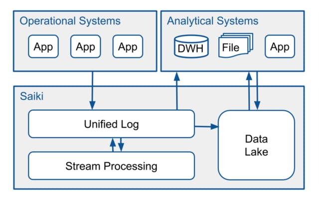
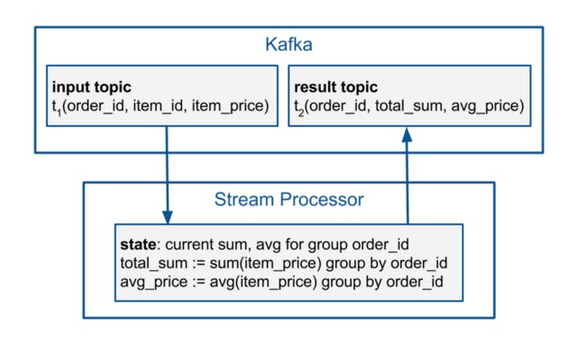
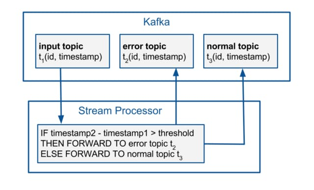
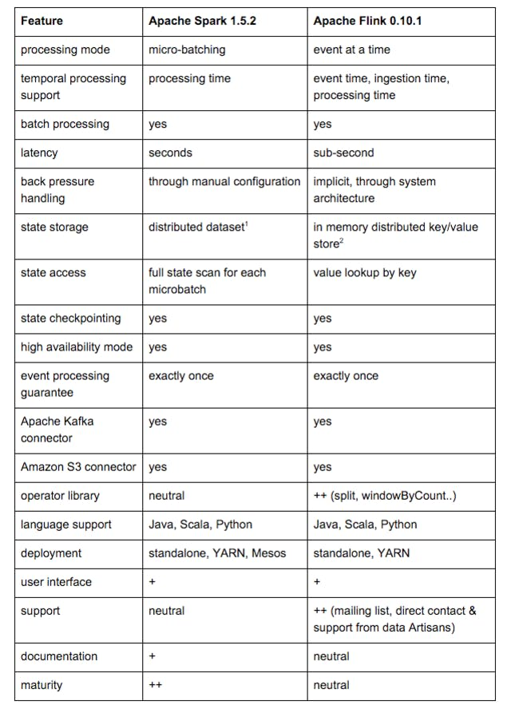

# Apache 对决：Flink 与 Spark

为什么我们选择 Apache Flink 作为 Saiki 数据集成平台。

[哈维尔洛佩兹](https://engineering.zalando.com/authors/javier-lopez.html)

大数据工程师

[米哈伊尔·维埃鲁](https://engineering.zalando.com/authors/mihail-vieru.html)

大数据工程师

发表于2016 年3 月 31 日

标签：

[Apache Flink](https://engineering.zalando.com/tags/apache-flink.html) , [Apache Spark](https://engineering.zalando.com/tags/apache-spark.html) ,[大数据](https://engineering.zalando.com/tags/big-data.html)

[Saiki是 Zalando 在](https://tech.zalando.com/blog/data-integration-in-a-world-of-microservices/)[微服务](https://tech.zalando.com/blog/so-youve-heard-about-radical-agility...-video/)领域的下一代数据集成和分发平台。Saiki 提取操作系统生成的数据，并将其提供给分析系统。在这种情况下，进行近乎实时的商业智能的机会已经出现，并引入了寻找合适的流处理框架的任务。在这篇文章中，我们将描述评估和决策过程，并说明为什么 Apache Flink 能够最好地满足我们的要求，而不是 Spark。

Zalando 的操作系统不断产生事件并将其发布到 Saiki 的统一日志（Apache Kafka）。从那里，Saiki 将它们存储在数据湖中（基于 Amazon S3）或将它们直接推送到消费分析系统。数据湖是一种集中、安全、经济高效的数据存储解决方案，可供我们的数据仓库 (Oracle) 和其他分析系统访问以进行检索。这种架构使我们能够为但不限于以下用例进行近乎实时的商业智能：

**业务流程监控。**最简单的业务流程是一系列业务事件。这些代表在整个 Zalando 平台内执行的操作。例如，当客户下订单时，负责的微服务会生成业务事件“ORDER CREATED”。当所述订单成功处理并发送相关货物时，将生成事件“PARCEL_SHIPPED”。我们的团队需要监控这些业务流程，以便快速检测和处理异常情况。继续该示例 - 一个异常可能是上述事件发生在意外的高时间间隔内，超过了先前指定的阈值。

**连续 ETL。**随着我们的 Oracle 数据仓库与越来越高的负载作斗争，我们需要通过在不同系统中执行部分 ETL 来放弃其部分资源，以确保我们未来的增长和动态扩展的能力。主要成本因素是属于不同来源的数据的连接，例如订单、运输和支付信息。由于这些信息通过事件流写入我们的统一日志，我们希望将它们加入到一个集成流中。要考虑的另一个方面是，我们不仅要为数据仓库提供这种数据集成，还要为其他分析下游系统提供这种数据集成。

在评估过程中，我们很快提出了一份潜在候选名单：Apache Spark、Storm、Flink 和 Samza。它们都是开源顶级 Apache 项目。Storm 和 Samza 给我们留下了深刻的印象，因为它们缺乏对批处理的支持。因此，我们将列表缩短为两个候选者：Apache Spark 和 Apache Flink。对于我们的评估，我们选择了当时可用的框架稳定版本：Spark 1.5.2 和 Flink 0.10.1。

## 要求

我们制定并优先考虑了我们的功能性和非功能性要求如下：

首先，我们一直在寻找一个高性能框架，它能够以始终如一的高速率和相对低的延迟处理事件。随着我们越来越多的操作系统迁移到云端并将数据发送到 Saiki，我们的目标是提供可扩展的解决方案。该框架应该能够在没有用户交互的情况下优雅地处理背压（即吞吐量峰值）。对于我们的两个用例，我们预计需要广泛使用有状态计算。因此，有效地存储、访问和修改状态信息至关重要。

我们还在寻找一个可靠的系统，该系统能够运行数月的作业并在发生故障时保持弹性。需要一种高可用性模式，影子主节点可以在失败时恢复主节点的工作。对于有状态的计算，我们需要一个检查点机制。因此，不需要重新计算整个 Kafka 主题，并且作业可以从失败前中断的位置恢复其工作。

对我们来说更重要的方面是编程模型的表现力和乱序事件的处理。对于前者，一个丰富且正确实现的运算符库是相关的。编程模型应该能够对事件流和事件时间进行简单而精确的推理，例如事件在现实世界中发生的时间。后一方面假设事件流不完美，事件到达系统的顺序不是它们发生的顺序。这意味着系统本身可以处理乱序事件，从而将用户从额外的工作中解脱出来。

其他值得注意的功能要求是“exactly once”事件处理保证、Apache Kafka 和 Amazon S3 连接器，以及用于监控运行作业进度和整体系统负载的简单用户界面。

非功能性需求包括良好的开源社区支持、适当的文档和成熟的框架。

## Spark vs. Flink - 经验和功能比较

为了评估 Spark 或 Flink 是否以及如何满足我们的要求，我们进行了如下操作。基于我们的两个初始用例，我们为这两个框架构建了概念证明 (POC)，实现了对单个事件输入流的聚合和监控。由于在状态处理方面的要求相似并且由于时间限制，我们没有为 join 操作实现 POC。

对于聚合用例，包含属于订单的项目信息的事件被生成并发布到单个 Kafka 主题。这些由流处理框架读取。结果包含每个订单的总项目价格和平均项目价格。结果被写回到不同的 Kafka 主题。我们使用状态来存储和更新每个订单的当前总和和平均商品价格。

对于监控用例，生成的输入流包含成对的相关事件。该对中的第一个事件代表前面提到的“ORDER CREATED”业务事件和第二个“PARCEL_SHIPPED”事件。第一个和最后一个事件的时间戳之间的时间差设置为随机天数。根据时间差和阈值区分事件。事件流分为两个流：错误和正常。错误流包含已超过指定阈值的所有事件，而正常流包含其余事件。然后将这些流写回 Kafka。

两个框架的聚合用例都已成功实现。在 Flink 中实现监控用例更加直观，主要是因为 split 运算符的存在，而在 Spark 中没有等效的。

关于这两个框架的性能，Flink 在我们的流处理用例中优于 Spark。Flink 在高吞吐量下始终比 Spark 提供更低的延迟。增加吞吐量对延迟的影响非常有限。对于 Spark，总是需要在吞吐量和延迟之间进行权衡。用户必须根据期望的结果手动调整 Spark 的配置。当然，这也会产生重新部署成本。我们的经验与[Yahoo!一致。基准](https://yahooeng.tumblr.com/post/135321837876/benchmarking-streaming-computation-engines-at)。

Spark 1.5.2 和 Flink 0.10.1 的状态实现是不同的，并提供了预期不同的结果。Spark 将状态实现为分布式数据集，而 Flink 采用分布式内存键/值存储。随着状态的增加，Spark 的性能会不断下降，因为它会扫描每个处理过的微批次的整个状态。它仍然可靠并且不会崩溃。Flink 只需查找和更新特定键的存储值。它的性能一直很高，但它可能会抛出 OutOfMemoryErrors 并导致计算失败。这是因为它无法将状态溢出到磁盘。[软件公司数据工匠](http://data-artisans.com/)已经讨论并解决了这个问题。当前的 1.0.0 版本提供了使用基于 RocksDB 的核外状态的可能性。

根据我们的经验，我们总结和评估了与我们对 Spark 和 Flink 的需求最相关的特性，如下表所示：

注意事项： 1. 经过我们的评估，Spark 1.6 为状态引入了键/值存储。2. 当前的 Flink 1.0.0 版本提供了使用基于 RocksDB 的核外状态的可能性。

## Saiki 的 Flink

为什么我们最终选择了 Apache Flink 作为 Saiki 的流处理框架？以下是我们的理由：

- Flink 以高吞吐量和低延迟处理事件流。它提供了一种高效、易于使用、基于键/值的状态。
- Flink 是一个真正的流处理框架。它一次处理一个事件，每个事件都有自己的时间窗口。使用 Flink 丰富的编程模型可以轻松实现复杂的语义。事件流的推理比微批处理更容易。使用框架的事件时间处理支持可以轻松处理诸如乱序事件之类的流缺陷。
- Flink 的支持明显优于 Spark 的支持。我们与其开发人员有直接联系，他们渴望改进他们的产品并解决像我们这样的用户问题。Flink 源于柏林的学术界，几乎可以保证有源源不断的柏林大学拥有 Flink 技能的毕业生。

我们的团队目前正致力于使用 Flink 实现近乎实时的业务流程监控解决方案。我们不断向 Flink 社区学习，并期待成为其中的积极一员。[Flink 1.0.0](http://flink.apache.org/news/2016/03/08/release-1.0.0.html)的发布更加坚定了我们在这条道路上的努力。