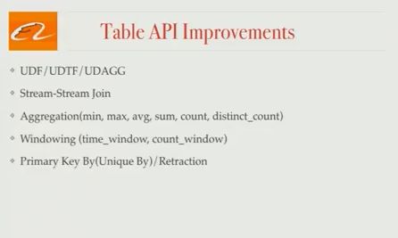

# Blink：阿里巴巴如何使用 Apache Flink®

2016 年 10 月 18 日 | [作者：姜小伟](https://www.ververica.com/blog/author/xiaowei-jiang)

  

*这是阿里巴巴搜索基础设施团队高级总监姜晓伟的客座文章。* *该帖子改编自阿里巴巴在*[*Flink Forward 2016上的演讲，您可以在*](http://flink-forward.org/)[*此处*](https://www.youtube.com/watch?v=w9f-440oejg&feature=youtu.be)*查看会议的原始演讲**。*阿里巴巴是全球最大的电子商务零售商。我们 2015 年的年销售额总计 3940 亿美元，超过了 eBay 和亚马逊的总和。我们的个性化搜索和推荐平台阿里巴巴搜索是我们客户的重要切入点，并为我们的大部分在线收入负责，因此搜索基础架构团队不断探索改进产品的方法。*

*
是什么造就了电子商务网站上的出色搜索引擎？为每个用户提供尽可能相关和准确的实时结果。

在阿里巴巴的规模上，这是一个不小的问题，很难找到能够处理我们用例的技术。 [Apache Flink®](https://flink.apache.org/)就是这样一种技术，阿里巴巴正在使用基于 Flink 的系统 Blink 为其搜索基础设施的关键方面提供支持，并为最终用户提供相关性和准确性。

在这篇文章中，我将介绍 Flink 在阿里巴巴搜索中的角色，并概述我们在搜索基础设施团队中选择与 Flink 合作的原因。 我还将讨论我们如何调整 Flink 以满足我们对 Blink 的独特要求，以及我们如何与数据工匠和 Flink 社区合作，将这些变化回馈给 Flink。**一旦我们成功地将我们的修改合并到开源项目中，我们就会****积极地将我们的系统从 Blink 过渡到 vanilla [Apache Flink 。](https://flink.apache.org/)****
第 1 部分：阿里巴巴搜索中的 Flink**文档创建为用户提供世界级搜索引擎的第一步是构建可供搜索的文档。在阿里巴巴的案例中，该文档由数百万个产品列表和相关产品数据组成。 搜索文档的创建是一项挑战，因为产品数据存储在许多不同的地方，搜索基础架构团队需要将所有相关信息整合在一起以创建完整的搜索文档。一般来说，这是一个 3 个阶段的过程：将来自不同来源（例如 MySQL、分布式文件系统）的所有产品数据同步到一个 HBase 集群中。使用业务逻辑将来自不同表的数据连接在一起，以创建最终的、可搜索的文档。这是一个 HBase 表，我们称之为“结果”表。将此 HBase 表导出为文件或一组更新。所有这 3 个阶段实际上在经典的“lambda 架构”中的 2 个不同的管道上运行：完整构建管道和增量构建管道。在完整构建管道中，我们处理所有数据源，这传统上是批处理作业。在增量管道中，我们处理批处理作业完成后发生的更新。例如，卖家可以修改价格或描述，或者库存可用性可能会改变。这些信息必须尽快反映在搜索结果中。增量构建管道传统上是一个流式作业。

搜索算法的实时 A/B 测试我们的工程师会定期测试不同的搜索算法，并且需要能够尽快评估性能。目前，这种评估每天进行一次，但我们希望实时进行分析，因此我们使用 Blink 构建了一个实时 A/B 测试框架。 在线日志（印象、点击、交易）由解析器和过滤器收集和处理，然后使用一些业务逻辑连接在一起。接下来对数据进行聚合，将聚合结果推送给 Druid；在 Druid 内部，可以编写一个查询来对数据执行复杂的 OLAP 分析，并查看不同算法的执行情况。

在线机器学习这里有几个应用程序，首先，我们将讨论实时功能更新。阿里巴巴搜索排名中使用的一些特征是产品点击率、产品库存和总点击次数。这些数据会随着时间而变化，如果我们可以使用最新的可用数据，我们将能够为我们的用户提供更相关的搜索排名。我们的 Flink 管道为我们提供了在线功能更新，并显着提高了转化率。

二、一年中有特定的日子（如[光棍节](https://en.wikipedia.org/wiki/Singles'_Day)) 产品大幅打折——有时高达 50%——因此，用户行为发生了巨大变化。交易量巨大，通常比我们平时看到的要高很多倍。我们之前训练的模型在这种情况下毫无用处，因此我们使用我们的日志和 Flink 流作业来支持在线机器学习，构建考虑实时数据的模型。结果是这些不常见但非常重要的销售日的转化率要高得多。**第 2 部分：选择解决问题的框架**当我们选择 Flink 来支持我们的搜索基础设施时，我们的评估包括以下四个类别。Flink 在这四个方面都满足了我们的要求。**敏捷性：**我们的目标是能够为我们的整个（2 管道）搜索基础架构流程维护一个代码库。我们想要一个足够高级的 API 来表达我们的业务逻辑。**一致性：** 卖家或产品数据库的更改必须反映在最终的搜索结果中，因此搜索基础架构团队需要至少一次语义（对于公司中的一些其他 Flink 用例，我们有完全一次的要求）。**低延迟：**当库存可用性发生变化时，这必须非常迅速地反映在搜索结果中；例如，我们不想给售罄的产品一个高搜索排名。**成本：**阿里巴巴处理大量数据，在我们的规模下，效率的提高可以显着节省成本。我们需要一个能够有效处理高吞吐量的框架。
更广泛地说，有两种方法可以考虑统一批处理和流处理。第一种方法是使用批处理作为起点，然后尝试在批处理之上构建流。但是，这可能无法满足严格的延迟要求，因为模拟流的微批处理需要一些固定的开销——因此，当您尝试减少延迟时，开销的比例会增加。在我们的规模下，需要为每个微批次安排 1000 多个任务，重新建立连接并重新加载状态。所以在某些时候，微批量方法变得太昂贵而没有意义。

另一方面，Flink 使用流式传输作为基本起点，并在*流式传输之上构建批处理解决方案*，其中批处理基本上是流的特殊情况。使用这种方法，我们不会失去批处理模式下优化的好处——当流是有限的时，您仍然可以对批处理进行任何您想做的优化。

**第 3 部分：什么是闪烁？**Blink 是 Flink 的一个分支版本，我们一直在维护它以满足我们在阿里巴巴的一些独特需求。此时，Blink 运行在几个不同的集群上，每个集群大约有 1000 台机器，因此大规模性能对我们来说非常重要。 Blink 的改进一般包括两个方面：使 Table API 更完整，以便我们可以对批处理和流处理使用相同的 SQL更强大的 YARN 模式，仍然 100% 兼容 Flink 的 API 和更广泛的生态系统
表 API我们首先添加了对用户自定义函数的支持，以便将我们独特的业务逻辑轻松带入 Flink。我们还添加了流到流的连接，由于 Flink 对状态的一流支持，这在 Flink 中是一项不平凡但相对简单的任务。接下来，我们添加了一些不同的聚合，最有趣的可能是 distinct_count，以及窗口支持。 （*编者注：*[*FLIP-11*](https://cwiki.apache.org/confluence/display/FLINK/FLIP-11%3A+Table+API+Stream+Aggregations)*涵盖了一系列针对 Flink 的 Table API 和 SQL 改进，这些改进与上面列出的功能相关，推荐给任何对该主题感兴趣的人阅读。）*
接下来，我们将介绍运行时改进，我们可以分成四个单独的类别。

闪烁纱线当我们开始我们的项目时，Flink 支持 2 种集群模式：独立模式和 Flink on YARN。在 YARN 模式下，作业不能动态请求和释放资源，而是需要预先获取所有需要的资源。并且不同的作业可能共享相同的 JVM 进程，这有利于资源利用而不是资源隔离。 Blink 包含一个架构，其中每个作业都有自己的 JobMaster 来根据作业需要请求和释放资源。并且不同的作业不能在同一个Java进程中运行，这样可以在作业和任务之间产生最好的隔离。阿里巴巴团队目前正在与 Flink 社区合作，将这项工作回馈给开源，并在[FLIP-6](https://cwiki.apache.org/confluence/pages/viewpage.action?pageId=65147077)（它扩展到 YARN 之外的其他集群管理器）中捕获了改进。

运算符重新缩放在生产中，我们的客户可能需要改变算子的并行度，但同时他们又不想丢失状态。当我们开始做 Blink 的时候，Flink 不支持在保持状态的同时改变算子的并行度。Blink 引入了“桶”的概念作为状态管理的单位。桶比任务多得多，每个任务将被分配多个桶。当并行度发生变化时，我们会将存储桶重新分配给任务。使用这种方法，可以改变算子的并行度并保持状态。

（*编者注：* *Flink 社区同时为 Flink 1.2 解决了这个问题 - 该功能在最新版本的 master 分支中可用。Flink 的“key groups”概念在很大程度上与上面提到的“buckets”是等价的，但实现方式在数据结构如何支持这些 buckets 方面略有不同。有关更多信息，请查看*[*Jira 中的 FLINK-3755*](https://issues.apache.org/jira/browse/FLINK-3755)*。）
*增量检查点在 Flink 中，检查点发生在两个阶段：在本地拍摄状态快照，然后将状态快照持久化到 HDFS（或另一个存储系统），并且整个状态快照与每个快照一起存储在 HDFS 中。我们的状态太大，这种方法无法接受，所以 Blink 只将*修改后的*状态存储在 HDFS 中，我们已经能够大大提高检查点的效率。这种修改使我们能够在生产中使用大状态。异步 I/O我们许多工作的生产瓶颈是访问 HBase 等外部存储。为了解决这个问题，我们引入了异步 I/O，我们将努力为社区做出贡献，并在[FLIP-12](https://cwiki.apache.org/confluence/pages/viewpage.action?pageId=65870673)中进行了详细描述。 （*编者注：data Artisans 认为 FLIP-12 足够充实，可以在不久的将来某个时候拥有自己的独立文章。所以我们在这里只简单介绍一下这个想法，暂时你应该看看如果您想了解更多信息，请*[*阅读 FLIP*](https://cwiki.apache.org/confluence/pages/viewpage.action?pageId=65870673)*文章。在发布时，代码已经贡献给 Flink。）***第 4 部分：Flink 在阿里巴巴的下一步是什么？**我们将继续优化我们的流式作业，特别是在不否定背压和更快从故障中恢复的积极方面更好地处理临时倾斜和慢速机器。正如 Flink Forward 上许多不同的演讲者所讨论的那样，我们相信 Flink 作为批处理器和流处理器具有巨大的潜力。我们正在努力充分利用 Flink 的批处理能力，并希望在几个月内实现 Flink 批处理模式的生产。

会议的另一个热门话题是流式 SQL，我们将继续在 Flink 中添加更多 SQL 支持和 Table API 支持。阿里巴巴的业务不断增长，这意味着我们的工作越来越大——确保我们可以扩展到更大的集群变得越来越重要。 非常重要的是，我们期待与社区继续合作，以便将我们的工作贡献回开源，以便所有 Flink 用户都能从我们为 Blink 所做的工作中受益。我们期待在 Flink Forward 2017 上向您更新我们的进展。