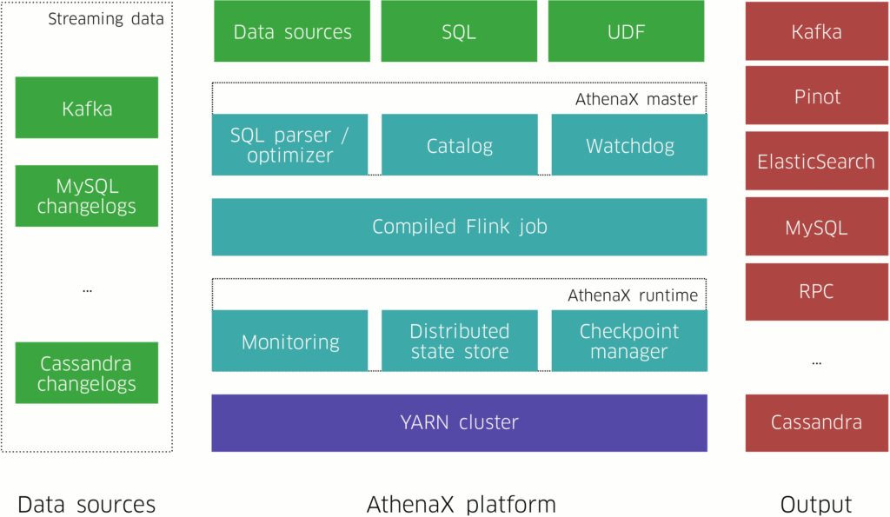
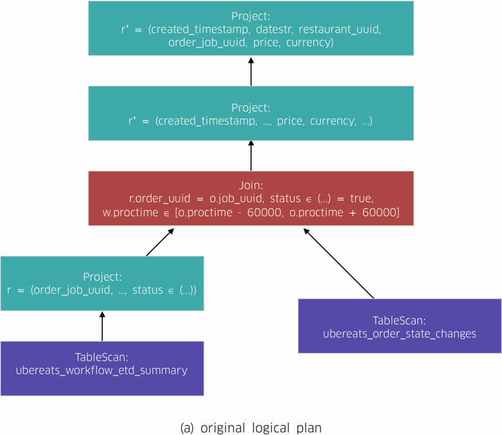
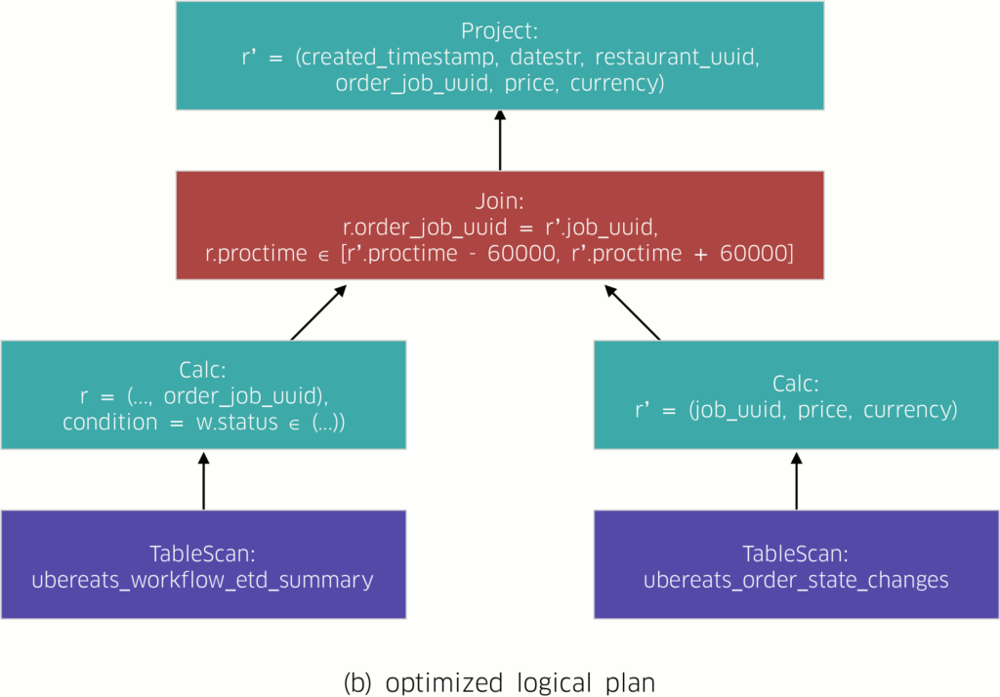
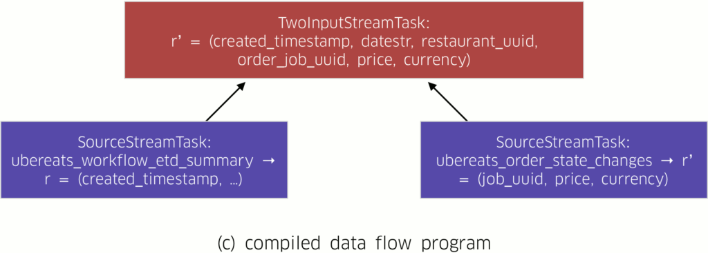
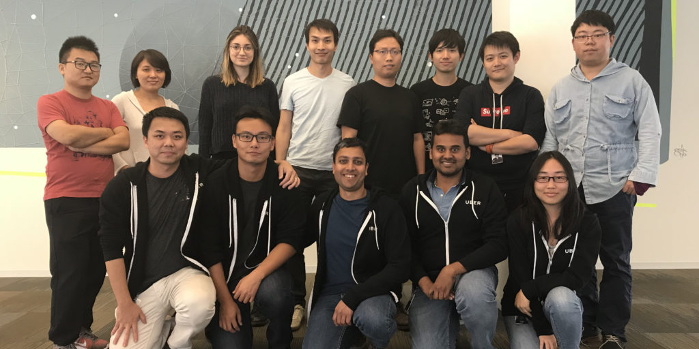

- [
  建筑学](https://eng.uber.com/category/articles/architecture/)
- [开源](https://eng.uber.com/category/articles/open-source-articles/)

- [建筑学](https://eng.uber.com/category/articles/architecture/)
-  

- [开源](https://eng.uber.com/category/articles/open-source-articles/)

### [介绍 Uber Engineering 的开源流分析平台 AthenaX](https://eng.uber.com/athenax/)

[Haohui Mai](https://eng.uber.com/author/haohui-mai/) , [Bill Liu](https://eng.uber.com/author/bill-liu/) , and [Naveen Cherukuri](https://eng.uber.com/author/naveen-cherukuri/)

2017 年 10 月 9 日

[ 0](https://eng.uber.com/athenax/#respond)

[鸣叫18](https://twitter.com/intent/tweet?text=Introducing+AthenaX%2C+Uber+Engineering’s+Open+Source+Streaming+Analytics+Platform&url=https%3A%2F%2Fubr.to%2F2BuWTM1&via=ubereng)

[分享](https://www.facebook.com/share.php?u=https%3A%2F%2Fubr.to%2F2BuWTM1)

[分享](https://www.linkedin.com/cws/share?url=https%3A%2F%2Fubr.to%2F2BuWTM1)

[投票1](https://news.ycombinator.com/submitlink?u=https%3A%2F%2Fubr.to%2F2BuWTM1&t=Introducing AthenaX%2C Uber Engineering’s Open Source Streaming Analytics Platform)

[红迪网9](https://www.reddit.com/submit?url=https%3A%2F%2Fubr.to%2F2BuWTM1)

[WhatsApp](https://api.whatsapp.com/send?text=https%3A%2F%2Fubr.to%2F2BuWTM1)

**28分享**

优步通过从各种实时来源传输数据来促进无缝和更愉快的用户体验。这些见解的范围从提供旅行路线指导的即时交通状况到[UberEATS 订单的预计交货时间 (ETD)](https://eng.uber.com/restaurant-manager/)以及介于两者之间的每个指标。

Uber 业务的快速增长需要一个数据分析基础设施，该基础设施能够随时传输从世界各地获取的广泛见解，例如特定城市的市场状况到全球财务估计。每天有超过 1[万亿](https://eng.uber.com/chaperone/)条实时消息通过我们的[Kafka](https://kafka.apache.org/)基础设施，该平台需要 (1) 无论技术专长如何，所有用户都可以轻松导航，(2) 具有足够的可扩展性和效率来分析实时事件， (3) 足够强大，可以持续支持数百个甚至数千个关键工作。

我们[构建并开源了我们的内部流分析平台 AthenaX](https://github.com/uber/AthenaX)，以满足这些需求并为每个人带来可访问的流分析。AthenaX 使我们的技术和非技术用户能够使用结构化查询语言 (SQL) 运行全面的生产质量流分析。SQL 使事件流处理变得容易——SQL 描述 *要* 分析的数据，而 AthenaX 确定*如何*分析数据（例如，通过定位数据或扩展其计算）。我们的实际经验表明，与数周相比，AthenaX 使用户能够在数小时内将大规模流分析工作负载投入生产。

在本文中，我们讨论了构建 AthenaX 的原因，概述了它的基础架构，并详细说明了我们回馈开源社区的平台的各种功能。

### 优步流媒体分析平台的演变

为了更好地为我们的用户提供可操作的见解，优步必须能够衡量应用活动以及影响它的各种外部因素（例如交通、天气和重大事件）。2013 年，我们在[Apache Storm](http://storm.apache.org/)之上构建了第一代流分析管道。虽然有效，但该管道仅计算特定的指标集；在非常高的层次上，该解决方案消耗实时事件，聚合多个维度（例如，地理区域、时间范围）的结果，并将它们发布在网页上。

随着我们扩展我们的产品，我们需要快速有效地进行流式分析变得越来越重要。就 UberEATS 而言，客户满意度和销售额等实时指标使餐厅能够更好地了解其业务的健康状况和客户的满意度，从而优化潜在收益。为了计算这些指标，我们的工程师在 Apache Storm 或[Apache Samza](http://samza.apache.org/)之上实现了他们的流分析应用程序。更具体地说，应用程序将多个 Kafka 主题投影、过滤或连接在一起以计算结果，并能够扩展到数百个容器。

然而，这些解决方案还不理想。用户要么被迫实施、管理和监控自己的流分析应用程序，要么仅限于获取预定义问题的答案。

AthenaX 着手解决这一难题，并通过使用户能够使用 SQL 构建定制的、生产就绪的流分析来实现两全其美。为了满足 Uber 的规模需求，AthenaX 将 SQL 查询编译并优化为分布式流应用程序，该应用程序每秒可处理多达数百万条消息，仅使用 8 个 YARN 容器。AthenaX 还端到端管理应用程序，包括持续监控其运行状况、根据输入大小自动扩展它们，以及从节点故障或数据中心故障转移中优雅地恢复它们。

在下一节中，我们将详细介绍我们如何构建 AthenaX 强大而灵活的架构。

### 使用 SQL 构建流式分析应用程序

图 1：AthenaX 将流数据和查询作为输入，计算结果，然后将它们推送到各种输出。

我们在这一演变过程中吸取的教训将我们引向了 AthenaX，这是当前 Uber 的流媒体分析平台。AthenaX 的关键特性是用户可以仅使用 SQL 指定他们的流分析，然后 AthenaX 高效地执行它们。AthenaX 将查询编译成可靠、高效、分布式的应用程序，并管理应用程序的整个生命周期，让用户能够专注于他们的业务逻辑。因此，无论规模如何，所有技术级别的用户都可以在短短几个小时内在生产环境中运行他们的流分析应用程序。

如上图 1 所示，AthenaX 作业将各种数据源作为输入，执行所需的处理和分析，并为不同类型的端点生成输出。AthenaX 的工作流程遵循以下步骤：

1. 用户在 SQL 中指定一个作业并将其提交给 AthenaX 主服务器。
2. AthenaX master 验证查询并将其编译为 Flink 作业。
3. AthenaX master 在 YARN 集群中打包、部署和执行作业。在失败的情况下，master 也会恢复作业。
4. 该作业开始处理数据并向外部系统（例如 Kafka）生成结果。

根据我们的经验，SQL 在指定流式应用程序方面表现力很强。以[餐厅经理](http://eng.uber.com/restaurant-manager)为例；在此用例中，以下查询计算餐厅在前 15 分钟内收到的订单数量，如下图所示：

**SELECT** **HOP_START** ( rowtime , **INTERVAL** '1' **MINUTE** , **INTERVAL** '15' **MINUTE** ) **AS** window_start ,   restaurant_uuid , **COUNT** (*) **AS** total_order **FROM** ubereats_workflow **WHERE** state = 'CREATED' **GROUP** **BY**   restaurant_uuid , **HOP** ( rowtime , **INTERVAL** '1' **MINUTE** ,**间隔**'15'**分钟**）              

本质上，查询会扫描ubereats_workflow Kafka 主题，过滤掉不相关的事件，并以每 1 分钟的频率聚合 15 分钟[滑动窗口内](https://ci.apache.org/projects/flink/flink-docs-release-1.3/dev/table/sql.html#group-windows)的事件数量。

AthenaX 还支持查询中的用户定义函数 (UDF)，从而丰富其功能。例如，以下展示特定机场行程的查询使用 UDF 将经度和纬度转换为机场 ID，如下所述：

**CREATE** **FUNCTION** AirportCode **AS** … ; **选择**  AirportCode ( location . lng , location . lat ) **AS** airport   driver_id **AS** driver_id , ... **FROM**   event_user_driver_app **WHERE** NAME = 'trip_start'          

一个更复杂的例子是计算给定餐厅的潜在收入，例如餐厅经理：

**选择**  w 。created_timestamp ，  w 。日期字符串，  w 。restaurant_uuid ,   w . order_job_uuid ,   o . 价格，  o 。货币，**从**  ubereats_workflow_etd_summary w**加入**  ubereats_order_state_changes o **ON**   o 。工作uuid = w 。order_job_uuid **WHERE**   w 。状态**输入**( 'CANCELED_BY_EATER' ,              '未完成' )**和**  w 。proctime **BETWEEN**   o 。proctime -**间隔**'60'**秒** **和**  o 。proctime + **INTERVAL** '60' **SECOND**      

该查询将包含订单状态及其详细信息的实时事件连接起来，以计算潜在收益。

我们的经验表明，生产中超过 70% 的流式应用程序可以用 SQL 表示。AthenaX 应用程序还可以表现出不同级别的数据一致性保证——AthenaX 作业最多可以处理一次、至少一次或恰好一次的实时事件。

接下来，我们讨论 AthenaX 查询编译工作流程。

### 为分布式数据流程序编译查询

AthenaX 利用 Apache Flink 实现经典的[Volcano](http://dl.acm.org/citation.cfm?id=757691)方法来编译查询，一直到分布式数据流程序。下面的图 2 描述了 Restaurant Manager 的编译过程工作流程：

1. AthenaX 解析查询并将其转换为逻辑计划（图 2(a)）。逻辑计划是描述查询语义的直接无环图 (DAG)。
2. AthenaX 优化了逻辑计划（图 2(b)）。在此示例中，优化器将投影和过滤与扫描流的任务捆绑在一起。这样可以最大限度地减少需要连接的数据量。
3. 逻辑计划被翻译成相应的物理计划。物理计划是由局部性和并行性等细节组成的 DAG。这些细节描述了查询应该如何在物理机器上执行。有了这些信息，物理计划直接映射到最终的分布式数据流程序（图 2(c)）。

图 2：AthenaX 编译过程由一系列 DAG 和节点组成。每个 DAG 描述查询的数据流，每个节点描述当数据流过它时要执行的任务。图 2(a)、2(b) 和 2(c) 分别展示了 Flink 中的原始逻辑计划、优化后的逻辑计划和编译后的数据流程序。（为简洁起见，省略了物理计划，因为它与图 2(c) 几乎相同）。

编译过程完成后，AthenaX 在 Flink 集群上执行编译后的数据流程序。这些应用程序可以在生产环境中使用八个 YARN 容器每秒处理多达数百万条消息。AthenaX 处理能力的速度和范围确保收集最新的见解，从而为我们的用户提供更好的体验。

### 在 Uber 的生产环境中使用 AthenaX

在六个月的生产中，当前版本的 AthenaX 在多个数据中心运行 220 多个应用程序，每天处理数十亿条消息。AthenaX 服务于多个平台和产品，包括[Michelangelo](https://eng.uber.com/michelangelo/)、UberEATS 的餐厅经理和 UberPOOL。 

我们还实现了以下功能以更好地扩展平台：

- **资源估计和自动缩放。**AthenaX 根据查询和输入数据的吞吐量来估计 vcore 和内存的数量。我们还观察到，工作负载在高峰和非高峰时段会有所不同。为了最大限度地提高集群利用率，AthenaX 主控会持续监控每个作业的水印和垃圾收集统计信息，并在必要时重新启动它们。Flink的[容错模型](https://ci.apache.org/projects/flink/flink-docs-release-1.3/internals/stream_checkpointing.html)确保作业仍然会产生正确的结果。
- **监控和自动故障恢复。**许多 AthenaX 作业作为管道的关键构建块，因此需要 99.99% 的可用性。AthenaX 主机持续监控所有 AthenaX 作业的运行状况，并在节点故障、网络故障甚至数据中心故障转移的情况下优雅地恢复它们。

### 前进：流式分析的简化方法

Uber 的流分析团队从 AthenaX 的工作中休息，对着镜头微笑。后排：Bill Liu, Ning Li, Jessica Negara, Haohui Mai, Shuyi Chen, Haibo Wang, Xiang Fu, & Heming Shou。 前排：Peter Huang、Rong Rong、Chinmay Soman、Naveen Cherukuri 和 Jing Fan。

通过使用 SQL 作为抽象，AthenaX 简化了流式分析的任务，并使用户能够将大规模流式分析应用程序快速投入生产。

为了让其他人能够构建自己的数据流平台，我们在 GitHub 上开源[了 AthenaX](https://github.com/uber/AthenaX) ，并将几个核心功能回馈给 [Apache Flink](http://flink.apache.org/)和[Apache Calcite](http://calcite.apache.org/)社区。例如，作为 Flink 1.3 版本的一部分，我们提供了 [组窗口](https://issues.apache.org/jira/browse/FLINK-6011)和[对复杂数据类型的支持](https://issues.apache.org/jira/browse/FLINK-6377)，并且我们打算 在下一个版本中 共享一个[JDBC 表接收器。](https://issues.apache.org/jira/browse/FLINK-6281) 

如果开发可扩展的数据分析解决方案对您有吸引力，请考虑申请加入我们团队[的职位](https://www.uber.com/careers/list/16742/)。

*Haohui Mai 和 Bill Liu 是 Uber 流分析团队的软件工程师。Naveen Cherukuri 是一名工程经理，也在 Uber 的流分析团队中。*

*[图片标题：博茨瓦纳奥卡万戈三角洲](https://en.wikipedia.org/wiki/Okavango_Delta)的 Conor Myhrvold 的“Lechwe 跳过湿地溪流” 。*