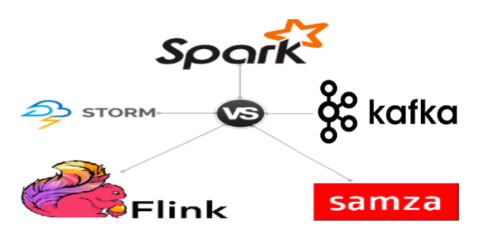
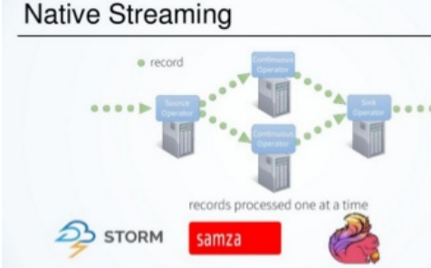
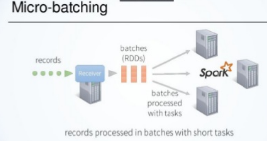
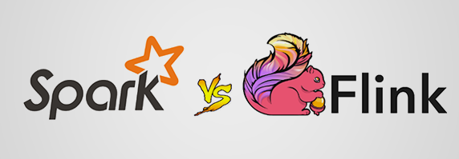

# [Spark Streaming，Flink，Kafka Streams：如何选择流处理框架](https://aijishu.com/a/1060000000119643)

[学习分享](https://aijishu.com/t/learning)

根据最新的统计显示，仅在过去的两年中，当今世界上90％的数据都是在新产生的，每天创建2.5万亿字节的数据，并且随着新设备，传感器和技术的出现，数据增长速度可能会进一步加快。
从技术上讲，这意味着我们的大数据处理将变得更加复杂且更具挑战性。而且，许多用例（例如，移动应用广告，欺诈检测，出租车预订，病人监护等）都需要在数据到达时进行实时数据处理，以便做出快速可行的决策。这就是为什么分布式流处理在大数据世界中变得非常流行的原因。

如今，有许多可用的开源流框架。有趣的是，几乎所有它们都是相当新的，仅在最近几年才开发出来。因此，对于新手来说，很容易混淆流框架之间的理解和区分。在本文中，我将首先大致讨论流处理的类型和方面，然后比较最受欢迎的开源流框架：Flink，SparkStreaming，Storm，KafkaStream。我将尝试（简要地）解释它们的工作原理，它们的用例，优势，局限性，异同。

## **什么是流/流处理：**

流处理的最优雅的定义是：一种数据处理引擎，其设计时考虑了无限的数据集。

与批处理不同，批处理以工作中的开始和结束为界，而工作是在处理有限数据之后完成的，而流处理则是指连续不断地处理天，月，年和永久到来的无边界数据。因此，流媒体应用程序始终需要启动和运行，因此难以实现且难以维护。

**流处理的重要方面：**

为了理解任何Streaming框架的优点和局限性，我们应该了解与Stream处理相关的一些重要特征和术语：

- *交付保证*：
  这意味着无论如何，流引擎中的特定传入记录都将得到处理的保证。可以是**at least once（至少一次）**（即使发生故障也至少处理一次），at **most once : 至\*多一次\***（如果发生故障则可能不处理）或**Exactly-once**（即使失败在这种情况下也只能处理一次））。显然，只处理一次是最好的，但是很难在分布式系统中实现，并且需要权衡性能。
- *容错：*
  如果发生诸如节点故障，网络故障等故障，框架应该能够恢复，并且应该从其离开的位置开始重新处理。这是通过不时检查流向某些持久性存储的状态来实现的。例如，从Kafka获取记录并对其进行处理后，将Kafka检查点偏移给Zookeeper。
- *状态管理：*在有状态处理需求的情况下，我们需要保持某种状态（例如，记录中每个不重复单词的计数），框架应该能够提供某种机制来保存和更新状态信息。
- *性能*：
  这包括延迟（可以多久处理一条记录），吞吐量（每秒处理的记录数）和可伸缩性。延迟应尽可能小，而吞吐量应尽可能大。很难同时获得两者。
- *高级功能：事件时间处理，水印，窗口化*
  如果流处理要求很复杂*，*这些是必需的功能。例如，根据在源中生成记录的时间来处理记录（事件时间处理）。
- *成熟度：*从采用的角度来看很重要，如果框架已经过大公司的验证和大规模测试，那就太好了。更有可能获得良好的社区支持并在堆栈溢出方面提供帮助。

**流处理的两种类型：**

现在了解了我们刚刚讨论的术语，现在很容易理解，有两种方法可以实现Streaming框架：

*原生流处理*：
这意味着每条到达的记录都会在到达后立即处理，而无需等待其他记录。有一些连续运行的过程（根据框架，我们称之为操作员/任务/螺栓），这些过程将永远运行，每条记录都将通过这些过程进行处理。示例：Storm，Flink，Kafka Streams，Samza。

*微批处理*：
也称为快速批处理。这意味着每隔几秒钟就会将传入的记录分批处理，然后以单个小批处理的方式处理，延迟几秒钟。例如：Spark Streaming, Storm-Trident。

两种方法都有其优点和缺点。
原生流传输感觉很自然，因为每条记录都会在到达记录后立即进行处理，从而使框架能够实现最小的延迟。但这也意味着在不影响吞吐量的情况下很难实现容错，因为对于每条记录，我们都需要在处理后跟踪和检查点。而且，状态管理很容易，因为有长时间运行的进程可以轻松维护所需的状态。

另一方面，微批处理则完全相反。容错是免费提供的，因为它本质上是一个批处理，吞吐量也很高，因为处理和检查点将在一组记录中一次性完成。但这会花费一定的等待时间，并且感觉不自然。高效的状态管理也将是维持的挑战。

## **流框架对比：**

**Storm :**

Storm是流处理世界的强者。它是最古老的开源流框架，也是最成熟和可靠的框架之一。这是真正的流传输，适合基于简单事件的用例。

*优点*：

- 极低的延迟，真正的流，成熟和高吞吐量
- 非常适合简单的流媒体用例

*缺点*

- 没有状态管理
- 没有高级功能，例如事件时间处理，聚合，开窗，会话，水印等
- 一次保证

**Spark Streaming :**

Spark已成为批处理中hadoop的真正继任者，并且是第一个完全支持Lambda架构的框架（在该框架中，实现了批处理和流传输；实现了正确性的批处理；实现了流传输的速度）。它非常受欢迎，成熟并被广泛采用。Spark Streaming是随Spark免费提供的，它使用微批处理进行流媒体处理。在2.0版本之前，Spark Streaming有一些严重的性能限制，但是在新版本2.0+中，它被称为结构化流，并具有许多良好的功能，例如自定义内存管理（类似flink），水印，事件时间处理支持等。另外，结构化流媒体更加抽象，在2.3.0版本以后，可以选择在微批量和连续流媒体模式之间进行切换。连续流模式有望带来像Storm和Flink这样的子延迟，但是它仍处于起步阶段，操作上有很多限制。

*优点*：

- 支持Lambda架构，Spark免费提供
- 高吞吐量，适用于不需要亚延迟的许多使用情况
- 由于微批量性质，默认情况下具有容错能力
- 简单易用的高级API
- 庞大的社区和积极的改进
- 恰好一次

*缺点*

- 不是真正的流，不适合低延迟要求
- 要调整的参数太多。很难做到正确。
- 天生无国籍
- 在许多高级功能方面落后于Flink

**Flink** :

Flink也来自类似Spark这样的学术背景。Spark来自加州大学伯克利分校，而Flink来自柏林工业大学。像Spark一样，它也支持Lambda架构。但是实现与Spark完全相反。虽然Spark本质上是一个批处理，其中Spark流是微批处理，并且是Spark Batch的特例，但Flink本质上是一个真正的流引擎，将批处理视为带边界数据流的特例。尽管这两个框架中的API都是相似的，但是它们在实现上没有任何相似性。在Flink中，诸如map，filter，reduce等的每个函数都实现为长时间运行的运算符（类似于Storm中的Bolt）

Flink看起来像是Storm的真正继承者，就像Spark批量继承了hadoop一样。

*优点*：

- 开源流媒体领域创新的领导者
- 具有所有高级功能（例如事件时间处理，水印等）的第一个True流框架
- 低延迟，高吞吐量，可根据要求进行配置
- 自动调整，无需调整太多参数
- 恰好一次
- 被Uber，阿里巴巴等大型公司广泛接受。

*缺点*

- 起步较晚，最初缺乏采用
- 社区不如Spark大，但现在正在快速发展

**Kafka Streams :**

与其他流框架不同，Kafka Streams是一个轻量级的库。对于从Kafka流式传输数据，进行转换然后发送回kafka很有用。我们可以将其理解为类似于Java Executor服务线程池的库，但具有对Kafka的内置支持。它可以与任何应用程序很好地集成，并且可以立即使用。

由于其重量轻的特性，可用于微服务类型的体系结构。Flink在性能方面没有匹配之处，而且不需要运行单独的集群，非常方便并且易于部署和开始工作。

Kafka Streams的一个主要优点是它的处理是完全精确的端到端。可能是因为来源和目的地均为Kafka以及从2017年6月左右发布的Kafka 0.11版本开始，仅支持一次。要启用此功能，我们只需要启用一个标志即可使用。

*优点*：

- 重量很轻的库，适合微服务，IOT应用
- 不需要专用集群
- 继承卡夫卡的所有优良特性
- 支持流连接，内部使用rocksDb维护状态。
- 恰好一次（从Kafka 0.11开始）。

*缺点*

- 与卡夫卡紧密结合，在没有卡夫卡的情况下无法使用
- 婴儿期还很新，尚待大公司测试
- 不适用于繁重的工作，例如Spark Streaming，Flink。

**Samza :**

简短介绍一下Samza。（Samza）看上去就像是（Kafka Streams）。有很多相似之处。这两个框架都是由同一位开发人员开发的，这些开发人员在LinkedIn上实现了Samza，然后在他们创建Kafka Streams的地方成立了Confluent。这两种技术都与Kafka紧密结合，从Kafka获取原始数据，然后将处理后的数据放回Kafka。使用相同的Kafka Log哲学。Samza是Kafka Streams的缩放版本。Kafka Streams是一个用于微服务的库，而Samza是在Yarn上运行的完整框架集群处理。
优点 ：

- 使用rocksDb和kafka日志可以很好地维护大量信息状态（适合于连接流的用例）。
- 使用Kafka属性的容错和高性能
- 如果已在处理管道中使用Yarn和Kafka，则要考虑的选项之一。
- 低延迟，高吞吐量，成熟并经过大规模测试

缺点：

- 与Kafka和Yarn紧密结合。如果这些都不在您的处理管道中，则不容易使用。
- 至少一次加工保证。我不确定它是否像Kafka 0.11之后的Kafka Streams现在完全支持一次
- 缺少高级流功能，例如水印，会话，触发器等

**流框架比较：**

我们只能将技术与类似产品进行比较。尽管Storm，Kafka Streams和Samza现在对于更简单的用例很有用，但具有最新功能的重量级产品之间的真正竞争显而易见：Spark vs Flink

当我们谈论比较时，我们通常会问：*给我看数字*

基准测试是仅当第三方进行比较时比较的好方法。

例如，但这是在Spark Streaming 2.0之前的某个时期，当时它受RDD的限制。
现在，随着Structured Streaming 2.0版本的发布，Spark Streaming试图赶上很多潮流，而且似乎还会面临艰巨的挑战。

最近，基准测试已成为Spark和Flink之间的一场激烈争吵。

最好不要相信这些天的基准测试，因为即使很小的调整也可以完全改变数字。没有什么比决定之前尝试和测试自己更好。
到目前为止，很明显，Flink在流分析领域处于领先地位，它具有大多数所需的方面，例如精确一次，吞吐量，延迟，状态管理，容错，高级功能等。

Flink的一个重要问题是成熟度和采用水平，直到一段时间之前，但是现在像Uber，Alibaba，CapitalOne这样的公司正在大规模使用Flink流传输，证明了Flink Streaming的潜力。

最近，Uber开源了其最新的流分析框架AthenaX，该框架基于Flink引擎构建。

如果您已经注意到，需要注意的重要一点是，所有支持状态管理的原生流框架（例如Flink，Kafka Streams，Samza）在内部都使用RocksDb。RocksDb从某种意义上说是独一无二的，它在每个节点上本地保持持久状态，并且性能很高。它已成为新流系统的关键部分。

**如何选择最佳的流媒体框架：**

这是最重要的部分。诚实的答案是：**这取决于** :

必须牢记，对于每个用例，没有一个单一的处理框架可以成为万灵丹。每个框架都有其优点和局限性。尽管如此，根据一些经验，他们仍然会分享一些有助于做出决定的建议：

1. 取决于用例：
   如果用例很简单，那么如果学习和实现起来很复杂，则无需寻求最新，最好的框架。在很大程度上取决于我们愿意投资多少来换取我们想要的回报。例如，如果它是基于事件的简单IOT事件警报系统，那么Storm或Kafka Streams非常适合使用。
2. 未来考虑因素：
   同时，我们还需要对未来可能的用例进行自觉考虑。将来可能会出现对诸如事件时间处理，聚合，流加入等高级功能的需求吗？如果答案是肯定的，则最好继续使用高级流框架（例如Spark Streaming或Flink）。一旦对一项技术进行了投资和实施，其变更的困难和巨大成本将在以后改变。例如，在之前的公司中，从过去的两年开始，Storm管道就已经启动并运行，并且在要求统一输入事件并仅报告唯一事件之前，它一直运行良好。现在，这需要状态管理，而Storm本身并不支持这种状态管理。虽然我使用基于时间的内存哈希表实现，但是在重启时状态会消失是有限制的。
3. 我要提出的观点是，如果我们尝试自行实现框架未明确提供的某些内容，则势必会遇到未知问题。
4. 现有技术堆栈：
   另一重要点是考虑现有技术堆栈。如果现有堆栈的首尾相连是Kafka，则Kafka Streams或Samza可能更容易安装。同样，如果处理管道基于Lambda架构，并且Spark Ba​​tch或Flink Batch已经到位，则考虑使用Spark Streaming或Flink Streaming是有意义的。例如，在我以前的项目中，我已经在管道中添加了Spark Ba​​tch，因此，当流需求到来时，选择需要几乎相同的技能和代码库的Spark Streaming非常容易。

简而言之，如果我们很好地了解框架的优点和局限性以及用例，那么选择或至少过滤掉可用的选项就更加容易。最后，一旦选择了几个选项。毕竟每个人都有不同的选择。

Streaming的发展速度如此之快，以至于在信息方面，此帖子可能在几年后已经过时。目前，Spark和Flink在开发方面是领先的重量级人物，但仍有一些新手可以加入比赛。Apache Apex是其中之一。还有一些我没有介绍的专有流解决方案，例如Google Dataflow。我的这篇文章的目的是帮助刚接触流技术的人以最少的术语理解流技术的一些核心概念，以及流行的开源流框架的优点，局限性和用例。希望该文章对您有所帮助。