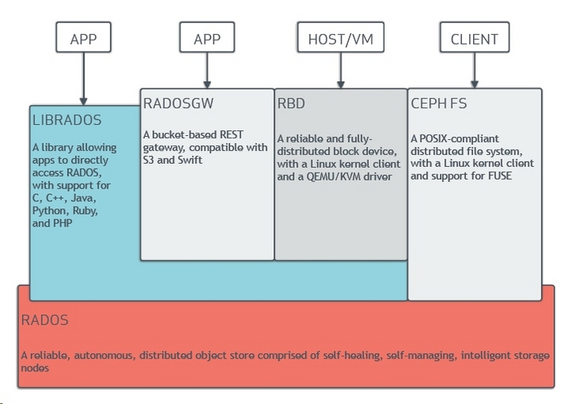
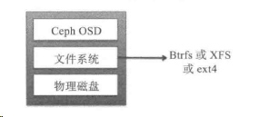
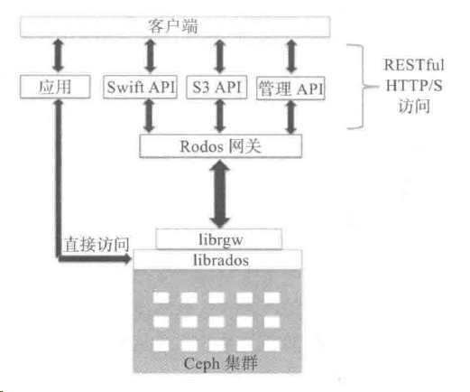
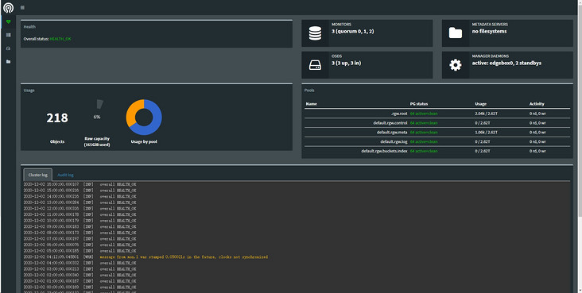
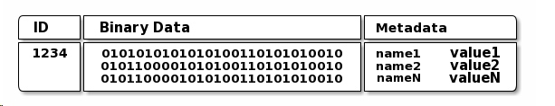
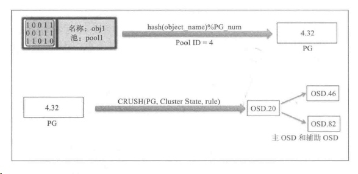
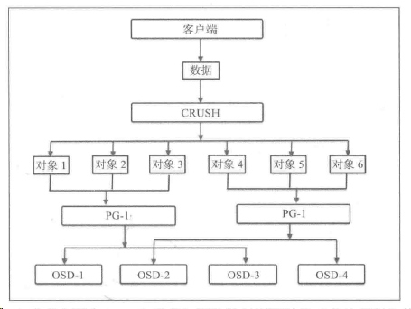
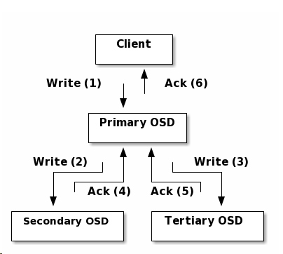

# [Ceph架构和原理](https://segmentfault.com/a/1190000038366631)

[**lvnux**](https://segmentfault.com/u/lvnux)发布于 2020-12-03


# 1. Ceph架构

## 1.1 Ceph存储架构

  Ceph独一无二地统一的系统提供了对象存储、块存储和文件存储功能。Ceph存储集群由几个不同的软件守护进程组成（比较重要的两个是MON和OSD），每个守护进程负责Ceph的一个独特功能并将值添加到相应的组件中。
    

Ceph术语简介：

- RADOS：**可靠、自动、分布式对象存储**（Reliable Autonomic Distributed Object Store），它是Ceph存储集群的基础。Ceph中的一切都是以对象的形式存储，而RADOS就负责存储这些对象，而不考虑它们的数据类型。RADOS层确保数据一致性和可靠性。对于数据一致性，它执行数据复制、故障检测和恢复，还包括数据在集群节点间的迁移和再平衡。
- OSD：**Ceph 对象存储设备**，它是Ceph集群中存储实际用户数据并响应客户端读操作请求的唯一组件。
- MON：**Ceph 监视器（Ceph monitor）**，MON组件通过一系列的map来跟踪整个集群的健康状态，一个MON为每一个组件维护一个独立的map，如OSD、MON、PG、CRUSH。MON不存储实际数据。
- librados：**librados库是一种用来简化访问RADOS的方法**，目前支持PHP、Python、Ruby、Java、Python、C和C++语言。librados是RBD和RGW的基础，并为CephFS提供POSIX接口。
- RBD：**Ceph 块设备**，它对外提供块存储，可以被映射、格式化进而像其他磁盘一样挂载到服务器。
- RGW/RADOSGW：**Ceph 对象网关**，它提供了一个兼容S3和Swift的restful API接口。
- MDS：**Ceph 元数据服务器**，MDS跟踪文件层次结构并存储只供CephFS使用的元数据。RBD和RGW不需要元数据，因此它们不需要MDS。
- CephFS：**Ceph 文件系统**，CephFS提供了一个任意大小且兼容POSIX的分布式文件系统。CephFS依赖MDS来跟踪文件层次结构，即元数据。
- MGR： **Ceph Manager**，Ceph管理器软件，可以收集整个集群的所有状态。有仪表板插件。
- PG：**placement groups，归置组**，一组对象的逻辑集合。
- PGP：**PGP是为实现定位而设置的PG，它的值应该与PG的总数保持一致。**
- POOL：**Ceph 池**，是一个用来存储对象的逻辑分区，方便管理对象。

## 1.2 RADOS

  RADOS是Ceph存储系统的核心，也称为Ceph存储集群。Ceph的数据访问方法（如RBD、CephFS、RADOSGW、librados）的所有操作都是在RADOS层之上构建的。当Ceph集群接收到来自客户端的写请求时，CRUSH算法首先计算出存储位置，然后这些信息传递到RADOS层进行进一步处理。RADOS以小对象的形式将数据分发到集群内的所有节点，最后将这些对象存储在OSD中。当配置的复制数大于1时，RADOS负责数据的可靠性，它复制对象，创建副本并将它们存储在不同的故障区域中。
  RADOS包含两个核心组件：OSD和MON。

### 1.2.1 OSD

  OSD是Ceph存储集群中最重要的一个基础组件，它负责将实际的数据`以对象的形式`存储在每一个集群节点的物理磁盘中。对于任何读写操作，客户端首先向MON请求集群的map，然后客户端就可以直接和OSD进行I/O操作。
  一个Ceph集群包含多个OSD。**`一个典型的Ceph集群部署方案会为集群节点上的每个物理磁盘创建一个OSD守护进程，这是推荐的做法。`**OSD上的每个对象都有一个主副本和几个辅副本，辅副本分散在其他OSD。一个OSD对于一些对象是主副本，同时对于其他对象可能是辅副本，存放辅副本的OSD手主副本OSD控制，如果主副本OSD异常（或者对应的磁盘故障），辅副本OSD可以成为主副本OSD。
  OSD由一个已经存在Linux文件系统的物理磁盘驱动器和OSD服务组成。Ceph推荐OSD使用的文件系统是XFS。OSD的所有写都是先到日志，再到存储。
    

### 1.2.2 MON

  MON负责监控整个集群的健康状况。它以守护进程的形式存在，一个MON为每一个组件维护一个独立的map，如OSD、MON、PG、CRUSH和MDS map。这些map统称为集群map。MON不为客户端存储和提供数据，它为客户端以及集群内其他节点提供更新集群map的服务。客户端和集群内其他节点定期与MON确认自己持有的是否是集群最新的map。一个Ceph集群通常包含多个MON节点，但是同一时间只有一个领导者MON。

### 1.2.3 librados

  librados是一个本地的C语言库，通过它应用程序可以直接和RADOS通信，提高性能。

### 1.2.4 RBD

  RBD对外提供块存储，可以被映射、格式化进而像其他磁盘一样挂载到服务器。
    

  Linux内核RBD（KRBD）通过librados映射Ceph块设备，然后RADOS将Ceph块设备的对象以分布式模式存储在集群中。一旦Ceph块设备映射到Linux主机，它也可以当作裸分区或标记为文件系统进行挂载。RBD利用librbd库来获取RADOS的好处并提供高可靠、分布式、基于对象的块存储。当客户端向RBD写入数据时，librbd库将数据块映射到对象进而存储在Ceph集群中，删除这些数据对象，并跨集群复制这些对象，从而提供更好的性能和可靠性。

### 1.2.5 RGW/RADOSGW

  RGW，Ceph对象网关，也称做RADOS网关，它是一个代理，可以将HTTP请求转换为RADOS，也可以把RADOS转换为HTTP请求，从而提供restful接口，兼容S3和Swift。Ceph对象网关使用Ceph对象网关守护进程(RGW)与librgw、librados交互。Ceph对象网关支持三类接口：S3、Swift、管理API（通过restful接口管理Ceph集群）。**RGW有自己的用户管理体系。**
    

## 1.3 MDS

  MDS是元数据服务器，跟踪文件层次结构并存储元数据。只有CephFS才需要。

## 1.4 CephFS

  CephFS在RADOS层之上提供了一个兼容POSIX的文件系统。它使用MDS作为守护进程，负责管理其元数据并将它和其他数据分开。CephFS使用cephfuse模块（FUSE）扩展其在用户空间文件系统方面的支持（就是将CephFS挂载到客户端机器上）。**它还允许直接与应用程序交互，使用libcephfs库直接访问RADOS集群。**

## 1.5 MGR

  Ceph管理器软件，可以收集整个集群的所有状态。有仪表板插件。


# 2. Ceph原理

## 2.1 对象

  一个对象通常包含绑定在一起的数据和元数据，并且用一个全局唯一的标识符标识。这个唯一的标识符确保在整个存储集群中没有其他对象使用相同的对象ID，保证对象唯一性。基于文件的存储中，文件大小是有限制的，与此不同的是，对象的大小是可以随着大小可变的元数据而变得很大。对象不使用一个目录层次结构或树结构来存储，相反，它存储在一个包含数十亿对象且没有任何复杂性的线性地址空间中。对象可以存储在本地，也可以存放在地理上分开的线性地址空间中，也就是说，在一个连续的存储空间中。任何应用程序都可以基于对象ID通过调用restful API从对象中获取数据。这个URL可以以同样的方式工作在因特网上，一个对象ID作为一个唯一的指针指向对象。这些对象都以复制的方式存储在OSD中，因为能提供高可用性。
    

## 2.2 CRUSH

  对于Ceph集群的一次读写操作，客户端首先联系MON获取一个集群map副本，然后使用对象和池名/ID将数据转换为对象。接着将对象和PG数一起经过散列来生成其在Ceph池中最终存放的那一个PG。然后前面计算好的PG经过CRUSH查找来确定存储或获取数据所需的主OSD的位置。得到准确的OSD ID之后，客户端直接联系这个OSD来存取数据。所有这些计算操作都由客户端来执行，因此它不会影响Ceph集群的性能。一旦数据被写入主OSD，主OSD所在节点将执行CRUSH查找辅助PG和OSD的位置来实现数据复制，进而实现高可用。
  简单地说，首先基于池ID将对象名和集群PG数应用散列函数得到一个PG ID，然后，针对这个PG ID执行CRUSH查找得到主OSD和辅助OSD，最后写入数据。
    

## 2.3 PG

  PG是一组对象地逻辑集合，通过复制它到不同的OSD上来提供存储系统的可靠性。根据Ceph池的复制级别，每个PG的数据会被复制并分发到Ceph集群的多个OSD上。可以将PG看成一个逻辑容器，这个容器包含多个对象，同时这个逻辑容器被映射到多个OSD。
  计算正确的PG数对一个Ceph存储集群来说是至关重要的一步。PG数计算公式如下：

```abnf
PG总数 = (OSD总数 * 100) / 最大副本数
```

    

## 2.4 Ceph池

  Ceph池是一个用来存储对象的逻辑分区，每个池都包含一定数量的PG，进而实现把一定数量的对象映射到集群内部不同OSD上的目的。每一个池都是交叉分布在集群所有节点上的，这样就能提供足够的弹性。池可以通过创建需要的副本数来保障数据的高可用性。
  Ceph的池还支持快照功能，我们可以使用`ceph osd pool mksnap`命令来给特定的池制作快照。此外，Ceph池还允许我们为对象设置所有者和访问权限。

## 2.5 Ceph数据管理

  数据管理始于客户端向Ceph池中写数据。一旦客户端准备写数据到Ceph池中，数据首先写入基于池副本数的主OSD中。主OSD再复制相同的数据到每个辅助OSD中，并等待它们确认写入完成。只要辅助OSD完成数据写入，就会发送一个应答信号给主OSD。最后主OSD再返回一个应答信号给客户端，以确认完成整个写入操作。
    

[ceph](https://segmentfault.com/t/ceph)