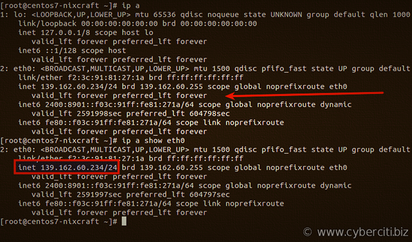
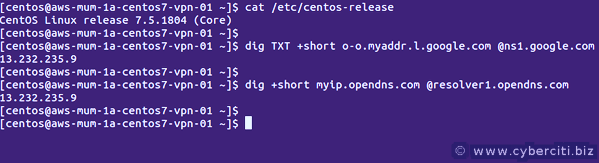
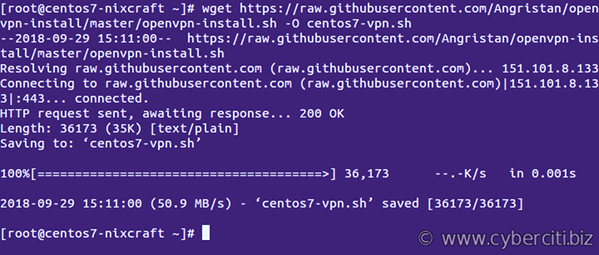
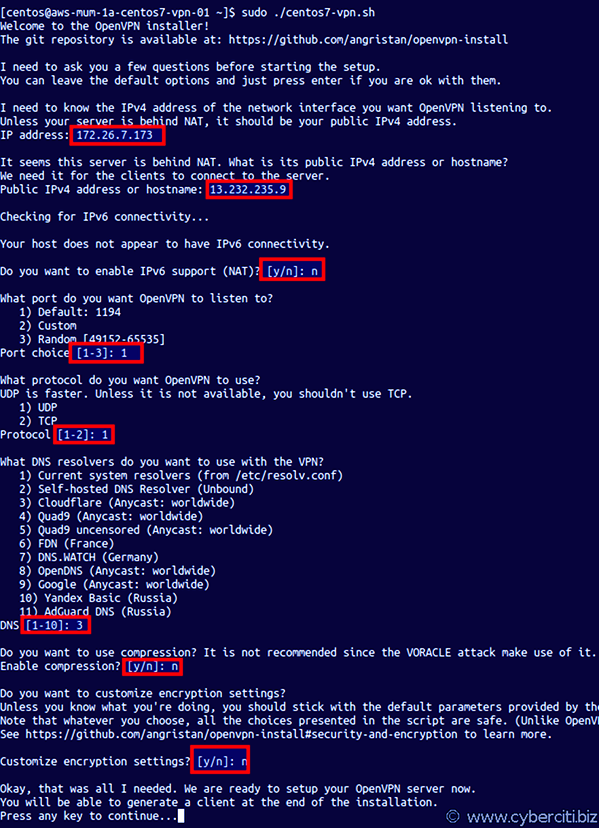
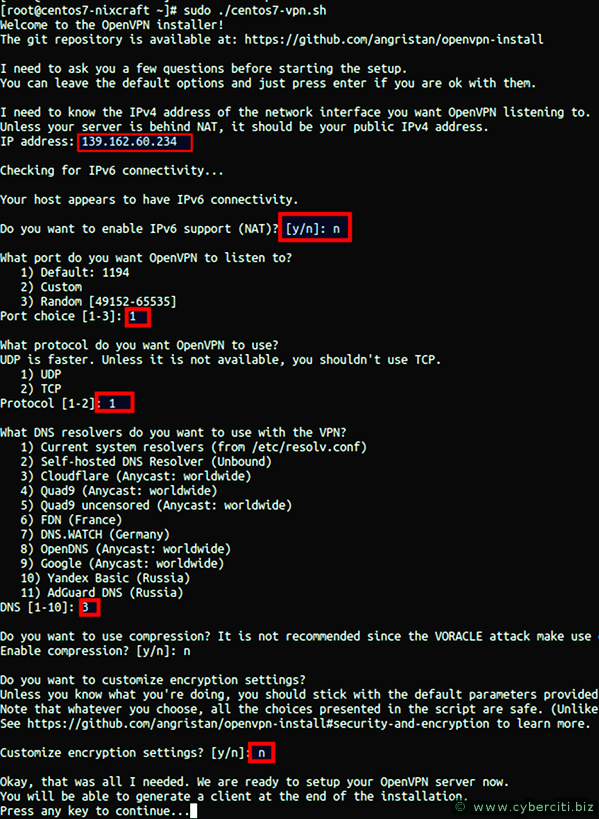
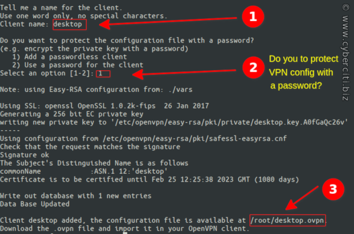
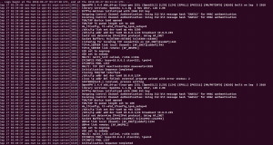
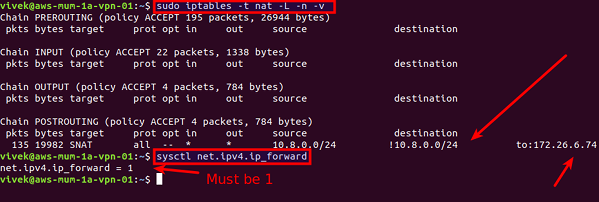
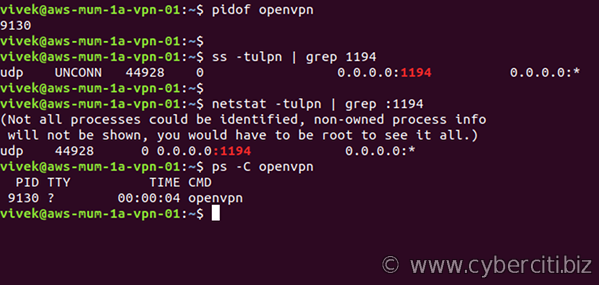

# CentOS 7 Set Up OpenVPN Server In 5 Minutes

Author: Vivek Gite Last updated: January 14, 2021 [3 comments](https://www.cyberciti.biz/faq/centos-7-0-set-up-openvpn-server-in-5-minutes/#comments)

[](https://www.cyberciti.biz/faq/category/openvpn/)

Iam a new CentOS Linux 7 server user. How do I set up an OpenVPN Server on CentOS 7 Linux server to shield my browsing activity from bad guys on public Wi-Fi, and more?

**Introduction** OpenVPN is a full-featured SSL VPN (virtual private network). It implements OSI layer 2 or 3 secure network extension using the SSL/TLS protocol. It is an open source software and distributed under the GNU GPL. A VPN allows you to connect securely to an insecure public network such as wifi network at the airport or hotel. VPN is also required to access your corporate or enterprise or home server resources. You can bypass the geo-blocked site and increase your privacy or safety online. This tutorial provides step-by-step instructions for configuring an OpenVPN server on CentOS Linux 7 server.


## Procedure: CentOS 7 Set Up OpenVPN Server In 5 Minutes

The steps are as follows:

### Step 1 – Update your system

Run the [yum command](https://www.cyberciti.biz/faq/rhel-centos-fedora-linux-yum-command-howto/):
`{vivek@centos7:~ }$ **sudo yum update**`

### Step 2 – Find and note down your IP address

Use the [ip command](https://www.cyberciti.biz/faq/linux-ip-command-examples-usage-syntax/) as follows:
`{vivek@centos7:~ }$ **ip a**{vivek@centos7:~ }$ **ip a show eth0**`

Another option is to run the following [dig command](https://www.cyberciti.biz/faq/linux-unix-dig-command-examples-usage-syntax/)/[host command](https://www.cyberciti.biz/faq/linux-unix-host-command-examples-usage-syntax/) to find out [your public IP address from Linux command line](https://www.cyberciti.biz/faq/how-to-find-my-public-ip-address-from-command-line-on-a-linux/):
`{vivek@centos7:~ }$ **dig +short myip.opendns.com @resolver1.opendns.com**`
One can grab [find IPv4 address](https://www.cyberciti.biz/faq/how-to-find-my-public-ip-address-from-command-line-on-a-linux/) using the dig and awk command:
`{vivek@centos7:~ }$ **dig -4 TXT +short o-o.myaddr.l.google.com @ns1.google.com | awk -F'"' '{ print $2}'**`
For IPv6 version, try:
`{vivek@centos7:~ }$ **dig -6 TXT +short o-o.myaddr.l.google.com @ns1.google.com | awk -F'"' '{ print $2}'**`

[](https://www.cyberciti.biz/faq/how-to-find-my-public-ip-address-from-command-line-on-a-linux/)

Finding out AWS/EC2 or Lighsail NAT IP address from the CLI

### A note about IP address

Most cloud servers have two types of IP address:

1. **Public static IP address directly** assigned to your box and routed from the Internet. For example, Linode, Digital Ocean, and others gives you direct public IP address.
2. Private static IP address directly attached to your server and **your server is behind NAT with public IP** address. For example, AWS EC2/Lightsail give you this kind of NAT public IP address.

The script will automatically detect your networking setup. All you have to do is provide correct IP address when asked for it.

### Step 3 – Download and run centos7-vpn.sh script

I am going to use the wget command:
`{vivek@centos7:~ }$ **wget https://raw.githubusercontent.com/Angristan/openvpn-install/master/openvpn-install.sh -O centos7-vpn.sh**`

Setup permissions using the chmod command`{vivek@centos7:~ }$ **chmod +x centos7-vpn.sh**`
One can view the script using a text editor such as vim/vi :
`{vivek@centos7:~ }$ **vi centos7-vpn.sh**`


#### Run centos7-vpn.sh to install OpenVPN server

Now all you have to do is:
`{vivek@centos7:~ }$ **sudo ./centos7-vpn.sh**`
Sample session **from AWS/Lightsail where my cloud server is behind NAT**:



Sample session from **Linode/DO server where cloud server has direct public IPv4 address**:

To avoid problem always choose DNS as 1.1.1.1 or Google DNS. Those are fast DNS server and reached from anywhere on the Internet.


### VPN client config

At the end of the installation, you need to provide a client name. We can choose client names such as desktop for desktop VPN client or ios for Apple iPhone and so on. We can also encrypt the private key with a password for added security. So every time you start a VPN session, you need to provide a password for added security reasons:



Do you want to protect the configuration file with a password?

#### How do I start/stop/restart OpenVPN server on CentOS 7 ?

```
{vivek@centos7:~ }$ **sudo systemctl stop openvpn@server** #<--- stop server{vivek@centos7:~ }$ **sudo systemctl start openvpn@server** #<--- start server{vivek@centos7:~ }$ **sudo systemctl restart openvpn@server** #<--- restart server{vivek@centos7:~ }$ **sudo systemctl status openvpn@server** #<--- get server status
```

### Step 4 – Connect an OpenVPN server using IOS/Android/Linux/Windows client

On server your will find a client configuration file called ~/desktop.ovpn. All you have to do is copy this file to your local desktop using the scp command:
`{vivek@centos7:~ }$ **scp vivek@139.162.60.234:~/deskcop.ovpn .**`
OR
`{vivek@centos7:~ }$ **scp root@139.162.60.234:~/deskcop.ovpn .**`
Next, provide this file to your OpenVPN client to connect:

1. Apple app store: [Apple iOS client](https://itunes.apple.com/us/app/openvpn-connect/id590379981?mt=8)
2. Google play store: [Android client](https://play.google.com/store/apps/details?id=net.openvpn.openvpn&hl=en)
3. [Apple MacOS (OS X) client](https://tunnelblick.net/)
4. [Windows 8/10 client](https://openvpn.net/index.php/open-source/downloads.html)

#### Linux Desktop: OpenVPN client configuration

First, install the openvpn client for your desktop as per your distro.

##### CentOS/RHEL/Oracle Linux desktop

Execute the [yum command](https://www.cyberciti.biz/faq/rhel-centos-fedora-linux-yum-command-howto/):
`{vivek@centos7:~ }$ **sudo yum install openvpn**`

##### Fedora Linux desktop

Run the dnf command:
`{vivek@centos7:~ }$ **sudo dnf install openvpn**`

##### Debian/Ubuntu Linux destkop

We need use the [apt command](https://www.cyberciti.biz/faq/ubuntu-lts-debian-linux-apt-command-examples/)/[apt-get command](https://www.cyberciti.biz/tips/linux-debian-package-management-cheat-sheet.html):
`{vivek@centos7:~ }$ **sudo apt install openvpn**`
Next, copy desktop.ovpn as follows:
`{vivek@centos7:~ }$ **sudo cp desktop.ovpn /etc/openvpn/client.conf**`
Test connectivity from the CLI:
`{vivek@centos7:~ }$ **sudo openvpn --client --config /etc/openvpn/desktop.conf**`
Your Linux system will automatically connect when computer restart using openvpn script/service:
`{vivek@centos7:~ }$ **sudo systemctl enable openvpn@client**{vivek@centos7:~ }$ **sudo systemctl start openvpn@client**`

### Step 5 – Verify/test the connectivity

Execute the following commands after connecting to OpenVPN server from your Linux desktop:
`{vivek@centos7:~ }$ **ping 10.8.0.1** #Ping to the OpenVPN server gateway{vivek@centos7:~ }$ **ip route** #Make sure routing setup working{vivek@centos7:~ }$ **dig TXT +short o-o.myaddr.l.google.com @ns1.google.com** #Must return public IP address of OpenVPN server`

### Step 6 – How to add additional OpenVPN client on a CentOS 7

First, log in to your openvpn based CentOS 7 server using the ssh command:
`ssh vivek@your-centos7-server-ip`
Run downloaded centos7-vpn.sh script again:
`sudo ./centos7-vpn.sh`
Sample session:

```
Welcome to OpenVPN-install!
The git repository is available at: https://github.com/angristan/openvpn-install
 
It looks like OpenVPN is already installed.
 
What do you want to do?
   1) Add a new user
   2) Revoke existing user
   3) Remove OpenVPN
   4) Exit
Select an option [1-4]:
```

We can now add a new VPN user or delete existing VPN user.

## A note about trouble shooting OpenVPN server and client issues

Check OpenVPN server for errors:
`{vivek@centos7:~ }$ **journalctl --identifier openvpn**`

[](https://www.cyberciti.biz/media/new/faq/2018/09/OpenVPN-server-log-files-and-error.png)

Click to enlarge image

Is firewall rule setup correctly on your server? Use the [cat command](https://www.cyberciti.biz/faq/linux-unix-appleosx-bsd-cat-command-examples/) to see rules:
`{vivek@centos7:~ }$ **sudo cat /etc/iptables/add-openvpn-rules.sh**`

```
#!/bin/sh
iptables -t nat -I POSTROUTING 1 -s 10.8.0.0/24 -o eth0 -j MASQUERADE
iptables -I INPUT 1 -i tun0 -j ACCEPT
iptables -I FORWARD 1 -i eth0 -o tun0 -j ACCEPT
iptables -I FORWARD 1 -i tun0 -o eth0 -j ACCEPT
iptables -I INPUT 1 -i eth0 -p udp --dport 1194 -j ACCEPT
```

Another option is to run iptables command and sysctl command commands to verify NAT rule setup on your server:
`{vivek@centos7:~ }$ **sudo iptables -t nat -L -n -v**{vivek@centos7:~ }$ **sysctl net.ipv4.ip_forward**`

Insert the rules if not inserted from/etc/iptables/add-openvpn-rules.sh
`{vivek@centos7:~ }$ **sudo sh /etc/iptables/add-openvpn-rules.sh**{vivek@centos7:~ }$ **sudo sysctl -w net.ipv4.ip_forward=1**`
Is OpenVPN server running and port is open? Use the ss command or netstat command and [pidof command](https://www.cyberciti.biz/faq/linux-pidof-command-examples-find-pid-of-program/)/ps command:
`{vivek@centos7:~ }$ **netstat -tulpn | grep :1194** ## 1194 is the openvpn server port ##{vivek@centos7:~ }$ **ss -tulpn | grep :1194** ## 1194 is the openvpn server port ##{vivek@centos7:~ }$ **ps aux | grep openvpn** ## is the openvpn server running? ##{vivek@centos7:~ }$ **ps -C openvpn** ## is the openvpn server running? ##{vivek@centos7:~ }$ **pidof openvpn** ## find the openvpn server PID ##`

If not running, restart the OpenVPN server:
`{vivek@centos7:~ }$ **sudo systemctl restart openvpn@server**`
Look out for errors:
`{vivek@centos7:~ }$ **sudo systemctl status openvpn@server**`
Can the Linux desktop client connect to the OpenVPN server machine? First you need to run a simple test to see if the OpenVPN server port (UDP 1194) accepts connections:
`{vivek@centos7:~ }$ **nc -vu 139.162.60.234 1194**Connection to 139.162.60.234 1194 port [udp/openvpn] succeeded!`
If not connected it means either a Linux desktop firewall or your router is blocking access to server. Make sure both client and server using same protocol and port, e.g. UDP port 1194.

## Conclusion

Congratulations. You successfully set up an OpenVPN server on CentOS Linux 7.0 server running in the cloud. See the OpenVPN website [here](https://openvpn.net/) and script site [here](https://github.com/angristan/openvpn-install) for additional information.

This entry is **7** of **11** in the **OpenVPN Tutorial** series. Keep reading the rest of the series:

1. [How To Setup OpenVPN Server In 5 Minutes on Ubuntu Server](https://www.cyberciti.biz/faq/howto-setup-openvpn-server-on-ubuntu-linux-14-04-or-16-04-lts/)
2. [Install Pi-hole with an OpenVPN to block ads](https://www.cyberciti.biz/faq/ubuntu-linux-install-pi-hole-with-a-openvpn/)
3. [Update/upgrade Pi-hole with an OpenVPN](https://www.cyberciti.biz/faq/how-to-updateupgrade-pi-hole-with-an-openvpn-on-ubuntudebian-linux-server/)
4. [OpenVPN server on Debian 9/8](https://www.cyberciti.biz/faq/install-configure-openvpn-server-on-debian-9-linux/)
5. [Import a OpenVPN .ovpn file with Network Manager](https://www.cyberciti.biz/faq/linux-import-openvpn-ovpn-file-with-networkmanager-commandline/)
6. [Ubuntu 18.04 LTS Set Up OpenVPN Server In 5 Minutes](https://www.cyberciti.biz/faq/ubuntu-18-04-lts-set-up-openvpn-server-in-5-minutes/)
7. CentOS 7 Set Up OpenVPN Server In 5 Minutes
8. [Pi-Hole and Cloudflare DoH config](https://www.cyberciti.biz/faq/configure-ubuntu-pi-hole-for-cloudflare-dns-over-https/)
9. [Debian 10 Set Up OpenVPN Server In 5 Minutes](https://www.cyberciti.biz/faq/debian-10-set-up-openvpn-server-in-5-minutes/)
10. [CentOS 8 OpenVPN server in 5 mintues](https://www.cyberciti.biz/faq/centos-8-set-up-openvpn-server-in-5-minutes/)
11. [Ubuntu 20.04 LTS OpenVPN server in 5 mintues](https://www.cyberciti.biz/faq/ubuntu-20-04-lts-set-up-openvpn-server-in-5-minutes/)


🐧 Please **support my work** on [Patreon](https://www.patreon.com/nixcraft) or with a [donation](https://www.paypal.com/cgi-bin/webscr?cmd=_s-xclick&hosted_button_id=LJF8UGD7QKF3U).
🐧 Get the latest tutorials on Linux, Open Source & DevOps via:

- **[RSS feed](https://www.cyberciti.biz/atom/atom.xml)** or **[Weekly email newsletter](https://newsletter.cyberciti.biz/subscription?f=1ojtmiv8892KQzyMsTF4YPr1pPSAhX2rq7Qfe5DiHMgXwKo892di4MTWyOdd976343rcNR6LhdG1f7k9H8929kMNMdWu3g)**
- Share on **[Twitter](https://twitter.com/intent/tweet?text=CentOS+7+Set+Up+OpenVPN+Server+In+5+Minutes&url=https://www.cyberciti.biz/faq/centos-7-0-set-up-openvpn-server-in-5-minutes/&via=nixcraft)** • **[Facebook](https://www.facebook.com/sharer/sharer.php?u=https://www.cyberciti.biz/faq/centos-7-0-set-up-openvpn-server-in-5-minutes/)** • 3 comments... [add one](https://www.cyberciti.biz/faq/centos-7-0-set-up-openvpn-server-in-5-minutes/#respond) **↓**

**Related Tutorials**

- [](https://www.cyberciti.biz/faq/centos-8-set-up-openvpn-server-in-5-minutes/)[CentOS 8 Set Up OpenVPN Server In 5 Minutes](https://www.cyberciti.biz/faq/centos-8-set-up-openvpn-server-in-5-minutes/)
- [](https://www.cyberciti.biz/faq/ubuntu-18-04-lts-set-up-openvpn-server-in-5-minutes/)[Ubuntu 18.04 LTS Set Up OpenVPN Server In 5 Minutes](https://www.cyberciti.biz/faq/ubuntu-18-04-lts-set-up-openvpn-server-in-5-minutes/)
- [](https://www.cyberciti.biz/faq/debian-10-set-up-openvpn-server-in-5-minutes/)[Debian 10 Set Up OpenVPN Server In 5 Minutes](https://www.cyberciti.biz/faq/debian-10-set-up-openvpn-server-in-5-minutes/)
- [](https://www.cyberciti.biz/faq/ubuntu-20-04-lts-set-up-openvpn-server-in-5-minutes/)[Ubuntu 20.04 LTS Set Up OpenVPN Server In 5 Minutes](https://www.cyberciti.biz/faq/ubuntu-20-04-lts-set-up-openvpn-server-in-5-minutes/)
- [](https://www.cyberciti.biz/faq/howto-setup-openvpn-server-on-ubuntu-linux-14-04-or-16-04-lts/)[How To Set up OpenVPN Server In 5 Minutes on Ubuntu Linux](https://www.cyberciti.biz/faq/howto-setup-openvpn-server-on-ubuntu-linux-14-04-or-16-04-lts/)
- [](https://www.cyberciti.biz/faq/install-configure-openvpn-server-on-debian-9-linux/)[Install and Configure an OpenVPN on Debian 9 In 5 Minutes](https://www.cyberciti.biz/faq/install-configure-openvpn-server-on-debian-9-linux/)
- [](https://www.cyberciti.biz/faq/crontab-every-10-min/)[Run crontab (cron jobs) Every 10 Minutes](https://www.cyberciti.biz/faq/crontab-every-10-min/)

|       Category       |               List of Unix and Linux commands                |
| :------------------: | :----------------------------------------------------------: |
|   File Management    | [cat](https://www.cyberciti.biz/faq/linux-unix-appleosx-bsd-cat-command-examples/ ) |
|       Firewall       | [Alpine Awall](https://www.cyberciti.biz/faq/how-to-set-up-a-firewall-with-awall-on-alpine-linux/ ) • [CentOS 8](https://www.cyberciti.biz/faq/how-to-set-up-a-firewall-using-firewalld-on-centos-8/ ) • [OpenSUSE](https://www.cyberciti.biz/faq/set-up-a-firewall-using-firewalld-on-opensuse-linux/ ) • [RHEL 8 ](https://www.cyberciti.biz/faq/configure-set-up-a-firewall-using-firewalld-on-rhel-8/ )• [Ubuntu 16.04](https://www.cyberciti.biz/faq/howto-configure-setup-firewall-with-ufw-on-ubuntu-linux/ ) • [Ubuntu 18.04](https://www.cyberciti.biz/faq/how-to-setup-a-ufw-firewall-on-ubuntu-18-04-lts-server/ ) • [Ubuntu 20.04](https://www.cyberciti.biz/faq/how-to-configure-firewall-with-ufw-on-ubuntu-20-04-lts/ ) |
|  Network Utilities   | [dig](https://www.cyberciti.biz/faq/linux-unix-dig-command-examples-usage-syntax/ ) • [host](https://www.cyberciti.biz/faq/linux-unix-host-command-examples-usage-syntax/ ) • [ip](https://www.cyberciti.biz/faq/linux-ip-command-examples-usage-syntax/ ) • [nmap](https://www.cyberciti.biz/security/nmap-command-examples-tutorials/ ) |
|       OpenVPN        | [CentOS 7](https://www.cyberciti.biz/faq/centos-7-0-set-up-openvpn-server-in-5-minutes/ ) • [CentOS 8](https://www.cyberciti.biz/faq/centos-8-set-up-openvpn-server-in-5-minutes/ ) • [Debian 10](https://www.cyberciti.biz/faq/debian-10-set-up-openvpn-server-in-5-minutes/ ) • [Debian 8/9](https://www.cyberciti.biz/faq/install-configure-openvpn-server-on-debian-9-linux/ ) • [Ubuntu 18.04](https://www.cyberciti.biz/faq/ubuntu-18-04-lts-set-up-openvpn-server-in-5-minutes/ ) • [Ubuntu 20.04](https://www.cyberciti.biz/faq/ubuntu-20-04-lts-set-up-openvpn-server-in-5-minutes/ ) |
|   Package Manager    | [apk](https://www.cyberciti.biz/faq/10-alpine-linux-apk-command-examples/ ) • [apt](https://www.cyberciti.biz/faq/ubuntu-lts-debian-linux-apt-command-examples/ ) |
| Processes Management | [bg](https://www.cyberciti.biz/faq/unix-linux-bg-command-examples-usage-syntax/ ) • [chroot](https://www.cyberciti.biz/faq/unix-linux-chroot-command-examples-usage-syntax/ ) • [cron](https://www.cyberciti.biz/faq/how-do-i-add-jobs-to-cron-under-linux-or-unix-oses/ ) • [disown](https://www.cyberciti.biz/faq/unix-linux-disown-command-examples-usage-syntax/ ) • [fg](https://www.cyberciti.biz/faq/unix-linux-fg-command-examples-usage-syntax/ ) • [jobs](https://www.cyberciti.biz/faq/unix-linux-jobs-command-examples-usage-syntax/ ) • [killall](https://www.cyberciti.biz/faq/unix-linux-killall-command-examples-usage-syntax/ ) • [kill](https://www.cyberciti.biz/faq/unix-kill-command-examples/ ) • [pidof](https://www.cyberciti.biz/faq/linux-pidof-command-examples-find-pid-of-program/ ) • [pstree](https://www.cyberciti.biz/faq/unix-linux-pstree-command-examples-shows-running-processestree/ ) • [pwdx](https://www.cyberciti.biz/faq/unix-linux-pwdx-command-examples-usage-syntax/ ) • [time](https://www.cyberciti.biz/faq/unix-linux-time-command-examples-usage-syntax/ ) |
|      Searching       | [grep](https://www.cyberciti.biz/faq/howto-use-grep-command-in-linux-unix/ ) • [whereis](https://www.cyberciti.biz/faq/unix-linux-whereis-command-examples-to-locate-binary/ ) • [which](https://www.cyberciti.biz/faq/unix-linux-which-command-examples-syntax-to-locate-programs/ ) |
|   User Information   | [groups](https://www.cyberciti.biz/faq/unix-linux-groups-command-examples-syntax-usage/ ) • [id](https://www.cyberciti.biz/faq/unix-linux-id-command-examples-usage-syntax/ ) • [lastcomm](https://www.cyberciti.biz/faq/linux-unix-lastcomm-command-examples-usage-syntax/ ) • [last](https://www.cyberciti.biz/faq/linux-unix-last-command-examples/ ) • [lid/libuser-lid](https://www.cyberciti.biz/faq/linux-lid-command-examples-syntax-usage/ ) • [logname](https://www.cyberciti.biz/faq/unix-linux-logname-command-examples-syntax-usage/ ) • [members](https://www.cyberciti.biz/faq/linux-members-command-examples-usage-syntax/ ) • [users](https://www.cyberciti.biz/faq/unix-linux-users-command-examples-syntax-usage/ ) • [whoami](https://www.cyberciti.biz/faq/unix-linux-whoami-command-examples-syntax-usage/ ) • [who](https://www.cyberciti.biz/faq/unix-linux-w-command-examples-syntax-usage-2/ ) • [w](https://www.cyberciti.biz/faq/unix-linux-w-command-examples-syntax-usage-2/ ) |
|    WireGuard VPN     | [Alpine](https://www.cyberciti.biz/faq/how-to-set-up-wireguard-vpn-server-on-alpine-linux/ ) • [CentOS 8](https://www.cyberciti.biz/faq/centos-8-set-up-wireguard-vpn-server/ ) • [Debian 10](https://www.cyberciti.biz/faq/debian-10-set-up-wireguard-vpn-server/ ) • [Firewall](https://www.cyberciti.biz/faq/how-to-set-up-wireguard-firewall-rules-in-linux/ ) • [Ubuntu 20.04](https://www.cyberciti.biz/faq/ubuntu-20-04-set-up-wireguard-vpn-server/ ) |

**3** comments… [add one](https://www.cyberciti.biz/faq/centos-7-0-set-up-openvpn-server-in-5-minutes/#respond)

- **Mahesh** Oct 30, 2020 @ 18:06

  This great documet, Open VPN server is working which configured using this document. Please help me to reset password of a current user’s, using script ./centos7-vpn.sh
  Sometime user forgot the password and need to reset.

  Please help in this matter.

  [reply](https://www.cyberciti.biz/faq/centos-7-0-set-up-openvpn-server-in-5-minutes/#respond) [link](https://www.cyberciti.biz/faq/centos-7-0-set-up-openvpn-server-in-5-minutes/#comment-932753)

- **Fernando** Jan 13, 2021 @ 16:54

  FYI, the script is 404:
  https://raw.githubusercontent.com/Angristan/openvpn-install/master/openvpn-install.sh -O centos7-vpn.sh

  [reply](https://www.cyberciti.biz/faq/centos-7-0-set-up-openvpn-server-in-5-minutes/#respond) [link](https://www.cyberciti.biz/faq/centos-7-0-set-up-openvpn-server-in-5-minutes/#comment-933279)

  - **Fernando** Jan 13, 2021 @ 16:55

    Nevermind… after i posted this i realized the parameters

    [reply](https://www.cyberciti.biz/faq/centos-7-0-set-up-openvpn-server-in-5-minutes/#respond) [link](https://www.cyberciti.biz/faq/centos-7-0-set-up-openvpn-server-in-5-minutes/#comment-933280)

Leave a Reply

Your email address will not be published. Required fields are marked *

Comment

Name *

Email *

Website


Use HTML <pre>...</pre> for code samples. Problem posting comment? Email me @ [webmaster@cyberciti.biz](mailto:webmaster@cyberciti.biz)

Next FAQ: [Ubuntu Linux Install Nvidia Driver (Latest Proprietary Driver)](https://www.cyberciti.biz/faq/ubuntu-linux-install-nvidia-driver-latest-proprietary-driver/)

Previous FAQ: [CentOS 7 dig command not found – How to install dig on CentOS](https://www.cyberciti.biz/faq/centos-7-dig-command-not-found-how-to-install-dig-on-centos/)