# 在Linux CentOS 7搭建OpenVPN服务与管理

 发表于 2020-05-09 | 分类于 [OpenVPN ](http://www.zhangblog.com/categories/OpenVPN/)| [0 ](http://www.zhangblog.com/2020/05/09/openvpn01/#comments)| 阅读次数: 10590

 字数统计: 4.6k | 阅读时长 ≈ 20

[](http://www.zhangblog.com/uploads/openvpn/openvpn-00.jpg)

> 在CentOS 7环境下搭建OpenVPN服务，Windows客户端、Linux客户端通过OpenVPN服务访问后端机器。

# 主机规划与架构

| 服务器名称(hostname) | 操作系统版本 | 内网IP        | 外网IP(模拟) | 角色           |
| :------------------- | :----------- | :------------ | :----------- | :------------- |
| web01                | CentOS7.7    | 172.16.10.191 | 无           | 被访问机器     |
| web02                | CentOS7.7    | 172.16.10.192 | 无           | 被访问机器     |
| openvpn-server       | CentOS7.7    | 172.16.10.190 | 10.0.0.190   | Openvpn-Server |
| openvpn-client       | CentOS7.7    | 无            | 10.0.0.180   | Openvpn-Client |
| 本地笔记本电脑       | Windows10    | 无            | 10.0.0.X     | Openvpn-Client |

## OpenVPN软件版本

```
Linux 安装：openvpn-2.4.9.tar.gz     # GitHub地址：https://github.com/OpenVPN/openvpn
Linux 安装：easy-rsa-3.0.7.tar.gz    # GitHub地址：https://github.com/OpenVPN/easy-rsa
widows安装：openvpn-install-2.4.9-I601-Win10.exe   # OpenVPN官网
```

如果widows安装软件在官方访问失败，那么可以从如下地址下载：

```
https://www.techspot.com/downloads/5182-openvpn.html
```

[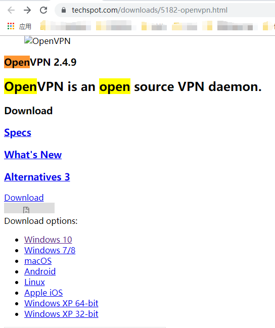](http://www.zhangblog.com/uploads/openvpn/openvpn-01-01.png)

## 架构图

[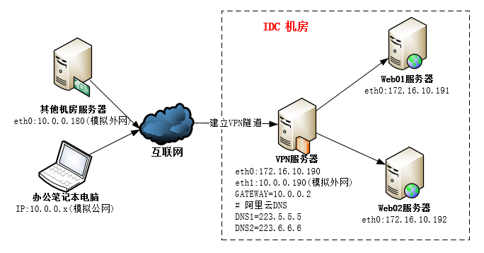](http://www.zhangblog.com/uploads/openvpn/openvpn-01-02.png)

## OpenVPN机器配置必要修改

**开启转发功能并生效**

```
## 不存在该配置则添加
# grep 'net.ipv4.ip_forward = 1' /etc/sysctl.conf || echo 'net.ipv4.ip_forward = 1' >> /etc/sysctl.conf
# sysctl -p
```

原因：从客户端访问web01或web02机器需要通过VPN机器中转。

**iptables配置**

只需添加配置，不需要启动iptables服务

```
## 添加如下配置
# iptables -t nat -A POSTROUTING -s 10.8.0.0/24 -o eth0 -j MASQUERADE
# iptables-save > /etc/sysconfig/iptables
# iptables -L -n -t nat
Chain PREROUTING (policy ACCEPT)
target     prot opt source               destination 

Chain INPUT (policy ACCEPT)
target     prot opt source               destination 

Chain OUTPUT (policy ACCEPT)
target     prot opt source               destination 

Chain POSTROUTING (policy ACCEPT)
target     prot opt source               destination 
MASQUERADE  all  --  10.8.0.0/24          0.0.0.0/0
```

原因：客户端连接VPN后，默认分配的10.8.0.0/24网段地址，不能直接访问web01或web02机器【这两台是172.16.10.0/24网段】，因此需要在iptables进行nat配置。

删除上面的iptables配置信息命令如下。作用：对比正常的访问和异常的访问

```
# iptables -t nat -D POSTROUTING 1
```

## 系统时间与硬件时间同步

```
[root@openvpn-server ~]# crontab -l   # 定时任务同步系统时间
# time sync by zhang at 2020-03-09
*/10 * * * * /usr/sbin/ntpdate ntp1.aliyun.com >/dev/null 2>&1
[root@openvpn-server ~]# ll /etc/localtime   # 使用上海时间
lrwxrwxrwx. 1 root root 33 Mar  9 03:59 /etc/localtime -> /usr/share/zoneinfo/Asia/Shanghai
[root@openvpn-server ~]# hwclock --show   # 查看硬件时间
Sun 03 May 2020 03:34:37 PM CST  -0.614806 seconds
[root@openvpn-server ~]# hwclock --systohc   # 系统时间同步到硬件时间
```

说明：如果时间不同步，那么VPN登录访问就可能存在问题。

# Vmware虚拟机网络设置【可略】

## web01机器

[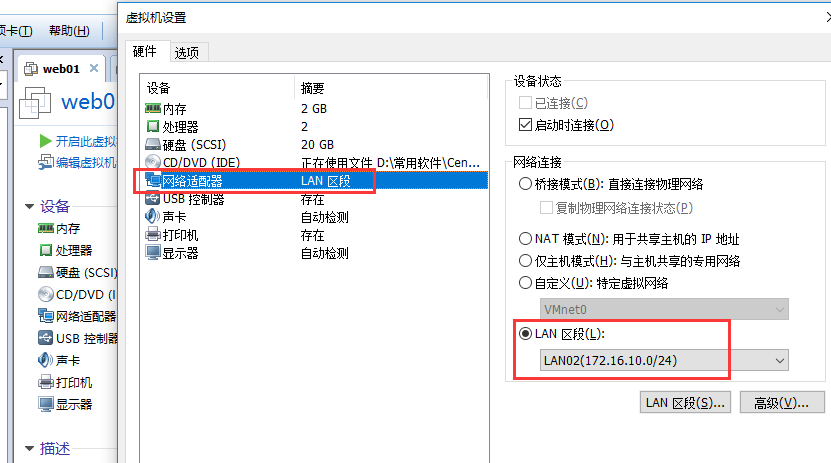](http://www.zhangblog.com/uploads/openvpn/openvpn-01-03.png)

**网卡eth0内网设置**

```
$ cat /etc/sysconfig/network-scripts/ifcfg-eth0 
DEVICE=eth0
TYPE=Ethernet
ONBOOT=yes
NM_CONTROLLED=yes
BOOTPROTO=none
IPV6INIT=yes
USERCTL=no
IPADDR=172.16.10.191
NETMASK=255.255.255.0
```

## web02机器

[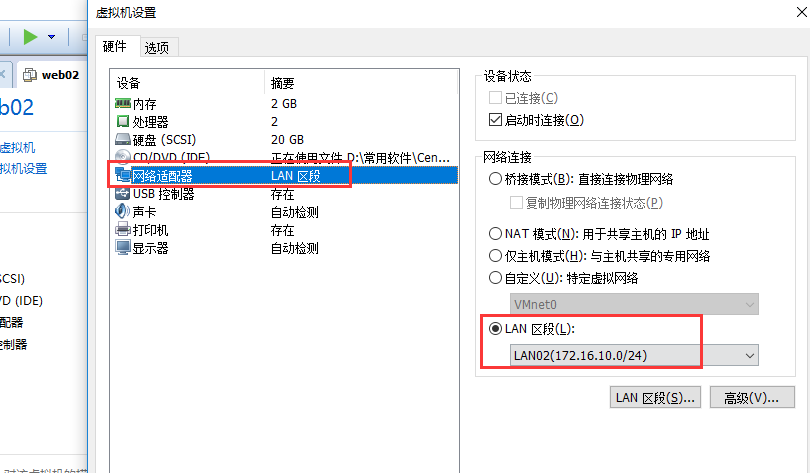](http://www.zhangblog.com/uploads/openvpn/openvpn-01-04.png)

**网卡eth0内网设置**

```
[zhang@zhang ~]$ cat /etc/sysconfig/network-scripts/ifcfg-eth0 
DEVICE=eth0
TYPE=Ethernet
ONBOOT=yes
NM_CONTROLLED=yes
BOOTPROTO=none
IPV6INIT=yes
USERCTL=no
IPADDR=172.16.10.192
NETMASK=255.255.255.0
```

## openvpn-server机器

[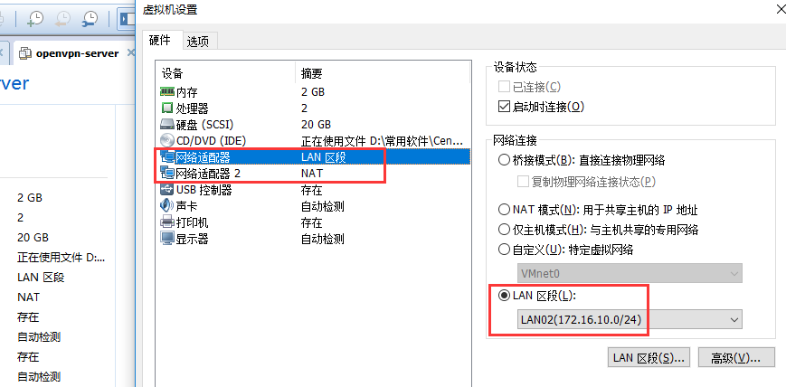](http://www.zhangblog.com/uploads/openvpn/openvpn-01-05.png)

**网卡eth0内网设置**

```
$ cat /etc/sysconfig/network-scripts/ifcfg-eth0 
DEVICE=eth0
TYPE=Ethernet
ONBOOT=yes
NM_CONTROLLED=yes
BOOTPROTO=none
IPV6INIT=yes
USERCTL=no
IPADDR=172.16.10.190
NETMASK=255.255.255.0
```

**网卡eth1模拟外网设置**

```
$ cat /etc/sysconfig/network-scripts/ifcfg-eth1 
DEVICE=eth1
TYPE=Ethernet
ONBOOT=yes
NM_CONTROLLED=yes
BOOTPROTO=none
IPV6INIT=yes
USERCTL=no
IPADDR=10.0.0.190
NETMASK=255.255.255.0
GATEWAY=10.0.0.2
DNS1=223.5.5.5
DNS2=223.6.6.6
```

## openvpn-client机器

[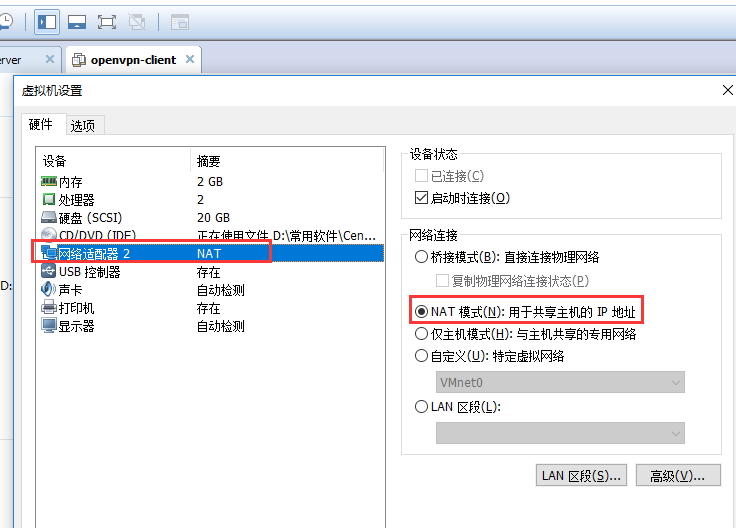](http://www.zhangblog.com/uploads/openvpn/openvpn-01-06.png)

**网卡eth0模拟外网设置**

```
$ cat /etc/sysconfig/network-scripts/ifcfg-eth0 
DEVICE=eth0
TYPE=Ethernet
ONBOOT=yes
NM_CONTROLLED=yes
BOOTPROTO=none
IPV6INIT=yes
USERCTL=no
IPADDR=10.0.0.180
NETMASK=255.255.255.0
GATEWAY=10.0.0.2
DNS1=223.5.5.5
DNS2=223.6.6.6
```

# 安装openvpn

根据主机规划，在openvpn-server【172.16.10.190、10.0.0.190】部署openvpn。

安装依赖包

```
# yum install -y lz4-devel lzo-devel pam-devel openssl-devel systemd-devel sqlite-devel
```

[备注如果是阿里云机器，可能还需要装如下包：]

```
yum install -y autoconf
yum install -y automake
yum install -y libtool libtool-ltdl
```

从github上下载openvpn源代码包并解压后编译安装，最后建立软连接

```
# wget https://github.com/OpenVPN/openvpn/archive/v2.4.9.tar.gz
# mv v2.4.9.tar.gz openvpn-2.4.9.tar.gz
# tar xf openvpn-2.4.9.tar.gz 
# cd openvpn-2.4.9/
# autoreconf -i -v -f
# ./configure --prefix=/usr/local/openvpn --enable-lzo --enable-lz4 --enable-crypto --enable-server --enable-plugins --enable-port-share --enable-iproute2 --enable-pf --enable-plugin-auth-pam --enable-pam-dlopen --enable-systemd
# make && make install
# ln -s /usr/local/openvpn/sbin/openvpn /usr/local/sbin/openvpn
```

配置文件修改

```
# vim /usr/local/openvpn/lib/systemd/system/openvpn-server@.service
### 找到 ExecStart 这行，改为如下
ExecStart=/usr/local/openvpn/sbin/openvpn --config server.conf
```

配置系统服务，并开机自启动

```
# cp -a /usr/local/openvpn/lib/systemd/system/openvpn-server@.service /usr/lib/systemd/system/openvpn.service
# systemctl enable openvpn.service
```

# 生成证书

## easy-rsa下载与配置修改

下载easy-rsa并解压

```
# wget https://github.com/OpenVPN/easy-rsa/archive/v3.0.7.tar.gz 
# mv v3.0.7.tar.gz easy-rsa-3.0.7.tar.gz
# tar xf easy-rsa-3.0.7.tar.gz
```

根据easy-rsa-3.0.7/easyrsa3/vars.example文件生成全局配置文件vars

```
# cd easy-rsa-3.0.7/easyrsa3
# cp -a vars.example vars
```

修改vars文件，根据需要去掉注释，并修改对应值；或者直接在文件末尾追加如下信息：

```
# 国家
set_var EASYRSA_REQ_COUNTRY     "CN"
# 省
set_var EASYRSA_REQ_PROVINCE    "BJ"
# 城市
set_var EASYRSA_REQ_CITY        "BeiJing"
# 组织
set_var EASYRSA_REQ_ORG         "zhang"
# 邮箱
set_var EASYRSA_REQ_EMAIL       "zhang@test.com"
# 拥有者
set_var EASYRSA_REQ_OU          "ZJ"

# 长度
set_var EASYRSA_KEY_SIZE        2048
# 算法
set_var EASYRSA_ALGO            rsa

# CA证书过期时间，单位天
set_var EASYRSA_CA_EXPIRE      36500
# 签发证书的有效期是多少天，单位天
set_var EASYRSA_CERT_EXPIRE    36500
```

## 生成服务端和客户端证书

**初始化与创建CA根证书**

```
# ./easyrsa init-pki
```

初始化，会在当前目录创建PKI目录，用于存储一些中间变量及最终生成的证书

```
# ./easyrsa build-ca
```

在这部分需要输入PEM密码 PEM pass phrase，输入两次，此密码必须记住，不然以后不能为证书签名。
还需要输入common name 通用名，如：openvpen，这个你自己随便设置个独一无二的。

**生成服务端证书**

```
# ./easyrsa build-server-full server nopass
```

为服务端生成证书对并在本地签名。nopass参数生成一个无密码的证书；在此过程中会让你确认ca密码

```
# ./easyrsa gen-dh
```

创建Diffie-Hellman，确保key穿越不安全网络的命令，时间会有点长，耐心等待

**生成客户端证书**

生成多个客户端证书

```
# ./easyrsa build-client-full client nopass    # 无密码，实际应用中不推荐，客户端有密码可提高安全性
# ./easyrsa build-client-full zhangsan    # 让你输入密码，后续VPN连接时会使用
# ./easyrsa build-client-full lisi        # 让你输入密码，后续VPN连接时会使用
# ./easyrsa build-client-full wangwu      # 让你输入密码，后续VPN连接时会使用
```

为客户端生成证书对并在本地签名。nopass参数生成一个无密码的证书；在此过程中都会让你确认ca密码

**为了提高安全性，生成ta.key**

```
# openvpn --genkey --secret ta.key
```

加强认证方式，防攻击。如果配置文件中启用此项(默认是启用的)，就需要执行上述命令，并把ta.key放到/etc/openvpn/server目录。配置文件中服务端第二个参数为0，同时客户端也要有此文件，且client.conf中此指令的第二个参数需要为1。【服务端有该配置，那么客户端也必须要有】

**整理服务端证书**

```
mkdir -p /etc/openvpn/server/
cp -a pki/ca.crt /etc/openvpn/server/
cp -a pki/private/server.key /etc/openvpn/server/
cp -a pki/issued/server.crt /etc/openvpn/server/
cp -a pki/dh.pem /etc/openvpn/server/
cp -a ta.key /etc/openvpn/server/
```

# 创建服务端配置文件

参照openvpn-2.4.9/sample/sample-config-files/server.conf文件

## 服务端配置文件

```
# cat /etc/openvpn/server/server.conf   # 配置文件内容
local 0.0.0.0
port 1194
proto tcp
dev tun
ca /etc/openvpn/server/ca.crt
cert /etc/openvpn/server/server.crt
key /etc/openvpn/server/server.key
dh /etc/openvpn/server/dh.pem
server 10.8.0.0 255.255.255.0
ifconfig-pool-persist ipp.txt
push "route 172.16.10.0 255.255.255.0"
;client-to-client
;duplicate-cn
keepalive 10 120
tls-auth /etc/openvpn/server/ta.key 0
cipher AES-256-CBC
compress lz4-v2
push "compress lz4-v2"
;comp-lzo
max-clients 1000
user nobody
group nobody
persist-key
persist-tun
status openvpn-status.log
log  /var/log/openvpn.log
verb 3
;explicit-exit-notify 1
```

## 配置文件参数说明

参考：openvpn-2.4.9/sample/sample-config-files/server.conf

```
local 0.0.0.0
表示openvpn服务端的监听地址

port 1194
监听的端口，默认是1194

proto tcp
使用的协议，有udp和tcp。建议选择tcp

dev tun
使用三层路由IP隧道(tun)还是二层以太网隧道(tap)。一般都使用tun

ca ca.crt
cert server.crt
key server.key
dh dh2048.pem
ca证书、服务端证书、服务端密钥和密钥交换文件。如果它们和server.conf在同一个目录下则可以不写绝对路径，否则需要写绝对路径调用

server 10.8.0.0 255.255.255.0
vpn服务端为自己和客户端分配IP的地址池。
服务端自己获取网段的第一个地址(此处为10.8.0.1)，后为客户端分配其他的可用地址。以后客户端就可以和10.8.0.1进行通信。
注意：该网段地址池不要和已有网段冲突或重复。其实一般来说是不用改的。除非当前内网使用了10.8.0.0/24的网段。

ifconfig-pool-persist ipp.txt
使用一个文件记录已分配虚拟IP的客户端和虚拟IP的对应关系，
以后openvpn重启时，将可以按照此文件继续为对应的客户端分配此前相同的IP。也就是自动续借IP的意思。

server-bridge XXXXXX
使用tap模式的时候考虑此选项。

push "route 10.0.10.0 255.255.255.0"
push "route 192.168.10.0 255.255.255.0"
vpn服务端向客户端推送vpn服务端内网网段的路由配置，以便让客户端能够找到服务端内网。多条路由就写多个Push指令

client-to-client
让vpn客户端之间可以互相看见对方，即能互相通信。默认情况客户端只能看到服务端一个人；
默认是注释的，不能客户端之间相互看见

duplicate-cn
允许多个客户端使用同一个VPN帐号连接服务端
默认是注释的，不支持多个客户登录一个账号

keepalive 10 120
每10秒ping一次，120秒后没收到ping就说明对方挂了

tls-auth ta.key 0
加强认证方式，防攻击。如果配置文件中启用此项(默认是启用的)
需要执行openvpn --genkey --secret ta.key，并把ta.key放到/etc/openvpn/server目录
服务端第二个参数为0；同时客户端也要有此文件，且client.conf中此指令的第二个参数需要为1。

cipher AES-256-CBC
# 选择一个密码。如果在服务器上使用了cipher选项，那么您也必须在这里指定它。注意，v2.4客户端/服务器将在TLS模式下自动协商AES-256-GCM。

compress lz4-v2
push "compress lz4-v2"
openvpn 2.4版本的vpn才能设置此选项。表示服务端启用lz4的压缩功能，传输数据给客户端时会压缩数据包。
Push后在客户端也配置启用lz4的压缩功能，向服务端发数据时也会压缩。如果是2.4版本以下的老版本，则使用用comp-lzo指令

comp-lzo
启用lzo数据压缩格式。此指令用于低于2.4版本的老版本。且如果服务端配置了该指令，客户端也必须要配置

max-clients 100
并发客户端的连接数

persist-key
persist-tun
通过ping得知超时时，当重启vpn后将使用同一个密钥文件以及保持tun连接状态

status openvpn-status.log
在文件中输出当前的连接信息，每分钟截断并重写一次该文件

;log openvpn.log
;log-append openvpn.log
默认vpn的日志会记录到rsyslog中，使用这两个选项可以改变。
log指令表示每次启动vpn时覆盖式记录到指定日志文件中，
log-append则表示每次启动vpn时追加式的记录到指定日志中。
但两者只能选其一，或者不选时记录到rsyslog中

verb 3
日志记录的详细级别。

;mute 20
沉默的重复信息。最多20条相同消息类别的连续消息将输出到日志。

explicit-exit-notify 1
当服务器重新启动时，通知客户端，以便它可以自动重新连接。仅在UDP协议是可用
```

# 启动openvpn服务并查看进程与端口

```
# systemctl start openvpn.service
# ps -ef | grep 'open'
nobody   19095   1  0 01:19 ?   00:00:00 /usr/local/openvpn/sbin/openvpn --config server.conf
# netstat -lntup | grep '19095'
tcp    0      0 0.0.0.0:1194    0.0.0.0:*     LISTEN     19095/openvpn
```

通过ifconfig命令，也可见多个tun0网卡信息

[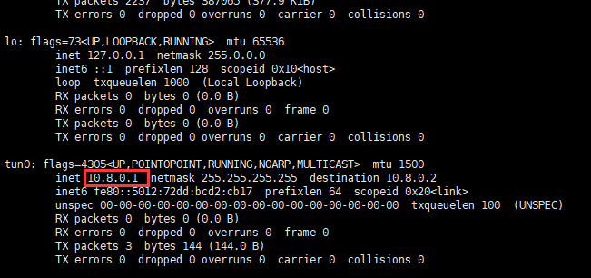](http://www.zhangblog.com/uploads/openvpn/openvpn-01-07.png)

# Windows客户端配置与访问

## 客户端安装

[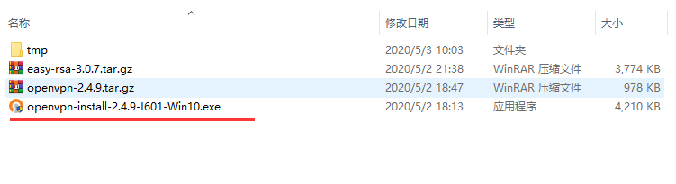](http://www.zhangblog.com/uploads/openvpn/openvpn-01-08.png)

安装完毕后会在「网络连接」中会多出一个连接

[](http://www.zhangblog.com/uploads/openvpn/openvpn-01-09.png)

## 客户端client用户配置文件

备注：文件名 windows为client.ovpn，Linux为client.conf

**需要的证书与配置文件如下图：**

```
说明：
1、注意路径，在OpenVPN/config目录下建立了client目录
2、ca.crt、client.crt、client.key、ta.key都是之前创建好的，只有client.ovpn需要单独下载并修改。
```

[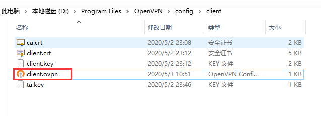](http://www.zhangblog.com/uploads/openvpn/openvpn-01-10.png)

**client.ovpn内容如下：**

参照openvpn-2.4.9/sample/sample-config-files/client.conf文件

```
;# 文件名 windows为client.ovpn，Linux为client.conf

client
dev tun
proto tcp
remote 10.0.0.190 1194
resolv-retry infinite
nobind
;user nobody
;group nobody
persist-key
persist-tun
ca ca.crt
cert client.crt
key client.key
remote-cert-tls server
tls-auth ta.key 1
cipher AES-256-CBC
compress lz4-v2
verb 3
;mute 20
```

## 客户端zhangsan用户配置文件

备注：文件名 windows为zhangsan.ovpn，Linux为zhangsan.conf

**需要的证书与配置文件如下图：**

```
说明：
1、注意路径，在OpenVPN/config目录下建立了zhangsan目录
2、ca.crt、zhangsan.crt、zhangsan.key、ta.key都是之前创建好的，只有zhangsan.ovpn需要单独下载并修改。
```

[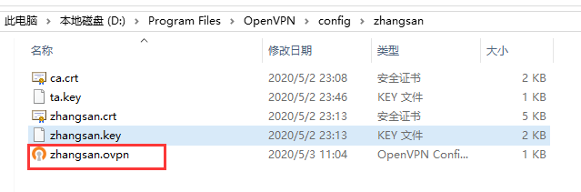](http://www.zhangblog.com/uploads/openvpn/openvpn-01-11.png)

**zhangsan.ovpn内容如下：**

参照openvpn-2.4.9/sample/sample-config-files/client.conf文件

```
;# 文件名 windows为client.ovpn，Linux为client.conf

client
dev tun
proto tcp
remote 10.0.0.190 1194
resolv-retry infinite
nobind
;user nobody
;group nobody
persist-key
persist-tun
ca ca.crt
cert zhangsan.crt
key zhangsan.key
remote-cert-tls server
tls-auth ta.key 1
cipher AES-256-CBC
compress lz4-v2
verb 3
;mute 20
```

**其他用户如：lisi，wangwu参考上述进行配置即可。**

## 配置文件参数说明

参考：openvpn-2.4.9/sample/sample-config-files/client.conf

```
# 文件名 windows为client.ovpn，Linux为client.conf

client
# 标识这是个客户端

dev tun
# 使用三层路由IP隧道(tun)还是二层以太网隧道(tap)。服务端是什么客户端就是什么

proto tcp
# 使用的协议，有udp和tcp。服务端是什么客户端就是什么

remote 10.0.0.190 1194
# 服务端的地址和端口

resolv-retry infinite
# 一直尝试解析OpenVPN服务器的主机名。
# 在机器上非常有用，不是永久连接到互联网，如笔记本电脑。

nobind
# 大多数客户机不需要绑定到特定的本地端口号。

;user nobody
;group nobody
# 初始化后的降级特权(仅非windows)

persist-key
persist-tun
# 尝试在重新启动时保留某些状态。

ca ca.crt
cert client.crt
key client.key
# ca证书、客户端证书、客户端密钥
# 如果它们和client.conf或client.ovpn在同一个目录下则可以不写绝对路径，否则需要写绝对路径调用

remote-cert-tls server
# 通过检查certicate是否具有正确的密钥使用设置来验证服务器证书。

tls-auth ta.key 1
# 加强认证方式，防攻击。服务端有配置，则客户端必须有

cipher AES-256-CBC
# 选择一个密码。如果在服务器上使用了cipher选项，那么您也必须在这里指定它。注意，v2.4客户端/服务器将在TLS模式下自动协商AES-256-GCM。

compress lz4-v2
# 服务端用的什么，客户端就用的什么
# 表示客户端启用lz4的压缩功能，传输数据给客户端时会压缩数据包。

verb 3
# 日志级别

;mute 20
# 沉默的重复信息。最多20条相同消息类别的连续消息将输出到日志。
```

## 启动客户端并连接VPN

[](http://www.zhangblog.com/uploads/openvpn/openvpn-01-12.png)

**连接client用户**

之前生成客户端证书的时候，加上 nopass 参数，因此直接连接无需输入密码。如果连接的是用户zhangsan，则需要输入密码。

连接成功后，会有如下提示

[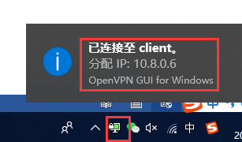](http://www.zhangblog.com/uploads/openvpn/openvpn-01-13.png)

## 客户端访问后端的web01和web02机器

本地笔记本电脑操作

[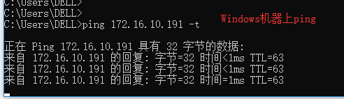](http://www.zhangblog.com/uploads/openvpn/openvpn-01-14.png)

VPN机器抓包

[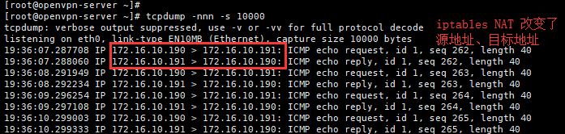](http://www.zhangblog.com/uploads/openvpn/openvpn-01-15.png)

可见能够正常访问

备注：可以将VPN机器的iptables配置删除；然后断开客户端连接，再重新连接，之后客户端ping 访问试试。【用于对比】

# Linux客户端配置与访问

## 安装openvpn

安装参见上文，上面说过了Linux安装OpenVPN，这里不单独说了。我们这里使用之前创建的wangwu客户端用户进行验证。

配置文件修改

```
[root@openvpn-client ~]# vim /usr/local/openvpn/lib/systemd/system/openvpn-server@.service
[Service]
Type=notify
PrivateTmp=true
#WorkingDirectory=/etc/openvpn/server
WorkingDirectory=/etc/openvpn/wangwu
#ExecStart=/usr/local/openvpn/sbin/openvpn --status %t/openvpn-server/status-%i.log --status-version 2 --suppress-timestamps --config %i.conf
ExecStart=/usr/local/openvpn/sbin/openvpn --config wangwu.conf
```

配置系统服务，并开机自启动【请根据需要加入开机自启动】

```
# cp -a /usr/local/openvpn/lib/systemd/system/openvpn-server@.service /usr/lib/systemd/system/openvpn.service
# systemctl enable openvpn.service
```

## 客户端wangwu客户配置

备注：文件名 windows为wangwu.ovpn，Linux为wangwu.conf

**需要的证书与配置文件如下：**

```
说明：
1、注意路径，在/etc/openvpn/目录下建立了wangwu目录
2、ca.crt、wangwu.crt、wangwu.key、ta.key都是之前创建好的，只有wangwu.ovpn需要单独下载并修改。
[root@openvpn-client wangwu]# pwd
/etc/openvpn/wangwu
[root@openvpn-client wangwu]# ll
total 24
-rw-r--r-- 1 root root 1164 May  2 23:08 ca.crt
-rw-r--r-- 1 root root  636 May  2 23:46 ta.key
-rw-r--r-- 1 root root  318 May  3 21:54 wangwu.conf
-rw-r--r-- 1 root root 4422 May  2 23:14 wangwu.crt
-rw-r--r-- 1 root root 1834 May  2 23:14 wangwu.key
```

**wangwu.conf内容如下：**

参照openvpn-2.4.9/sample/sample-config-files/client.conf文件

```
[root@openvpn-client wangwu]# cat wangwu.conf 
;# 文件名 windows为client.ovpn，Linux为client.conf

client
dev tun
proto tcp
remote 10.0.0.190 1194
resolv-retry infinite
nobind
user nobody
group nobody
persist-key
persist-tun
ca ca.crt
cert wangwu.crt
key wangwu.key
remote-cert-tls server
tls-auth ta.key 1
cipher AES-256-CBC
compress lz4-v2
verb 3
;mute 20
```

**其他用户如：参考上述进行配置即可。**

## 启动客户端并连接VPN

```
[root@openvpn-client wangwu]# systemctl start openvpn.service 
Enter Private Key Password: ******  # 输入该用户创建时设定的密码
[root@openvpn-client wangwu]# ps -ef | grep 'open'
nobody   11266   1  0 21:56 ?   00:00:00 /usr/local/openvpn/sbin/openvpn --config wangwu.conf
```

网卡信息如下图：

[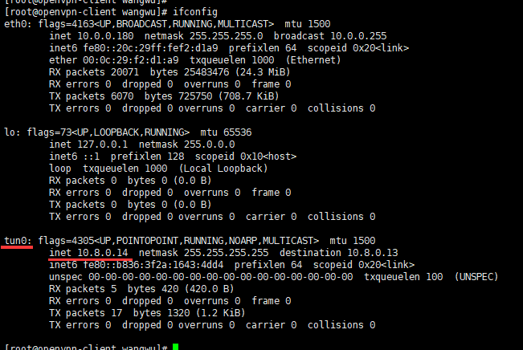](http://www.zhangblog.com/uploads/openvpn/openvpn-01-16.png)

## 客户端访问后端的web01和web02机器

客户端Linux操作

[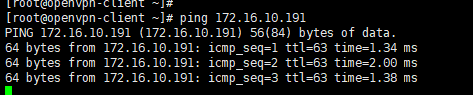](http://www.zhangblog.com/uploads/openvpn/openvpn-01-17.png)

VPN机器抓包

[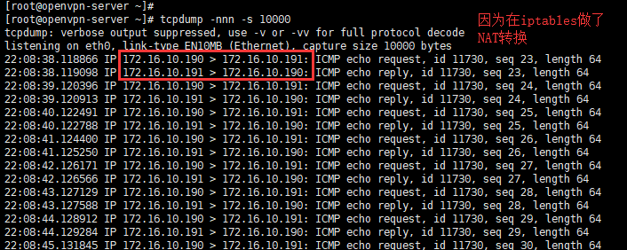](http://www.zhangblog.com/uploads/openvpn/openvpn-01-18.png)

可见能够正常访问

备注：可以将VPN机器的iptables配置删除；然后断开客户端连接，再重新连接，之后客户端ping 访问试试。【用于对比】

# 推荐阅读

**应用openvpn**

```
https://www.bbsmax.com/A/x9J23DRZ56/
```

**OpenVPN服务搭建与管理**

```
https://my.oschina.net/u/3021599/blog/3048615
```

**CentOS安装PPTP VPN**

```
http://www.ttlsa.com/linux/centos-install-pptp-vpn/
```

完毕！

------

<-------------the end------------->

[](http://www.zhangblog.com/uploads/weixin_pulic_code.png)

欢迎扫一扫，订阅我的微信公众号！

坚持原创分享，你的支持就是我最大的动力！

打赏

- **本文作者：** lightzhang
- **本文链接：** http://www.zhangblog.com/2020/05/09/openvpn01/
- **版权声明：** 本博客所有文章除特别声明外，均采用 [CC BY-NC-SA 3.0](https://creativecommons.org/licenses/by-nc-sa/3.0/) 许可协议。转载请注明出处！

[# linux](http://www.zhangblog.com/tags/linux/) [# OpenVPN](http://www.zhangblog.com/tags/OpenVPN/)