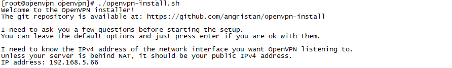
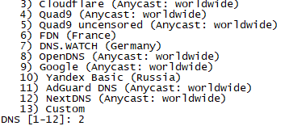
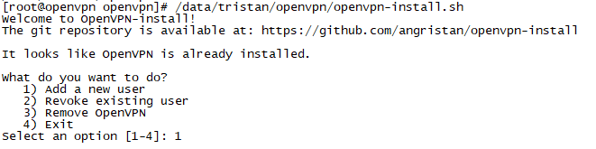
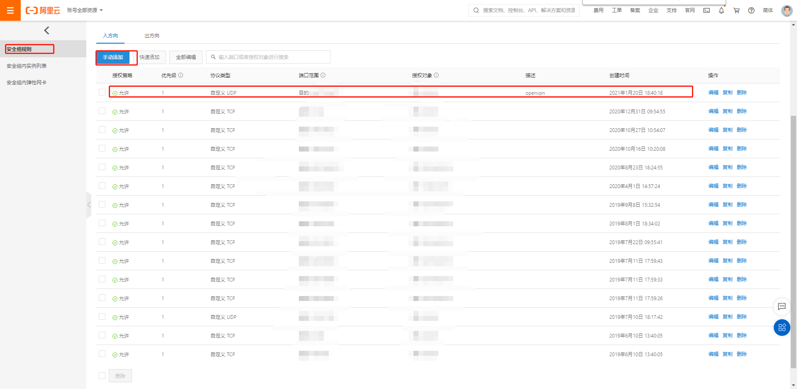

# 安装

关闭防护墙

同步时间


线上

```
# 上传文件到服务器上
mv openvpn-install-20210524-server.sh openvpn-install.sh
chmod +x openvpn-install.sh

# 先下载好包
wget -O ~/easy-rsa.tgz https://github.com/OpenVPN/easy-rsa/releases/download/v3.0.7/EasyRSA-3.0.7.tgz

./openvpn-install.sh
```

线下

```
# 上传文件到服务器上
mv openvpn-install-20210524-local.sh openvpn-install.sh
mv EasyRSA-3.0.7.tgz easy-rsa.tgz

chmod 777 openvpn-install.sh easy-rsa.tgz

./openvpn-install.sh
```

实际上基本上一路回车即可, 注意在dns选择和端口选择的地方需要改动

确定本机ip



确定公网ip


是否需要使用ipv6


确定端口, 注意选择随机高位端口


确定协议: 使用udp更加稳定


确定dns

使用用户自己本身的dns




确定压缩


确定自定义加密


回车确定安装


# 配置网络

我们先看到服务端配置如下:

```
port 1234
proto udp
dev tun
user nobody
group nobody
persist-key
persist-tun
keepalive 10 120
topology subnet
server 10.8.0.0 255.255.255.0
ifconfig-pool-persist ipp.txt
push "dhcp-option DNS 10.8.0.1"
push "redirect-gateway def1 bypass-dhcp"
dh none
ecdh-curve prime256v1
tls-crypt tls-crypt.key
crl-verify crl.pem
ca ca.crt
cert server_zir1mGwJskPHmrcw.crt
key server_zir1mGwJskPHmrcw.key
auth SHA256
cipher AES-128-GCM
ncp-ciphers AES-128-GCM
tls-server
tls-version-min 1.2
tls-cipher TLS-ECDHE-ECDSA-WITH-AES-128-GCM-SHA256
client-config-dir /etc/openvpn/ccd
status /var/log/openvpn/status.log
verb 3
```


`vi /etc/openvpn/server.conf`

加上服务端ip, 去掉全部流量代理

```
#push "redirect-gateway def1 bypass-dhcp"

explicit-exit-notify 1
push "route 192.168.2.0 255.255.255.0"
push "route 192.168.3.0 255.255.255.0"
push "route 192.168.4.0 255.255.255.0"
push "route 192.168.5.0 255.255.255.0"
```

线下

```
#push "redirect-gateway def1 bypass-dhcp"

explicit-exit-notify 1
push "route 192.168.1.0 255.255.255.0"
push "route 192.168.90.0 255.255.255.0"
push "route 172.30.1.0 255.255.255.0"
```


`systemctl restart openvpn-server@server`

`systemctl status openvpn-server@server`

# 用户管理

## 添加用户

```
/data/tristan/openvpn/openvpn-install.sh
```



输入名字


# 管理

查看状态

```
systemctl status openvpn-server@server
```

重启

```
systemctl restart openvpn-server@server
```

其他的按照systemctl指令即可

# 配置网络

协议: udp

端口范围: openvpn端口/openvpn端口

授权对象: 0.0.0.0/0



# 参考文档

https://github.com/angristan/openvpn-install