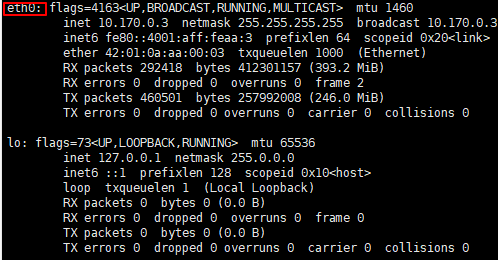
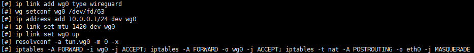

# WireGuard介绍及客户端配置使用教程

2019-06-29 

[ 技术 ](https://www.readmorejoy.com/categories/技术/)

 约 2937 字 预计阅读 6 分钟

## 文章目录

# WireGuard介绍及客户端配置使用教程

WireGuard 是一种新兴的 VPN 实现，比广泛使用的 OpenVPN 和 IPSec 速度更快、攻击面更小，配置更简单。它已经支持 Linux，Android、BSD 和 macOS，但 Windows 长期以来一直没有支持。原因是 WireGuard 作者 Jason Donenfeld 不想使用 OpenVPN OpenTAP 网卡代码，他也不喜欢微软内置的 VPN API。因此支持 Windows 平台的第一步是开发更简单的虚拟适配器，它不仅可以被 WireGuard 使用，也可以被其它项目使用。这就是 Wintun。WireGuard 最近释出了 Windows 的早期预览版，Donenfeld 称之为 pre-alpha，称其功能还不完整。但测试显示，WireGuard on Window 预览版已经相当完整了。Donenfeld 承认他之所以称其为 pre-alpha 的一个理由是为了避免还没有准备好之前媒体记者就来写报道。

WireGuard是Jason A. Donenfeld开发的开源VPN协议。目前支持Linux, macOS,Android以及OpenWrt。Windows官方客户端还在开发，但第三方Windows客户端已经出现。WireGuard被视为下一代V*N协议。

它是一个构建快速、现代、安全的 FQ 的协议和工具套件，它具有以下优点

- 使用最先进的加密技术，防范攻击（RSA, SHA 广被诟病都将被淘汰）
- 性能远超 OpenV*N
- 效率极高，WireGuard 协议作为 Linux 内核模块运行
- 通用用途，支持嵌入式和非嵌入式设备
- 跨平台，初期在 Linux 平台发布，现已支持所有平台
- 易用，用过 OpenV*N 等工具集的人都明白这其中的痛苦
- 工作在 3 层（链路层），支持漫游，地址变更对用户无感知，使用更简单，切换更平滑
- 使用 UDP 传输数据，轻量、高效、节能、节省带宽（适用于 IOT 领域）
- 基于 GPLv2 （Linux Kernel 基于 GPLv2）免费开源

由于 WireGuard 是 UDP 传输，部分地区运营商对 UDP 有干扰，可能导致断流等问题，暂不推荐作为日常 FQ 手段使用，但是在 TCP 被阻断的 VPS 上不失为一种解决办法。


当前 VPN 领域，已经有了 IPSEC, PPTP, L2TP, OpenVPN，为什么我们还需要另一种？

WireGuard协议的速度几乎秒杀其它VPN协议，测试结果如下图


- **更少的实现代码** 相比OpenVPN 600,000 行代码来说，WireGuard 只有4,000 行，对于安全组件，代码量越少，可能遭受到的攻击越少，也更容易被世界各地的开发者 review。
- **更容易部署** 作为比较，一个完全不熟悉 VPN 的技术人员，使用 OpenVPN 和 WireGuard 部署一套 VPN 所使用的时间大概是 48小时对 6 小时。
- **更强的加密算法** 其中使用了 [Curve25519](https://cr.yp.to/ecdh.html) 秘钥交换算法；ChaCha20 对称加解密算法（比 AES 更快更高效）； [Poly1305](https://en.wikipedia.org/wiki/Poly1305) 消息摘要算法； [BLAKE2](https://en.wikipedia.org/wiki/BLAKE_(hash_function)) 和 [SipHash24](https://en.wikipedia.org/wiki/SipHash) HASH 算法；[HKDF](https://en.wikipedia.org/wiki/HKDF) 秘钥衍生算法。

**更快的连接** 在 OpenVPN，OpenSSL 的世界里，等待是习以为常的事情，因为协议的复杂性决定了连接的建立非常耗时，通常你需要主动告诉用户 VPN 正在建立连接中，否则用户会以为程序挂掉了，而当你第一次用 WireGuard 客户端后，你发现它的速度超乎想象，跟你在 shell 里敲一个`echo`命令一样快。

### Linus Torvalds 如何评价？

在了解 WireGurad 是什么之前，让我们先看一段 Linus Torvalds 在邮件组中的一段话，世界上能入 Torvalds 法眼的东西太少了，从他的这段话中我们可以看出 WireGuard 的分量，当然这其中也有其前任 OpenVPN 和 IPSec 等的使用极其复杂，同时还频频爆出安全漏洞的原因。

> Can I just once again state my love for it and hope it gets merged soon? Maybe the code isn’t perfect, but I’ve skimmed it, and compared to the horrors that are OpenVPN and IPSec, it’s a work of art.

以下内容是我在[GCP](https://cloud.google.com/)的`Debain 9`以及`Ubuntu 16.04 LTS`上搭建[WireGuard](https://www.wireguard.com/)的过程，其他系统应该也类似，可以自己多尝试下。

# WireGuard配置过程

## 安装 WireGuard

Debain 系统：

```
# 先安装linux-headers
apt update
apt install linux-headers-$(uname -r) -y

# 安装WireGuard
echo "deb http://deb.debian.org/debian/ unstable main" > /etc/apt/sources.list.d/unstable.list
printf 'Package: *nPin: release a=unstablenPin-Priority: 150n' > /etc/apt/preferences.d/limit-unstable
apt update
apt install wireguard-dkms wireguard-tools resolvconf -y
```

Ubuntu 系统：

```
add-apt-repository ppa:wireguard/wireguard
apt-get update
apt-get install wireguard-dkms wireguard-tools resolvconf -y
```

安装成功后，显示如下：


**注意** ：除了`Debain`、`Ubuntu`其他操作系统的安装命令可以在[WireGuardInstallstion](https://www.wireguard.com/install/)查看。

除了以上部分内容不同系统不一样，接下来的操作都是一样的。

```
# 开启ipv4流量转发
echo "net.ipv4.ip_forward = 1" >> /etc/sysctl.conf
sysctl -p

# 创建并进入WireGuard文件夹
mkdir -p /etc/wireguard && chmod 0777 /etc/wireguard
cd /etc/wireguard
umask 077

# 生成服务器和客户端密钥对
wg genkey | tee server_privatekey | wg pubkey > server_publickey
wg genkey | tee client_privatekey | wg pubkey > client_publickey
```

## 服务端配置文件

- 创建并进入了 WireGuard 后，开始配置服务端文件，输入`ifconfig`查看主网卡名称，可能结果如下：
  
  记住以上标记处名字，若不是`eth0`，可以将其复制了待会需要用到。

- 生成服务器配置文件`/etc/wireguard/wg0.conf`:

  # 重要！如果名字不是eth0, 以下PostUp和PostDown处里面的eth0替换成自己服务器显示的名字

  # ListenPort为端口号，可以自己设置想使用的数字

  # 以下内容一次性粘贴执行，不要分行执行

  echo " [Interface] PrivateKey = $(cat server_privatekey) Address = 10.0.0.1/24 PostUp = iptables -A FORWARD -i wg0 -j ACCEPT; iptables -A FORWARD -o wg0 -j ACCEPT; iptables -t nat -A POSTROUTING -o eth0 -j MASQUERADE PostDown = iptables -D FORWARD -i wg0 -j ACCEPT; iptables -D FORWARD -o wg0 -j ACCEPT; iptables -t nat -D POSTROUTING -o eth0 -j MASQUERADE ListenPort = 50814 DNS = 8.8.8.8 MTU = 1420

  [Peer] PublicKey = $(cat client_publickey) AllowedIPs = 10.0.0.2/32 " > wg0.conf

- 设置开机自启：

  systemctl enable wg-quick@wg0

## 客户端配置文件

生成客户端配置文件`/etc/wireguard/client.conf`:

```
# Endpoint是自己服务器ip和服务端配置文件中设置的端口号，自己在本地编辑好再粘贴到SSH里
# 以下内容一次性粘贴执行，不要分行执行
echo "
[Interface]
  PrivateKey = $(cat client_privatekey)
  Address = 10.0.0.2/24
  DNS = 8.8.8.8
  MTU = 1420

[Peer]
  PublicKey = $(cat server_publickey)
  Endpoint = 1.2.3.4:50814
  AllowedIPs = 0.0.0.0/0, ::0/0
  PersistentKeepalive = 25 " > client.conf
```

至此，基本上就已经搞定了，可以启动 WireGuard 了：

```
# 启动WireGuard
wg-quick up wg0

# 停止WireGuard
wg-quick down wg0

# 查看WireGuard运行状态
wg
```

启动后，如果没有错误的话，显示应该与下图类似：


## 导出配置文件

我们需要导出客户端的配置供客户端使用，客户端可以自己手动填，但是密钥什么的输入比较麻烦，以下提供两种方法供使用：

- 方法一：使用配置文件，使用`cat /etc/wireguard/client.conf`指令查看配置文件信息并复制，然后自己本地编辑一个`.conf`文件（名字可以自定义）将复制内容粘贴并保存，发送到手机上；或者使用 FTP 等方式把配置文件下载到本地；

- 方法二：使用二维码

  apt install qrencode -y qrencode -t ansiutf8 < /etc/wireguard/client.conf

# 客户端使用方法

客户端界面都很简单，操作基本没什么难度。

## 下载地址

- iOS: [WireGuard TestFlight](https://testflight.apple.com/join/63I19SDT)
- Android: [WireGuard Google Play](https://play.google.com/store/apps/details?id=com.wireguard.android)
- Windows: Coming Soon

## IOS


## ANDROID


# 配置多用户

一个客户端文件只能同时有一个设备连接，所以如果需要同时使用的话，可以建立多个客户端文件。

再添加一个客户端的操作方法：

```
# 停止WireGuard
wg-quick down wg0

# 生成新的客户端密钥对
wg genkey | tee client0_privatekey | wg pubkey > client0_publickey


# 在服务端配置文件中加入新的客户端公钥
# AllowedIPs重新定义一段
# 一次性复制粘贴，不要分行执行
echo "
[Peer]
  PublicKey = $(cat client0_publickey)
  AllowedIPs = 10.0.0.3/32" >> wg0.conf


# 新建一个客户端文件，使用新客户端密钥的私钥
# Address与上面的AllowedIPs保持一致
# Endpoint和之前的一样，为服务器ip和设置好的ListenPort
# 一次性复制粘贴，不要分行执行
echo "
[Interface]
  PrivateKey = $(cat client0_privatekey)
  Address = 10.0.0.3/24
  DNS = 8.8.8.8
  MTU = 1420

[Peer]
  PublicKey = $(cat server_publickey)
  Endpoint = 1.2.3.4:50814
  AllowedIPs = 0.0.0.0/0, ::0/0
  PersistentKeepalive = 25 " > client0.conf


# 已经成功创建后，启动WireGuard
wg-quick up wg0

# 导出客户端配置文件方式依旧可以采用上面介绍的两种方法，例如此客户端文件生成二维码就应该为
qrencode -t ansiutf8 < /etc/wireguard/client0.conf
```

如果还需要添加`Peer`，同样方法再次操作即可。