# jumpserver安装后遇到的死人坑

[80a6c486874b](https://www.jianshu.com/u/80a6c486874b)关注

2019.11.19 11:13:46字数 3,047阅读 4,680

鉴于现有的服务机器逐渐增多，开发人员要查看日志时，每个都要配置一次，而且记录不统一等各种原因，促使我要统一各个开发人员的。在此安装过程中遇到到很多坑人死的地方，特此记录下来遇到的问题与解决方案。

**环境：**

内网隔离环境（该环境不可连接外网，只允许远程连接进入）（属于自建服务器）

jumpserver服务器：10.10.10.8  (有root管理员用户、jump普通用户)(root已屏蔽从外网登录，只可通过普通用户连接)

开发人员使用虚拟机：10.10.10.120  (此为开发人员使用的Windows 7 虚拟机)

外网生产环境云服务器：11.11.11.1*  (有root管理员用户、dev普通用户、loger普通用户)(root已屏蔽从外网登录，只可通过普通用户连接；dev为程序所用来运行的用户--属于运维人员管理，loger为配置给开发人员查看日志的用户)

**使用流程：**

开发人员查看服务器日志：要通过10.10.10.120的xlshell、secureCRT等软件连接到jumpserver服务器10.10.10.8的2222端口后，由jumpserver列出可授权使用的服务器

**需求：**

需要统一授权所有开发人员连接生产环境的方式，记录所有开发人员的操作记录，安装jumpserver后不给web登录，都通过xlshell、secureCRT来连接ssh授权的环境。对于某些只开放给开发人员查看日志的用户，就要把这些用户所有普通权限都禁止掉（如cd /,ls /等），因为这些用户的功能就只有一个，查看实时日志，根据不需要其它操作，所以把其它没有的命令全部禁止点

**吐槽点：**

因为生产服务器另做了禁止root远程登录，禁止任何普通用户进行sudo操作，所有对于jumpserver中的sudo与推送，一点都用不上。并且文档中对于如何通过xlshell、secureCRT连接说的也不清晰，浪费了好几天才发现这些问题。

# 一、jumpserver安装步骤

安装步骤参考下面官网文档

[https://docs.jumpserver.org/zh/docs/setup_by_localcloud.html](https://links.jianshu.com/go?to=https%3A%2F%2Fdocs.jumpserver.org%2Fzh%2Fdocs%2Fsetup_by_localcloud.html)

# 二、安装后说明

1、安装完成后，登陆进jumpserver

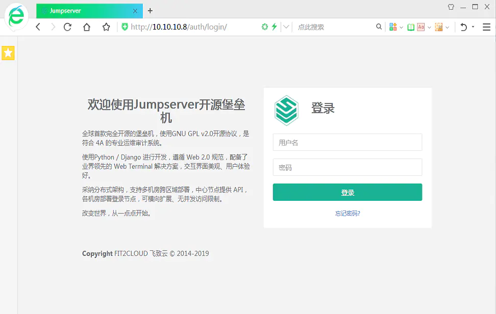

jumpserver--登录页面

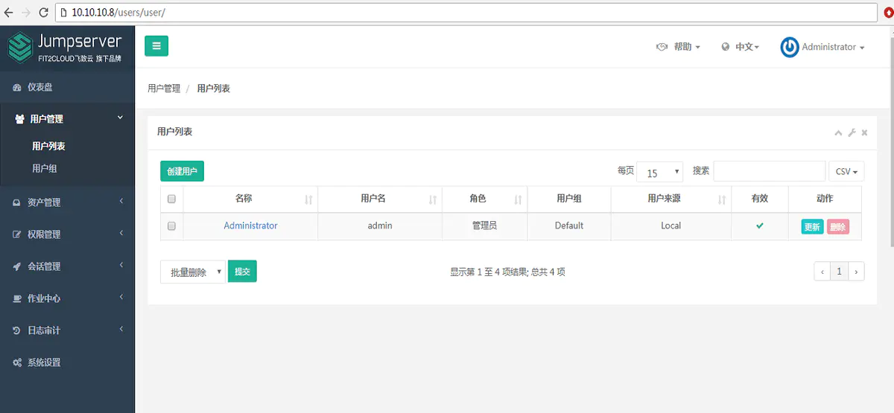

jumpserver--用户管理

登录jumpserver后，有几个东西要特别说明的，像我这种这么笨的人看这几个都错了好几回没弄明白什么意思。

用户管理--用户列表，中的用户：指的是登录jumpserver的用户，此用户将在后面用到xlshell、secureCRT等软件中

资产管理--管理用户，中的用户：指的是要连生产环境中用户root或者是具备sudo的用户（非jumpserver机器上的），有时候在网上看的东西太专业有点绕舌（如通过局域网secureCRT直接连接你的服务器，这里的管理用户就是你服务器上的具备root权限的用户）

资产管理--系统用户，中的用户：指的是要连生产环境中普通用户（非jumpserver机器上的），如通过局域网secureCRT直接连接你的服务器，这里的系统用户就是你服务器上的普通用户

2、创建用户

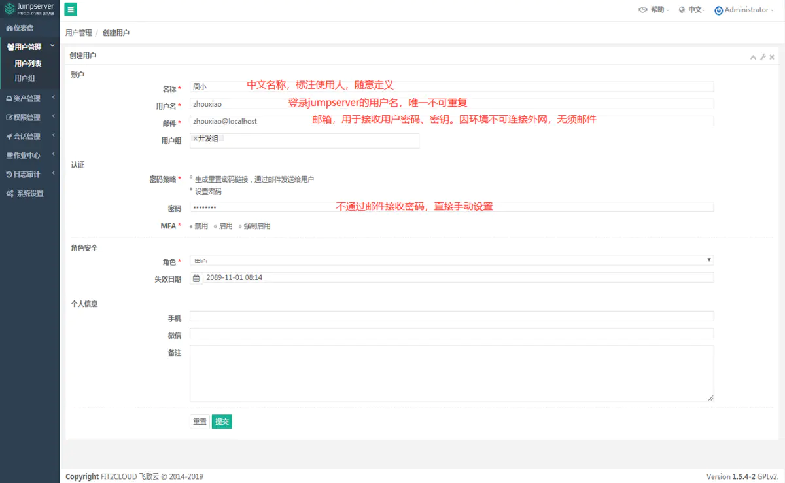

jumpserver--创建用户

按上图在用户管理--用户列表，中点击创建用户。

因我的环境是隔离网，不允许邮件通过，且机器与人员也不是很多，都是小企业的标配，所以认证设置为手动更改密码，角色按需选择，填写完成提交即可。

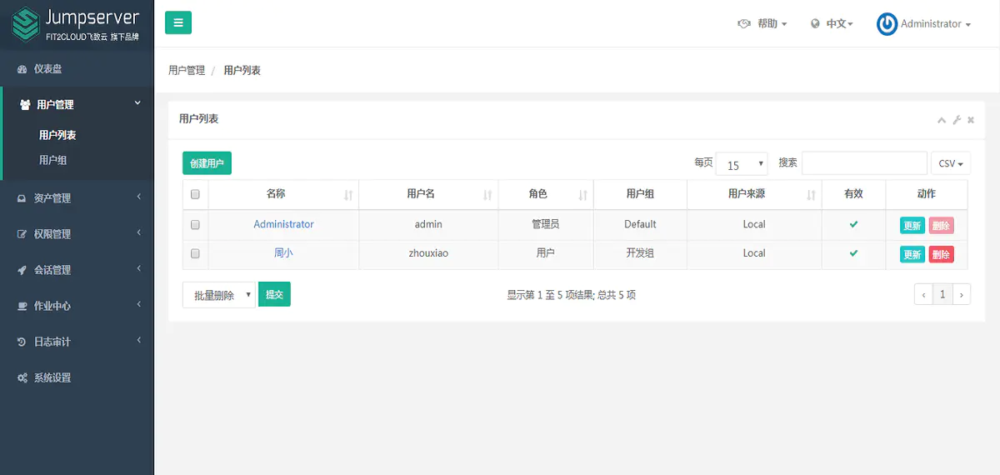

jumpserver--创建用户

3、创建管理用户

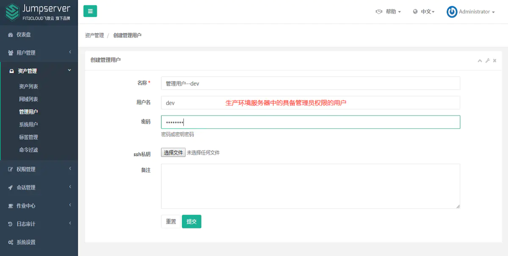

jumpserver--创建管理用户

按上图在资产管理--管理用户，中点击创建管理用户。

管理用户就是生产环境中的普通用户（可具备管理权限），给运维人员或是运行程序的用户，即外网生产环境云服务器 11.11.11.1* 中的管理员用户。

因为我的云服务器不需要给任何用户sudo权限，不需要推送，所以给的是一个普通用户，不给管理员用户。

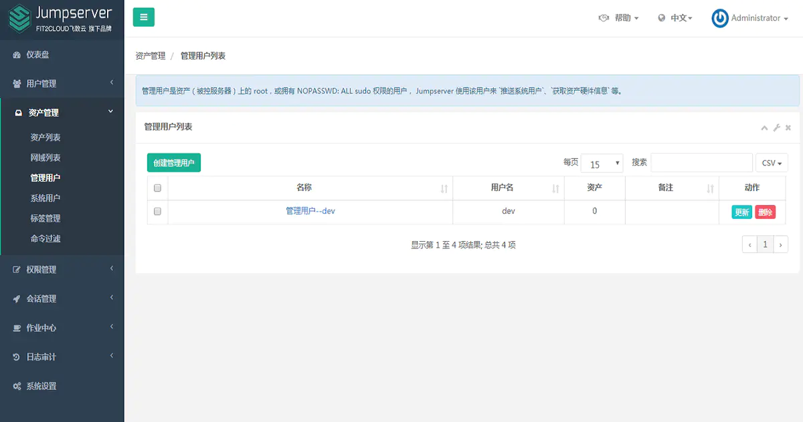

jumpserver--创建管理用户

4、创建系统用户

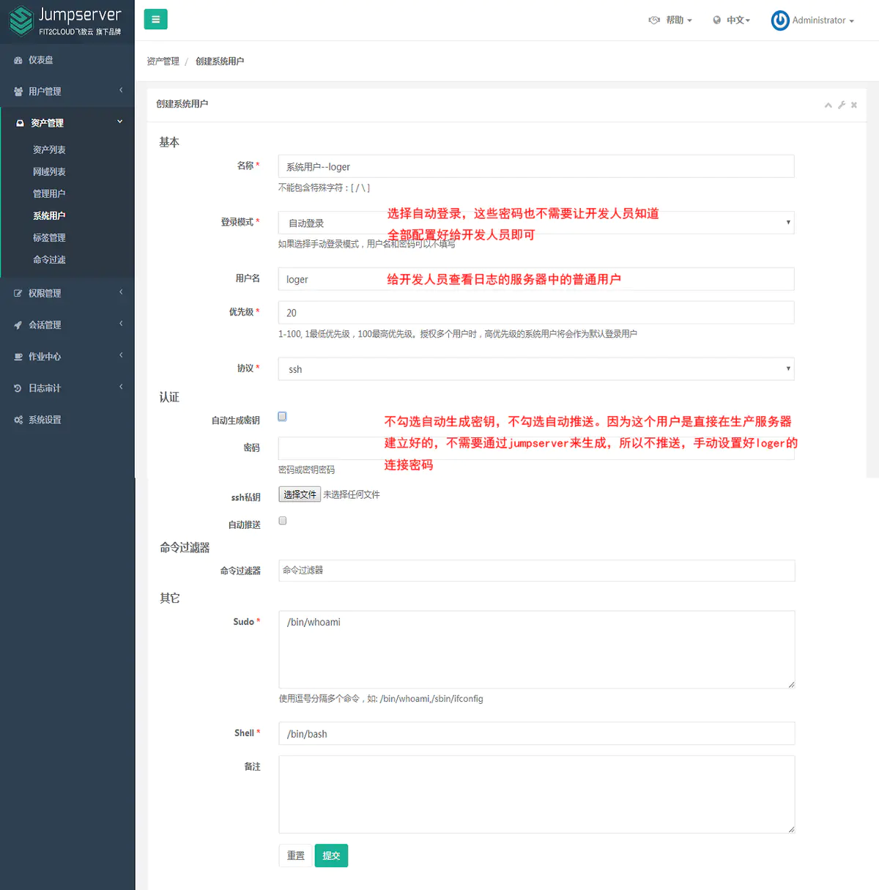

jumpserver--创建系统用户

系统用户就是生产环境中的普通用户，给开发人员查看日志用的用户

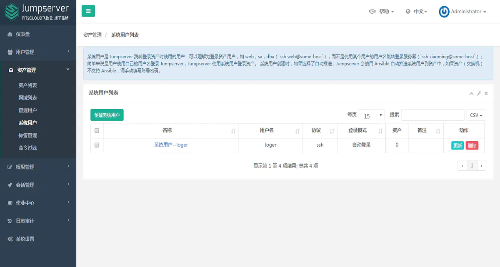

jumpserver--创建系统用户

5、建立资产

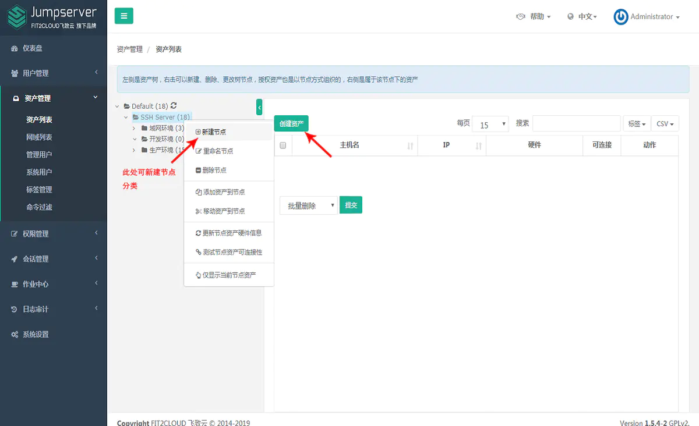

按上图所示在资产管理--资产列表，中点击“创建资产”，也可先创建各个分类，再在各分类下建立资产。

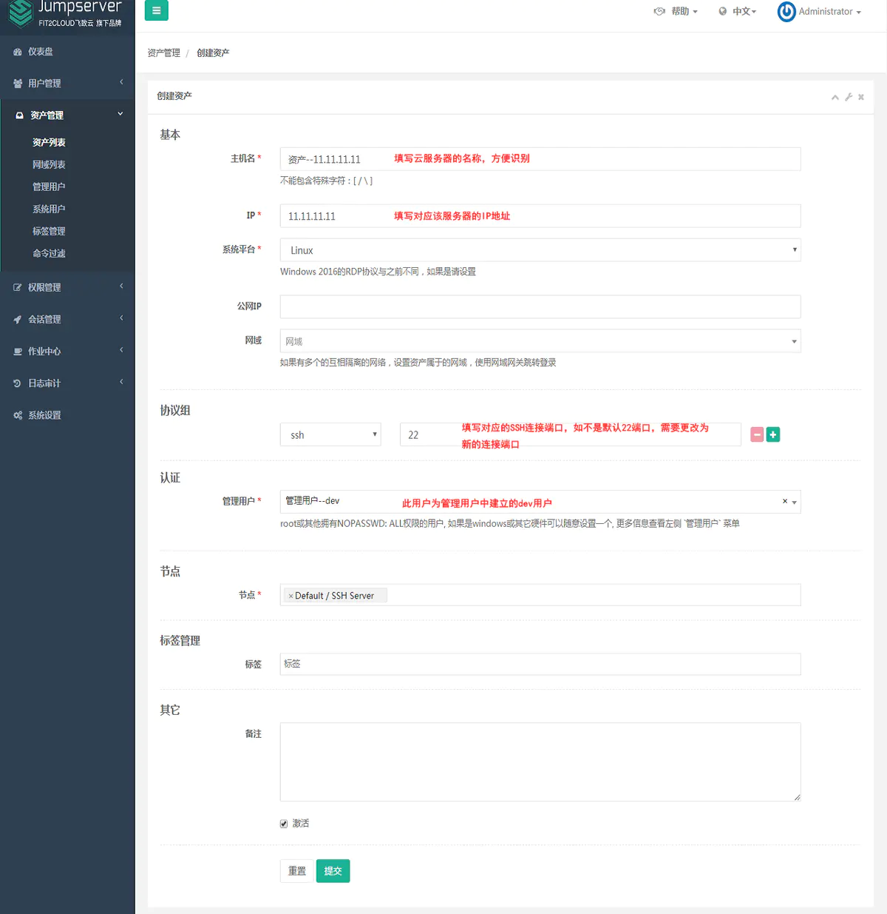

jumpserver--创建资产

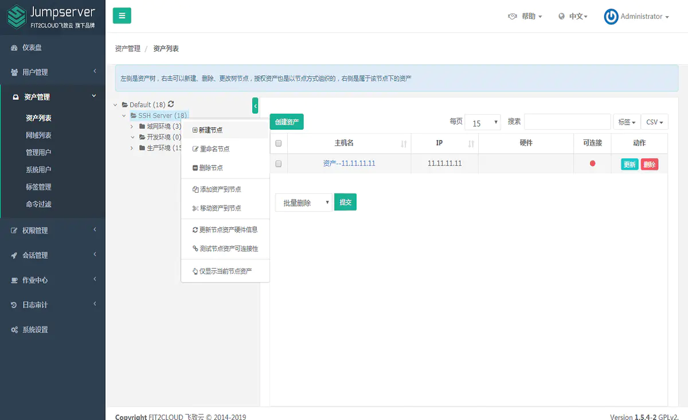

jumpserver--资产管理

如上图创建资产，就可以分配授权了

**注意：**因之前不懂授权，就每个资产都设置了一个授权，设置了几十个后，感觉很不对劲，发现自己想当然的做的太麻烦了。就直接改掉不按资产来授权，要按用户名来授权，哪个用户用到哪些资产的，直接授权到此用户即可。而不是原来的每个资产中都去配置授权给指定的用户。

6、创建授权

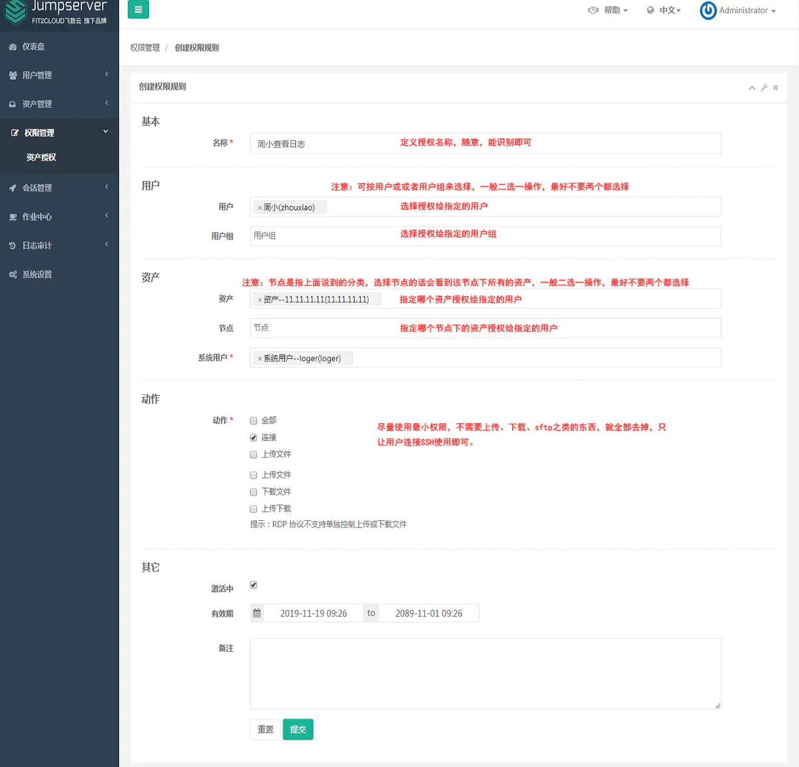

jumpserver--创建授权

如上图所示：创建资产时，尽量选择最小权限规则，指定授权的用户（不选择用户组），指定授权的资产（不选择节点），指定系统用户；如不需要SFTP等上传下载的话，动作只勾选“连接”即可。

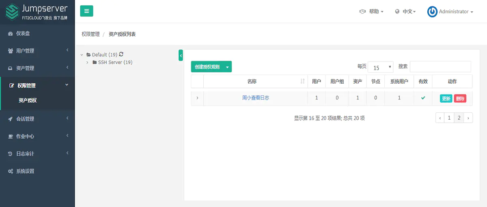

jumpserver--创建授权

现在就可以打开另一个浏览器，通过zhouxiao这个用户来登录jumpserver

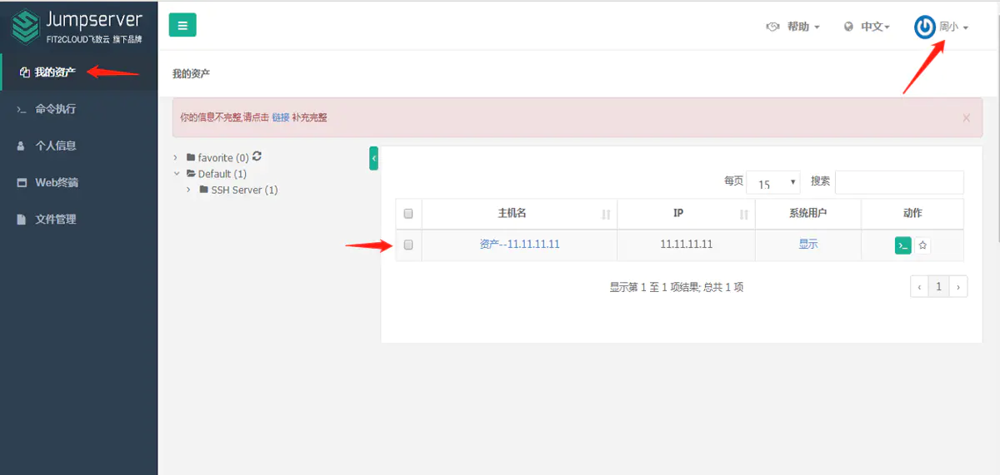

jumpserver--用户登录

如上图所示，要连接资产，点击所在资产--动作，一栏下的绿色按钮后，即可跳转到luna连接窗口，luna会帮你直接连接上所选的云服务器

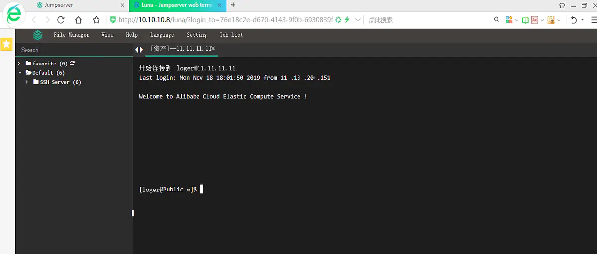

以上就成功给开发人员用户zhouxiao建立了一个通道通过服务器loger普通用户连接进服务器，但是此用户还有很多命令可以使用，本着最小权限原则，而且该用户根本不需要其它规则，只要查看日志的权限即可。

so

**重点来了**

**第一个重点：**

如何限定loger用户的权限：

1.只允许loger使用ls、ll、sh命令，其它命令全部禁用

2.不允许loger跳出家目录，只能在家目录执行

3.在loger目录建立好实时查看日志的脚本文件(如查看/var/log/nginx/access.log的日志，建立一个showlog-nginx.sh的脚本文件，脚本中的内容只有 tail -f /var/log/nginx/access.log 这一句英文命令即可，当用户连接上来后，只执行 sh showlog-nginx.sh 或者 ./showlog-nginx.sh 即可打开查看实时日志)

7、建立命令规则

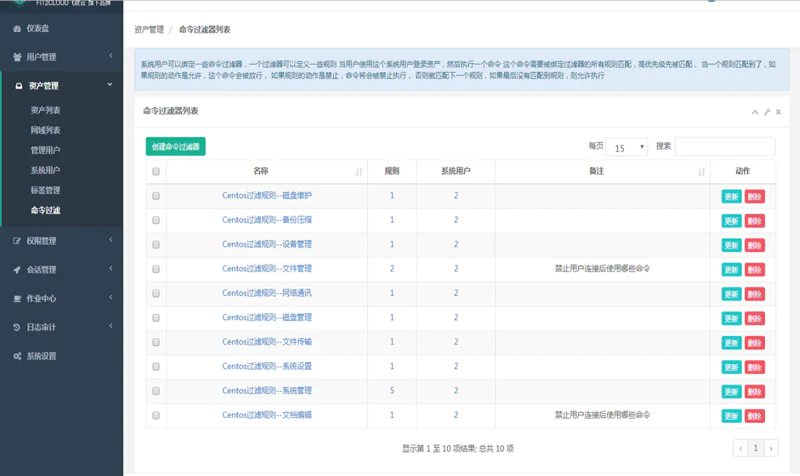

jumpserver--命令过滤

关于命令规则，直接上百度搜索“linux常用命令”即可搜索出一大堆，根据需要过滤，把要屏蔽的命令都加入到过滤规则中，并且要绑定指定的用户才能生效，不绑定用户是不生效的，当初就在这里摸了半天鱼。

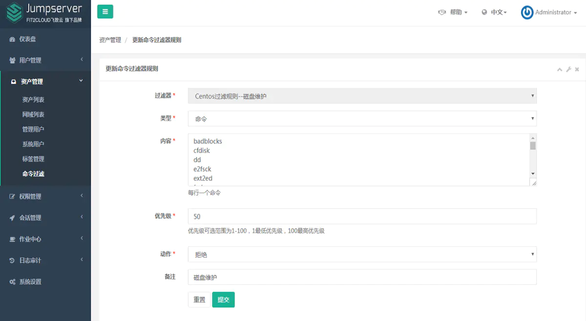

jumpserver--命令过滤

每行一个过滤命令，要注意的是，如要屏蔽ls、ll查看命令（但只想屏蔽查看家目录之外的路径，在家目录中可以正常执行的话），哪些你的过滤命令就得设置为

ll /

ls /

这种形式来过虑屏蔽防止跳出家目录去，但在家目录是可以正常执行ls ll的。

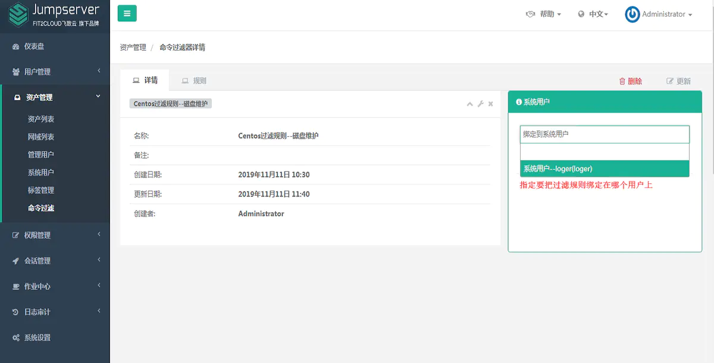

jumpserver--命令过滤

建立以上过滤后，再通过zhouxiao用户登录服务器loger用户时就会提示命令被禁止，如下图

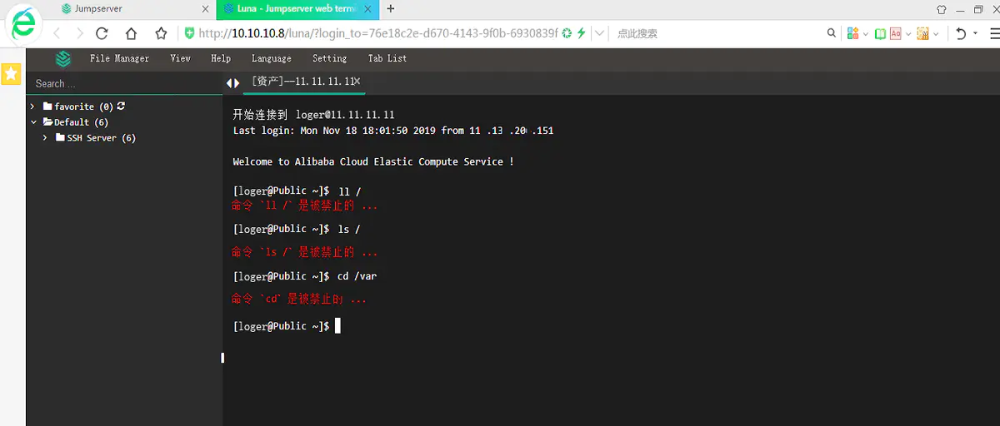

jumpserver--命令过滤

到此，就达到了我想要的最小权限，本来是想在linux上做这种限制的，发现在linux上很难实现，不如jumpserver这样直接过滤掉。

**第二个重点：**

通过xlshell、secureCRT连接jumpserver再到云服务器，当初一直没想明白xlshell等软件是怎么连接到跳板机jumpserver后，再连接到云服务器的，百度了一些结果大多数都是通过密钥来操作、隧道呀，我都懵圈了，一我是手动设置的密码，没有密钥这东西。

通过jumpserver的用户zhouxiao来连接11.11.11.11:22云服务器不成功；通过jumpserver的用户zhouxiao来连接jump服务器10.10.10.8也没成功。

在此中摸了两天，也不知道是什么原因没有出现如网上所示的图（### 欢迎使用jumpserver开源跳板机系统），在此摸索中，知道是要通过jumpserver中的用户如zhouxiao来作为用户名登录的，但一直不知道是哪里出错。

直到看到一篇文章中有提示要把jumpserver当做跳板机来用的话，需要连接koko的接口2222，我娘的才反应过来。在xlshell、secureCRT中是通过jumpserver中的用户如zhouxiao与密码直接连接jumpserver服务器10.10.10.8的2222端口，才能正常连接到跳板机的。

在此过程中，在网上搜索不到任何关于提示新手是怎么连接到跳板机的，都是一笔带过，用密钥连接22端口之类的，根本没有提示过新手要通过xlshell、secureCRT来ssh到jumpserver服务器10.10.10.8的2222端口。搞的我摸了几天也没明白个鸟。

注意点：

10.10.10.8:22   此SSH端口 22 是 jumpserver服务器（linux服务器）中的登录用户端口，而不是建立jumpserver后通过浏览器创建的用户要连接使用的端口

10.10.10.8:2222   此SSH端口 2222 是 jumpserver服务器（linux服务器）中的服务端口，是让建立jumpserver后通过浏览器创建的用户连接使用的，通过此2222端口连接进来到跳板机系统

xlshell、secureCRT连接方式如下图

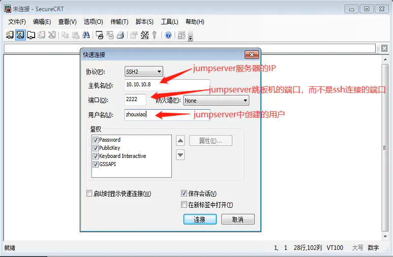

securtCRT连接跳板机

如上图，连接jumpserver服务器10.10.10.8，端口要注意连接的是2222端口而不是22端口（这两个端口都存在的，都要在防火墙中开放）

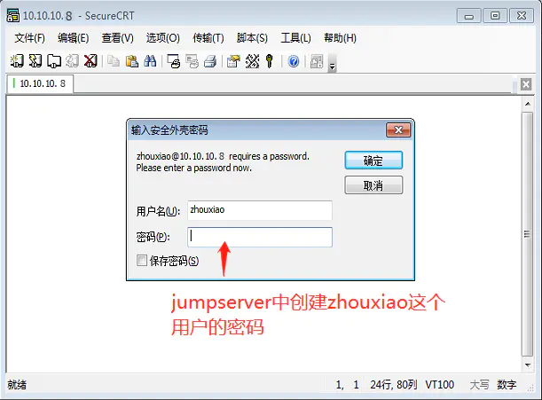

securtCRT连接跳板机

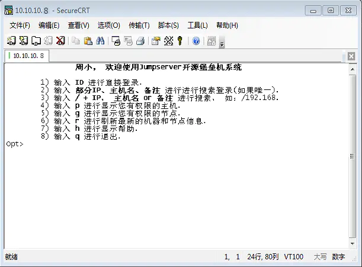

securtCRT连接跳板机

输入jumpserver中创建的用户密码连接后，终于出现如上图所示的跳板机系统的，摸了几天，终于摸成功了。。。

输入对应序号即可进入对应的功能中

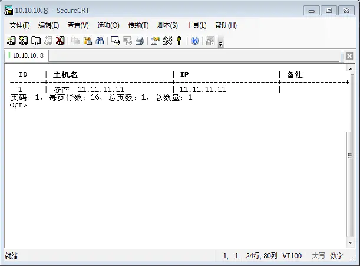

securtCRT连接跳板机

按p进入资产列表中，查看到已授权的主机，需要连接的话，直接选择对应序号确定即可连接到相应的生产环境云服务器上了。

未解决问题：

因为没有开发能力，不知道如何修改停止jumpserver探测SSH的状态。因为服务器有探测登录告警，只要有人连接SSH与SCP的话，都会发出钉钉告警信息，加了jumpserver资产信息后，总会时不时的探测一下服务器的状态，每次探测都会发起5、6个连接登录，所以每天每次都会收到同一服务器十几条告警信息，这个好不爽的，我只想它手动点没测试的时候才发起检测，其它时候不要发起任何操作。也弄不懂在哪个文件上改掉这个。看了一下日志里面有一个任务是《定期测试管理账号可连接性》的记录跟这个告警是很吻合的，还没找到怎么屏蔽。