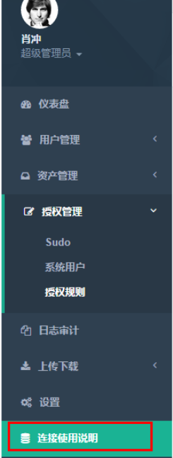

**需要注意下面亮点** 
在使用jumpserver过程中，有一步是系统用户推送，要推送成功，client（后端服务器）要满足以下条件：

- 后端服务器需要有python、sudo环境才能使用推送用户，批量命令等功能
- 后端服务器如果开启了selinux，请安装libselinux-python

**在使用Jumpserver过程中的一些名词解释**

- 用户：用户是授权和登陆的主体，将来为每个员工建立一个账户，用来登录跳板机， 将资产授权给该用户，查看用户登陆记录命令历史等。
- 用户组：多个用户可以组合成用户组，为了方便进行授权，可以将一个部门或几个用户 组建成用户组，在授权中使用组授权，该组中的用户拥有所有授权的主机权限。
- 资产：资产通常是我们的服务器、网络设备等，将资产授权给用户，用户则会有权限登 录资产，执行命令等。
- 管理账户：添加资产时需要添加一个管理账户，该账户是该资产上已有的有管理权限的用户， 如root，或者有 NOPASSWD: ALL sudo权限的用户，该管理账户用来向资产推送系统用户， 为系统用户添加sudo，获取资产的一些硬件信息。
- 资产组：同用户组，是资产组成的集合，为了方便授权。
- 机房：又称IDC，这个不用解释了吧。
- Sudo：这里的sudo其实是Linux中的sudo命令别名，一个sudo别名包含多个命令， 系统用户关联sudo就代表该系统用户有权限sudo执行这些命令。
- 系统用户：系统用户是服务器上建立的一些真实存在的可以ssh登陆的用户,如 dev, sa, dba等，系统用户可使用jumpserver推送到服务器上，也可以利用自己公司 的工具进行推送，授权时将用户、资产、系统用户关联起来则表明用户有权限登陆该资产的这个系统用户，比如用户小明 以 dev系统用户登录 172.16.1.1资产, 简单理解就是 将某个资产上的某个系统用户映射给这个用户登录。
- 推送系统用户：添加完系统用户，需要推送，推送操作是使用ansible，把添加的系统用户和系统用户管理的sudo，推送到资产上，具体体现是在资产上useradd该系统用户，设置它的key,然后设置它的sudo，为了让用户可以登录它。
- 授权规则：授权规则是将资产系统用户和用户关联起来，用来完成授权。 这样用户就可以以某个系统用户账号登陆资产。大家对这好像不是很理解，其实也是对系统用户， 用户这里没有搞清楚。我们可以把用户当做虚拟的用户，而系统用户是真实再服务器上存在的用户， 系统用户可以使用jumpserver推送，也可以自己手动建立，但是推送的过程一定要有，哪怕是模拟 推送（不选择秘钥和密码推送，如网络设备），因为添加授权规则会检查推送记录。为了简化理解， 我们暂时 以 用户 资产 系统用户 来理解，暂时不考虑组，添加这样的规则意思是 授权 用户 在这个资产上 以这个系统用户来登陆, 系统用户是一组具有通用性，具有sudo的用户， 不同的用户授权不同的 系统用户，比如 dba可能有用数据库的sudo权限。
- 日志审计：分为以下5个方式：**1）在线**：查看当前在线的用户(非web在线)，可以监控用户的命令执行，强制结束用户 登录；**2）实时监控**：实时监控用户的操作；**3）登录历史**：查看以往用户的登录历史，可以查看用户登陆操作的命令，可以回放用户 执行命令的录像；**4）命令记录**：查看用户批量执行命令的历史，包含执行命令的主机，执行的命令，执行的结果；**5）上传下载：**查看用户上传下载文件的记录。
- 默认设置：默认设置里可以设置 默认管理账号信息，包括账号密码密钥，默认信息为了方便添加资产 而设计，添加资产时如果选择使用默认管理账号，则会使用这里设置的信息，端口是资产的ssh端口，添加 资产时，默认会使用该端口。

--------------------------------------------Jumpserver中的用户，系统用户，管理用户对比---------------------------------------

```
为了简单的描述这个问题，可以举例来说明，：``1）用户：小王(公司员工)，``2）系统用户：dev(后端服务器上存在的账号),``授权时将系统用户dev在某台后段服务器授权给小王，这样小王登陆后端服务器，其实是登陆了服务器上的dev用户,类似执行``"ssh dev@somehost"``3)管理账号: 是为了帮助大家推送系统用户用的``在jumpserver上新建系统用户并推送， 其实相当于执行了``"ssh 管理账户@somehost -e 'useradd 系统账号'"``, 这个是用ansible完成这样的操作。
```


**下面简单说下在Jumpserver的web界面里添加用户、推送用户等操作流程：**

\1. 添加用户
用户管理 - 查看用户 - 添加用户 填写基本信息，完成用户添加。
用户添加完成后，根据提示记住用户账号密码，换个浏览器登录下载key，
ssh登录jumpserver测试

\2. 添加资产
资产管理 - 查看资产 - 添加资产 填写基本信息，完成资产添加

\3. 添加sudo
授权管理 - Sudo - 添加别名 输入别名名称和命令，完成sudo添加

\4. 添加系统用户
授权管理 - 系统用户 - 添加 输入基本信息，完成系统用户添加

\5. 推送系统用户
授权管理 - 推送 - 选择需要推送的资产或资产组完成推送

推送只支持服务器，使用密钥是指用户从跳板机跳转时使用key，反之使用密码，
授权时会检查推送记录，如果没有推送过则无法完成系统用户在该资产上的授权。
如果资产时网络设备，请不要选择密码和秘钥，模拟一下推送，目的是为了生成
推送记录。

\6. 添加授权规则
授权管理 - 授权规则 - 添加规则 选择刚才添加的用户，资产，系统用户完成授权

\7. 测试登录
用户下载key 登录跳板机，会自动运行connect.py，根据提示登录服务器
用户登陆web 查看授权的主机，点击后面的链接，测试是否可以登录服务器

\8. 监控和结束会话
日志审计 - 在线 查看当前登录的用户登录情况，点击监控查看用户执行的命令， 点击阻断，结束用户的会话

\9. 查看历史记录
日志审计 - 登录历史 查看登录历史,点击统计查看命令历史，点击回放查看录像

\10. 执行命令
同7 测试命令的执行，命令记录查看 批量执行命令的日志

\11. 上传下载
同7 测试文件的上传下载，日志审计 - 上传下载 查看上传下载记录

**下面分享几个问题的排查注意点：**

**1）查看日志**
tail -f logs/jumpserver.log
里面包含了详细的日志，包含了账号和密码，一切完成后，请将 jumpserver.conf中的log改为 warning等

**2）推送系统用户失败**
在系统用户列表，点击系统用户名称，查看系统用户详情，把鼠标放到失败按钮上，会看到失败的原因，通常是因为 管理账号添加的不对（见管理账号名称解释），或服务器没有安装sudo(推送系统用户时，会推送sudo设置)

**3）邮件发送失败**
如果出现mail,smtp等错误通常都是由于发送邮件导致的，请尝试不同提供商的邮件设置

**4）service启动失败**
请进入/opt/jumpserver目录，手动运行
\# python manage.py runserver 0.0.0.0:80
\# python run_websocket.py
如果启动失败，可能是由于 80端口和3000端口已经被占用，或者数据库账号密码不对，请检查

**5)监控，websocket, web命令执行失败**
它们会像运行的websocket服务发起请求， 可能是websocket没有启动，可能是Jumpserver.conf中websocket的地址不正确(注意这个文件里的ip地址的配置，内外网地址？端口通不通？)，务必保证设置的地址用户可以访问到(映射或防火墙等), service.sh先关掉服务器，手动运行, 查看websocket的console输出

**6）Crypto，HAVE_DECL_MPZ_POWM_SEC等错误**
很常见的错误，通常是由 pycrypto的版本问题，请卸载重新安装
\# pip uninstall pycrypto
\# rm -rf /usr/lib64/python2.6/site-packages/Crypto/
\# pip install pycrypto

**==================================================**
**问题记录一：**

```
默认跳板机的上传文件有限制大小为256M,可以修改dropzone.js``[root@``test``-vm001 ~]``# vim /opt/jumpserver/static/js/dropzone/dropzone.js ，296 行``maxFilesize: 5000,`` ` `还要安装一个nginx代理，以用来改善它的80端口访问和改善WEB大文件上传，加上一个http:``//jumpserver``.venic.com``/doc``来链接使用说明`` ` `[root@``test``-vm001 http]``# vi uploadbigfile.conf``server {``    ``listen 80;``    ``client_max_body_size 5g;`` ` `    ``proxy_connect_timeout 300;``    ``proxy_read_timeout 300;``    ``proxy_send_timeout 300;``    ``proxy_buffer_size 64k;``    ``proxy_buffers 4 32k;``    ``proxy_busy_buffers_size 64k;``    ``proxy_temp_file_write_size 64k;`` ` `    ``location ^~ ``/ws/` `{``        ``proxy_set_header X-Real-IP $remote_addr;``        ``proxy_set_header Host $host;``        ``proxy_set_header X-Forwarded-For $proxy_add_x_forwarded_for;``        ``proxy_http_version 1.1;``        ``proxy_set_header Upgrade $http_upgrade;``        ``proxy_set_header Connection ``"upgrade"``;``        ``proxy_pass http:``//127``.0.0.1:8000``/ws/``;``    ``}``    ``location / {``           ``proxy_pass http:``//127``.0.0.1:8000;``    ``}``    ``location ``/file/upload/` `{`` ` `           ``proxy_pass http:``//127``.0.0.1:8083;``    ``}``    ``location ^~ ``/doc/` `{``        ``proxy_pass http:``//127``.0.0.1:8088/;``    ``}``}`` ` `server {``    ``listen 8088;``    ``location / {``      ``root  ``/opt/jumpserver/docs/``;``      ``index index.html index.htm;``    ``}``}`` ` ` ` `由于多了一个8083端口，还要启动这个``[root@``test``-vm001 ~]``# cd /opt/jumpserver``[root@``test``-vm001 ~]``# python manage.py runserver 127.0.0.1:8083 &``*************************************************``xshell工具的上传大小还没解决，以下是刚才修改配置的位置，但测试最终提示不超过2G的单文件。`` ` `上传文件有限制大小为256M,可以修改dropzone.js``[root@``test``-vm001 ~]``# vi /opt/jumpserver/static/js/dropzone/dropzone.js ，296 行``maxFilesize: 5000,`` ` `[root@``test``-vm001 ~]``# /opt/jumpserver/service.sh restart
```

**问题记录二：**

```
问题记录二：``Web console登录机器，会产生过大的CPU，单开一个WEB console就消耗了44%的CPU，2核中占满一个。而使用Xshell公钥匙则没有问题``如果要禁用Web Console的话，修改Web前端，但我没有删掉``进入``/opt/jumpserver/templates/jasset/asset_cu_list``.html   -----修改130行，这个是修改普通用户界面的``进入``/opt/jumpserver/templates/jasset/asset_list``.html  --------修改135行，这个是修改管理员界面的`` ` `比如我把它修改成跳转方式到其它网站连接去``<a value=``"{{ asset.id }}"` `class=``"conn btn btn-xs btn-warning"``>连接<``/a``>``<a href=``"http://jumpserver.venic.com/doc"` `class=``"conn btn btn-xs btn-warning"``>连接<``/a``>`` ` `而我没有取消，是因我调高CPU配置为8核后，发现开了8个窗口，最终还是最多消耗2个核，所以我没有禁用web console``-------------------------------------------------------------------------------------------------------------`` ` `需求变更一：`` ` `修改web console的窗口宽一点``[root@``test``-vm001 ~]``# vim /opt/jumpserver/static/js/webterminal.js``改里面所有100值为160的值`` ` `修改webconsole 窗口，加个注释，禁用用户修改窗口大小`` ` `<!--``<div class=``"termChangBar"``>``  ``<input ``type``=``"number"` `min=``"100"` `value=``"100"` `placeholder=``"col"` `id``=``"term-col"``/>``  ``<input ``type``=``"number"` `min=``"35"` `value=``"35"` `placeholder=``"row"` `id``=``"term-row"``/>``  ``<button ``id``=``"col-row"``>修改窗口大小<``/button``>``<``/div``>``-->`` ` `修改弹窗的窗口体大小（非terminal），``进入``/opt/jumpserver/templates/jasset/asset_cu_list``.html -----修改237行和249行 这个是修改普通用户界面的``进入``/opt/jumpserver/templates/jasset/asset_list``.html   --------248行和259 这个是修改管理员界面的`` ` `window.``open``(new_url+data, ``"_blank"``, ``'width=1000, height=600'``);`` ` `---------------------------------------------------------------------------------------------------------------``需求变更二：``修改左侧导航栏的访问官网链接``进入``/opt/jumpserver/templates/nav``.html  52行和80行`` ` `<a href=``"http://jumpserver.venic.com/doc"` `target=``"_blank"``><i class=``"fa fa-database"``><``/i``> <span class=``"nav-label"``>访问官网<``/span``><``/a``>``上传一个用word文档写的“操作指引”到如下链接，
```



这个word文档转成html，这里只是使用另存为html自己保存成2个新文件（index.files和index.htm）


```
然后我在htm文件的<``head``><``/head``>标签中，添加了一个<style><``/style``>如下标签，目的是让图片自动伸缩和居中``<style>``html{``  ` `}``body{width:800px;``  ``margin:auto;``  `` padding: 0px !important; border-radius: 0px !important; background: none !important; border: 0px !important; bottom: auto !important; float: none !important; height: auto !important; left: auto !important; line-height: 1.8em !important; outline: 0px !important; overflow: visible !important; position: static !important; right: auto !important; top: auto !important; vertical-align: baseline !important; width: auto !important; box-sizing: content-box !important; font-family: Consolas, "Bitstream Vera Sans Mono", "Courier New", Courier, monospace !important; min-height: auto !important; color: rgb(0, 130, 0) !important;">#FFFFFF;``  ``}``img {max-width:800px;}``<``/style``>`` ` `然后把这2个文件上传至服务器的``/opt/jumpserver-master/docs``目录下。所以才上面的nginx多一条跳转的配置
```


```
然后我们还要修改首页的前代码，让“连接使用说明”指到这个 http:``//jumpserver``.venic.com``/doc/``修改处在``/opt/jumpserver-master/templates/nav``.html
```


测试跳转后的显示界面样式如下：


**问题记录三：**

```
修改sshd配置，禁止密码登录``#``[root@``test``-vm001 ~]``# vim /etc/sshd/sshd_config``......``PasswordAuthentication no``[root@``test``-vm001 ~]``# service sshd restart
```

**问题记录四：**

```
非admin的普通用户登录jumpserver界面，通过webshell登录服务器的时候，连接报错！报错信息为：``Connection Reset By Peer`` ` `通过jumpserver的log日志，可以看出Websocket连接失效了``[root@``test``-vm001 ``install``]``# tail -f /data/jumpserver/logs/jumpserver.log``2018-01-18 09:18:40,660 - views.py - DEBUG - 获取授权系统用户: ops,app,dev``2018-01-18 09:18:46,429 - run_websocket.py - DEBUG - Websocket: session_key:``2018-01-18 09:18:46,430 - run_websocket.py - WARNING - Websocket: Request auth failed.``2018-01-18 09:18:46,486 - run_websocket.py - DEBUG - Websocket: Close request``2018-01-18 09:18:48,589 - run_websocket.py - DEBUG - Websocket: session_key:``2018-01-18 09:18:48,589 - run_websocket.py - WARNING - Websocket: Request auth failed.``2018-01-18 09:18:48,645 - run_websocket.py - DEBUG - Websocket: Close request` `通过重启jumpserver服务重新建立Websocket链接即可此问题，但是过了一段时间后，Websocket链接会再次失效。``所以可以结合``crontab``定时重启jumpserver。``[root@``test``-vm001 ``install``]``# crontab -e``*``/2` `* * * * ``/data/jumpserver/service``.sh restart > ``/dev/null` `2>&1
```

**问题记录五：**

```
jumpserver运行一段时间后，突然发现服务器的CPU负载很高，zabbix报警jumpserver服务器利用率已高达85%！` `[root@jumpserver01 ~]``# uptime`` ``14:03:49 up 52 days, 22:36, 4 ``users``, load average: 33, 35, 38` `[root@jumpserver01 ~]``# top``top` `- 14:04:12 up 52 days, 22:37, 4 ``users``, load average: 1.02, 1.05, 0.80``Tasks: 902 total,  3 running, 899 sleeping,  0 stopped,  0 zombie``Cpu(s): 2.6%us, 0.1%sy, 0.0%ni, 97.3%``id``, 0.0%wa, 0.0%hi, 0.0%si, 0.0%st``Mem: 65724264k total, 4008704k used, 61715560k ``free``,  257600k buffers``Swap: 32767996k total,    0k used, 32767996k ``free``,  230724k cached` `  ``PID USER   PR NI VIRT RES SHR S %CPU %MEM  TIME+ COMMAND                               `` ``20299 chengjun 20  0 360m 35m 4768 R 100.0 0.1 20:49.54 python                                `` ``32661 502   20  0 303m 25m 3720 S 100.0 0.1  0:00.22 python`` ``20299 chengjun 20  0 360m 35m 4768 R 100.0 0.1 20:49.54 python                                `` ``32661 502   20  0 303m 25m 3720 S 100.0 0.1  0:00.22 python`` ``25149 chengjun 20  0 360m 35m 4768 R 100.0 0.1 20:49.54 python                                `` ``38315 502   20  0 303m 25m 3720 S 100.0 0.1  0:00.22 python`` ``42299 chengjun 20  0 360m 35m 4768 R 100.0 0.1 20:49.54 python                                `` ``23161 502   20  0 303m 25m 3720 S 100.0 0.1  0:00.22 python`` ``......` `jumpserver服务器的配置是128G内存、40核CPU，按照这个配置，服务器硬件配置方面是绝对不会出现瓶颈的！` `经排查是由于之前有些用户登录jumpserver后没有退出程序，从而导致一直占用cpu资源。``[root@jumpserver01 ~]``# ps -ef|grep python``root   20299 20284 98 13:42?    00:30:02 python ``/data/jumpserver/connect``.py``root   37155 37153 0 14:12?    00:00:00 python ``/data/jumpserver/manage``.py runserver 0.0.0.0:80``502   37156 37154 0 2017 ?    00:00:00 python ``/data/jumpserver/run_websocket``.py``502   37171 37155 0 2017 ?    00:00:00 ``/usr/bin/python` `/data/jumpserver/manage``.py runserver 0.0.0.0:80``root   37228 37156 0 14:12?    00:00:00 python ``/data/jumpserver/run_websocket``.py``root   37229 37156 0 14:12?    00:00:00 python ``/data/jumpserver/run_websocket``.py``502   37230 37156 0 2017 ?    00:00:00 python ``/data/jumpserver/run_websocket``.py``zhenyj  37231 37156 0 2017 ?    00:00:00 python ``/data/jumpserver/run_websocket``.py``502   37232 37156 0 2017 ?    00:00:00 python ``/data/jumpserver/run_websocket``.py``502   37228 37156 0 2017 ?    00:00:00 python ``/data/jumpserver/run_websocket``.py``zhenyj  37229 37156 0 2017 ?    00:00:00 python ``/data/jumpserver/run_websocket``.py``zhenyj  37230 37156 0 2017 ?    00:00:00 python ``/data/jumpserver/run_websocket``.py``502   37231 37156 0 2017 ?    00:00:00 python ``/data/jumpserver/run_websocket``.py``root   37232 37156 0 14:12?    00:00:00 python ``/data/jumpserver/run_websocket``.py``502   37228 37156 0 2017 ?    00:00:00 python ``/data/jumpserver/run_websocket``.py``502   37229 37156 0 2017 ?    00:00:00 python ``/data/jumpserver/run_websocket``.py``wangbin 37230 37156 0 2017 ?    00:00:00 python ``/data/jumpserver/run_websocket``.py``root   37231 37156 0 14:12?    00:00:00 python ``/data/jumpserver/run_websocket``.py``root   37232 37156 0 14:12?    00:00:00 python ``/data/jumpserver/run_websocket``.py``502   37228 37156 0 2017 ?    00:00:00 python ``/data/jumpserver/run_websocket``.py``502   37229 37156 0 2017 ?    00:00:00 python ``/data/jumpserver/run_websocket``.py``xiaof  37230 37156 0 2017 ?    00:00:00 python ``/data/jumpserver/run_websocket``.py``525   37228 37156 0 2017 ?    00:00:00 python ``/data/jumpserver/run_websocket``.py``525   37229 37156 0 2017 ?    00:00:00 python ``/data/jumpserver/run_websocket``.py``wangbin 37230 37156 0 2017 ?    00:00:00 python ``/data/jumpserver/run_websocket``.py``chengwq 47230 37156 0 2017 ?    00:00:00 python ``/data/jumpserver/run_websocket``.py``chengwq 43230 37156 0 2017 ?    00:00:00 python ``/data/jumpserver/run_websocket``.py` `如上信息，那些第五列显示``"2017 ?"``信息的，即是之前登陆jumpserver后没有完全退出以至于系统资源一直被占用。``批量``kill``掉这些程序的pid即可降低jumpserver服务器的CPU利用率。``[root@jumpserver01 ~]``# ps -ef|grep python |awk '$5=2017 {print $2}'|xargs kill -9
```