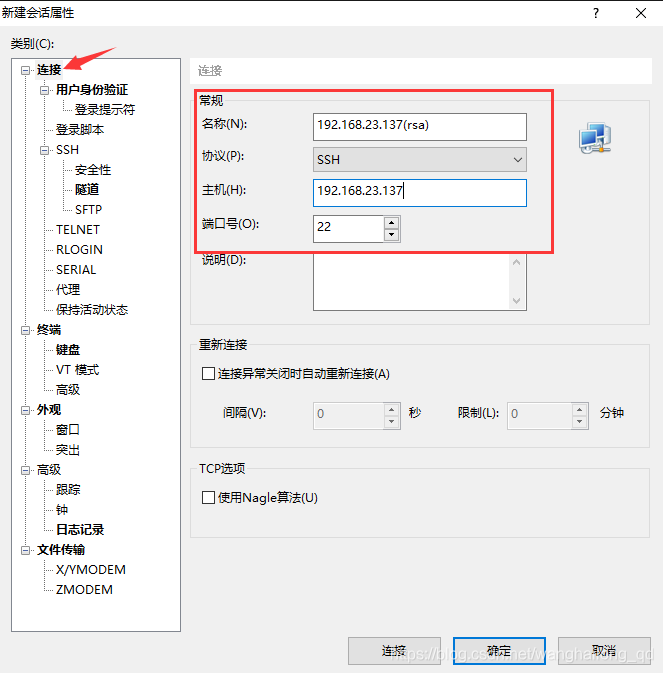

# CentOS 7 配置免密码证书登录

[国产龙王](https://blog.csdn.net/wanghailong_qd) 2019-05-21 00:53:54  4657  收藏 1

分类专栏： [Linux基础](https://blog.csdn.net/wanghailong_qd/category_8966476.html) 文章标签： [Linux](https://www.csdn.net/tags/MtjaQg5sMDY0MC1ibG9n.html) [CentOS](https://www.csdn.net/tags/MtTaEg0sMzk5NjctYmxvZwO0O0OO0O0O.html) [证书登录](https://so.csdn.net/so/search/s.do?q=证书登录&t=blog&o=vip&s=&l=&f=&viparticle=) [免密码登录](https://so.csdn.net/so/search/s.do?q=免密码登录&t=blog&o=vip&s=&l=&f=&viparticle=)

版权

服务器: CentOS 7

客户端: Xshell 6

 

密码登录:

这对我们来说太熟悉了, 换句话说我们对密码这东西太熟悉了, 几乎随处都会用到. 登录只是密码的一个应用场景之一. 但是密码常见的风险在于, 一是可能泄露, 二是被破解的风险

 

证书登录:

这里说的证书其实就是密钥. 在非对称加密中, 密钥分为公钥和私钥. 私钥, 即密钥所有人持有. 公钥则公布给他人. 公钥和私钥成对使用, 互相解密. 公钥加密数据只能用私钥解密; 私钥加密则只能用公钥解密(验证)

 

证书登录原理:

密钥对生成后, 公钥存储于远程服务器. 登录时远程服务器向客户端发送随机字符串, 客户端以私钥加密后返回服务器, 服务器再以公钥解密. 解密成功则证明客户端合法, 允许登录

 

配置证书登录

\1. 登录用户:

首先在服务器生成公钥和私钥. 因为密钥与登录用户是对应的, 所以生成的密钥仅对当前用户有效. 本次以whl用户登录

 

以whl用户登录, 并且当前路径位于用户的默认home目录下

 

\2. 创建公钥私钥:

ssh-keygen -t rsa

ssh-keygen是一个用来生成和管理ssh密钥的工具

-t参数用于指定密钥类型, 或者说加密算法. 本次使用rsa算法. 除此以外还有rsa1, dsa可选

 

执行命令后会提示输入用于保存密钥对的路径. 默认位于/home/用户/.ssh目录下. 确认无误则直接回车

 

提示目录已创建, 同时要求输入证书密码. 该密码用于客户端使用证书时验证(要不然把证书文件复制走了岂不可以随便登录了?), 与用户登录密码没有任何关系. 而且也有提示: 不想设密码的话保留为空即可, 不输入任何内容直接回车

 

然后要求再确认一次. 有密码就重复输入一次, 没有密码当然直接回车确认

 

密钥生成成功, 并提示保存路径, 以及打印密钥指纹

 

\3. 写入公钥

进入证书存储目录

 

将公钥写入authorized_keys. 目录下多出一个文件authorized_keys

 

\4. 设置权限

.ssh目录权限为700, authorized_keys权限为600

 

\5. 修改ssh配置文件sshd_config

该文件位于/etc/ssh目录下

 

编辑该文件需要root权限. 切换为root用户, 然后就可以编辑了

 

找到PubkeyAuthentication这项, 去掉前面的#注释, 使其生效. AuthorizedKeysFile这项确保与刚才生成的文件路径一致. 修改完毕保存并退出

 

 

最后重启一下sshd服务

systemctl restart sshd

 

 

\6. 下载私钥

还记得home/.ssh下的三个文件不? 把私钥id_rsa下载到本地

 

\7. 配置客户端

这里用的是Xshell 6

新建会话, 几个常规项不变

 

用户身份验证一栏, 方法选择 Public Key

 

输入用户名, 点击浏览

 

随后弹出的对话框中选择导入, 选择刚才下载的私钥文件

 

 

导入后这里会显示已导入的密钥. 点击选中, 确定

 

用户密钥栏下拉列表会显示已导入的密钥. 选择对应该用户的密钥, 输入密码(无密码则保留空), 确定. 会话创建完毕

 

双击刚创建的会话, 登录成功

 

\8. 关闭密码登录

到这一步为止证书登录配置成功. 也就是说此时用户名密码, 证书登录都可用. 我们也可以将密码登录禁用, 只允许证书登录. 这个配置还是在前面用到过的SSH配置文件sshd_config中

编辑sshd_config

vi /etc/ssh/sshd_config

 

找到PasswordAuthentication这一项, 由yes改为no. 保存退出, 并重启sshd服务

 

这时就可以看到, 第一(whl用户)和第三个会话(root用户)是以用户名密码登录的, 已经无法登录了. 而且password输入框也不可用

 

这里禁止的只是远程密码登录, 也就是SSH登录. 本地输入密码切换用户当然是不影响的

