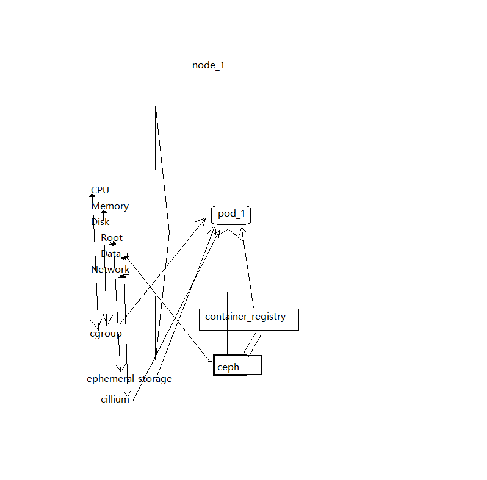
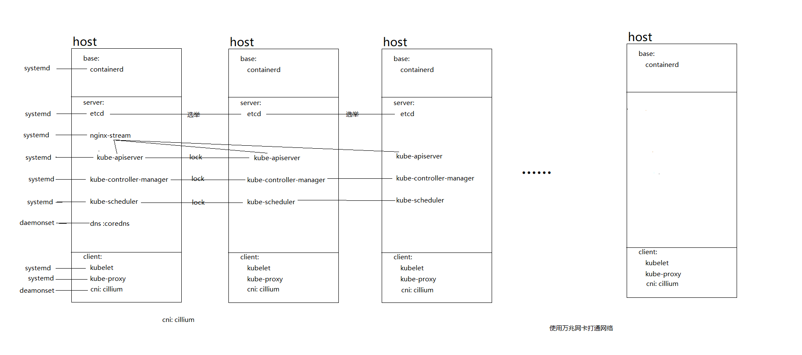

[toc]

搭建配置kubernetes(1.23.1)基础设施以及相关的核心必要底层组件

# 关于容器

运行在同一个服务器的多个容器通过模拟服务器实现容器环境, 默认情况下是会共享所有的, 但是也可以使用kata包裹cri(containerd)实现内核分离

文件描述符、进程、网络、存储(量/iops)

# 关于kubernetes

什么是kubernetes?

通过对cri的单体调配以及集群环境供给实现分布式容器化管理

透过单体看集群, 单体网络可以看为nat, 容器共享宿主机的外部网络ip, 容器本身绑定一个随机高位端口, 外部透过宿主机上的容器的随机高位端口访问容器, 而集群问题在于容器和容器之间如何打通网络, 如何扁平化网络(扁平化网络才能算是一个集群网络环境); 单体服务容器只能局限于单机本身, 而在kubernetes中, 在容器范围内只要还有一个节点在就可以无限容灾; 在存储上建议使用专门的存储系统, 例如ceph, 在底层透过系统管理磁盘, 同时透过storage class和pv/pvc给上层应用使用; 同时也加强了容器生命周期的管理, 例如容器存活销毁、网络接入接出

什么是集群化? 在最少层级情况下最快容错的方式; 最少层级意味着应该在可行的情况下两两直接接触, 例如裸金属kubernetes, 这样就可以直接减少虚拟机事故导致上层服务不可用; 最快容错意味着: 1、任意一个集群副本掉线不会影响集群 2、任意一个工作副本掉线不会影响服务失败、过慢和业务结果错误, 例如elasticsearch 的三节点2副本方式、mysql的mgr方式、redis的6节点cluster方式、rocketmq的dledger方式、ceph的2副本方式, 同时这里又有另外一个问题, 就是多层容错问题, kubernetes本身已经提供了无状态层的容错, 而如果上层没有实现有状态容错, 例如只能单副本运行, 那么在服务掉线时服务会中断, 而如果下层能够容错, 例如通过cephfs共享一个目录, 那么则可以直接运行2个没有提供集群容错的副本, 从而提供集群级别的容错, 不仅仅是在单个服务掉线后整体服务不会中断, 更多的是底层数据不会丢失, 例如某一块消耗性的磁盘损坏了

kubernetes本身是由三层构成: master、worker、enviroment

master由etcd集群、kube-apiserver(4-层网络分发)、kube-controller-manager(lease分发多点副本锁)、kube-scheduler(lease分发多点副本锁)组成

worker由cri(containerd)、kubelet、kube-proxy(可由cillium替代)组成

environment由cni(cillium、dns(coredns)、ingress-controller(ingress-nginx-controller))、image-registry(habor)组成

