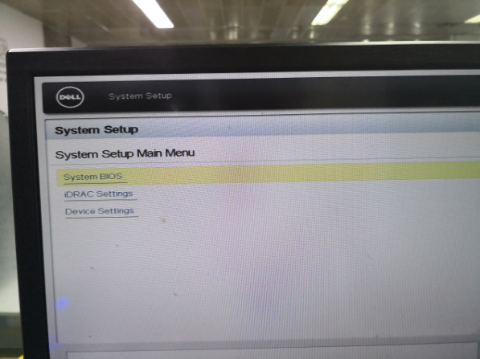
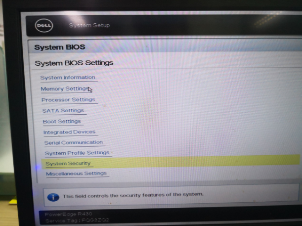
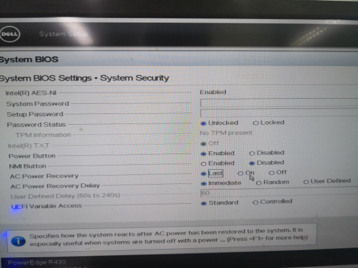
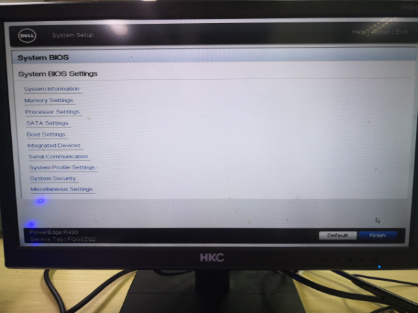
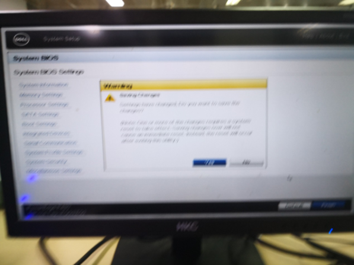
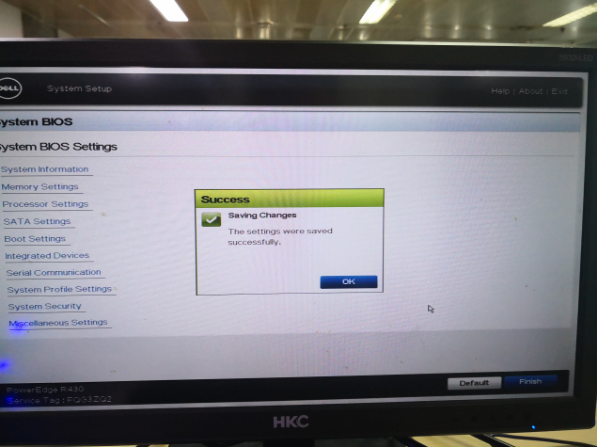
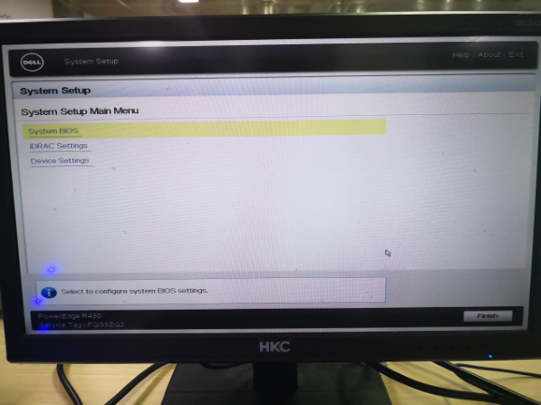
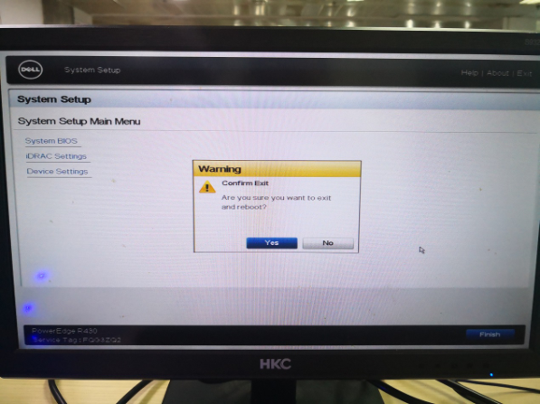

# [Dell R系服务器设置通电自动开机](https://www.cnblogs.com/xiaoshagua/articles/12186511.html)

[作者：小小傻瓜牙](https://www.cnblogs.com/xiaoshagua/articles/12186511.html)开机按一直F2

出现下图 选system BIOS

 

 

 下图选system security

 

 下图的AC Power recovery 设置为on 然后点击右下角的back

 

 下图点击右下角的finish

 

 下图点击yes（照的不清楚，抱歉）

 

 下图点击OK

 

 下图点击右下角的finish

 

 下图点击yes

