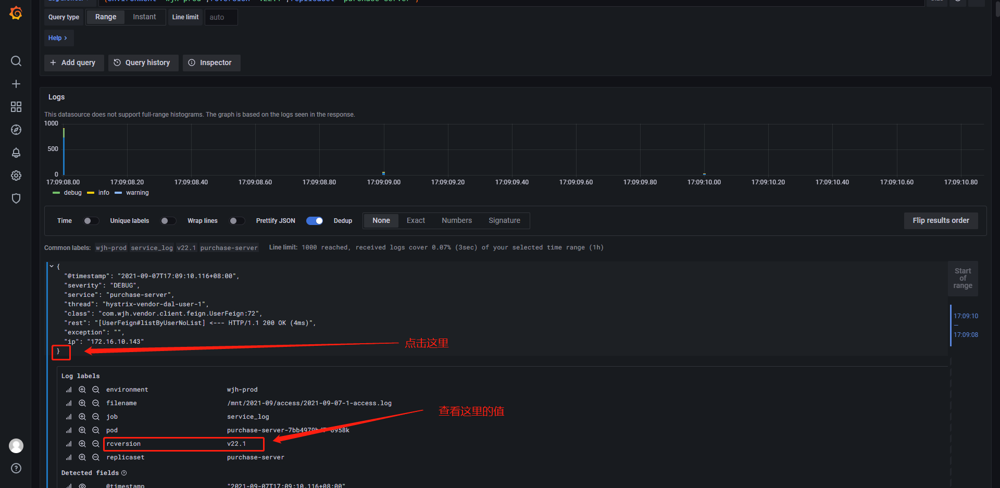

线上环境:

访问地址: http://grafana-loki./explore?orgId=1&left=%5B%22now-1h%22,%22now%22,%22Loki%22,%7B%7D%5D

登录账号/密码: wjh/wjh666_

线下环境:

http://grafana.local./explore?orgId=1&left=%5B%22now-1h%22,%22now%22,%22K8S-Loki%22,%7B%7D%5D

登录账号/密码: wjh/wjh666

目前线上和线下的日志查询方式已保持一致

整个日志是分成三个级别: 日志类型、环境、服务名称、版本号

例如: 想查询 1、业务日志(job): service_log(业务日志) 2、环境(environment): wjh-prod(生产环境) 3、replicaset(项目名称): custshop-server(跟运维系统中的服务名称已保持一致, 含义为商城服务后台)4、版本号(rcversion): 跟项目部署中的服务版本保持一致

通过 `|="<查询关键字>"` 去匹配过滤查询, 相当于linux系统的`|grep` , 可以多级过滤

通过`!="<查询关键字>"` 去不匹配过滤查询, 过滤掉不匹配的字段串

通过traceid过滤查看就相当于直接查询上下文

如何查看版本

