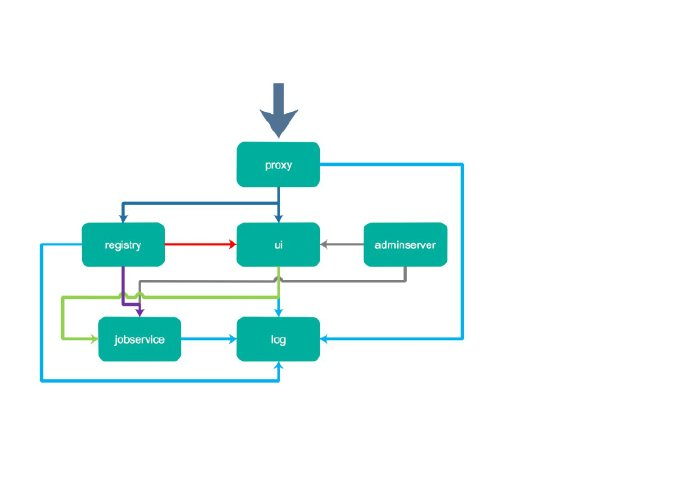
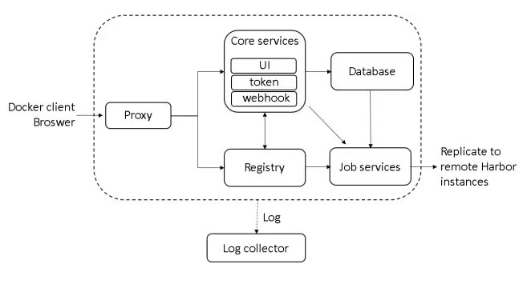
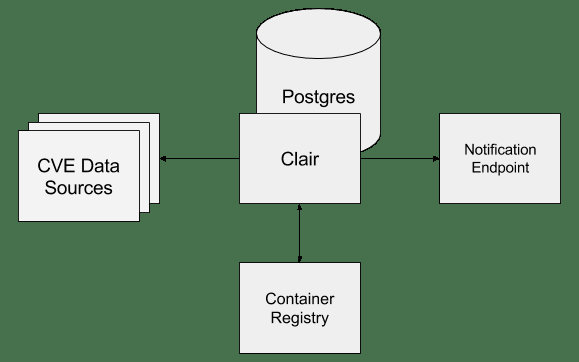

# Habor初印象

 发表于 2019-03-26 | 分类于 [云计算 ](https://www.a-programmer.top/categories/云计算/)| [0 ](https://www.a-programmer.top/2019/03/26/Habor初印象/#comments)| 浏览 90次

 字数统计: 1,443 字 | 阅读时长 ≈ 5 分钟

部署企业私有镜像仓库往往是很有必要的, 它可以帮助你管理企业的一些敏感镜像, 同时由于Docker Hub的下载速度和GFW的原因, 往往需要将一些无法直接下载的镜像导入本地私有仓库。 而Harbor就是部署**企业级镜像仓库**的一个不二之选，本文主要对Habor做一个简要介绍。

### Habor简介

Harbor是vmware开源的企业级registry，可以让你迅速的搭建自己的私有registry，harbor扩展的docker的registry，使harbor支持以下特性：

- RBAC 基于角色的权限控制: 用户与Docker镜像仓库通过“项目”进行组织管理，一个用户可以对多个镜像仓库在同一命名空间（project）里有不同的权限
- 基于策略的镜像复制: 镜像可以在多个Registry实例中复制（同步）。尤其适合于负载均衡，高可用，混合云和多云的场景。
- 漏洞扫描
- LDAP/AD支持: Harbor可以集成企业内部已有的AD/LDAP，用于鉴权认证管理
- 镜像删除和垃圾清理
- Notary 镜像签名
- 用户界面: 用户可以通过浏览器来浏览，检索当前Docker镜像仓库，管理项目和命名空间。
- 审计日志: 所有针对镜像仓库的操作都可以被记录追溯，用于审计管理。
- RESTful api
- 安装简单:提供在线和离线两种安装工具

Harbor是container镜像仓库，其主要作用是为管理和服务container镜像提供一个安全的环境，用户可以用habor打造一个私有的镜像仓库；这对一些想管理自己的镜像又不想开源的企业来说是有用的。Habor既然是container镜像仓库，那么就应当是存储镜像的，这个可能是大多数接触harbor的人的一个误区，当深入了解以后才发现，镜像的存储harbor使用的是官方的docker registry服务去完成，至于registry是用本地存储或者s3都是可以的，harbor的功能是在此之上提供用户权限管理、镜像复制等功能，提高使用的registry的效率。

### Habor架构

Habor发展至今，架构肯定有一些变化，下面的图是参考网上的，不是最新的架构，不过应该变化不大，可以参考一下：

- harbor-adminserver：harbor系统管理接口，可以修改系统配置以及获取系统信息
- harbor-db：存储项目的元数据、用户、规则、复制策略等信息
- harbor-jobservice：harbor里面主要是为了镜像仓库之前同步使用的
- harbor-log：收集其他harbor的日志信息。rsyslogd
- harbor-ui：一个用户界面模块，用来管理registry。主要是前端的页面和后端CURD的接口
- nginx：harbor的一个反向代理组件，代理registry、ui、token等服务。这个代理会转发harbor web
  和 docker client的各种请求到后端服务上。nginx负责流量转发和安全验证，对外提供的流量都是从nginx中转，它将流量分发到后端的ui和正在docker镜像存储的docker registry
- registry：存储docker images的服务，并且提供pull/push服务。harbor需要对image的访问进行访问控制，当client每次进行pull、push的时候，registry都需要client去token服务获取一个可用的token。
- redis：存储缓存信息
- webhook：当registry中的image状态发生变化的时候去记录更新日志、复制等操作。
- token service：在docker client进行pull/push的时候今天token的发放。

### Registry相关概念

我们一般在使用Docker的过程中更为常用的是pull image、run image、build image和push image。主要是围绕image展开的。

image和Registry的关系可以想象成自己机器上的源码和远端SVN或者Git服务的关系。Registry是一个几种存放image并对外提供上传下载以及一系列API的服务。可以很容易和本地源代码以及远端Git服务的关系相对应。

Docker hub是Docker公司提供的一些存储镜像的空间，这部分空间是有限的。我们一般会自主建设Docker私有仓库Registry。

### Repository和Registry区别

Repository：本身是一个仓库，这个仓库里面可以放具体的镜像，是指具体的某个镜像的仓库，比如Tomcat下面有很多个版本的镜像，它们共同组成了Tomcat的Repository。

Registry：镜像的仓库，比如官方的是Docker Hub，它是开源的，也可以自己部署一个，Registry上有很多的Repository，Redis、Tomcat、MySQL等等Repository组成了Registry。

### clair

clair是 coreos 开源的容器漏洞扫描工具，在容器逐渐普及的今天，容器镜像安全问题日益严重。clair 是目前少数的开源安全扫描工具，主要提供OS（centos，debian，ubuntu等）的软件包脆弱性扫描。clair既可以单机部署也可以部署到k8s上，并可以与现有的registry集成。harbor 很好的整合了 clair ，通过简单的UI就可以对上传的镜像扫描，还可以通过每天的定时扫描对所有镜像进行统一扫描，架构如下：

> 注意不要混淆Clair 和 clarity，Clair is not clarity, clarity is the UI library we used, while clair is the docker image scanner.
> [按照 docs/compile_guide.md 进行源码编译出错](https://github.com/goharbor/harbor/issues/3464)

### Notary

Notary是一套docker镜像的签名工具， 用来保证镜像在pull，push和传输工程中的一致性和完整性。避免中间人攻击，避免非法的镜像更新和运行。

### 参考资料：

[Harbor github](https://github.com/goharbor/harbor)
[按照 docs/compile_guide.md 进行源码编译出错](https://github.com/goharbor/harbor/issues/3464)
[谈谈我对Harbor认识](https://blog.csdn.net/u010278923/article/details/77941995)
[Registry私有仓库搭建及认证](http://www.cnblogs.com/zhaojiankai/p/7813969.html)