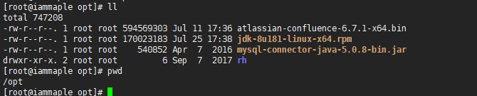
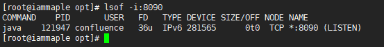

# Centos 7.5破解安装Confluence 6.7.1完整攻略

- 博主： [unxlab](https://www.iammaple.com/index.php/author/1/)
-  

- 发布时间：2018 年 08 月 22 日
-  

- 4988次浏览
-  

- [暂无评论](https://www.iammaple.com/index.php/archives/8/#comments)
-  

- 9295字数
-  

- 分类：

1. [首页](https://www.iammaple.com/)
2. 正文 
3. 分享到： 

## Confluence简介

> Confluence为团队提供一个协作环境。在这里，团队成员齐心协力，各擅其能，协同地编写文档和管理项目。从此打破不同团队、不同部门以及个人之间信息孤岛的僵局，Confluence真正实现了组织资源共享。
> Confluence 已经在超过100个国家，13500个组织中成功地应用于企业内网平台、知识管理及文档管理，涉及财富1000企业、政府机构、教育机构、财务金融机构及技术研究领域。
> 包括IBM、Sun MicroSystems、SAP等众多知名企业使用Confluence来构建企业Wiki并面向公众开放。
> *简介引用：https://baike.baidu.com/item/confluence/452961#1*

## 前言：

公司因为业务需求，需要安装这个玩意儿，从confluence6.3折腾到6.10,期间各种版本的都折腾过，无奈6.3最好装，但版本较为老旧，而且启动会出各种问题，往往导致正在使用的wiki直接卡死。后来痛定思痛，重新梳理了一番，选择了个人认为比较稳定且并不低的版本6.7.1来进行破解安装。同时这个版本破解也并不麻烦，就是后期的https配置等着实让我头疼了一会儿，不过已经解决了。在此，把安装破解方式分享出来，希望能够帮到需要的朋友，也为自己做个备忘方便查找。

### 准备工作

需要下载以下内容：

> Confluence6.7.1安装包
>
> Confluence破解器
>
> mysql-connector-java-5.0.8-bin.jar
>
> jdk-8u181-linux-x64.rpm

**百度云已放置，所有需要的文件都已经压缩，请放心下载即可**

> 链接：https://pan.baidu.com/s/1n-G1TTMef8CiyOiB3aPwPA 提取密码：755f

### 一、正式安装

已准备好的Centos 7.5，建议可以把yum库在安装之前更新一下。
[](https://photo.iammaple.com/blog/180822/G25A5BD4JD.png?imageslim)


用WinSCP工具把刚下载的四个文件上传到服务器/opt/目录下

> WinSCP是一款开源的SFTP客户端，运行于Windows系统下，遵照GPL发布。WinSCP除了SFTP，还支持SSH、SCP。使用该工具就不需要再单独配置FTP了，直接用ssh的22端口即可。

[](https://photo.iammaple.com/blog/180822/7kIHGhlk48.png?imageslim)


[](https://photo.iammaple.com/blog/180822/4Fimc98057.png?imageslim)


上传完毕，进入目录进行查看。

```
#cd /opt/
```

[](https://photo.iammaple.com/blog/180822/37megB0BJG.png?imageslim)


#### 安装JDK，rpm格式的一条命令就足以。

```
# rpm -ivh jdk-8u181-linux-x64.rpm
```

[](https://photo.iammaple.com/blog/180822/5cGjki8LAB.png?imageslim)


[](https://photo.iammaple.com/blog/180822/3FI2eiAk4g.png?imageslim)


### 二、安装mysql环境（这里用的是centos7下的MariaDB），默认版本为5.5.60。不影响我们配置confluence，所以不必刻意在意数据库版本。

```
# yum -y install mariadb mariadb-server
```

[](https://photo.iammaple.com/blog/180822/cblCEJ1eGk.png?imageslim)


#### 启动mariadb

```
# systemctl start mariadb
```

#### 设置为开机自动启动mariadb

```
# systemctl enable mariadb
```

接下来进行MariaDB的相关配置，输入以下命令开启简单配置。

```
# mysql_secure_installation 
```

[](https://photo.iammaple.com/blog/180822/5aHe0lefHd.png?imageslim)


首先是设置密码，会提示先输入密码

> Enter== current password for root (enter for none):<–初次运行直接回车
>
> Set root password? [Y/n] <– 是否设置root用户密码，输入y并回车或直接回车
> New password: <– 设置root用户的密码
> Re-enter new password: <– 再输入一次你设置的密码
>
> 其他配置
> Remove anonymous users? [Y/n] <– 是否删除匿名用户，回车
>
> Disallow root login remotely? [Y/n] <–是否禁止root远程登录,回车。
>
> Remove test database and access to it? [Y/n] <– 是否删除test数据库，回车。
>
> Reload privilege tables now? [Y/n] <– 是否重新加载权限表，回车。

#### 进入数据库进行下一步的配置。

```
# mysql -uroot -p“yourpassword”
```

[](https://photo.iammaple.com/blog/180822/KagimgJ5f0.png?imageslim)


查看数据表；

```
>show databases;
```

[](https://photo.iammaple.com/blog/180822/99gj4h5ELa.png?imageslim)


***比较重要的一步就是配置Mariadb的字符集，为了避免在confluence中选择中文而出现乱码，此步骤务必要做；\***

-->首先是配置文件/etc/my.cnf ，在[==mysqld==]标签下添加以下条目.

```
init_connect='SET collation_connection = utf8_unicode_ci'
 
init_connect='SET NAMES utf8'

character-set-server=utf8
 
collation-server=utf8_unicode_ci
 
skip-character-set-client-handshake
```

-> 接着配置文件/etc/my.cnf.d/client.cnf，在[==client==]中添加

```
default-character-set=utf8
```

-> 然后配置文件/etc/my.cnf.d/mysql-clients.cnf，在[==mysql==]中添加

```
default-character-set=utf8
```

重启MariaDB，并登陆MariaDB查看字符集.

```
# systemctl restart mariadb
# mysql -uroot -p
>show variables like "%character%";show variables like "%collation%";
```

[](https://photo.iammaple.com/blog/180822/8581ClJbjl.png?imageslim)


为Confluence创建对应的数据库、用户名和密码。

```
MariaDB [(none)]> create database confluence default character set utf8 collate utf8_bin;
Query OK, 1 row affected (0.01 sec)

MariaDB [(none)]> grant all on confluence.* to 'confluence'@'%' identified by 'confluencepasswd';
Query OK, 0 rows affected (0.00 sec)

MariaDB [(none)]> flush privileges;
Query OK, 0 rows affected (0.00 sec)
```

[](https://photo.iammaple.com/blog/180822/65hA9e4KlA.png?imageslim)


好了，数据库已经配置完毕，接下来进入正题，安装confluence6.7.1

------

1.切换至/opt目录，给二进制文件授执行权限，然后执行二进制文件进行安装。

```
#chmod +x atlassian-confluence-6.7.1-x64.bin 
```

[](https://photo.iammaple.com/blog/180822/f4akA5km9B.png?imageslim)


```
 #./atlassian-confluence-6.7.1-x64.bin 
```

[](https://photo.iammaple.com/blog/180822/Dghd5aEGCC.png?imageslim)


2.开始安装，会跳出以下提示，按照提示进行相应的选择即可。


[](https://photo.iammaple.com/blog/180822/hDG4hDB9EJ.png?imageslim)


3.安装完毕，确认是否启动confluence？ 输入[y]继续。
[](https://photo.iammaple.com/blog/180822/KBd93ic8EK.png?imageslim)


Confluence启动中....

[](https://photo.iammaple.com/blog/180822/ALhDCfi374.png?imageslim)


4.服务已经启动完毕，可以看到版本号和如何访问，注意，端口号是8090。

5.通过上图可以看出confluence安装到了/opt/atlassian/confluence和/var/atlassian/application-data/confluence目录下，并且confluence默认监听的端口是8090.一路默认安装即可！
注意：confluence的主要配置文件为/opt/atlassian/confluence/conf/server.xml，和jira类似。此server.xml相当于tomcat中的server.xml配置文件，如果要修改访问端口，可以这里修改。
如果要修改confluence的数据目录，可以在安装的时候，在安装过程中进行更换（默认是/var/atlassian/application-data/confluence）

[](https://photo.iammaple.com/blog/180822/0c3jL6LaeH.png?imageslim)


6.查看8090端口是否开启。

```
# lsof -i:8090
```

[](https://photo.iammaple.com/blog/180822/CIamg0e1G4.png?imageslim)


7.现在打开浏览器，输入服务器地址（10.0.1.250）和端口号（8090）进行访问。
***（不要忘记关闭防火墙，规则还没做，默认端口都是禁止的，先关闭防火墙进行下一步操作.)\***

```
# systemctl stop firewalld.service 
```

[](https://photo.iammaple.com/blog/180822/kFj1HKJmiE.png?imageslim)


8.做到这一步，其实也只是成功了一点点，接下来进行下一步，选择语言为中文后，继续进行配置。

[](https://photo.iammaple.com/blog/180822/CiaJEE8GBD.png?imageslim)


9.这一步是选择插件，不用选择，直接下一步。
[](https://photo.iammaple.com/blog/180822/DaBC323f3m.png?imageslim)


10.记住页面上显示的机器码，打开注册机准备破解。
[](https://photo.iammaple.com/blog/180822/265EiFI6Dc.png?imageslim)


### 三、破解Confluence

#### 1.复制上述截图中的Server ID（即BUWN-ACQE-4Y7I-DD7Y），然后关闭confluence

```
# /etc/init.d/confluence stop
```

#### 2.在confluence的安装目录下/opt/atlassian/confluence/confluence/WEB-INF/lib/找到atlassian-extras-decoder-v2-3.3.0.jar文件，先将该文件备份。

```
cp /opt/atlassian/confluence/confluence/WEB-INF/lib/atlassian-extras-decoder-v2-3.3.0.jar /opt/atlassian-extras-decoder-v2-3.3.0.jar.bak
```

#### 3.然后将该文件移动并重命名为atlassian-extras-2.4.jar。

```
mv /opt/atlassian/confluence/confluence/WEB-INF/lib/atlassian-extras-decoder-v2-3.3.0.jar /opt/atlassian-extras-2.4.jar
```

#### 4.通过WinSCP工具将已经重命名的atlassian-extras-2.4.jar传到本地进行破解

[](https://photo.iammaple.com/blog/180822/BA17ECk5kb.png?imageslim)


#### 5.运行破解器confluence_keygen.jar。

[](https://photo.iammaple.com/blog/180822/6dD7CAImm8.png?imageslim)


#### 6.点击.patch，找到刚才传回来的atlassian-extras-2.4.jar文件，点击打开，破解器左下角会提示jar文件破解成功

[](https://photo.iammaple.com/blog/180822/DCiHKmC62B.png?imageslim)


#### 7.找到已经破解的jar文件，***在文件旁边会有一个atlassian-extras-2.4.jar.bak文件，这是破解器自动备份的，不出问题就不用理会。\***

上传破解后jar包到/opt/atlassian/confluence/confluence/WEB-INF/lib，并重命名为==atlassian-extras-decoder-v2-3.3.0.jar==。
[](https://photo.iammaple.com/blog/180822/9df3CHF20d.png?imageslim)


上传mysql驱动/opt/atlassian/confluence/confluence/WEB-INF/lib


#### 8.重启服务

```
停止：# sh /opt/atlassian/confluence/bin/stop-confluence.sh
启动：# sh /opt/atlassian/confluence/bin/start-confluence.sh
```

#### 9.访问confluence，[http://10.0.1.250](http://10.0.1.250/):8090 继续进行配置，会跳出授权页面，此事进行下一步破解操作。

[](https://photo.iammaple.com/blog/180822/265EiFI6Dc.png?imageslim)


#### 10.还是破解器，输入serverID，确保和网页上显示的服务器ID一致。

[](https://photo.iammaple.com/blog/180822/b085lhIhH2.png?imageslim)


点击[.gen!]获得授权码。

复制key内的内容，到confluence

[](https://photo.iammaple.com/blog/180822/mbI94LFDDC.png?imageslim)


#### 11.如果破解成功，即可成功下一步，若提示报错，请参考是否已经成功的破解了上面提到的jar文件。

#### 12.设置自己的数据库，正式生产环境直接选择第一项。

[](https://photo.iammaple.com/blog/180822/K373KC2ef1.png?imageslim)


#### 13.数据库类型选择Mysql，安装类型选择[==通过简单字符串==]

***简单字符串一定要带utf8的信息，系统默认是不带的，所以要粘贴下面的数据类型，才能避免后期使用中存在乱码的情况。\***

```
jdbc:mysql://localhost/confluence?characterEncoding=utf8
```

[](https://photo.iammaple.com/blog/180822/G497Bda6Hc.png?imageslim)


### 有报错

***报错信息\***

***不正确的隔离级别\***

***您的数据库必须使用'READ-COMMITTED'作为默认隔离级别\***

这个就要改一下mariadb的隔离级别了。

进入数据库，输入以下命令：

```
#mysql -uroot -p
SET GLOBAL tx_isolation='READ-COMMITTED';
```

[](https://photo.iammaple.com/blog/180822/F0IbfLIK8H.png?imageslim)


#### 14.不用重启数据库，提示ok后，在confluence页再次点击“测试连接”。

[](https://photo.iammaple.com/blog/180822/3ELm4lffD6.png?imageslim)


#### 15.已经测试成功，进入下一步。数据库的设置时间会稍微长一点。

#### 16.加载完成后，点击“示范站点”，立即开始使用Confluence

[](https://photo.iammaple.com/blog/180822/hkf52j7ji2.png?imageslim)


#### 17.配置用户：

[](https://photo.iammaple.com/blog/180822/HKde1i04eL.png?imageslim)


#### 18.带*号的栏目必输，输入完后点击下一步。

[](https://photo.iammaple.com/blog/180822/BCiJDki19g.png?imageslim)


#### 19.终于可以愉快的开始玩耍confluence了。

[](https://photo.iammaple.com/blog/180822/D50IBF49bI.png?imageslim)


#### 20.点击开始后，会自动登录你刚创建好的账号，首页会对confluence进行一个简短的视频演示，不过因为视频是youtube的，国内看不到，可以直接跳过。。什么？为什么我能看？你猜~~

[](https://photo.iammaple.com/blog/180822/55A6j1iGfg.png?imageslim)


[](https://photo.iammaple.com/blog/180822/1FEiiLAeh0.png?imageslim)


其他略过不提，进入confluence之后，会发现右上角接连跳出好几个错误信息。

[](https://photo.iammaple.com/blog/180822/kFlHCb0f3H.png?imageslim)


不必理会，先检查一下我们的破解是否成功，右上角小齿轮按钮----一般设置---左侧边栏最下方--授权细节

[](https://photo.iammaple.com/blog/180822/FAAGfFlLG4.png?imageslim)


自己算一下多久后会过期吧~。

[](https://photo.iammaple.com/blog/180822/BELCm5AL49.png?imageslim)


到这里我们的破解安装confluence6.7.1就已经全部搞定，confluence已经可以愉快的和你一起玩耍了~~

另外上面提到的报错等信息，我会在下一章“confluence优化配置及https访问”博文中解决，请持续关注。

© 著作权归作者所有，若要转载请注明出处

 最后修改：2020 年 10 月 21 日 09 : 33 PM

© 允许规范转载

 赞赏